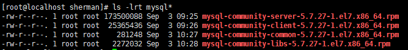
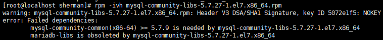
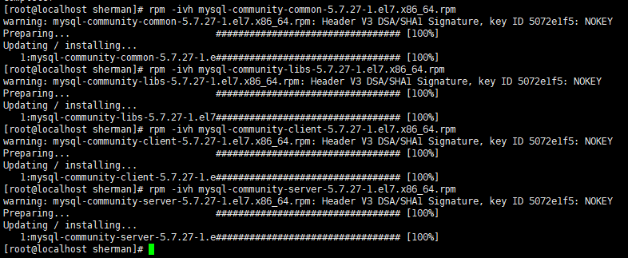

## 前期准备

### 一、CentOS虚拟机配置
#### 1.1 VMware虚拟网络配置
在VMware虚拟网络编辑器中将CentOS虚拟机的网络配置成NAT模式，在NAT设置中获取网关IP，
在DHCP中获取子网掩码以及可用的IP地址范围：


#### 1.2 本机主机信息

在本地主机的网络连接详细信息中获取本地DNS服务器：


#### 1.3 修改网络配置文件
CentOS的网络配置文件位置：**vim /ect/sysconfig/network-scripts/ifcfg-ens33**:
修改BOOTPROTP为static，ONBOOT为yes，加入上述查询到的IPADDR、NETMASK、GATEWAY、DNS、ZONE，具体配置
如下：


重启网络：systemctl restart network.service

### 二. CentOS安装MySQL5.7

- 下载mysql的server和client的rpm安装包，必须包含server、client、common和libs四个包：



- 查询是否用rpm安装过mysql：
```shell
rpm -qa | grep -i mysql
# 如果查询出来有相应安装，进行删除
rpm -e 相应rpm安装包 
```
- 安装四个rpm文件，安装顺序为: common->libs->client->server:
    - 注意安装libs过程中可能出现以下错误：
    
    
    - 解决：清除yum里面所有mysql依赖包：
    ```shell
    rpm -qa | grep mysql
    yum remove mysql-libs
    ```
    - 重新按照common-libs->client->server的安装顺序安装即可，注意rpm三个参数：-i: install -v: verbose -h: hash校验
    
    
- 启动mysql服务：
```shell
systemctl start mysqld.service
```    
- 登录mysql：
    - 以临时密码的方式登录mysql：
    
    
    - 临时密码为上述标记部分（没有前面的空格），使用mysql -uroot -p 临时密码登录
    - 修改密码：MySQL5.7开始不允许弱密码，首先要取消弱密码限制：
    ```shell
    # 取消弱密码限制
    set global validate_password_policy=0;
    set global validate_password_length=1;
    # 修改新密码
    set password for root@localhost=password('sherman');
    ```
    - 授予root远程访问权限：
    ```shell
    # 授予root权限
    grant all privileges on *.* to root@'%' identified by 'sherman';
    flush privileges;
    # 查看root用户是否有远程登录权限
    use mysql;
    select user, host from user;
    ```
- 关闭防火墙或者开放端口：
```shell
# 查看防火墙的状况
firewall-cmd --state
# 查看防火墙开放的端口号
firewall-cmd --list-ports
# 关闭或者开启防火墙
systemctl stop/start firewalld.service
# 开启特定端口
firewall-cmd --zone=public --add-port=3306/tcp --permanent
# 选择关闭防火墙或者开启3306端口即可允许远程用户访问数据库
```
- CentOS默认MySQL安装目录：
    - /usr/bin: 客户端程序和脚本
    - /usr/sbin: mysqld服务器
    - /var/lib/mysql: 日志文件，数据库文件
    - /usr/share/mysql: 错误消息和字符集文件
    - /etc/my.cnf: 配置文件
    
- 修改默认字符集：在/etc/my.conf下修改配置文件中字符集并重启MySQL服务，注意字符集是**utf8**不是**utf-8**:
```shell
[client]
default-character-set=utf8

[mysqld]
character-set-server=utf8
collation-server=utf8_general_ci

[mysql]
default-character-set=utf8
```    
- MySQL配置文件：
    - 二进制日志文件：log-bin
    - 错误日志文件：log-error
    - 查询日志文件：log
    - 数据文件：
        - frm文件：数据库的表结构
        - myd文件：存放表中数据
        - myi文件：存放表中的索引
        
### 三、MySQL的逻辑架构简介

和其它数据库相比，MySQL的架构可以支持多种不同场景中应用并发挥出良好的作用，主要体现
在存储引擎的架构上：**插件式的存储引擎架构**将查询处理和其它的系统任务以及数据的存储
提取相分离。这种架构可以根据实际业务的需求和实际需要选择合适的存储引擎。

#### 3.1 连接层

最上层是一些客户和连接服务，包含本地socket通信和大多数基于C/S工具实现的类似于TCP/IP
的通信。主要完成一些类似于连接处理、授权认证及相关的安全方案。在该层上引入线程池的概念，
未通过认证安全接入的客户端提供线程。同样在该层上可以实现基于SSL的安全连接，服务器也会为
安全连接的每个客户端验证它具有的操作权限。

#### 3.2 服务层

第二层架构主要完成大多数的核心服务功能，如SQL结构，并完成缓存的查询，SQL的分析和优化及部分内置函数的执行。
所有跨存储引擎的功能也在这一层实现，如过程、函数等。在该层，服务器会解析查询结果并创建相应的内部解析树，
并对其完成相应的优化如确定查询 表的顺序，是否利用索引等，最后生成相应的执行结果。如果是select语句，服务器还会查询内部的缓存，
如果缓存空间足够大，这样在解决大量读操作的环境中还能够很好的提升系统的性能。

#### 3.3 引擎层

存储引擎层，存储引擎真正的负责了MySQL中数据的存储和提取，服务器通过API与存储引擎进行通信。不同的存储引擎具有的功能不同，
这样我们可以根据自己的实际需求进行选取（插件式）。

#### 3.4 存储层

数据存储层，主要讲数据存储在运行于读设备的文件系统之上，并完成存储引擎的交互。
       
#### 3.5 存储引擎介绍
- 查询默认的存储引擎：
    - show engines;
    - show variables like '%storage_engine%';    
- MyISAM和InnoDB存储引擎对比：

| 对比项  | MyISAM| InnoDB |
|---|---|---|
| 主外键 |不支持|支持|
| 行表锁 |表锁，即使操作一条记录也会锁住整个表|行锁，操作时只锁定某一行，适合高并发|
| 缓存 |只缓存索引，不缓存真实数据|缓存索引和真实数据，对内存要求较高，内存大小对性能又决定性影响|
| 表空间 |小|大|
| 关注点 |性能|事务|


