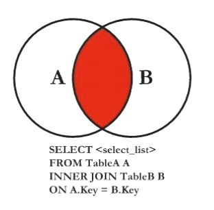
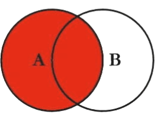
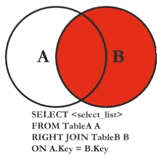
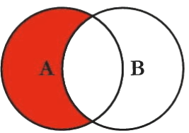
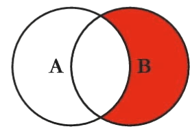
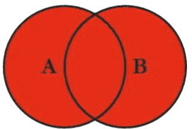
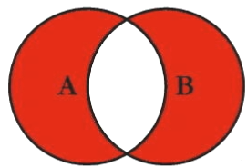
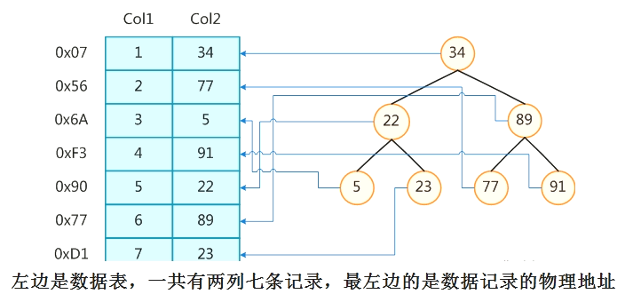
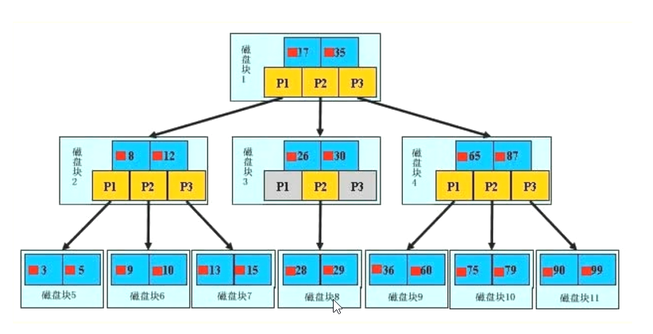

## 索引优化

### 1.1 性能下降SQL原因
- 查询语句写的烂
- 索引失效：
    - 单值索引：create index idx_user_name on user(name);
    - 复合索引：create index idx_userEmail on user(name, email);
- 关联查询太多的join（设计缺陷或者是不得已的需求）
- 服务器调优及各个参数的设置（缓冲、线程池等）不恰当

#### 1.2 SQL执行加载顺序
- 手写SQL的顺序：
```sql
select distinct 
    [select_list]
from 
    [left_table] [join_type]
join 
    [right_table] on [join_condition]
where 
    [where_condition]
group by 
    [group_by_list]
having 
    [having_condition]
order by 
    [order_by_condition]
limit
    [limit_number]    
```    
- MySQL实际执行顺序：
```sql
from 
    [left_table]
on 
    [join_condition]
[join_type] join [right_table]
where 
    [where_condition]
group by 
    [group_by_list]
having 
    [having_condition]
select distinct 
    [select_list]
order by 
    [order_by_condition]
limit 
    [limit_number]  
```
- 具体示意图：**MySQL实际执行顺序是从from开始的**


#### 1.3 七种JOIN
- inner join：


```sql
select [select_list]
from tableA as a
inner join tableB as b
on a.key = b.key;
```

- left join:


```sql
select [select_list]
from tableA as a
left join tableB as b
on a.key = b.key;
```

- right join:


```sql
select [select_list]
from tableA as a
right join tableB as b
on a.key = b.key;
```
注意：**left join和right join可以互相转换**，例如上面的right join可以使用left join表示：
```sql
select [select_list]
from tableB as b
left join tableA as a
on b.key = a.key;
```

- left join & is null：表示A表独有，所以B表对应字段应该为null


```sql
select [select_list]
from tableA as a
left join tableB as b
on a.key = b.key 
where b.key is null;

# example
mysql> select * from emp e left join dept d on e.deptno =d.deptno where d.deptno is null;
Empty set(0.00 sec)
```

- right join & is null：表示B表独有，所有A表对应字段应该为null



```sql
select [select_list]
from tableA as a
right join tableB as b
on a.key = b.key 
where a.key is null;

# example
mysql> select * from emp e right join dept d on e.deptno = d.deptno where e.deptno is null;
+-------+-------+------+------+----------+------+------+--------+--------+------------+----------+
| empno | ename | job  | mgr  | hiredate | sal  | comm | deptno | deptno | dname      | dloc     |
+-------+-------+------+------+----------+------+------+--------+--------+------------+----------+
|  NULL | NULL  | NULL | NULL | NULL     | NULL | NULL |   NULL |     40 | OPERATIONS | BOSTON   |
|  NULL | NULL  | NULL | NULL | NULL     | NULL | NULL |   NULL |     51 | java       | hangzhou |
|  NULL | NULL  | NULL | NULL | NULL     | NULL | NULL |   NULL |     52 | java       | hangzhou |
|  NULL | NULL  | NULL | NULL | NULL     | NULL | NULL |   NULL |     53 | java       | hangzhou |
+-------+-------+------+------+----------+------+------+--------+--------+------------+----------+
```

- 全外连接1：MySQL不支持全外连接，但是可以通过合并集——left join & union & right join 完成：


```sql
select * from emp as e left join dept as d on e.deptno = d.deptno
union 
select * from emp as e right join dept as d on e.deptno = d.deptno;
```

- 全外连接2：A表独有部分&B表独有部分——(left join & is null) & union & (right join & is null)完成:


```sql
select * from emp as e left join dept as d on e.deptno = d.deptno where d.deptno is null 
union 
select * from emp as e right join dept as d on e.deptno = d.deptnowhere e.deptno is null
```

#### 1.4 索引

索引（Index）是帮助MySQL高效获取数据的数据结构，本质是一种排好序的快速查找数据结构。索引会影响sql中的两部分：
where的条件过滤以及order by排序。

为了加快查找，数据库还维护了一个B树索引，该树的每个节点包含了索引键值和一个指向对应数据记录物理地址的指针。
这样运用二叉查找在一定负载范围内获得相应数据。一种可能的索引方式示例如下：



**索引的优劣势**

- 优势：
    - 提高数据查询效率，降低数据库的IO成本
    - 通过索引对数据进行排序，降低数据排序的成本，降低CPU的消耗
- 劣势：    
    - 索引本身也是一张表，保存了主键和索引字段，并指向实体表的记录，索引也会占用空间
    - 虽然索引大大提高查询速度，但是同时会降低更新表（update、insert、delete）的速度。因为每次更新表时，MySQL不仅要保存数据，还要保存一下索引文件每次更新添加索引列的字段，需要调整因为更新导致的键值变化后的索引信息
    - 索引只是提高效率的一个因素，如果MySQL有大数据量的表，需要花费大量的时间研究建立最优秀的索引表
    
**索引分类和索引建立**
- 索引分类：
    - 单值索引：即一个索引只包含单个列，一个表可以包含多个单值索引
    - 唯一索引：索引列的值必须唯一，但是允许有空值，例如银行卡号
    - 复合索引：一个索引可以包含表的多个列
- 创建索引：
```sql
# 方式一
create [unique] index index_name on table_name(column_name(length));
# 方式二
alter table_name add [unique] index [index_name] on table_name(column_name(length));
```    
- 删除索引：
```sql
drop index [index_name] on table_name;
```
- 查看索引：
```sql
show index from table_name;
```
- 使用alter放十天假数据表的索引
```sql
# 添加一个主键, 这意味着索引值必须是唯一的且不能为null
alter table table_name add primary key (column_list);
# 创建索引的值必须是唯一的, null除外, 可以有多个null
alter table table_name add unique index index_name(column_list);
# 创建普通索引, 索引值可能出现多次
alter table table_name add index index_name(column_list);
# 指定索引为FULLTEXT, 即全文索引
alter table table_name add fulltext index_name(column_list);
```

**索引的结构**



磁盘块中包含几个数据项（深蓝色）和指针（黄色），真实的数据存在于叶子节点中，非叶子节点不存储真实
的数据，只存储指引搜索方向的数据项。如17、35并不真实存在于数据表中。B树在磁盘操作上比红黑树有优势，而在内存操作上，红黑树比B树效率更高。

参考文章：**https://www.cnblogs.com/lyc94620/p/10179579.html**

#### 1.5 什么时候\[不]建立索引
**建立索引**
- 主键自动建立唯一索引
- 频繁作为查询条件的字段应该创建索引
- 查询中与其它表关联的字段，外键关系建立索引（deptno）
- 单键、组合索引的选择问题？在高并发环境下倾向建立组合索引
- 查询中排序的字段，排序字段若通过索引去访问将大大提高排序速度
- 查询中统计或者分组字段

**不建立索引**
- 表记录太少
- 经常增删改的表
- where条件里用不到的字段不创建索引
- 重复且分布平均的表，如果某个数据里包含了许多重复的内容，为它建立索引没有太大的实际意义
（索引的选择性（索引列中不同值的数目/表中记录数）越接近1，使用该索引的效率越高）


    
