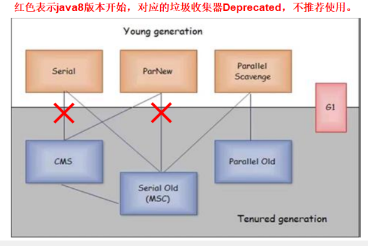

本文大部分内容参考 **周志明《深入理解 Java 虚拟机》** ，需要深入研究JVM请参考原书！


# 一、运行时数据区

## 1.1 Java内存区域分布与概述

* 相比较C++，Java的内存管理机制不再需要为没一个new操作去写配对的内存分配和回收等代码，
  不容易出现内存泄漏和内存溢出等问题

- JVM运行时数据区分布图讲解

  * 线程共享数据区：方法区、堆
  * 线程隔离数据区：虚拟机栈、本地方法栈、堆、程序计数器


## 1.2 程序计数器（PC）

程序计数器是一块较小的内存空间，它可以看作是当前线程所执行的字节码的行号指示器。字节码解释器工作时就是通过改变这个计数器的值来选取下一条需要执行的字节码指令，分支、循环、跳转、异常处理、线程等现场恢复基础功能都需要依赖这个计数器来完成。

为了线程切换后能恢复到正确的执行位置，每条线程都需要有一个独立的程序计数器，各条线程之间计数器互不影响，独立存储，我们称这类内存区域为“线程私有”的内存。

内存区域中唯一一 个没有规定任何 OutOfMemoryError 情况的区域。


## 1.3 虚拟机栈

虚拟机栈用于描述Java方法执行的内存模型，每个方法在执行的同时都会创建一个栈帧（Stack Frame）用于存储**局部变量表、操作数栈、动态链接、方法出口**等信息。每一个方法从调用直至执行完成的过程，就对应着一个栈帧在虚拟机栈中入栈到出栈的过程。

注意：局部变量表存放了编译期可知的各种基本数据类型（boolean、byte、char、short、int、float、long、double）以及对象引用（reference 类型）。如果线程请求的栈深度大于虚拟机所允许的深度，将抛出 StackOverflowError 异常。
## 1.4 本地方法栈

本地方法栈讲解用于作用于本地（native）方法执行的一块Java内存区域，与Java虚拟机栈相同，每个方法在执行的同时都会创建一个栈帧（Stack Frame）用于存储局部变量表、操作数栈、动态链接、方法出口等信息。每一个方法从调用直至执行完成的过程，就对应着一个栈帧在虚拟机栈中入栈到出栈的过程。

注意：Hotspot将Java虚拟机栈和本地方法栈合二为一。


## 1.5 堆

堆是Java内存区域中一块用来存放对象实例及数组的区域，几乎所有的对象实例都在这里分配内存，JVM启动时该内存就会被创建，堆内存的唯一目的就是存放对象实例，是 JVM所管理的内存中最大的一块，同时堆内存也是被所有线程共享的一块内存区域  。

特点：
- 堆是垃圾收集器管理的主要区域，因此很多时候也被称做“GC 堆”（Garbage Collected Heap）
- 堆内存可以在物理上不连续的，堆也是可以拓展的，可以通过-Xmx -Xms参数控制
- 堆可以分成新生代和老年代 ，新生代可分为survivor from、survivor to和eden
- 线程共享的Java堆还可能划分出多个线程私有的分配缓冲区（Thread Local Allocation Buffer, TLAB），用于进一步更好地回收内存或者更快的分配内存


## 1.6 方法区

方法区是各个线程共享的内存区域，它用于存储**已被虚拟机加载的类信息、常量、静态变量、即时编译器编译后的代码**等数据，Hotspot使用在JDK1.7以前使用永久代来实现方法区。

方法区也存在垃圾回收过程，主要涉及到常量的回收和类的卸载。方法区也会抛出OutofMemoryError，当它无法满足内存分配需求时 。

​          

## 1.7 运行时常量池

运行时常量池是方法区的一部分，Class文件除了有类的版本、字段、方法、接口等描述信息外，还有一项信息是常量池，用于存放编译器生成的各种**字面量和符号引用**，这部分内容将在类加载后进入方法区的运行时常量池中存放。

运行时常量池相对于Class文件中常量池而言最大的特点是具有**动态性**，也就是说并非只有在Class文件中常量池的内容才能进入运行时常量池（常亮并不一定必须在编译期间产生）。例如使用String类的intern()方法可以将堆中分配内存移动到运行时常量池。

运行时常量池是方法区的一部分，受到方法区内存的限制，当常量池再申请到内存时会抛出OutOfMemoryError异常。

```java
public class A {

    public static void main(String[] args) {
        String a = "abc";
        String b = "abc";
        System.out.println(a==b);           // true
        String c = new String("abc");
        System.out.println(a==c);           // false
       	// 将堆中分配的对象移动到运行时常量池
        System.out.println(a==c.intern());  // true
    }
}
```

## 1.8 直接内存

直接内存并不是虚拟机运行时数据区的一部分，也不是Java虚拟机规范中定义的内存区域。但是这部分的内存也可能被频繁使用，也可能导致OOM异常。

在jdk1.4中加入了NIO，引入了一种基于通道与缓冲区的IO方式，具体来说：它使用Native函数库直接分配堆外内存：`ByteBuffer.allocateDirect(1024);`，这样能够在某些场景下显著提升性能，避免了Java堆和Native堆中来回复制数据。但在堆外分配的内存空间并不受JVM管理，需要手动管理。频繁在堆外分配内存而不进行释放，JVM内存正常的情况下，也会抛出**OOM: Direct buffer memory**异常。

------

# 二、对象

## 2.1 对象创建过程

对象创建的流程步骤包括哪些：

- 虚拟机遇到一条new指令时，首先检查这个对应的类能否在常量池中定位到一个类的**符号引用**，同时检查该符号引用代表的类是否**已被加载、解析和初始化过**，如果没有，那么必须先执行相应的类加载过程。

- 如果类已经加载，则为这个新生对象在Java堆中分配内存空间，对象所需要的内存大小在类加载完成之后便完全确定，其中Java堆分配内存空间的方式主要有以下两种：

  - 指针碰撞：分配内存空间包括开辟一块内存和移动指针两个步骤，指针向空闲空间那边挪动一段与大小相等的距离。非原子步骤（分配内存+移动指针）可能出现并发问题，Java虚拟机采用CAS配上失败重试的方式保证更新操作的原子性
  - 空闲列表：分配内存空间包括开辟一块内存和修改空闲列表两个步骤：空闲列表上记录着哪些内存块是可用的，在分配内存的时候，会在空闲列表中寻找到足够大的空间划分给对象实例，并更新列表上的记录
  
  注意：指针碰撞和空闲链表在分配内存时都可能出现并发问题，Java虚拟机采用CAS配上失败重试的方式保证更新操作的原子性；采用哪种分配方式是由Java堆是否规整决定的，而Java堆是否规整又由所采用的垃圾收集器是否带有压缩整理功能决定的；除了采用CAS配上乐观锁解决并发问题的方式外，另一种解决方案：把内存分配的动作放在本地线程分配缓冲（TLAB，每个线程在Java堆中预先分配一小块内存）中进行。哪个线程需要分配内存，就在哪个线程的TLAB上分配，只有TLAB用完并分配新的TLAB时，才需要同步锁。虚拟机是否使用TLAB，可以通过参数 **-XX:+/-UseTLAB** 来设定。
  
- 将分配到的内存空间都初始化为零值，不包括对象头

- 虚拟机需要对对象执行必要的设置，主要设置对象头中相关的信息，虚拟机根据当前的运行状态的不同，例如是否启用偏向锁等，会对对象头有不同的设置：

  * GC分代年龄
  * 对象的哈希码 hashCode
  * 元数据信息

- 执行对象\<clinit\>方法：执行static代码块以及static方法。只有\<init\>方法执行完之后，对象才真正创建成功。


## 2.2 对象内存结构

Java对象在内存中的存储布局可以分为3块区域：对象头（Mark Word）、实例数据、对齐填充：

- 对象头用于存储对象的元数据信息，包括两部分信息：
  - 第一部分信息用于：存储对象自身运行时数据，包括：例如HashCode、GC分代年龄、锁状态标志、线程持有的锁、偏向锁ID、偏向锁时间戳等，这部分数据的长度在32位和64位虚拟机（未开启压缩指针）中分别为32bit和64bit，官方称它们为Mark Word 。存储对象自身的运行时数据如哈希值等。Mark Word一般被设计为非固定的数据结构，以便存储更多的数据信息和复用自己的存储空间。
  - 第二部分信息用于存储：类型指针，指向它的类元数据的指针，即该指针指向方法区，用于判断对象属于哪个类的实例。
  - 注意：如果对象是数组，在对象头中还必须有一块用于记录数组长度的数据，因为虚拟机可能通过普通Java对象的元数据信息得到Java对象的大小，但是不能从对象的元数据中获取到数组的大小。
- 实例数据存储的是真正有效数据，如各种字段内容，各字段的分配策略，父类定义的变量会出现在子类定义的变量的前面。
- 对齐填充部分仅仅起到占位符的作用

## 2.3 对象访问方式

对对象的访问就是访问对象的实例数据（存储在Java堆中）以及类型数据（存储在方法区中）

- 当我们在堆上创建一个对象实例后，就要通过虚拟机栈中的引用类型数据来操作堆上的对象。现在主流的访问方式有两种（HotSpot采用第二种）：
  -   使用句柄访问对象：引用存储的是对象句柄的地址，而句柄中包含了对象实例数据的指针与对象类型的指针，相当于二级指针。

  -   直接指针访问对象：引用中存储的就是对象地址，相当于一级指针。

对比：

* 垃圾回收分析：句柄访问对象时：当垃圾回收移动对象时，引用中存储的地址是稳定的地址，不需要修改，仅需要修改对象句柄的地址；直接指针访问对象：垃圾回收时需要修改引用中存储的地址。

* 访问效率分析，直接指针访问对象只需要一次指针定位，节省了时间开销，而这也是HotSpot采用的实现方式。

  

# 三、GC算法

GC需要做的三件事：哪些内存应该被回收；什么时候回收；如何回收。

## 3.1 对象存活判定

GC回收对象之前需要判定哪些对象可以被回收，哪些对象不需要回收，判定对象存活方式主要有两种：

- 引用计数：维护一个计数器，有其它对象引用该对象时，计数器加一，引用的对象被销毁时，计数器减一。当计数器为0时，判定该对象可被回收。引用计数执行效率较高，在需要程序不被长时间打断的场景下比较有利，但是引用无法检测出循环引用问题，一般不适用该方法。 


- 可达性分析(根搜索法)：程序把所有的引用关系看作一张图，从一个节点GC ROOT开始，寻找对应的引用节点，找到这个节点以后，继续寻找这个节点的引用节点，当所有的引用节点寻找完毕之后，其它节点认为对象不可达，需要被回收。

java中可作为GC Root的对象：

* 虚拟机栈中引用的对象（本地变量表）
* 本地方法栈中引用的对象
* 方法区中静态属性引用的对象
* 方法区中常量引用的对象

## 3.2 四大引用

引用在JDK1.2之前定义：如果reference类型的数据中存储的值代表另一块内存的起始地址，那么该内存就是引用。这种定义过于“狭隘”，我们希望还能描述这样的一类对象：当内存空间还足够时，则将这些对象保留在内存中；当内存空间在进行GC后还是非常紧张，则抛弃这些对象（很多系统的缓存都是符合这样的场景）。JDK1.2之后对引用概念进行了扩充，引用主要分为四类：

- 强引用：类似于`Object obj = new Object();`，垃圾回收器就不会回收被强引用
- 软引用：在系统要发生内存溢出之前，会将软对象列入回收范围之内进行二次回收。如果第二次回收之后还没有足够的内存，那么就会抛出内存溢出异常，即软引用只在内存不足时才会被回收。
- 弱引用：弱引用关联的对象只能生存到下一次垃圾回收之前。当垃圾回收工作时，无论当前内存是否足够，都会回收掉弱引用。
- 虚引用：一个对象是否由虚引用的存在，完全不会对其生存时间构成影响，也无法通过虚引用来取得一个对象实例。为对象设置虚引用关联的唯一目的就是在这个对象被回收器回收时收到一个系统通知，通常配合ReferenceQueue使用，比finalize机制灵活。


## 3.3 复制算法

复制算法为了解决效率问题，一种称为“复制”（Copying）的收集算法出现了，它将可用内存按量划分为大小相等的两块，每次只使用其中的一块：

-   当这一块的内存用完了，就将还存活着的对象复制到另外一块上面，然后再把已使用过的内存空间一次清理掉。这样使得每次都是对整个半区进行内存回收，内存分配时也就不用考虑内存碎片等复杂情况，只要移动堆顶指针，按顺序分配内存即可，实现简单，运行高效。

-   现在的商业虚拟机都采用这种收集算法来回收新生代，新生代中的对象 98%是“朝生夕死”的，并不需要按照 1:1 的比例来划分内存空间，而是将内存分为一块较大的 Eden 空间和两块较小的 Survivor 空间，每次使用 Eden 和其中一块 Survivor。  Survivor from  和Survivor to  ，内存比例 8：1：1。
-   当回收没有办法保证每次回收都只有不多于 10%的对象存活，即当 Survivor 空间不够用时，需要依赖老年代进行分配担保（Handle Promotion）。


## 3.4 标记-清除

**简介：标记清除算法讲解**

标记-清除（Mark-Sweep）是最基础的收集算法，分为“标记”和“清除”两个阶段：

* 可达性分析标记可达对象，剩余未标记的对象需要进行清除
* 主要问题：效率问题，标记和清除两个过程的效率都不高；内存碎片问题，标记清除之后会产生大量不连续的内存碎片，空间碎片太多可能会导致以后在程序运行过程中需要分配较大对象时，无法找到足够的连续内存而不得不提前触发另一次垃圾收集动作。
  


## 3.5 标记-整理

标记整理算法：复制收集算法在对象存活率较高时就要进行较多的复制操作，效率将会变低，对于老年代对象，一般不采用复制算法。标记-整理（Mark- Compact）算法根据老年代的特点，标记过程仍然与“标记-清除”算法一样，但后续步骤不是直接对可回收对象进行清理，而是让所有存活的对象都向一端移动，然后直接清理掉端边界以外的内存，防止内存碎片化问题。


## 3.6 分代收集

没有最好的收集算法，根据Java堆中新生代和老年代的特点，采用适当的收集算法，即分代收集算法。在新生代中，对象朝生夕亡，存活率低，选用复制算法，只需要付出少量存活对象的复制成本就可以完成收集。而老年代中对象存活率高、没有额外空间对它进行分配担保，就必须使用“标记-清理”或者“标记一整理”算法来进行回收。


------

# 四、垃圾回收器
- 串行垃圾回收器（Serial）：为单线程环境设置并且只使用一个线程进行垃圾回收，会暂停所有的用户线程，不适合服务器环境；
- 并行垃圾回收器（Parallel）：Serial垃圾回收器的多线程版本，会开启多个线程进行垃圾回收，仍然会暂停所有的用户线程，速度较快，适用于科学计算或者大数据处理；
- 并发垃圾回收器（CMS）：用户线程和垃圾回收线程同时执行（不一定是并行，可能是交替执行），不需要暂停用户线程，适用于对响应时间要求严格的应用；
- G1垃圾回收器⭐️：将堆内存分割成不同的区域（Region）然后进行垃圾回收，并不存在明显的新生代和老年代；

Serial和Parallel垃圾回收器都会产生STW(Stop The World)问题，CMS并不会产生该问题，但是CMS的GC过程可能更加复杂，导致抢占应用程序的CPU资源。




## 4.1 默认垃圾回收器、配置

- 查看默认的垃圾回收器：java -XX:+PrintCommandLineFlags -version，Java8默认使用ParallelGC
- JVM默认的垃圾回收器（7种，有一种已经废弃）：
    - UseSerialGC <--------> ~~UseSerialOldGC~~
    - UseParallelGC <--------> UseParallelOldGC
    - UseParNewGC <--------> UseConcMarkSweepGC
    - UseG1GC
    

对于一个正在运行的Java程序，可以通过jps找到Java的pid，然后 **jinfo flag UseXxxGC pid** 来查看当前运行的程序是否开启了指定的垃圾回收器。

- JVM垃圾回收器日志中参数说明:
    - DefNew: Default New Generation
    - Tenured: 老年代
    - ParNew: Parallel New Generation
    - PSYoungGen: Parallel Scavenge
    - ParOldGen: Parallel Old Generation
- JVM中CS模式：
    - 32位Windows操作系统,无论硬件如何默认使用Client的JVM模式
    - 32位其它操作系统,2G内存同时拥有2个cpu及以上的硬件资源使用的是Server模式，否则Client模式
    - 64位操作系统只有Server模式

## 4.2 Serial

一个单线程的垃圾回收器并且只使用单个线程进行垃圾回收在进行垃圾回收时，必须暂停其他所有的工作线程(STW)直到它的垃圾回收结束。串行垃圾回收最稳定高效，对于限定单个CPU的环境来说，没有线程交互的开销可以获得最高的单线程垃圾回收效率。因此，Serial垃圾收集器依然是JVM运行在Client模式下默认的新生代垃圾收集器。

- 对应JVM参数: -XX:+UseSerialGC
- 说明：开启SerialGC后，默认使用的配套GC是: Serial(Young区使用)+Serial Old(Old区使用)的收集器组合，表示新生代和老年代都会使用串行垃圾回收器，新生代使用复制算法，老年代使用标记-整理算法
- 配置运行说明：DefNew&Tenured


## 4.3 ParNew

使用多个线程进行垃圾回收，是Serial收集器新生代的多线程版本，在进行垃圾回收时仍然会出现STW问题直至它的回收工作结束，它是很多JVM运行在Server模式下的新生代默认垃圾回收器。

- 对应JVM参数: -XX:+UseParNewGC
- 说明：开启ParNewGC后，默认使用的配套GC是：ParNew(Young区使用)+Serial Old(Old区使用)的垃圾收集器组合，相对于Serial来说只会影响新生代，不影响老年代。新生代使用复制算法，老年代使用标记-整理算法。但是，ParNew&Serial Old在Java8已经不推荐被使用：`Using the ParNew young collector with Serial old collector is deprecated and will likely be removed in future release`。更加推荐的组合是：ParNew&CMS
- 备注:-XX:ParallelGCThreads参数可以限定回收线程的数量，默认开启和CPU数目相同的线程数
- 配置运行说明：ParNew&Tenured


## 4.4 Parallel Scavenge

Parallel Scavenge收集器类似于ParNew，也是一个新生代垃圾并行多线程收集器，使用复制算法，俗称吞吐量(CPU运行用户代码的时间和CPU总消耗时间的比值，即吞吐量=运行用户代码时间/(运行用户代码时间+垃圾收集时间))优先收集器。总的来说，相对于ParNew收集器而言：Parallel Scavenge是在新生代和老年代都是并行多线程处理的垃圾回收器，它是Java8默认的垃圾回收器。

高吞吐量意味着高效利用CPU的时间，它多用于在后台运算而不需要太多的交互任务。

除此之外，相对于ParNew收集器而言，PS收集器存在一个自适应调节策略：JVM会根据当前系统的运行情况收集性能监控信息，动态调节这些参数以提供最合适的停顿时间(-XX:MaxPauseGCMillis)或最大吞吐量。

- 对应JVM参数：-XX:+UseParallelGC或-XX:+UseParallelOldGC可以相互激活
- 说明：开启该参数后，新生代使用复制算法，老年代使用标记-整理算法
- 备注：-XX:ParallelGCThreads=N表示开启多少个GC线程，如果CPU核数>8, N = 5/8，否则N=CPU核数
- 配置运行说明：PSYoungGen&ParOldGen


## 4.5 Parallel Old

Parallel Old收集器是PS的老年代版本，使用多线程的标记-整理算法，Parallel Old是JDK1.6才开始提供的。在JDK1.6之前，新生代使用PS收集器只能在老年代配合Serial Old收集器，只能保证在新生代的吞吐量优先，无法保证整体的吞吐量。

Parallel Old正是为了在老年代同样提供吞吐量优先的垃圾回收器，如果系统对吞吐量要求较高，在JDK1.8版本都是使用Parallel Scavenge&Parallel Old垃圾收集器组合。
- 对应JVM参数：-XX:+UseParallelOldGC, 和-XX:+UseParallelGC相互激活；


## 4.6 CMS

CMS收集器是标记-清除GC算法的落地实现，是一种以获得最短停顿时间为目标的收集器，适合应用在互联网站或者B/S系统的服务器上，这类应用尤其重视服务器的响应速度，希望系统停顿时间最短CMS非常适合堆内存大, CPU核数多的服务器应用，也是G1收集器出现之前大型应用的首选收集器。

- 对应JVM参数：-XX:+UseConcMarkSweepGC，同时会自动开启-XX:+UseParallelGC，开启该参数后，会自动使用: ParNew(Young区使用)&CMS(Old区使用)&Serial Old的收集器组合，Serial Old将作为CMS出错后的备用收集器
- 收集过程：
    - 初始标记(CMS initial mark)：只是标记一下GC Roots能够直接关联的对象，速度很快，但是存在STW
    - 并发标记(CMS concurrent mark)：进行GC Roots跟踪过程，和用户线程一起工作，没有STW过程，主要是标记过程，会标记全部对象
    - 重新标记(CMS remark)：为了修正在并发标记期间，因为用户程序继续运行而导致标记产生变动的那一部分对象的标记记录，仍然存在STW过程。因为并发标记时，用户线程亦然可以运行，因此在正式清理之前，再一次修正工作
    - 并发清除(CMS concurrent sweep)：清除GC Roots不可达对象，和用户线程一起工作，不需要暂停工作线程，根据标记结果，直接清除对象。由于耗时最长的并发标记和并发清除过程中，GC线程和用户线程可以同时工作，因此总体上来看CMS收集器的内存回收和用户线程是一起并发地执行
- 优缺点：
    - 并发收集停顿低，它本身就是以最短停顿时间为目标的垃圾回收器
    - 并发执行对CPU资源压力较大：由于并发执行，CMS在垃圾回收时会与应用线程同时增加对堆内存的占用，也就是说，CMS必须要在老年代堆内存用尽之前完成垃圾回收（浮动垃圾产生），否则CMS回收失败，将会触发担保机制。此时Serial Old收集器会作为后备收集器，以STW的方式进行一次GC，造成较大的停顿时间
    - CMS收集器是标记-清除算法的落地实现，就标记-清除算法而言本身存在内存碎片的问题，老年代的空间会随应用时长被逐渐用尽，最后不得不通过担保机制对堆内存进行压缩，通过参数：-XX:CMSFullGCsBeforeCompaction（默认0, 表示每次都进行内存整理）来指定多少次CMS收集之后，再进行一次压缩的Full GC
- 配置运行说明：ParNew&CMS&Serial Old


## 4.7 Serial Old收集器

Serial Old收集器是Serial收集器的老年代版本，同样是单线程收集器，使用标记-整理算法，该收集器主要在Client模式下老年代使用。

在Server模式下，Serial Old收集器的主要作用有：
- 在JDK1.6之前，在老年代和新生代Parallel Scavenge配合使用
- 作为ParNew&CMS的后备收集器

注意：在Java8中不能使用JVM参数-XX:+UseSerialOldGC来开启Serial Old收集器。


## 4.8 G1收集器

G1收集器是一种面向服务端的垃圾回收器，应用在多处理器和大容量内存环境中，在实现高吞吐量的同时，尽可能满足垃圾收集暂停时间的要求，用于取代CMS垃圾收集器，在JDK9中G1是默认的垃圾回收器。

在G1收集器中，Region之间的对象引用及其他收集器中的新生代和老年代之间的对象引用，JVM都是通过Remembered Set来避免全堆扫描。G1中每个Region都有一个与之对应的Remembered Set，JVM发现程序对Reference引用的对象进行写操作时，会产生一个写中断(Write Barrier)，检查Reference引用的对象是否处于不同的Region之中(例如检查是否老年代中的对象引用了新生代中的对象)，如果是，便通过CardTable把相关用信息记录到被引用对象所属的Region的Remembered Set中。当进行内存回收时，在GC更节点的枚举范围内加入Remembered Set即可保证不对全堆扫描也不会有遗漏(注：这也说明GC Roots中的对象也可以是属于Remembered Set中的对象)。
- 特点：
    - 可以和用户线程并行执行，尽量缩短STW时间
    - 分代收集：虽然G1收集器不需要配合其它收集器就能独立管理整个GC堆，但是它仍然保留新生代和老年代的概念，它将整个Java堆划分为多个大小相等的独立区域(Region)，新生代和老年代也不再需要物理隔离，它们都是Region的集合，每个Region大小从1M到32M不等，每个Region可能是Eden，也可能是Tenured内存区域
    - 空间整理：G1整体上是使用标记-整理算法，从局部(两个Region之间)看使用的是复制算法，这样的空间整理算法会使G1在运行期间不会产生内存碎片，内存回收之后可以提供规整的可用内存
    - :star:可预测的停顿时间：G1除了追求低停顿时间之外，还建立了可预测的停顿时间模型，可以让用户明确指定一个长度为M毫秒的时间片段，消耗在垃圾收集器上的时间不得超过M毫秒，且回收价值最大的垃圾
- 原理：G1收集器将区域化的内存分割成大小不等的Region，范围在1M到32M，JVM在启动时会自动设置这些区域的大小，最多能够设置2048个区域，即最大能够支持的内存为32MB * 2048 = 64GB。在堆内存使用上，G1并不要求对象一定存储在物理连续的内存上只要逻辑上连续即可，每个分区也不会固定地为某个代服
务，可以按需在新生代和老年代之间切换。

在G1中还有一个特殊的区域(Humongous)区域，如果一个对象占用的内存超过了分区容量的50%，这样的巨型对象会直接被分配在老年代，但是它会对垃圾回收产生负面影响。为了解决这个问题，G1专门划分了一个Humongous区域，专门存放巨型对象。如果一个H区不能装下巨型对象，那么G1会寻找连续的H分区来存储，
有时为了能够找到连续的H区，不得不启动一次Full GC。

- G1收集器的运作步骤(不考虑Remembered Set)：
    - 初始标记: 只对GC Roots能够直接关联到的对象进行标记，存在STW
    - 并发标记: 对GC Roots关联的对象进行可达性分析，可以并发执行
    - 最终标记: 修正并发标记期间因为应用程序继续执行而导致变化的那一部分对象，存在STW
    - 筛选回收: 根据时间来进行价值最大化的回收

- G1常用参数：
    - -XX:+UseG1GC
    - -XX:G1HeapRegionSize=n: G1Region的大小，值必须是2的幂，范围在1MB到32MB
    - -XX:MaxGCPauseMillis=n：最大GC停顿时间大小
    - -XX:ConcGCThreads=n：并发GC使用的线程数
- 相对CMS优势：
    - 不产生内存碎片
    - 可以让用户指定期望的GC停顿时间，G1会根据允许的停顿时间区收集回收价值最高的垃圾

## 

# 五、堆内存分配策略

## 5.1 优先Eden区分配

对象优先分配在新生代的 Eden 区上，当Eden区没有足够的内存时，将发生一次Minor GC。如果启动了本地线程分配缓冲，将按线程优先在 TLAB 上分配。少数情况下可能分配在老年代。


## 5.2 大对象直接进入老年代

大对象是指需要大量连续内存空间的 Java 对象，例如很长的字符串、数组。JVM提供-XX: PretenureSizeThreshold 参数，大于这个设置值的对象直接在老年代分配。这样做的目的是避免在 Eden 区及两个 Survivor 区之间发生大量的内存复制。


## 5.3 长期存活的对象将进入老年代

JVM给每个对象都定义了一个对象年龄计数器。如果对象在Eden出生并经过第一次Minor GC后仍然存活，并且能被Survivor容纳的话，将被移动到Survivor空间中，并且对象的年龄设为1。对象在Survivor区中每经过一次Minor GC，年龄就会增加1，当年龄增加到-XX:MaxTenuringThreshold设定的参数值时，就会被晋级到老年代。


## 5.4 动态年龄判定

虚拟机并不是永远要求对象的年龄必须达到 MaxTenuringThreshold 才能晋升老年代，如果在 Survivor 中相同年龄所有对象大小的总和大于 Survivor 空间的一半，则年龄大于或等于该年龄的对象可以直接进入老年代，无需等到 MaxTenuringThreshold 中要求的年龄。


## 5.5 空间分配担保

在发生 Minor GC 之前，虚拟机先检查老年代最大可用的连续空间是否大于新生代所有对象总空间，如果条件成立的话，那么 Minor GC 可以确认是安全的。

如果不成立的话虚拟机会查看 HandlePromotionFailure 的值是否允许担保失败，如果允许那么就会继续检查老年代最大可用的连续空间是否大于历次晋升到老年代对象的平均大小，如果大于，将尝试着进行一次 Minor GC；如果小于，或者 HandlePromotionFailure 的值不允许冒险，那么就要进行一次 Full GC。


## 5.6 逃逸分析和栈上分配

逃逸分析的基本行为就是分析**对象动态作用域**：当一个对象在方法中被定义后，它可能被外部方法所引用，称为方法逃逸。甚至还有可能被外部线程访问到，例如赋值给类变量可以在其他线程中访问的实例变量，称为线程逃逸

```java
public static Object obj;
public void variableEscape() {
    obj = new Object(); 		// 发生逃逸
}

public Object methodEscape() {
    return new Object();		// 方法逃逸		
}
```

栈上分配就是把方法中的变量和对象分配到栈上，方法执行完后自动销毁，而不需要垃圾回收的介入，从而提高系统性能：

```shell
-XX:+DoEscapeAnalysis开启逃逸分析（jdk1.8默认开启）
-XX:-DoEscapeAnalysis 关闭逃逸分析
```


# 六、Full GC 触发条件

对于 Minor GC，其触发条件非常简单，当 Eden 空间满时，就将触发一次 Minor GC。而 Full GC 则相对复杂，有以下条件：


## 6.1 System.gc()

只是建议虚拟机执行 Full GC，但是虚拟机不一定真正去执行。不建议使用这种方式，而应该让JVM管理内存。


## 6.2 老年代空间不足

老年代空间不足的常见场景：大对象直接进入老年代、长期存活的对象进入老年代等。为了避免以上原因引起的 Full GC，应当尽量不要创建过大的对象以及数组。除此之外，可以通过 -Xmn 虚拟机参数调大新生代的大小，让对象尽量在新生代被回收掉，不进入老年代。还可以通过 -XX:MaxTenuringThreshold 调大对象进入老年代的年龄，让对象在新生代多存活一段时间。


## 6.3 空间分配担保失败

使用复制算法的 Minor GC 需要老年代的内存空间作担保，如果担保失败会执行一次 Full GC。


## 6.4 永久代空间不足

在 JDK 1.7 及以前，HotSpot 虚拟机中的方法区是用永久代实现的，永久代中存放的为一些 Class 的信息、常量、静态变量等数据。当系统中要加载的类、反射的类和调用的方法较多时，永久代可能会被占满，在未配置为采用 CMS GC 的情况下也会执行 Full GC。如果 Full GC 仍然回收不了，JVM会抛出 java.lang.OutOfMemoryError。为避免以上原因引起的 Full GC，可采用的方法为增大永久代空间或转为使用 CMS GC。


## 6.5 Concurrent Mode Failure

执行 CMS GC 的过程中同时有对象要放入老年代，而此时老年代空间不足（可能是 GC 过程中浮动垃圾过多导致暂时性的空间不足），便会报 Concurrent Mode Failure 错误，并触发 Full GC。


# 七、类文件结构

Class文件是一组以8位字节为基础单位的二进制流，中间没有任何分隔符，采用大端模式字节序。Class文件格式采用了类似于C语言结构体的伪结构体来存储数据，这种伪结构中只有两种数据：无符号数和表

* 无符号数：属于基本数据类型，以u1、u2、u4、u8来分别代表1、2、4、8字节的无符号数，无符号数可以描述数字、索引引用、数量值或者按照utf-8构成的字符串值
* 表由多个无符号数或者其它表作为数据项构成的符合数据类型，所有表都习惯性以**_info**结尾

魔数与Class文件的版本：
* 魔数：每个Class文件的头4个字节被称为魔数，Java对应的Class文件的魔数为“0xCAFEBABE”
* 版本号：紧接着魔数的四个字节之后的是版本号：第5、6字节是次版本号，第7、8字节是主版本号

常量池：
* 紧接着主次版本号之后的是常量池入口，常量池可以理解为Class文件中资源仓库，它是Class文件结构中与其他项目关联最多的数据类型，也是占用Class文件空间最大的数据项目之一，同时它还是在Class文件中第一个出现的表类型数据项目
* 常量池的入口需要放置一箱u2类型的数据，代表常量池容量计数值，注意，Class文件结构中只有常量池的容量计数是从1开始的，计数值为0用于表达不引用任何一个常量池项目
* 常量池中主要存放两大常量：字面量：文本字符串、声明为final的常量值；符号引用：类和接口全限定名、字段的名称和描述符、方法的名称和描述符
* 当JVM运行时，需要从常量池中获得对应符号的引用，然后在类创建时或者运行时解析、翻译到具体的内存地址之中。

访问标志：常量池结束之后，紧接着的两个字节代表访问标志（access flags），这个表示用于识别一些类或者接口的层次的访问信息。例如该Class是类还是接口，是否定义为public，是否为bastract等。常见的两个标志位`ACC_PUBLIC`和`ACC_SUPER`。


# 八、虚拟机类加载机制

虚拟机的类加载机制：虚拟机把描述类的数据从Class文件加载到内存，并对数据进行校验、转换解析和初始化，最终形成可以被虚拟机直接使用的Java类型，称为类加载机制。Java中类型的加载、连接和初始化过程都是在程序运行期间完成的，虽然会损失一些性能开销但是可以提供高度的灵活性，使得其可以动态地拓展


## 8.1 类加载时机
类从被加载到虚拟机内存到卸载出内存整个生命周期包括：加载、验证、准备、解析、初始化、使用、卸载。其中验证、准备、解析统称为链接。

JVM并没有规定什么情况下必须进行加载，但是规定了**有且仅有**的5种情况必须进行初始化（这5种初始化也称为类的主动引用）
* 遇到new、getstatic、putstatic或者invokestatic这4个字节码指令时，对应的场景为：new创建对象实例、读取或者设置static字段（被final修饰、已在编译期间把结果放入常量池的staic字段除外）以及调用一个类的static方法
* 使用java.lang.reflect包的方法对类进行反射调用时候
* 当初始化一个类，如果发现其父类还没有进行初始化，需要先出发其父类的初始化
* 当JVM启动时候，用户需要指定一个要执行的主类（包含main方法的那个类），JVM会先初始化那个主类
* 当使用jdk1.7及以上时，如果一个java.lang.invoke.MethodHandle实例最后解析结果REF_getStatic、REF_putStatic、REF_invokeStatic的方法句柄，并且这个方法句柄所对应的类没有初始化，则需要先出发初始化

类的被动引用，和上述五种主动引用相反，被动引用默认不会完成初始化：
* 对于static字段，只有直接定义这个字段的类才会被初始化，因此通过子类引用父类定义的static字段，只会触发父类的初始化，不会导致子类的初始化。但是在Sun HotSpot中，可以通过-XX:+TraceClassLoading来导致子类的初始化
* 通过数组的定义来引用类，不会触发该类的初始化
* 常量在编译期间会存入调用类的常量池中，本质上没有直接引用到定义常量的类，因此不会触发定义常量类的初始化。在编译期间通过常量传播优化将定义常量类中的常量存储到调用类的常量池中，之后对该常量的引用实际转换成调用类对自身常量池的引用

接口的加载过程：
* 接口的加载过程和类的加载过程类似，编译器也会为接口生成**<clinit()>**类构造器，用于初始化接口中所定义的成员变量
* 相对于类的初始化主要区别在于上述主动引用情况的第三点：接口并不要求其父接口必须全部完成初始化，只有在真正使用到父接口的时候才会被初始化


## 8.2 类加载过程

JVM类加载的全过程包括：加载、验证、准备、解析、初始化5个阶段

* 加载：加载是类加载过程的一个阶段，JVM需要完成三个步骤：
  * 通过一个类的全限定名类获取定义此类的二进制字节流
  
  * 将这个字节流代表的静态存储结构转换为**方法区**的运行时数据结构
  
  * 在内存中生成一个代表该类的java.lang.Class对象，作为方法区该类的各种数据的访问入口
  
  
  对于**非数组类**的加载过程，开发人员的可控性是最强的，因为加载过程既可以使用系统提供的类加载器完成，也可以用户自定义类加载器完成，只需要重写类加载器的loadClass()方法；对于**数组类**其本身不是通过类加载器创建，而是由JVM直接创建。但是数组类的元素类型最终还是需要类加载器创建。
  
* 验证：验证是链接阶段的第一步，目的是确保Class文件的字节流中包含的信息符合当前虚拟机的要求，并且不会危害虚拟机的自身安全，包括Class文件个是、魔数、主次版本号、常量池验证等，验证失败抛出java.lang.VerifyError异常。
* 准备：为类变量分配内存并且设置类变量的默认值，这些变量所使用的内存都在方法区中进行分配。注意但是final修饰的类变量直接赋初始值。

* 解析：解析阶段是虚拟机将常量池中的符号引用替换成直接引用的过程。
  * 符号引用以一组符号来描述所引用的目标，符号可以是任何形式的字面量，只要使用时能无歧义的定位到目标即可。被引用的目标不一定已经加载到内存中，但是符号引用的字面量会明确的定义在Class文件中
  * 直接引用可以是直接指向目标的指针、相对偏移量或者一个能间接定位到目标的句柄，直接引用的目标必定存在内存中
* 初始化：在初始化阶段，根据程序员指定的规则初始化类变量和其它资源，即初始化阶段是执行类构造器\<clinit\>()方法的过程：
  * <clinit>方法是由编译器自动收集类中的所有类变量的赋值动作和静态代码块的语句合并产生的。注意静态代码块中只能访问到定义在static代码块之前的变量
  * <clinit>不需要显式地调用父类的类构造器，因为JVM保证子类的<clinit>调用之前，父类的<clinit>已经执行完毕，因此第一个被调用的<clinit>是java.lang.Object
  * 由于父类的<clinit>方法先执行，因此父类定义的static代码块优先于子类的static代码块
  * <clinit>对于类和接口来说并不是必须的，如果一个类中没有static代码块，也没有对变量的赋值操作，那么编译器不会为这个类生成<clinit>方法
  * <clinit>在多线程环境下会被正确的加锁、同步，由JVM保证多线程安全。如果多个线程同时去初始化一个类，那么只有一个线程会执行该类的<clinit>方法，其它线程需要阻塞等待，直到活动线程执行<clinit>方法完毕
  
  

## 8.3 类加载器

类加载器通过一个类的全限定名来获取描述此类的二进制字节流，类加载器广泛用于类层次划分、OSGi、热部署、代码加密等领域。

类和类加载器：对于任意一个类，都需要由加载它的类加载器和该类本身共同确定其在Java虚拟机中的唯一性，每一个类加载器，都拥有一个独立的类名称空间。也就是说只有在同一个类加载器加载的前提下两个类的“相等”比较操作才有意义

从JVM角度出发，只存在两种类型的类加载器：

* 启动类加载器（Bootstrap ClassLoader）：这个类加载器是使用C++实现，是JVM本身的一部分
* 其它类加载器：这些类都是由Java实现，独立于JVM外部，并且全部继承于java.lang.ClassLoader

从Java开发人员角度，存在三种类型的类加载器：

* 启动类加载器（Bootstrap ClassLoader）：负责存放在<JAVA_HOME>\lib目录中或者被

  -Xbootclasspath参数所指定的路径中的，并且是可以被JVM识别的。Java程序不能直接引用启动类加载器，如果需要把加载请求委派给启动类加载器，则直接使用null代替即可

* 拓展类加载器（Extension ClassLoader）：该加载器由sun.misc.Launcher$ExtClassLoader实现，它负责<JAVA_HOME>\lib\ext目录中的，或者被java.ext.dirs系统变量所指定的路径中的所有类库，开发者可以直接使用拓展类加载器

* 应用程序类加载器（Application ClassLoader）：该加载器由sun.misc.Launcher$Application实现。这个类加载器是ClassLoader中getSystemClassLoader()方法的返回值，因此一般也把它成为系统类加载器。它负责加载用户类路径（ClassPath）上所指定的类库，开发者可以直接使用这个类加载器


## 8.4 双亲委派模型：

双亲委派模型要求除了顶层启动类加载器之外，其余的类加载器都应该有自己的类加载器：如果一个类加载器收到了类加载的请求，它首先不会自己尝试加载这个类，而是把这个请求委派给父类加载器去完成，每一个层次的类加载器都是如此，因此所有的加载请求最终都会传送到顶层的启动类加载器中，这有当父加载器反馈自己无法完成这个加载请求时，子加载器才会尝试自己去加载

* 使用双亲委派的好处：Java类随着它的类加载器一起具备类一种带有优先级的层次关系
* 双亲委派的代码实现：先检查是否被加载过，若没有加载则调用父加载器的loadClass()方法，若父加载器为空则默认使用启动类加载器作为父加载器。若父加载器加载失败，抛出ClassNotFoundExceptionyi异常后，在调用自己的findClass()方法进行加载

```java
protected Class<?> loadClass(String name, boolean resolve)
    throws ClassNotFoundException
    {
        synchronized (getClassLoadingLock(name)) {
            // First, check if the class has already been loaded
            Class<?> c = findLoadedClass(name);// 检查请求的类是否被加载过
            if (c == null) {
                long t0 = System.nanoTime();
                try {
                    if (parent != null) {
                        c = parent.loadClass(name, false);
                    } else {
                        c = findBootstrapClassOrNull(name);
                    }
                } catch (ClassNotFoundException e) {
                    // 父类加载器抛出异常表明父类加载器无法完成加载请求
                }

                if (c == null) {
                    // 调用本身的findClass方法进行加载
                    long t1 = System.nanoTime();
                    c = findClass(name);
                    // this is the defining class loader; record the stats
                    sun.misc.PerfCounter.getParentDelegationTime().addTime(t1 - t0);
                    sun.misc.PerfCounter.getFindClassTime().addElapsedTimeFrom(t1);
                    sun.misc.PerfCounter.getFindClasses().increment();
                }
            }
            if (resolve) {
                resolveClass(c);
            }
            return c;
        }
    }
```


# 九、Java内存模型

为了解决处理器和内存之间速度不匹配问题，通常在处理器和内存之间加入高速缓存，但是高速缓存也会带来新的—缓存一致性：在多处理器系统中，每个处理器都有自己的缓存，而它们共享同一主存（main memory），当各个处理器各自的缓存数据不一致时，如何将缓存中的数据同步到主存中。除了增加高速缓存外，为了使得处理器内部的运算单元能够尽量被充分利用，处理器可能会对输入代码进行乱序执行优化，处理器会在计算之后将乱序执行的结果重组，保证该结果和执行顺序的结果一致性。

JVM中定义了一种Java内存模型（JMM）来屏蔽掉各种硬件和操作系统的内存访问差异，来达到Java程序在不同平台下一致的内存访问效果。

主内存和工作内存：

* JMM的主要目标是定义程序中各个变量的访问规则，即在JVM中将变量存储到内存和从内存中读取出变量这样的底层细节，注意这里的变量包括：实例字段、静态字段、构成数组对象的元素，但不包括局部变量、方法参数这样线程私有的变量
* JMM规定所有的变量都是存储在主内存中，每个线程都有自己的工作内存下，线程的工作内存中保存了该线程所用到的变量的主内存副本拷贝，线程对变量的所有操作都是在工作内存中进行的，不能直接读取主内存中的变量。不同线程之间无法直接访问对象工作内存中的变量，线程间变量值的传递需要通过主内存来完成

volatile类型变量：
* volatile关键字是Java虚拟机提供的最轻量级的同步机制
* volatile提供以下保证：
  * volatile变量在所有线程中的可见性，即对volatile比变量的写操作都能立刻在其他线程中立刻感知到：每次使用前执行引擎都会刷新各个线程中的执行内存，保证变量的一致性，但volatile变量不保证原子性。
  * volatile变量禁止指令重新排序优化

原子性、可见性与有序性
* 原子性：由JMM直接保证原子性变量操作有read、load、assign、use、store、write，对于long和double64位数据类型，JVM允许将没有被volatile修饰的64位数据的读写操作划分为2次32位的操作来进行
* 可见性：当一个线程修改了共享变量的值，其它线程能够立刻感知到这个修改。volatile的特殊规则能够保证新值能够立即同步到主内存中，以及使用前立即从主内存中刷新。
* 有序性：在本线程内观察，所有操作都是有序的；在一个线程观察另一个线程，所有操作都是无序的


#  十、线程安全和锁优化

## 10.1 线程安全的实现方法

当多个线程访问同一个对象时，如果不用考虑这些线程的运行时环境下的调度和交替执行，也不需要进行额外的同步，或者在调用方进行任何其它的协作操作，调用这个对象的行为都可以获得正确的结果，那么该对象就是线程安全的。

* 互斥同步：互斥同步（悲观策略，总是认为只要不去做正确的同步措施，那就会出现问题）是常见的一种并发正确性保障手段。同步是指在多个线程并发访问共享数据时，保证共享数据在同一时刻只能被一个线程使用。互斥是实现同步的一种手段，临界区、互斥量、信号量都是主要的互斥实现方式。总之：互斥是因，同步是果；互斥是方法，同步是目的
  * 互斥最基本的手段：synchronized关键字。synchronized关键字经过编译后，会在同步块的前后分别形成monitorenter和monitorexit两个字节码指令，这两个字节码需要一个reference类型的参数来指明需要锁定和解锁的对象。如果没有指定对象，那么会根据synchronized修饰的是实例方法还是静态方法来锁实例对象或Class对象
  * 执行monitorenter指令时，首先要尝试获取对象的锁，如果该对象没有被锁定，或者当前线程拥有了该对象的锁，把锁的计数器加1；相应的，在执行monitorexit指令时将锁计数器减1。如果获取对象锁失败，那么当前线程就要阻塞等待，直到对象锁被另一个线程释放为止
  * synchronized同步块对于同一线程来说是可重入的，也就是说不会出现自己把自己锁死的问题；同步块在已进入线程执行完之前，会阻塞后面线程的进入
  * synchronized是Java中一个重量级的操作
  * JUC中重入锁实现同步：ReentrantLock和synchronized类似，使用互斥锁但是增加了一些高级功能，包括：等待可中断、公平锁、绑定多个条件
  * 注意在JDK1.6之后，ReentrantLock和synchronized在性能上就没有太大差距，推荐使用JVM原生的synchronized关键字
* 非阻塞同步：非阻塞同步是基于冲突检测的乐观并发策略，先进行操作，如果没有其它线程争抢共享资源，那么操作就成功了；如果共享数据有争抢，那么就产生冲突，那么就需要采取相应的补偿措施（不断地重试，直到成功为止）。非阻塞同步要求**操作和冲突检测**这两个步骤具有原子性：
  * CAS算法：CAS算法需要3个操作数，分别是内存地址V、旧的期望值A和新值B。当CAS执行执行时，当且仅当V符合旧预期值A，处理器用新值B更新V的值，否则就不执行更新，但是无论是否更新了V的值，都将返回V的旧值，上述的处理过程是一个原子操作
  * ABA问题：CAS算法在初次检查时发现V的值为A，再次读取的时候V的值仍然是A，但是两次读取期间可能有变得线程先将V的值从A改成B，再从B改成A。对于这样的ABA问题，CAS算法无法检测出
  
  

## 10.2 锁优化

**自旋锁和自适应自旋**

* 自旋锁：互斥同步的最大影响是阻塞的实现，挂起线程和恢复线程的操作都需要转入内核态中完成，，持有锁的线程的锁定状态可能只会持续很短的时间，为了这段时间去挂起和恢复线程并不值得，可以考虑让线程等待，执行一个忙循环（自旋）
* 自旋锁在JDK1.6之后是默认开启的，自旋等待避免了线程切换的开销，但是需要占用处理器的时间。如果锁占用时间很长，那么自旋的线程会白白消耗处理器资源。自旋次数默认值为10次，可通过参数-XX:PreBlockSpin改变
* 自适应自旋：自旋时间不在是一个固定值，而是由前一次在同步锁上的自旋时间及锁的拥有者的状态来决定

**锁消除**

对于一些代码上要求同步，但是被检测到不可能存在共享数据竞争的锁进行消除。

**锁粗化**

一般情况下：总是推荐将同步块的范围限制尽量小，只在共享数据的实际作用域中才能进行同步，可以使得同步操作数量尽量小，等待锁的线程尽快拿到锁；但是如果存在一系列连续操作对同一对象反复加锁和解锁，甚至加锁操作出现在循环体中，那么即使没有线程竞争，频繁地进行互斥同步操作也会导致不必要的性能先消耗。

**轻量级锁**

轻量级锁时JDK1.6之后加入的新型锁机制，它是相对于使用操作系统互斥量来实现传统锁而言的。轻量级锁的出现并不是为了替代重量级锁，它的本意是在没有多线程竞争的前提下，**减少传统的重量级锁当使用操作系统互斥量产生的性能消耗**。轻量级锁提升性能的依据是：对于绝大数锁，整个同步周期内都不存在竞争的这一经验依据。但是如果存在多线程锁竞争，那么除了互斥量的开销外，还要额外的CAS操作，因此这种情况下，轻量级锁的性能比重量级锁低。

**偏向锁**

轻量级锁是在无竞争的情况下使用CAS操作消除同步使用的互斥量，而偏向锁就是在无竞争的情况下把整个同步操作都消除掉，连CAS操作都不执行。偏向锁会偏向第一个获得它的线程，如果在接下来的执行过程中，该锁没有被其他线程锁获取，那么持有偏向锁的线程将永远不需要再进行同步操作。