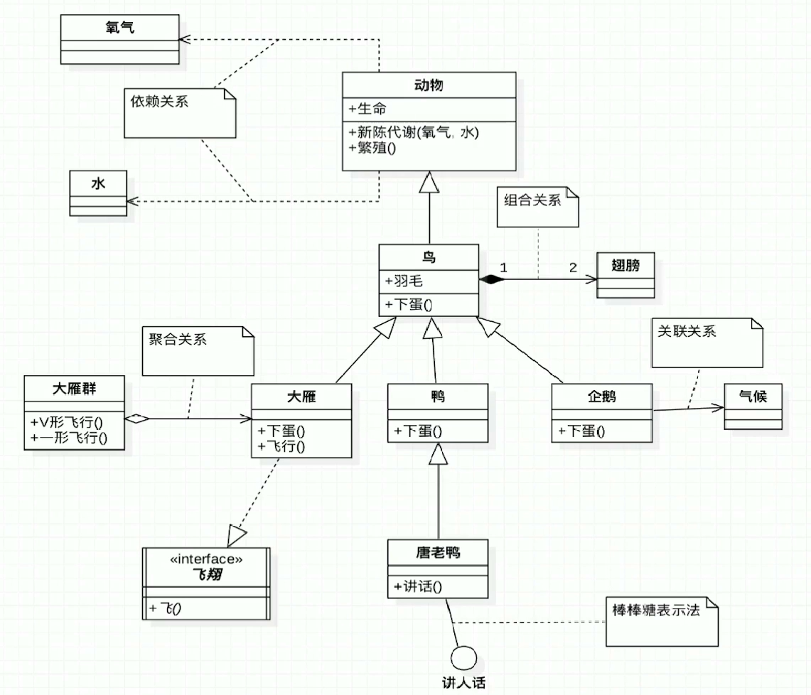

### UML类图说明

### 六大原则

- 单一职责：方法、类、接口单一
- 李氏替换：父类出现的地方都能透明的使用其子类
  - 覆盖或者实现父类的方法数 **输入参数可以被放大**
  - 覆盖或者实现父类的方法时 **返回值类型可以被缩小**
- 依赖倒置：面向接口编程（OOD——Object-Oriented Design），广泛引用于测试驱动开发（TDD），使用Mock数据开发
  - 高层模块不应该依赖底层模块，两者都应该依赖抽象：模块之间的依赖性通过抽象发生，实现类之间不发生直接的依赖关系
  - 抽象不应该依赖细节：接口或者抽象类不依赖具体实现类
  - 细节应该依赖抽象：实现类依赖接口或者抽象类
- 接口隔离：类间的依赖关系应该是建立在最小接口之上的，或者说：客户端应该依赖它不需要的接口（因为这些不需要的接口可能对它来说是没有权限的，不安全的等等）

- 迪米特法则：最小知道原则，不要和陌生人说话（只和直接朋友交流），例如controller调用service，service调用dao，而不会出现controller直接调用dao，因为dao层不是controller层的直接朋友

- 开闭原则：对拓展开放，对修改关闭：通过拓展软件的实体行为来实现变化，而不是通过修改已有的代码来实现变化。其它所有原则都是为该原则服务。