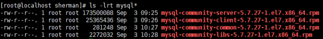
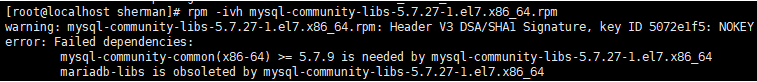
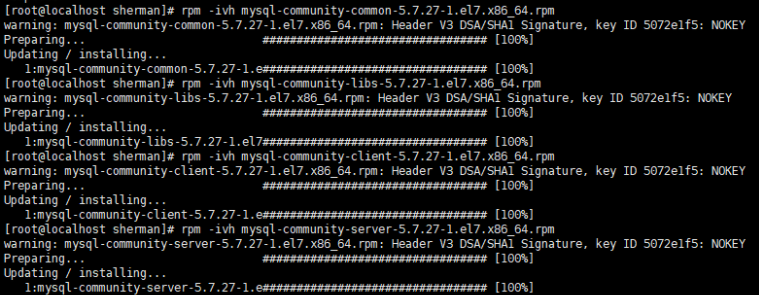
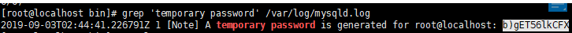

## Linux定制篇

### 1.1 JDK安装和配置
- 下载jdk tar.gz格式安装包，放在/opt下
- 解压：tar -zxvf jdk-8u231-linux-x64.tar.gz
- 配置环境变量：vim /etc/profile
```properties
# Jdk and jre configuration
JAVA_HOME=/opt/jdk1.8.0_231
JRE_HOME=$JAVA_HOME/jre
CLASS_PATH=.:$JAVA_HOME/lib:$JRE_HOME/lib
PATH=$JAVA_HOME/bin:$PATH
export JAVA_HOME JRE_HOME CLASS_PATH PATH
```
- 激活环境变量：source /etc/profile

### 1.2 Tomcat安装
- 下载apache-tomcat-8.5.49.tar.gz，并解压
- firewall-cmd --add-port=8080/tcp --zone=public --permanent
- 启动Tomcat应用，访问8080端口即可

### 1.3 MySQL安装
- 下载MySQL的server和client安装包，必须包含server、client、common、lib四个包：


- 查询之前是否使用rpm安装过mysql：
```shell
rpm -qa | grep -i mysql
# 如果查询出来有相应安装，进行删除
rpm -e 相应rpm安装包 
```
- 安装四个rpm文件，顺序：common -> libs -> client -> server
    - 注意安装libs可能出现：
    
    
    - 解决办法：清除yum里面所有mysql依赖的包：
    ```shell
    rpm -qa | grep mysql
    yum remove mysql-libs
    ```
    - 重新按照：common -> libs -> client -> server顺序安装即可
    
    
- 启动mysql服务：systemctl start mysqld.service
- 登录mysql：
    - 使用临时密码方式登录：标记部分即为临时密码
    
    
    - mysql -u root -p 临时密码，登录即可
    - 修改密码：
    ```shell
    # MySQL5.7默认不允许弱密码，需要进行修改：
    set global validate_password_policy=0;
    set global validate_password_length=1;
    # 修改新密码：
    set password for root@localhost=password('sherman');
    # 授予root远程访问权限：
    grant all privileges on *.* to root@'%' identified by 'sherman';
    flush privileges;
    # 查看是否成功：
    use mysql;
    select user, host from user;
    ```
- 防火墙开放3306端口：firewall-cmd --zone=public --add-port=3306/tcp --permanent

### 1.4 安装SpringToolSuite
- 下载spring-tool-suite-4-4.4.2.RELEASE-e4.13.0-linux.gtk.x86_64.tar.gz并解压
- 在/etc/profile中给SpringToolSuited4一个alias:
```shell
# Give an alias for SpringToolSuite4
alias sts=/opt/develop_tools/sts-4.4.2.RELEASE/SpringToolSuite4
```
- 在sherman用户下激活配置：source /etc/profile，注意要在sherman用户下激活。同样的道理，
在/etc/profile中配置了jdk和jre，如果要激活也需要在sherman用户下激活，否则启动sts之后，默认
使用的jdk还是openjdk。
- 之后在terminal中直接输入**sts**，即可启动springToolSuite4。