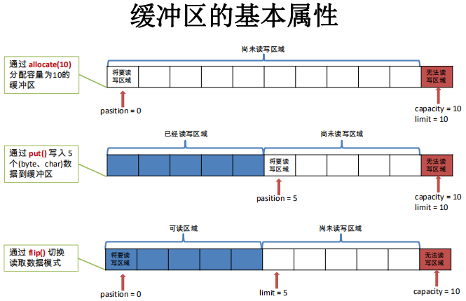
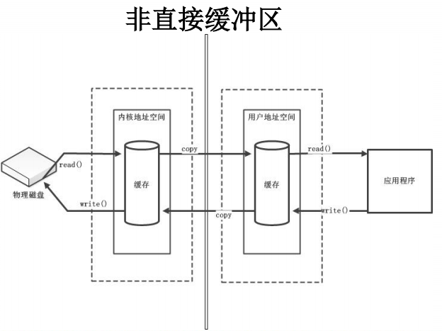
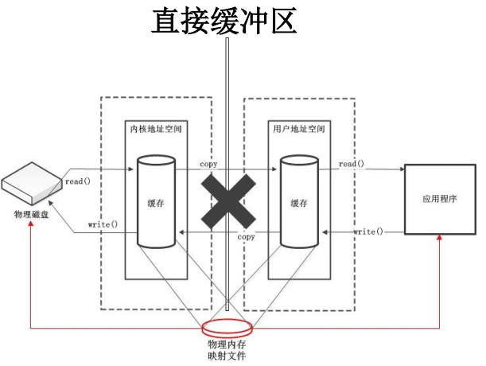
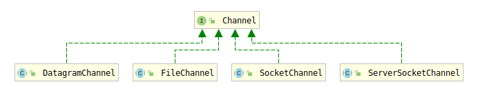
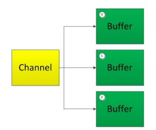
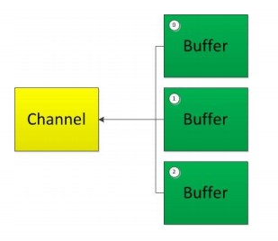
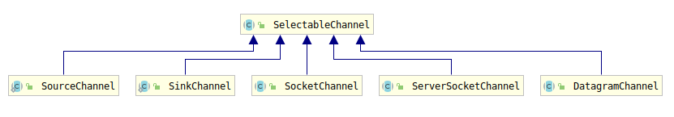
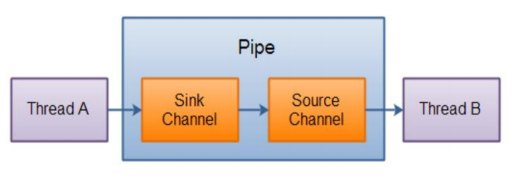

# NIO

## 一. Java NIO简介

​		Java NIO（New IO，也可以称为Non-Blocking IO）是从JDK1.4版本开始引入的一个新的IO API，可以替代标准的Java IO API。NIO和原来的IO有同样的作用和目的，但是使用方式完全不同，NIO主要是支持面向缓冲区的、基于通道的IO操作，因此NIO可以更加高效地进行文件读写操作

### 1.1 NIO和IO的主要区别

* IO是面向流的，NIO是面向缓冲区的：NIO中在程序和和远端（磁盘）文件之间建立一个通道（Channel），通道的目的是负责连接，而真正的数据是存储在缓冲区（Buffer）中，即缓冲区负责存储。缓冲区可以在通道中双向传输导致数据能够进行传输，因此NIO是面向缓冲区的
* IO是阻塞IO，NIO是非阻塞IO
* NIO提供了选择器（Selectors）

### 1.2 通道和缓冲区

​		Java NIO的核心在于：通道和缓冲区。通道表示打开到IO（File, Socker）设备的连接，若需要使用NIO系统，需要获取到用于连接IO设备的通道以及用于容纳数据的缓冲区。然后操作缓冲区，对数据进行处理。简而言之：**通道负责传输，缓冲区负责存储**


## 二. 缓冲区——数据存储

​		在Java NIO中，缓冲区负责数据存储。缓冲区本身就是一个数组，用于存储不同数据类型的数据。根据数据类型不同（boolean除外），提供了不同类型的缓冲区（ByteBuffer, CharBuffer, ShortBuffer, IntBuffer, LongBuffer, FloatBuffer, DoubleBuffer），不同类型的缓冲区的管理方式几乎是一致的，通过**allocate()**获取缓冲区

### 2.1 缓冲区的主要方法

* 创建一个指定大小的缓冲区：

```java
ByteBuffer buf = new ByteBuffer(1024); // 分配一个1024字节的Byte缓冲区
```

* 存取数据的两个核心方法：
  * put()：存入数据到缓冲区中
  * get()：获取缓冲区中的数据
* 切换读写模式：flip()
* 恢复到读模式最初状态，可重复读：rewind()
* 清空缓冲区，但是缓冲区的数据仍然存在，处于“被遗忘”状态：clear()
* 标记当前position的位置：mark()
* 将position恢复到mark标记的位置：reset()
* 判断缓冲区中是否还有数据/缓冲区中还有多少剩余数据：hasRemaining()/remaining()

### 2.2 缓冲区的4个核心属性

* capacity：容量，表示缓冲区中最大存储数据的容量，一旦声明就不能改变
* limit：界限，表示缓冲区中可以操作数据的大小，limit之后的数据不能进行读写
* position：位置，表示缓冲区中正在操作数据的位置
* mark：标记，表示记录当前position的位置，配合reset()方法可以将position恢复到mark的位置
* `​0 <= mark <= postion <= limit <= capacity`



```java
// 演示NIO中Buffer的相关方法
public class ByteBufferDemo {
    public static void main(String[] args) {
        // 1. 分配一个指定大小为1024的Byte类型缓冲区
        ByteBuffer buf = ByteBuffer.allocate(1024);

        System.out.println("----------------allocate()-----------------");
        System.out.println(buf.capacity());		    // 1024
        System.out.println(buf.limit());		    // 1024
        System.out.println(buf.position());		    // 0

        // 2. 使用put()方法将数据写入到缓冲区中
        String str = "abcde";
        buf.put(str.getBytes());
        System.out.println("----------------put()-----------------");
        System.out.println(buf.capacity());         // 1024
        System.out.println(buf.limit());            // 1024，此时limit没有变化
        System.out.println(buf.position());         // 5

        // 3. 使用flip()方法切换到写模式
        buf.flip();
        System.out.println("----------------flip()-----------------");
        System.out.println(buf.capacity());         // 1024
        System.out.println(buf.limit());            // 5
        System.out.println(buf.position());         // 0

        // 4. 使用get()方法对缓冲区中数据进行读取
        byte[] dst = new byte[buf.limit()];
        buf.get(dst);
        System.out.println("----------------get()-----------------");
        System.out.println("读取到数据: " + new String(dst));
        System.out.println(buf.capacity());         // 1024
        System.out.println(buf.limit());            // 5
        System.out.println(buf.position());         // 5, get()之后，position开始移动

        // 5. 使用rewind()将position恢复到读模式最开始状态, 可重复读
        buf.rewind();
        System.out.println("----------------rewind()-----------------");
        System.out.println(buf.capacity());         // 1024
        System.out.println(buf.limit());            // 5
        System.out.println(buf.position());         // 0

        // 6. 使用clear()方法清空缓冲区, 恢复到allocate状态, 但是缓冲区中数据依然存在
        buf.clear();
        buf.rewind();
        System.out.println("----------------clear()-----------------");
        System.out.println(buf.capacity());         // 1024
        System.out.println(buf.limit());            // 1024
        System.out.println(buf.position());         // 0
        System.out.println((char)buf.get());        // a，仍能获取到数据，数据在缓冲区中仍然存在
    }
}
```

```java
// 演示NIO中Buffer的mark属性
public class MarkFieldDemo {
    public static void main(String[] args) {
        ByteBuffer buf = ByteBuffer.allocate(1024);
        String str = "abcde";
        buf.put(str.getBytes());

        buf.flip();

        byte[] dst = new byte[buf.limit()];
        buf.get(dst, 0, 2);
        System.out.println(new String(dst, 0, 2));    // ab
        System.out.println(buf.position());           // 2

        // 标记一下此时位置为2，便于之后reset回来
        buf.mark();

        buf.get(dst, 2, 2);
        System.out.println(new String(dst, 0, 2));    // cd
        System.out.println(buf.position());           // 4

        // 恢复到原来mark的地方，即postion为2
        buf.reset();
        System.out.println(buf.position());           // 2

        // 缓冲区中是否还有剩余数据，此时reset到mark2的位置上，还有3个数据
        if (buf.hasRemaining()){
            System.out.println(buf.remaining());      // 3
        }
    }
}
```

### 2.3 直接缓冲区和非直接缓冲区

* 非直接缓冲区：通过ByteBuffer.allocate(capacity)分配缓冲区，该缓冲区是分配在JVM内存中，由JVM进行管理。当应用程序向磁盘读写文件时，需要将数据不断在**内核地址空间和用户地址空间之间来回复制**，效率较低



* 直接缓冲区：通过ByteBuffer.allocateDirect()方法分配直接缓冲区，将缓冲区建立在物理内存中，不受JVM控制。当进行IO操作时，JVM会尽可能直接在直接缓冲区上操作，避免复制操作。如果不断在物理内存中分配内存，JVM内部不会收到影响，但可能导致直接内存被使用完毕，最终抛出**OOM: Direct buffer memory**异常。直接缓冲区避免了复制操作从而提高了效率，但同时对之间缓冲区的分配和销毁操作成本会相应提高，并且直接缓冲区控制权不在JVM，也会增加不确定性风险



* 判断是否为直接缓冲区：isDirect()，提供该方法是为了能够在性能关键型代码中执行显式缓冲区管理


## 三. 通道

​		通道用于源节点和目标节点的连接，在Java NIO中负责缓冲区数据的传输，Channel本身不存储数据，需要配合缓冲区一起使用

### 3.1 通道的主要实现类



### 3.2 获取通道的方法

* Java针对支持通道的类提供了getChannel()方法
  * 本地IO：FileInputStream/FileOutputStream/RandomAccessFile
  * 网络IO：Socket/ServerSocket/DatagramSocket
* 在JDK1.7中NIO.2中，针对各个通道提供了静态方法open()
* 在JDK1.7中NIO.2中，Files工具类提供静态方法newByteChannel()

```java
/**
 * 使用管道完成图片拷贝（非直接缓冲区）
 */
public class ChannelDemo1 {
    public static void main(String[] args) throws IOException {
        FileInputStream fis = null;
        FileOutputStream fos = null;
        FileChannel inChannel = null;
        FileChannel outChannel = null;

        try {
            // 相对工程根路径，这里nio以mudule形式存在于project（notes）下
            // 因此工程根路径为notes，需要加上nio前缀
            fis = new FileInputStream("nio\\tom.jpg");
            fos = new FileOutputStream("nio\\dst.jpg");

            // 从stream流中获取Channel
            inChannel = fis.getChannel();
            outChannel = fos.getChannel();

            ByteBuffer buf = ByteBuffer.allocate(1024);
            while ((inChannel.read(buf)) != -1) {
                // 切换成读模式
                buf.flip();
                outChannel.write(buf);
                buf.clear();
            }
        } catch (Exception e) {
            e.printStackTrace();
        } finally {
            if (outChannel != null) {
                outChannel.close();
            }
            if (inChannel != null) {
                inChannel.close();
            }
            if (fis != null) {
                fis.close();
            }
            if (fos != null) {
                fos.close();
            }
        }
    }
}
```

### 3.3 通道的数据传输与内存映射文件

* 使用直接缓冲区完成文件复制（内存映射文件），缓冲区是通过Channel的**map**方法获得。注意如果使用直接缓冲区进行复制文件操作，复制操作效率提高，但是**文件复制完成并不代表程序会立刻结束**，可能程序仍然会继续运行一会才会终止。因此，建议将直接缓冲区主要分配给那些易受基础系统本机IO操作影响的大型、持久缓冲区。一般情况下，最好仅在直接缓冲区能在性能方面带来明显优势时才分配：

```java
/**
 * 使用管道完成图片复制（只用直接内存，即内存映射文件）
 */
public class ChannelDemo2 {
    public static void main(String[] args) throws IOException {

        // 注意：Channel.open的StandardOpenOption要和Channel.map中MapMode模式相互对应
        FileChannel inChannel = FileChannel.open(Paths.get("nio\\tom.jpg"),
                                                 StandardOpenOption.READ);
        FileChannel outChannel = FileChannel.open(Paths.get("nio\\dst-1.jpg"),
                								 StandardOpenOption.READ, 
                                                 StandardOpenOption.WRITE, 		
                                                 StandardOpenOption.CREATE);

        // 内存映射文件，和ByteBuffer.allocateDirect()原理类似
        MappedByteBuffer inMapBuf = 
            inChannel.map(FileChannel.MapMode.READ_ONLY, 0, inChannel.size());
        MappedByteBuffer outMapBuf = 
            outChannel.map(FileChannel.MapMode.READ_WRITE, 0, inChannel.size());

        // 现在不需要通道，因为都直接在内存映射文件中
        byte[] buf = new byte[inMapBuf.limit()];
        inMapBuf.get(buf);
        outMapBuf.put(buf);

        inChannel.close();
        outChannel.close();
    }
}
```

* 通道之间通过**transferTo()**和**transferFrom()**两个函数能够完成直接传输
    * inChannel.transferTo(start, count, outChannel);
    * outChannel.transferFrom(inChannel, start, count);

```java
/**
 * 使用管道完成图片复制（直接使用transferTo和transferFrom完成传输）
 */
public class ChannelDemo3 {
    public static void main(String[] args) throws IOException {
        FileChannel inChannel = FileChannel.open(Paths.get("nio\\tom.jpg"), StandardOpenOption.READ);
        FileChannel outChannel = FileChannel.open(Paths.get("nio\\dst-2.jpg"),
                StandardOpenOption.READ, StandardOpenOption.WRITE, StandardOpenOption.CREATE);

        // transferTo和transferFrom等价，不同形式而已
        // inChannel.transferTo(0, inChannel.size(), outChannel);
        outChannel.transferFrom(inChannel, 0, inChannel.size());
        inChannel.close();
        outChannel.close();
    }
}
```


## 四. 分散和聚集

### 4.1 分散（Scatter）

* 分散读取（Scatter Reads）：指从Channel中读取的数据“分散”到多个Buffer中



* 注意：按照缓冲区的顺序，依次从Channel中读取数据将Buffer填满为止

### 4.2 聚集（Gather）

* 聚集写入（Gathering Writes）：指将多个Buffer中的数据“聚集”到一个Channel中



* 注意：按照缓冲区的顺序，将Buffer中**从position到limit之间**的数据写入到Channel中

### 4.3 演示

```java
/**
 * 演示Scatter & Gather
 */
public class ScatterAndGatherDemo {
    public static void main(String[] args) throws IOException {
        RandomAccessFile inRaf = new RandomAccessFile("nio\\tom.jpg", "rw");
        RandomAccessFile outRaf = new RandomAccessFile("nio\\dst-3.jpg", "rw");
        FileChannel inChannel = inRaf.getChannel();
        FileChannel outChannel = outRaf.getChannel();

        // 分散的buffer大小之和要大于输入图片
        ByteBuffer buf1 = ByteBuffer.allocate(1024 * 20);
        ByteBuffer buf2 = ByteBuffer.allocate(1024 * 20);
        ByteBuffer buf3 = ByteBuffer.allocate(1024 * 30);

        ByteBuffer[] bufs = {buf1, buf2, buf3};
        inChannel.read(bufs);
        // 读完之后需要flip操作切换成写模式
        for (ByteBuffer buf : bufs) {
            buf.flip();
        }
        outChannel.write(bufs);
    }
}
```

### 4.4 字符集

```java
/**
 * 字符集（编、解码器）演示
 */
public class CharsetDemo {
    public static void main(String[] args) throws CharacterCodingException {
        // 获取所有编码集
//        SortedMap<String, Charset> charsets = Charset.availableCharsets();
//        for (Map.Entry<String, Charset> charset : charsets.entrySet()) {
//            System.out.println(charset.getKey() + ": " + charset.getValue());
//        }

        Charset gbk = Charset.forName("GBK");
        // 获取编码器和解码器
        CharsetEncoder encoder = gbk.newEncoder();
        CharsetDecoder decoder = gbk.newDecoder();

        // CharBuffer编码成ByteBuffer
        CharBuffer charBuf = CharBuffer.allocate(1024);
        charBuf.put("你好NIO");
        charBuf.flip();

        // 开始编码
        ByteBuffer byteBuf = encoder.encode(charBuf);
        for (int i = 0; i < byteBuf.limit(); i++) {
            System.out.println(byteBuf.get());
        }

        // 开始解码
        byteBuf.flip();
        CharBuffer decodeCharBuf = decoder.decode(byteBuf);
        System.out.println(decodeCharBuf.toString());

        // 使用UTF-8进行解码，出现乱码
        byteBuf.flip();
        // 直接解码，不需要显示指定使用解码器
        System.out.println(Charset.forName("UTF-8").decode(byteBuf).toString());
    }
}
```

## 五. NIO非阻塞式网络IO

* Java NIO是非阻塞模式的，当线程从某个通道进行读写数据时，如果没有数据可用时，该线程可以进行其他任务。线程通常将非阻塞IO的空闲时间用于其它通道上执行IO操作，所以单独的线程可以管理多个输入和输出通道，NIO可以让服务器端使用一个或者多个线程同时处理连接到服务器端的所有客户端

* 选择器（Selector）：是 SelectableChannle 对象的多路复用器，Selector 可以同时监控多SelectableChannel 的 IO 状况（能够知道该通道是否为读写事件做好准备），也就是说，利用 Selector 可使一个单独的线程管理多个 Channel。Selector 是非阻塞 IO 的核心。



### 5.1客户端（TCP）

```java
/**
 * NIO非阻塞IO下C-S模型：客户端
 */
public class NIOTcpClient {
    public static void main(String[] args) throws IOException {
        SocketChannel socketChannel = SocketChannel.open(new InetSocketAddress("127.0.0.1", 2571));
        // 设置为非阻塞模式
        socketChannel.configureBlocking(false);
        ByteBuffer buf = ByteBuffer.allocate(1024);

        Scanner scanner = new Scanner(System.in);
        while (scanner.hasNext()) {
            String next = scanner.next();
            buf.put((new Date().toString() + ": " + next).getBytes());
            buf.flip();
            socketChannel.write(buf);
            buf.clear();
            System.out.println(next);
        }
        socketChannel.close();
        scanner.close();
    }
}
```

### 5.2 服务端（TCP）

```java
/**
 * NIO非阻塞IO下C-S模型：服务端
 */
public class NIOTcpServer {
    public static void main(String[] args) throws IOException {
        // 1. 创建Channel
        ServerSocketChannel ssChannel = ServerSocketChannel.open();
        // 2. 设置为非阻塞
        ssChannel.configureBlocking(false);
        // 3. 绑定端口
        ssChannel.bind(new InetSocketAddress(2571));
        // 4. 获得选择器
        Selector selector = Selector.open();
        // 5. 将通道注册在选择器上，并绑定监听的事件
        ssChannel.register(selector, SelectionKey.OP_ACCEPT);
        // 6. 轮训获取selector上已经就绪的事件
        while(selector.select() > 0) {
            // 7. 获取当前selector中所有注册的键
            Iterator<SelectionKey> iter = selector.selectedKeys().iterator();
            while(iter.hasNext()) {
                SelectionKey sk = iter.next();
                // 8. 判断具体是注册的哪种键
                if (sk.isAcceptable()){
                    // 8.1. 接受准备就绪，获取客户端的连接
                    // 注意需要返回一个和原来ssChannle不一样的Channel
                    SocketChannel acceptChannel = ssChannel.accept();
                    // 将客户端连接设置为非阻塞模式
                    acceptChannel.configureBlocking(false);
                    // 将accept后的channel再注册到selector上，并且键为读就绪状态
                    acceptChannel.register(selector, SelectionKey.OP_READ);
                }else if (sk.isReadable()){
                    // 8.2. 读就绪状态
                    SocketChannel sChannel = (SocketChannel) sk.channel();
                    // 读取数据
                    ByteBuffer buf = ByteBuffer.allocate(1024);
                    int len = 0;
                    while((len = sChannel.read(buf)) > 0) {
                        System.out.println(len);
                        buf.flip();
                        System.out.println(new String(buf.array(), 0, len));
                        buf.clear();
                    }
                }
                // 9. 取消键
                iter.remove();
            }
        }
    }
}
```

### 5.3 客户端（UDP）

```java
/**
 * NIO UDP C-S模型：客户端
 */
public class NIOUdpClient {
    public static void main(String[] args) throws IOException {
        DatagramChannel dc = DatagramChannel.open();
        ByteBuffer buf = ByteBuffer.allocate(1024);
        Scanner scanner = new Scanner(System.in);
        while (scanner.hasNext()) {
            String next = scanner.next();
            buf.put((new Date().toString() + ": " + next).getBytes());
            buf.flip();
            dc.send(buf, new InetSocketAddress("127.0.0.1", 2571));
            buf.clear();
        }
        dc.close();
        scanner.close();
    }
}
```

### 5.4 服务端（UDP）

```java
/**
 * NIO UDP C-S模型：服务端
 */
public class NIOUdpServer {
    public static void main(String[] args) throws IOException {
        DatagramChannel dc = DatagramChannel.open();
        dc.configureBlocking(false);
        dc.bind(new InetSocketAddress(2571));
        Selector selector = Selector.open();
        dc.register(selector, SelectionKey.OP_READ);
        while (selector.select() > 0) {
            Iterator<SelectionKey> iter = selector.selectedKeys().iterator();
            while (iter.hasNext()) {
                SelectionKey sk = iter.next();
                if (sk.isReadable()) {
                    ByteBuffer buf = ByteBuffer.allocate(1024);
                    dc.receive(buf);
                    buf.flip();
                    System.out.println(new String(buf.array(), 0, buf.limit()));
                    buf.clear();
                }
                iter.remove();
            }
        }
        dc.close();
    }
}
```


## 六. 管道

​		Java NIO管道是2个线程之间的单向数据连接。Pipe有一个sink通道和一个source通道。数据会被写入到sink通道，然后从source通道中读取。



```java
/**
 * Pipe完成数据单向连接
 */
public class PipeDemo {
    public static void main(String[] args) throws IOException {
        // 1. 获取管道
        Pipe pipe = Pipe.open();

        // 2. 将缓冲区中内容sink到pipe中
        ByteBuffer buf = ByteBuffer.allocate(1024);
        Pipe.SinkChannel sinkChannel = pipe.sink();

        // 3. 向缓冲区中写数据
        buf.put("你好NIO ".getBytes());
        buf.flip();
        sinkChannel.write(buf);

        // 4. 从缓冲区中读数据
        Pipe.SourceChannel sourceChannel = pipe.source();
        buf.flip();
        int len = sourceChannel.read(buf);
        System.out.println(new String(buf.array(), 0, len));
    }
}
```