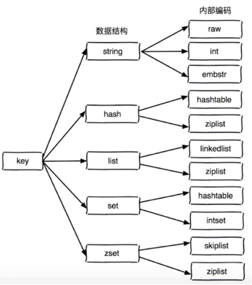
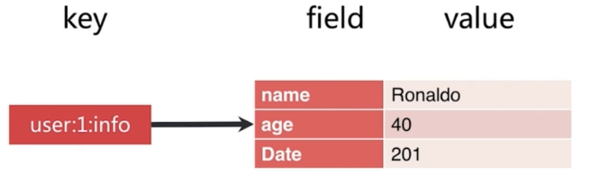
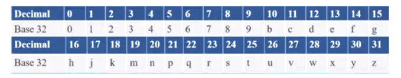

## 一. redis概述

### 1.1 redis是什么

全称：REmote DIctionary Server（远程字典服务器），高性能的key-value分布式内存数据库，基于内存运行并支持持久化的NoSQL数据库，是当前最热门的NoSQL数据库之一。

### 1.2 用途

- 内存存储和持久化：存储在内存中同时支持异步写入到硬盘中

- 为频繁获取最新的K个数据操作设置了缓存

- 模拟类似HttpSession这种需要设置过期时间的功能

- 发布、订阅消息系统

- 定时器、计数器

### 1.3 安装

[官网教程](https://redis.io/download)

**redis-server三种启动方式**

- 最简启动：./redis-server 默认配置启动
- 动态参数：./redis-server --port xxxx
- 配置文件：./redis-server path/to/config/file，生产环境中推荐使用，并且单机多实例情况下，配置文件可以用端口区分

**redis-cli客户端连接方式**

```shell
>> ./redis-cli -h localhost -p 6379 -a password
>> ping
PONG
>> set hello world
>> get hello
world
```

**客户端返回值**

- 状态回复：ping -> PONG、(nil)
- 错误回复：(error)  WRONGTYPE Operation against
- 整数回复：(integer) 1
- 单行字符串：get hello -> "world"
- 多行字符串：mget hello bar -> 1) "world" \n 2) "bar"

### 1.4 可执行文件介绍

在redis/src目录下执行：

```shell
# 查找可执行文件
ls -F | grep "*"
# 输出：
mkreleasehdr.sh*
redis-benchmark*
redis-check-aof*
redis-check-rdb*
redis-cli*
redis-sentinel*
redis-server*
redis-trib.rb*

# 除此之外：
ls -F | grep "/" # 查找目录
ls -F | grep "=" # 查找套接字
ls -F | grep "|" # 查找FIFOS
ls -F | grep "#" # 查找链接符号
```

| 文件名          | 描述                                            |
| :-------------- | :---------------------------------------------- |
| redis-benchmark | redis基准性能测试工具                           |
| redis-check-aof | redis append only file（AOF）检查工具           |
| redis-ckeck-rdb | redis RDB检查工具                               |
| redis-cli       | redis客户端工具                                 |
| redis-sentinal  | redis哨兵节点，其实是一个软连接指向redis-server |
| redis-server    | redis服务器                                     |
| redis-trib.rb   | ruby开发的redis cluster管理工具                 |

### 1.5 redis服务器相关信息获取

使用./redis-cli -a password INFO [可选命令]查看：

| 可选命令    | 描述                       |
| ----------- | -------------------------- |
| Server      | redis服务器的基本信息      |
| Clients     | 客户端的连接和指标         |
| Memory      | 大致内存消耗指标           |
| Persistence | 数据持久化相关的状态和指标 |
| Stats       | 总体统计数据               |
| Replication | 主从复制相关状态和指标     |
| CPU         | CPU使用情况                |
| Cluster     | redis cluster的状态        |
| Keyspace    | 数据库相关的统计数据       |

### 1.6 redis通用命令

以下key可以是任何类型：

* keys [pattern]：遍历出所有的key，支持正则表达式。O(n)，会阻塞单线程的redis，生产环境不建议使用。可以使用**热备从节点**或者**scan命令**解决
* dbsize：计算key的总数，内部维护了计数器，O(1)
* exists key：检查key是否存在，O(1)

- del key [key...]：删除指定的key-value，可以删除多个
- expire key seconds：设置key的过期时间，O(1)

```shell
# 设置hello的过期时间为10s
expire hello 10
# ttl hello：查看hello的过期时间：-1代表key没有设置过期时间；-2代表key已经过期被删除
# 注意：对一个不存在的key执行ttl命令也是返回-2
ttl hello
# persist hello：取消hello的过期时间
persist hello
```

- type key：返回type的类型，O(1)


## 二. redis数据结构

redis有基本五种数据结构，在后续版本中添加了新的数据结构：

- **字符串**
- **列表list        （l开头）**
- **散列表hash（h开头）**
- **无序集合      （s开头）**
- **有序集合      （z开头）**
- 基数统计HyperLogLog（v2.9）
- 地理地图GEO（v3.2）
- 流Stream（v5.0）

redis数据结构和内部编码示意图：



### 2.1 字符串

redis中String类型是最基本的类型，它是**二进制安全**的（放入什么东西，拿出来的就是什么东西，不会出现乱码等情况），字符串类型**最大存储的内存为512M**。redis内部使用了三种编码类型来保存字符串对象的数据，会自动根据保存字符串的内容变化。

**二进制安全**

因为reids的编码和解码过程**只发生在客户端**，也因此效率较高，不需要额外时间编解码。客户端使用特定编码方式发送数据给服务器，服务器接收到的数据是二进制的。服务端经过一系列操作之后，在将二进制数据返回给客户端，客户端才会使用特定解码方式对二进制数据进行解码。

**内部编码方式**

- int：用于保存64位有符号的整型的字符串
- embstr：用于保存**小于等于44字节**的字符串，有利于提高redis的工作效率
- raw：用于保存**大于44字节**的字符串

可以使用**OBJECT ENCODING key**查看对应key的内部编码方式。

**相关命令**

- get、set、del：获取、设置、删除key
- incr、decr、incrby、decrby：自增、自减、key自增某个值、key自减某个值

```shell
# incr、decr、incrby、decrby如果key不存在，默认是key原始值为0
>> incr x
>> get x
"1"
>> decrby y 10
>> get y
"-10"
```

* set key value [expiration ex seconds|px milliseconds] [nx|xx]：过期时间、不存在设置、存在设置

```shell
>> exists name
(integer) 0
# 相当于setex name 10 sherman，但是不能指定时间为milliseconds
>> set name sherman ex 10
>> ttl name
(integer) 8
...
>> exists name
(integer) 0

# 相当于setnx name tanglei，key不存在才能设置成功，add操作
>> set name tanglei nx
OK
# 相当于setxx name sherman，key存在才能设置成功，update操作
>> set name sherman xx
>> get name
"sherman"
```

- mget、mset：批量操作（原子操作），避免多次网络传输时间开销，但是也不能一次性传输太多命令，需要消耗过多网络带宽
- getset key new_value：原子操作，返回旧值并更新新值
- append key value：将value追加到原来key对应的value上

- incrcrbyfloat key value：对key进行浮点数自增、自减（将value设置为负数），注意没有decrbyfloat命令

- getrange key start end：获取字符串指定下标所有的值，注意start和end都是包含在内的
- setrange key index value：设置指定下标所有对应的值，注意设置

```shell
>> set name "sherman1996"
>> setrange name 1 zzz
>> get name
"szzzman1996"
>> setrange name 1 xxxxxxxxxxxxxxxx
"sxxxxxxxxxxxxxxxxzzzzzzzzzzzzzz"
```

- strlen key：获取key的长度


### 2.2 Hash

redis本身的数据结构就是key-value键值对，散列这种数据结构也称为**mapmap**，为了区别redis的key和hash的key，把hash的key成为field。相对于字符串而言，最大缺点就是：**ttl无法控制某个field的过期时间，只能自己维护对应逻辑。**



**相关命令**

- hget、hgetall、hset、hdel：获取、设置、删除，注意尽量不要使用hgetall，就像尽量在MySQL中不要使用**select ***一样

```shell
>> hset user:1:info name sherman
>> hget user:1:info name
"sherman"
>> hset user:1:info age 23
>> hgetall user:1:info
1) "name"
2) "sherman"
3) "age"
4) "23"
>> hdel user:1:info name age
(integer) 2
>> hgetall user:1:info
(empty list or set)
```

* hmset、hmget、hexists、hlen：判断hash key是否有field

```shell
>> hmset user:1:info name tanglei age 23 date 201
OK
>> hmget user:1:info name age date
1) "tanglei"
2) "23"
3) "201"
>> hexists user:1:info name
(integer) 1
>> hlen user:1:info
(integer) 3
```

- hvals、hkeys：返回hash所有的values和fields

```shell
>> hmset user:1:info name tanglei age 23 date 201
OK
>> hvals user:1:info
1) "tanglei"
2) "23"
3) 201
>> hkeys user:1:info
1) "name"
2) "age"
3) "date"
```

- hsetnx、hincrby、hincrbyfloat：不存在才能更新、自增、浮点数自增（自减）

```shell
# 在上面基础上
>> hsetnx user:1:info name xxx
(integer) 0
>> hsetnx user:1:info ext others
(integer) 1
>> hget user:1:info ext
"others"
>> hincrby user:1:info age 10
(integer) 33
>> hincrbyfloat user:1:info age -10.0
"23"
```


### 2.3 列表list

redis内部数据结构类似于**双向链表**，它是有序的、可以重复的并且可以从两边插入和弹出。

**相关命令**

- lpush、rpush、lrange：从左边、右边进行插入，获取指定范围内所有元素

```shell
>> lpush goods a b c d
(integer) 4
>> lrange goods 0 -1
1) "d"
2) "c"
3) "b"
4) "a"
>> rpush goods m n z
(integer) 7
>> lrange goods 0 -1
1) "d"
2) "c"
3) "b"
4) "a"
5) "m"
6) "n"
7) "z"
```

- linsert key before|after value new_value：在指定value之前|后插入新的值new_value

```shell
>> linsert goods before c Java
(integer) 8
>> lrange goods 0 2
1) "d"
2) "Java"
3) "c"
```

- lpop、rpop：从左边、右边弹出一个元素

```shell
>> lpop goods
"d"
>> rpop goods
"z"
```

- lrem key count value：列表是可以重复的，由count可控制扫描顺序和删除数量：
  - count=0：删除所有和value相等的项
  - count>0：从左往右，删除最多count个相等的项
  - count<0：从右往左，删除最多abs(count)个相等的项

```shell
>> lpush items a c b a a b c b e
(integer) 9
>> lrem items 3 a
(integer) 3
>> lrem items -2 b
(integer) 2
>> lrange items 0 -1
1) "e"
2) "b"
3) "c"
4) "c"
>> lrem items 0 c
(integer) 2
>> lrange items 0 -1
1) "e"
2) "b"
```

- index key index：获取列表指定索引的item

- llen key：获取列表的长度，O(1)
- lset key index new_value：将指定索引位置上的值更新为new_value

- blpop、brpop key timeout：lpop、rpop的阻塞版本，timeout是阻塞超时时间，timeout=0为永不阻塞，**适合生产者-消费者模型或者阻塞队列**。
- ltrim key start end：对列表进行修剪，只保留指定区间的元素
- rpoplpush source destination：从右边pop，并push到左边，类似于循环排队功能

```shell
>> rpush items a b c d
(integer) 4
>> rpoplpush items items
"d"
>> lrange items 0 -1
1) "d"
2) "a"
3) "b"
4) "c"
```

**TIPS**

- LPUSH + LPOP   -> Stack
- LPUSH + RPOP   -> Queue
- LPUSH + LTRIM  -> Capped Collection
- LPUSH + BRPOP -> Message Queue


### 2.4 无序集合set

redis中集合和Java中集合类似，不能重复，可以进行结合运算（交集、并集、差集运算等等）。

**相关操作**

- sadd key member [member ...]：向集合中添加元素，如果已经存在则添加失败(integer 0)
- scard、spop、sismember、srandmember、smembers：集合大小、随机从集合中弹出几个元素、判断key是否在集合中、随机挑选几个元素、集合中所有元素

```shell
>> sadd user:1:follow music code swim sleep
(integer) 4

>> scard user:1:follow
(integer) 4

>> sismember user:1:follow code
(integer) 1
>> sismember user:1:follow eat
(integer) 0

>> srandmember user:1:follow 2
1) "code"
2) "sleep"
> scard user:1:follow
(integer) 4

>> spop user:1:follow 2
1) "sleep"
2) "swim"

# 无序且耗时，可以使用scan代替
>> smembers user:1:follow
1) "code"
2) "music"
```

- sdiff、sinter、sunion：集合间操作，差集、交集、并集

```shell
>> sadd user:1:lang Java c c++
(integer) 3
>> sadd user:2:lang Java python go
(integer) 3
>> sdiffer user:1:lang user:2:lang
1) "c++"
2) "c"
>> sinter user:1:lang user:2:lang
1) "Java"
>> sunion user:1:lang user:2:lang
1) "Java"
2) "c++"
3) "c"
4) "go"
5) "python"

```

* sdiffstore|sinterstore|sunionstore destination key [key ...]：将差集、交集、并集的结果保存在destination中

```shell
>> sdiffstore user:diff user:1:lang user:2:lang
(integer) 2
>> sinterstore user:inter user:1:lang user:2:lang
(integer) 1
>> sunionstore user:union user:a:lang user:2:lang
(integer) 5
```


### 2.5 有序集合sortedset

redis有序集合之所以能够进行排序，是因为在每次添加一个新元素时候，手动给每个元素赋值了一个分数score，排序就是通过这个分数进行的。

**相关操作**

- zadd key score member [score member ...]：添加操作
- zrem key member [member ...]：删除操作

```shell
>> zadd user:1:ranking 1 sherman 91 mike 200 frank 220 chris
(integer) 4
>> zrem user:1:ranking sherman chris
(integer) 2
```

- zscore key member：显示对应member的分数
- zincrby key increment member：对应member的分数自增increment（可以是负数）
- zrank key member：根据score获取对应member的排名
- zcard key：返回有序结合元素个数，O(1)

```shell
>> zscore user:1:ranking mike
"91"
>> zincrby user:1:ranking -1 mike
"90"
>> zcard user:1:ranking
(integer) 2
>> zrank user:1:ranking mike  # score: 90
(integer) 0
>> zrank user:1:ranking frank # score: 200 
(integer) 1
```

- zrange key start end [withscores]：进行范围遍历（按照排名升序排序，**注意某个元素排名为n，对应的下标为n-1**）

```shell
>> zrange user:1:ranking 0 -1
1) "mike"
2) "frank"
>> zrange user:1:ranking 0 -1 withscores # 带分数
1) "mike"
2) "90"
3) "frank"
4) "200"
```

- zrangebyscore key min max [withscores] [limit offset count]：按照分数遍历

```shell
>> zadd user:1:ranking 100 sherman 120 tl 140 gantlei 160 wqy 180 zhangsan
(integer) 5
>> zcard user:1:ranking
(integer) 7
>> zrangebyscore user:1:ranking 125 230
1) "gantlei"            # 排名0
2) "wqy"                # 排名1    
3) "zhangsan"           # 排名2
4) "frank"              # 排名3
>> zrangebyscore user:1:ranking 125 230 withscores limit 1 2 # 从排名1开始，显示2个
1) "wqy"
2) "160"
3) "zhangsan"
4) "180"
```

- zcount key minScore maxScore：获取指定范围内key的数量

```shell
>> zcount user:1:ranking 100 300
(integer) 6
```

- zremrangebyrank key start end：按照指定范围删除范围内所有元素
- zremrangebyscore key minScore maxScore：按照指定分数范围进行删除

```shell
# 删除排名[2, 3]范围元素，即sherman(100)、tl(120)被删除
>> zremrangebyrank user:1:ranking 1 2 
(integer) 2
# 删除分数[170, 220]范围元素，即zhangsan(180)、frank(200)被删除
>> zremrangebyscore user:1:ranking 170 200
(integer) 2
```

- zrevrank、zrevrange、zrevrangebyscore：对应zrank、zrange、zrangebyscore的reverse版本

```shell
>> zrange user:1:ranking 0 -1 withscores
1) "mike"
2) "90"
3) "gantlei"
4) "140"
5) "wqy"
6) "160"
>> zrevrank user:1:ranking mike # 反向排名第2
(integer) 2
>> zrevrange user:1:ranking 0 -1
1) "wqy"
2) "gantlei"
3) "mike"
>> zrevrangebyscore user:1:ranking 200 50 withscores
1) "wqy"
2) "160"
3) "gantlei"
4) "140"
5) "mike"
6) "90"
```
- zinterstore destination numkeys key [key ...] [weights weight] [aggregate sum|min|max]：将两个有序集合求交集保存在destination中，可以设置两个有序集合权重

```shell
# stu:1的期中考试成绩
>> zadd stu:1:mid_test 90 Chinese 80 Math 100 English
(integer) 3
# stu:1的期末考试成绩
>> zadd stu:1:fin_test 80 Chinese 90 Math 70 English
(integer) 3
# stu：1的总成绩加权求和：期中成绩 * 0.3 + 期末成绩 * 0.7
>> zinterstore stu:1:res 2 stu:1:mid_test stu:1:fin_test weights 0.3 0.7 aggregate sum
1) "English"
2) "79"
3) "Chinese"
4) "83"
5) "Math"
6) "87"
```

- zunionstore destination numKeys key [key ...] [weights weight] [aggregate sum|min|max]：将两个有序集合求并集，保存在destination中，可以设置这两个有序集合的权重：

```shell
# user:2 期中考试只考了语文、数学
>> zadd user:2:mid_test 100 Chinese 80 Math
(integer) 2
# user:2 期末考试只考了数学、英语
>> zadd user:2:fin_test 80 Math 90 English
(integer) 2
# user:2 最终三门课总成绩
>> zunionstore user:2:total 2 user:2:mid_test user:2:fin_test weights 0.3 0.7 aggregate sum
(integer) 3
>> zrange user:2:total 0 -1 withscores
1) "Chinese"
2) "30"
3) "English"
4) "62.999999999999993" # 注意这里有浮点数运算精度问题
5) "Math"
6) "80"
```

### 2.6 HyperLogLog

**场景**

统计网站每天访问的独立IP数量功能，注意**只关心独立IP的数量，并不关心具体的IP是什么**。

**思路一**：使用字符串

使用字符串，维护一个字符串集合，请求的ip直接放入到字符串集合中，独立ip即为字符串集合的大小。对于ipv4（xxx.xxx.xxx.xxx），每个字符串至少需要15字节才能完整表示：

| 数量     | 一天内存消耗 | 一个月内存消耗 | 一年内存消耗 |
| -------- | ------------ | -------------- | ------------ |
| 一百万ip | 15M          | 450M           | 5.4G         |
| 一千万ip | 150M         | 4.5G           | 54G          |
| 一亿ip   | 1.5G         | 45G            | 540G         |

**思路二**：使用HyperLogLog

独立IP统计这类问题，并不关心具体数据内容（IP内容）是什么，只关心这些数据的数量，redis引入了HyperLogLog统计机制：

HyperLogLog可以接受多个元素作为输入，并给出输入元素**基数估算值**。

- 基数：集合中不同元素的数量
- 估算值：算法给出的基数并不是精确地，但是该误差在合理的范围内，官方给定的误差率为0.81%

HyperLogLog本质上还是字符串，但是可以通过极小内存完成独立数据统计工作。因为无论输入数据的数量还是体积有多么庞大，它所需要计算基数的空间总是固定的，而且非常小，在redis中，每个HyperLogLog键只需要花费**12KB**的内存，就可以计算接近2^64个不同的基数。但是HyperLogLog只会根据输入元素来计算基数，并不会存储输入元素本身，因此HyperLogLog并不能像集合那样，能返回输入的元素本身。

**相关操作**

- pfadd key elment [element ...]：添加元素

* pfcoutn key：获取基数的估算值
* pfmerge destkey sourceKey [sourceKey ...]：和并多个HyperLogLog

```shell
>> pfadd ip1 123 123 124 125 126 126
(integer) 1
>> pfcount ip1
(integer) 4
>> pfadd ip2 123 126 127 128
(integer) 1
>> pfcount ip2
(integer) 4
>> pfmerge ip1_ip2 ip1 ip2
OK
>> pfcount ip1_ip2
(integer) 6
```

**思路三**：使用bitmap，后面介绍。

### 2.7 GEO

redis在v3.2以后增加了地理位置的处理相关数据结构。

**geohash地址编码**：把二维空间经纬度编码成一个字符串

- geohash用一个字符串表示经度和纬度的坐标

- geohash表示的是一个区域，并不是一个点

- geohash编码前缀可以表示更大的区域，编码的字符串越长，表示范围越小，字符串越短，表示范围越大

**geohash计算过程**：

- 将经度和纬度转换成二进制：例如点(39.923201, 116.390705)，纬度的范围是（-90, 90），中间值为0，对于39.923201在区间的有半部分，因此为1；然后在区间（0，90）范围内，中间值为45，39.923201在左半部分，得到0，依次类推，最终得到10111000110001111001。同理，也可以得到经度为116.390705的二进制编码为11010010110001000100。

- 合并经纬度的二进制：从高到低，偶数位是纬度，奇数位是经度，合并经纬度编码：

  ​							11100 11101 00100 01111 00000 01101 01011 00001

- 按照Base32进行编码：11100 -> 28 -> w；11101 -> 29 -> x；00100 -> 4 -> 4......依次类推，上述二进制经纬度最终被编码成：wx4g0ec1



​	

**相关操作**

- geoadd  key longtide latitude member [longtide latitude member ...]：添加空间元素
- geopos key member [member ...]：获取地理位置信息
- geodist key member1 member2 [unit]：计算两个位置距离，单位unit有m、km、mi、ft四种，默认单位m
- geohash key member [member ...]：获取地理位置的geohash值
- georadius key longtide latitude radisu m|km|ft|mi [withcoord] [withdist] [withhash] [COUNT count] [ASC|DESC] [STORE key] [STOREDIST key]：以给定的经纬度为中心， 返回与中心的距离不超过给定最大距离的所有位置元素。
  - [withcoord]：返回结果包含经纬度信息
  - [withdist]：返回结果中包含距离信息
  - [withhash]：返回结果中包含geohash值
  - [COUNT count]：指定最多输出count个元素，类似于MySQL中limit
  - [ASC|DESC]：升序或者降序输出
  - [STORE key]：输出结果保存在key中，注意和[with*]参数不能共存，类型是一个zset，对应score为距离信息
  - [STOREDIST key]：将距离信息保存在key中，注意和[with*]参数不能共存，类型是一个zset，对应score为距离信息
- georadiusbymember key member radius m|km|ft|mi [withcoord] [withdist] [withhash] [COUNT count] [ASC|DESC] [STORE key] [STOREDIST key]：以指定member为中心，获取距离不超过给定最大距离的所有位置元素

```shell
>> geoadd city 120.20000 30.26667 hangzhou 116.41667 39.91667 beijing 121.47 31.23 shanghai
(integer) 3
>> geopos city hangzhou beijing
1) 1) "120.20000249147415161"
   2) "30.2666706589875858"
2) 1) "116.41667157411575317"
   2) "39.91667095273589183"
>> geohash city hangzhou
1) "wtmkpjyuph0"
>> geodist city hangzhou beijing km
"1126.8937"
>> georadius city 120.0 34.0 400 km withcoord withdist withhash count 3 asc
1) 1) "shanghai" 				 # member
   2) "337.4642"				 # dist
   3) (integer) 4054803462927619 # hash
   4) 1) "121.47000163793563843" # longtide 
      2) "31.22999903975783553"  # latitude 
>> georadiusbymember city hangzhou 300 km
1) "hangzhou"
2) "shanghai"
```

### 2.8 Stream

Stream是redis5.0引入的一种新的数据类型，它是一种新的强大的支持多播的可持久化的消息队列，主要借鉴了kafaka的设计。

redis stream的结构有一个消息链表，将所有加入的消息都都串起来，每个消息都有一个唯一的ID和对应的内容。消息是持久化的，redis重启后，内容还在。

**相关操作**

- xadd key id field string [field stirng ...]：向流中发送一条消息，每个消息在流中都必须有一个id，可以使用**\***表示让服务器自动生成id，这个id是根据当前时间戳自动生成的
- xlen key：当前消息队列长度
- xrange key startID endID [COUNT count]：获取从startID到endID的消息，注意有两个特殊的符号：
  - -：表示无穷小
  - +：表示无穷大
  - xrange queue - + count 10：获取当前消息队列中前10个消息
- xrevrange key startID endID [COUNT count]：xrange的reverse版本
- xdel key ID [ID ...]：删除指定ID的消息
-  xread [COUNT count] [BLOCK milliseconds] STREAMS key [key ...] ID [ID ...]：可以阻塞方式获取数据
  - [BLOCK milliseconds]：0表示一直阻塞，否则阻塞对应时间。不加该选项表示非阻塞方式
  - ID：注意ID有一个特殊符号**$**，表示当前消息队列中id最大值
  - xread count 2 streams queue $：必定返回nil，因为要比最大值还要大
  - xread count 1 block 0 streams queue $：阻塞方式获取下一个值，只有生产者生产了，才获取对应产品，否则一直等待

```shell
>> xadd queue * msg0 "ahh"
"1578062157431-0"
>> xadd queue * msg1 "hello msg1"
"1578062167679-0"
>> xadd queue * msg2 "I'm sherman"
"1578062179221-0"
>> xadd queue * msg3 "nothing to say"
"1578062190380-0"
>> xlen queue
(integer) 4
>> xadd queue 1578062157431-0
(integer) 1

# 获取消息队列中所有消息
>> xrange queue - + 
1) 1) "1578062167679-0"
   2) 1) "msg1"
      2) "hello msg1"
2) 1) "1578062179221-0"
   2) 1) "msg2"
      2) "I'm sherman"
3) 1) "1578062190380-0"
   2) 1) "msg3"
      2) "nothing to say"
      
# 反向获取消息队列id从无穷大到1578062179221-0所有元素，输出结果保留2个
>> XREVRANGE queue + 1578062179221-0 count 2
1) 1) "1578062190380-0"
   2) 1) "msg3"
      2) "nothing to say"
2) 1) "1578062179221-0"
   2) 1) "msg2"
      2) "I'm sherman"
      
# 非阻塞方式获取queue中id比最大值（$）还要大的消息，必定为nil
>> XREAD count 2 streams queue $
(nil)
>> XREAD count 2 streams queue 0
1) 1) "queue"
   2) 1) 1) "1578062167679-0"
         2) 1) "msg1"
            2) "hello msg1"
      2) 1) "1578062179221-0"
         2) 1) "msg2"
            2) "I'm sherman"
# 阻塞方式获取queue中id比最大值（$）还要大的消息，如果2s内没有新消息产生，返回nil            
>> xread count 1 block 2000 streams queue $
(nil)
(2.07s)
```
