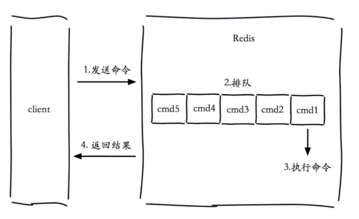
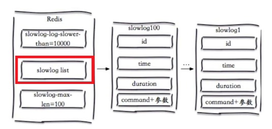
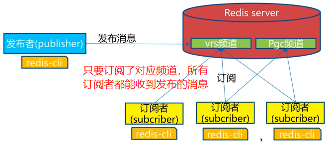
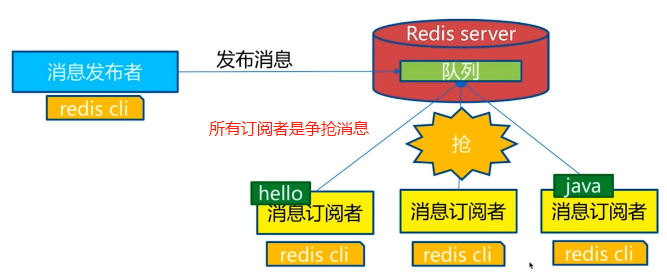
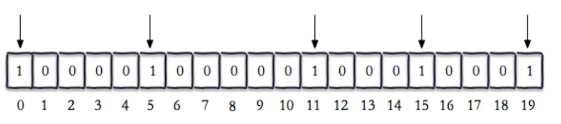
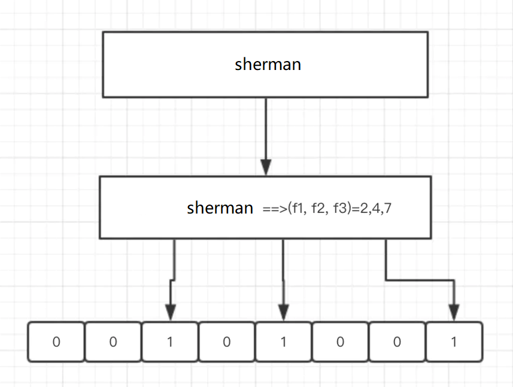

## 三. redis特性

### 3.1 慢查询

#### 3.1.1 redis生命周期




- 慢查询时发生在第三阶段：The Redis Slow Log is a system to log queries that exceeded a specified
   execution time. The execution time does not include the I/O operations like talking with the client, sending the reply and so forth, but **just the time needed to actually execute the command** (this is the only stage of command execution where the thread is blocked and can not serve other requests in the meantime).
- 客户端超时不一定是慢查询，但是慢查询是客户端超时的一个可能因素。

#### 3.1.2 慢查询两个配置

**slowlog-max-len**

慢查询日志长度，redis维护了一个慢查询日志列表，该列表是先进先出的队列、固定长度、**保存在内存中**。slowlog-max-len默认值为128，实际生产中建议调大一些，但是它始终是有长度限制的，且保存在内存中，因此应该配合响应的持久化手段，将历史慢查询日志持久化到数据库中，防止慢查询日志信息丢失。



**slowlog-log-slower-than**

慢查询时间限制阈值，单位为微秒，默认为10000微秒（10ms），实际生产中建议调小，推荐值1ms。因为redis每秒可以处理万级别请求，相当于平均每条命令执行时间为0.1ms，10ms阈值限制过于宽松。同时注意：

- slowlog-log-slower-than=0：表示系统会纪录所有命令
- slowlog-log-slower-than<0：表示系统不会纪录任何命令

**配置方法**

- redis.conf：文件配置方式，推荐在redis刚开机时使用，在实际生产环境中不建议使用，会导致redis重启
- 动态配置：

```shell
>> config get slowlog-max-len
1) "slowlog-max-len"
2) "1000"
>> config get slowlog-log-slower-than
1) "slowlog-log-slower-than"
2) "1000"
>> config set slowlog-max-len 500
OK
>> config set slowlog-log-slower-than 5000
OK
```

**慢查询相关命令**

- slowlog get num：获取num条慢查询日志

```shell
>> slowlog get 2
1) 1) (integer) 14				# 每条慢查询日志唯一递增标识符
   2) (integer) 1309448221		# 处理命令unix时间戳
   3) (integer) 15				# 命令执行时间，微秒为单位
   4) 1) "ping"					# 组成该命令的参数数组
2) 1) (integer) 13
   2) (integer) 1309448128
   3) (integer) 30
   4) 1) "slowlog"
      2) "get"
      3) "100"
```

- slowlog len：查看慢查询日志长度
- slowlog reset：重置慢查询日志


### 3.2. pipeline

redis是一种基于**C-S模型**以及请求响应协议的TCP服务。这意味着通常情况下一个请求会遵循：

1. 客户端向服务器发送一个查询请求，并监听socket返回，通常是阻塞模式，等待响应
2. 服务器接收到请求命令，放入到执行队列中等待执行（单线程的）
3. 执行命令，获取到查询结果
4. 将结果返回给客户端

以上四个步骤所有的时间，称为往返时间（RTT）。RTT时间主要包括两个部分：

- 步骤1和4（时间a）：取决于客户端和服务器之间的网络延迟
- 步骤2和3（时间b）：取决于redis服务器本身

redis是一个高性能的服务器，时间b远远小于时间a，当多次重复发送单个命令时，网络延迟时间的消耗要远远高于服务器本身处理时间，导致效率低下。为此，我们希望节约总的往返时间，将多条命令集中一次性发送给redis服务器，然后把执行结果在集中的返回给客户端，这就是redis管道的基本思想。

#### 3.2.1 典型案例

北京和上海之间距离为1300km，假设数据在光纤（折射率存在）中传输速率是光速的（2/3），那么数据往返消耗在网络上时间为：

​											1300000 * 2 / 200000000 s = 13ms

北京到华盛顿之间距离为11172km，网络延时为：111.72ms

redis实际上每条命令处理时间是微秒级别的，如果发送多条命令累计，网络时间开销是不能接受的。

**Java案例演示**

```java
// 219.224s
public long noPipeline() {
    long start = System.currentTimeMillis();
    Jedis jedis = new Jedis("123.56.239.187", 6379);
    jedis.auth("tanglei");
    for (int i = 0; i < 10000; ++i) {
        jedis.hset("hashKey: " + i, "field:" + i, "value:" + i);
    }
    long end = System.currentTimeMillis();
    return (end - start);
}

// 3.430s
public long usePipeline(){
    long start = System.currentTimeMillis();
    Jedis jedis = new Jedis("123.56.239.187", 6379);
    jedis.auth("tanglei");
    for (int i = 0; i < 10; ++i) {
        Pipeline pipelined = jedis.pipelined();
        for(int j = i * 1000; j < (i + 1) * 1000; ++j) {
            pipelined.hset("pipe:hashKey:" + j, "field:" + j, "value:" + j);
        }
    }
    return (System.currentTimeMillis() - start);
}
```

注意pipeline写入数据有一定比例会丢失数据。

**使用命令行**

```shell
>> cat ../pipeline.txt 
set key1 value1
set key2 value2
set key3 value3
set key4 value4
>> cat ../pipeline.txt | ./redis-cli -a tanglei --pipe
Warning: Using a password with '-a' or '-u' option on the command line interface may not be safe.
All data transferred. Waiting for the last reply...
Last reply received from server.
errors: 0, replies: 4
```

#### 3.2.2 注意事项

- 注意权衡每次pipline携带的数据量，太小网络延迟影响大，太大网络带宽负载中
- pipeline每次只能作用在一个redis节点上
- 注意pipeline和M操作区别，M操作是原子的，而pipeline是非原子的，大批量数据写入时，有一定比例丢失数据


### 3.3 发布订阅

发布/订阅是一个经典的消息传递模式，在这个模式中发布者（发送消息的客户端）不是将消息直接发送给特定的接受者（接受消息的客户端），而是将消息发送给频道（channel），然后又频道将消息发送给所有对这个频道感兴趣的订阅者。也就是说，发送者无需知道任何关于订阅者的信息，而订阅者也无须知道是那个客户端给它发送消息，他只需要关注自己感兴趣的频道即可。

#### 3.3.1 发布订阅模型



#### 3.3.2 相关API

- subscribe channel [channel ...]：订阅一个频道
- publish channel message：向对应频道发送消息
- unsubscribe channel [channel ...]：取消订阅频道
- psubscribe [pattern [pattern ...]]：按照pattern订阅的频道
- punsubscribe [pattern [pattern ...]]：按照pattern取消订阅的频道
- pubsub channels：列出至少有一个订阅者的频道，即列出活跃状态下的频道
- pubsub numsub [chennel ...]：列出给定频道的订阅者数量
- pubsub numpat：返回订阅模式的数量，这个命令返回的不是订阅模式的客户端的数量， 而是客户端订阅的**所有模式的数量总和**，注意如果有多个客户端订阅了统一模式，也会被重复计算。

```shell
# client 1
>> psubscribe news.* discount.*
1) "psubscribe"
2) "news.*"
3) (integer) 1
1) "psubscribe"
2) "discount.*"
3) (integer) 2

# client 2
>> psubscribe music.*
1) "psubscribe"
2) "music.*"
3) (integer) 1

# client 3
>> pubsub numpat
(integer) 3

# 此时又有一个client 3订阅news.*模式频道
>> psubscribe news.*
1) "psubscribe"
2) "news.*"
3) (integer) 1

# 再次从client 3查询：
>> pubsub numpat
(integer) 4
```

#### 3.3.3 发布订阅和消息队列

redis的发布订阅模型并不能完成传统消息队列**消息堆积**的功能，即不能获取订阅某个频道的历史消息。同时，发布订阅和消息队列最大的特定是：

- 发布订阅中，只要订阅者订阅了某个频道，发向该频道的消息，所有订阅者都能收到，例如一对多的生产者-消费者模型
- 消息队列中，发向频道的消息是通过争抢的方式获取，例如抢红包程序就是 消息队列



#### 3.3.4 补充

当开启sentinel模式时，会默认开启一个**\__sentinel__::hello**频道，用于向其它哨兵节点广播消息。


### 3.4 bitmap

位图（也叫位数组或者位向量）是由bit位组成的数组，redis中bitmap并不是一种新的数据类型，实际上它的底层仍然是字符串，因为字符串本质上是二进制大对象（BLOB, Binary Large Object），所有字符串也可以视为位图。redis中的bitmap因为直接用bit来保存数据，每一位所在的位置为偏移量（offset），在bitmap上执行AND, OR, XOR以及其它位操作，这样在某些应用场景下，能够很大程度的节省内存空间。

#### 3.4.1 实例



要完成以上bitmap结构，只需要使用setbit命令即可：

```shell
# 注意setbit的返回值是bitmap对应索引位原来的值
>> setbit bitmap 0 1
(integer) 0
>> setbit bitmap 5 1
(integer) 0
>> setbit bitmap 11 1
(integer) 0
>> setbit bitmap 15 1
(integer) 0
>> setbit bitmap 19 1
(integer) 0
```

也可以通过改变bitmap位来修改字符：

```shell
# 'a'的二进制为：0110 0001
>> set key a
OK
>> setbit key 6 1 # 此时二进制为：0110 0011 -> c
(integer) 0
>> get key
"c"
```

#### 3.4.2 相关操作

- setbit key offset value：设置对应key偏移量上值

- getbit key  offset：获取对应key偏移量上的值

- bitcount key [start end]：统计二进制中被置为1的个数

  - 不指定[start end]：统计所有字节
  - [0 -1]：统计所有字节
  - [0 0]：统计第一个字节
  - 注意：如果统计的是整型数字，要注意：

  ```shell
  # 7654二进制字符串：1110111100110，共有9个1
  >> set num 7654
  OK
  >> bitcount num
  (integer) 16
  # bitcount会将7654分别转换成字符'7'（48+7）、'6'（48+6）、'5'（48+5）、'4'（48+4）
  # 48二进制中含有2个1，7（3个1），6（2个1），5（2个1）4、（1个1）
  # 总共1的个数：2*4 + 3 + 2 + 2 + 1 = 16
  ```

- bitop operation destkey key [key ...]：根据指定操作，将多个bitmap在二进制上进行运算，将结果保留到dst中

  - bitop and music:active:3:day music:2020:01:01 music:2020:01:02 music:2020:01:03   # 三天都活跃
  - bitop or music:active:1:day music:2020:01:01 music:2020:01:02 music:2020:01:03      # 任意一天活跃

- bitpos key key bit [start] [end]：在指定范围内（单位字节，不指定就是全部范围），获取第一个位为bit的偏移量

```shell
# 0110 0001
>> set char a
OK
>> bitpos char 1
(integer) 1 # 偏移量为1
>> bitpos char 0
(integer) 0 # 偏移量为0
```

#### 3.4.3 使用场景

**独立用户统计、连续多少天活跃用户统计**

计算用户A上线了多少天，用户B连续听歌多少天等功能，从而决定让哪些用户参与特定的Beta测试活动或者领取某些奖励，这个模式就可以利用bitmap使用很少的内存完成。

**思路**

我们将用户id和bitmap上每一位进行对应，如果某个用户在某一天是活跃的，就将该位置为1，否则置为0。因为用户每天活跃的状况都在变化，那么每一天都要创建一个新的bitmap，我们简单地将日期添加到key的后面，就可以实现这个功能，例如如果统计有多少个用户至少在某个音乐app中听了一首歌曲，可以将redis的key设计为：

​									redis.setbit(play:yyyy-mm-dd, user_id, 1);	      # 用户id和偏移量是对应的

要统计连续多少天都活跃，只要将连续几天的bitmap进行**and操作**即可，就能得到最终连续多少天都活跃的用户列表。

如果是1亿用户，每天大约需要**12.5Mb**（准确11.92Mb）内存使用量。


独立用户统计的思路相同，将每个用户和偏移量对应起来，每次存在一个用户访问，就将对应的位设置为1。一天结束后，使用**bitcount**进行统计即可。

**问题**

bitmap相比于set在数据规模非常大时能够节省大量内存，但是也存在一些问题：

- 小规模数据时，bitmap不一定比有序集合节省内存空间
- 如果用户id最终映射到bitmap偏移量时非常**稀疏**，会导致大量内存浪费。


### 3.5 布隆过滤器

 在redis中的布隆过滤器的支持是在redis4.0后支持插件的情况下，通过插件（module）的方式实现的 。

#### 3.5.1 安装布隆过滤器

```shell
>> wget https://github.com/RedisLabsModules/rebloom/archive/v1.1.1.tar.gz
>> cd RedisBloom-1.1.1
>> ll
drwxrwxr-x 2 root root   4096 Jan  5 12:24 contrib
-rw-rw-r-- 1 root root    399 Feb 22  2019 Dockerfile
drwxrwxr-x 2 root root   4096 Feb 22  2019 docs
-rw-rw-r-- 1 root root   5794 Feb 22  2019 LICENSE
-rw-rw-r-- 1 root root   1761 Feb 22  2019 Makefile
-rw-rw-r-- 1 root root    820 Feb 22  2019 mkdocs.yml
-rw-rw-r-- 1 root root    511 Feb 22  2019 ramp.yml
-rw-rw-r-- 1 root root   1899 Feb 22  2019 README.md
-rwxr-xr-x 1 root root 184304 Jan  5 12:24 rebloom.so
drwxrwxr-x 2 root root   4096 Jan  5 12:24 src
drwxrwxr-x 2 root root   4096 Feb 22  2019 tests

>> vim /path/to/redis.conf
===============MODULES===============
loadmodule /path/to/rebloom/rebloom.so
# 使用该配置文件重启redis服务器即可
```

#### 3.5.2 布隆过滤器原理

布隆过滤器本质是一个**位数组**arr，除此之外，它还有K个哈希函数（f1, f2, ..., fk），当一个元素加入布隆过滤器中的时候，会进行如下操作：

- 使用 K 个哈希函数对元素值进行 K 次计算，得到 K 个哈希值（v1, v2, ..., vk）
- 根据得到的hash值，将维数组中对应下标的值置为1（arr[v1]=1, arr[v2]=1, ..., arr[vk]=1）

当需要判断某个值是否存在布隆过滤器中时，对该值再使用K个哈希函数计算K个哈希值，得到K个哈希值后，判断位数组中对应的位置是否都为1：

- 如果都为1，则大概率该值存在布隆过滤器中，小概率不存在布隆过滤器中（误判）
- 如果不全为1，则该值一定不存在布隆过滤器中



**实际应用场景**

- 网络爬虫URL去重：相同的URL一定不会被误判成没有访问过
- 反垃圾邮件：从数十亿垃圾邮件列表中判断某邮件是否是垃圾邮件
- 将所有可能存在的数据缓存在放到布隆过滤器中，当访问不存在的缓存数据时能够快速返回，避免穿透到数据库

```java
// redis伪代码
public Stirng get(key) {
    String value = redis.get(key);
    if (value == null) {
        if (!bloomfilter.mightContain(key)){
            return null;
        }else{
            // 缓存中不存在，bloomfilter判定大概率存在，还是要去DB中获取确认
            value = db.get(key);
            redis.set(key, value);
        }
    }
    return value;
}
```

#### 3.5.3 相关操作

- bf.add|bf.madd key ...options...：添加一个|多个元素到布隆过滤器中
- bf.exists|bf.mexists key ...options...：判断一个|多个元素是否存在过滤器中
- bf.reserve key error_rate initial_size：设置布隆过滤器两个error_rate和initial_size两个参数
  - error_rate：允许布隆过滤器的错误率，这个值越低，位数组占用的内存空间就越大
  - initial_size：布隆过滤器可以存储元素的个数，当实际存储的元素超过这个值之后，过滤器的准确性就会下降


