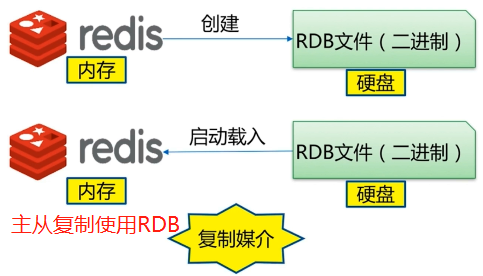
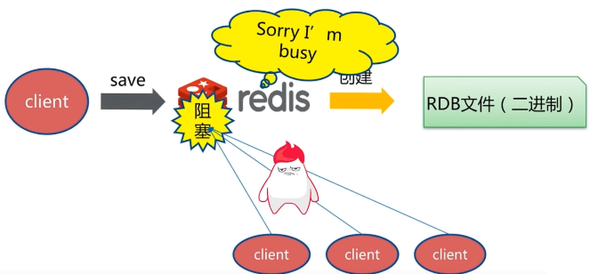
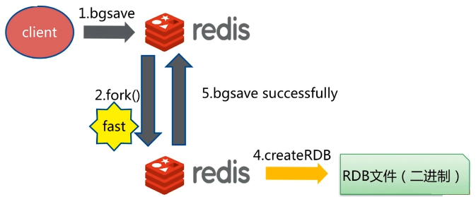
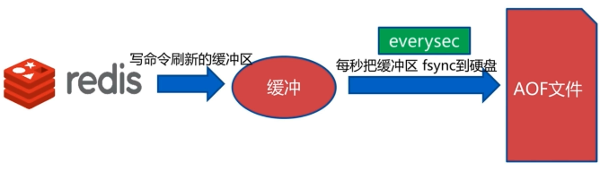
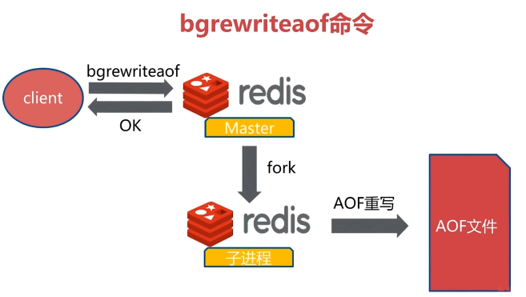

## 四. 持久化

持久化：简单说就是将数据写到断电后数据不会丢失的设备中，也就是通常说的硬盘中。redis提供了两种持久化技术：RDB（MySQL中Dump）和AOF（MySQL中BinLog）。

写数据到磁盘上执行过程：

1. 客户端向服务器发送写操作（数据在客户端的内存中）
2. 数据库服务端接受到写请求的数据（数据在服务端内存中）
3. 数据库调用操作系统的write函数，将数据往磁盘上写（数据在操作系统内存的缓冲区中）
4. 操作系统将缓冲区的数据转移到磁盘控制器上（数据在磁盘缓冲区中）
5. 磁盘控制器将数据写到磁盘的物理介质中（数据在磁盘中）

注意：一般情况下，**磁盘的写缓存都不会开启**，除非该磁盘有独立电源。因此，一般第四步和第五步会合并成：直接将缓冲区中的内容写入到磁盘的物理介质中。


### 4.1 RDB



RDB持久化机制被触发时会将内存中的数据集快照写入到磁盘的二进制文件中该（dump.rdb），RDB是默认的持久化方式。三种触发机制：

- save
- bgsave
- redis配置RDB生成策略
- 不容忽略的RDB触发机制

#### 4.1.1 save命令

save命令是同步的，客户端执行save命令时，redis会阻塞于内存中数据写入到dump.rdb过程中，此时其它redis客户端不能访问redis服务器。




#### 4.1.2 bgsave命令

bgsave是异步写入命令，redis会使用linux的fork()命令，创建一个异步写入的子进程（**redis-rdb-bgsave**），redis还是会阻塞于fork()函数，但fork()函数的执行一般是很快的。当异步子进程写操作完成后会通知redis主进程bgsave操作成功。



注意：这里也可以看出redis并不是一个纯粹的单线程模型，bgsave命令就存在子线程。

#### 4.1.3 redis配置RDB生成策略

redis关于RDB方式持久化相关配置：

| 配置                            | 900s内有1条写入就触发RDB写入机制              |
| ------------------------------- | --------------------------------------------- |
| **save 900 1**                  | 900s内有1条写入就触发RDB写入机制              |
| **save 300 10**                 | 300s内有10条写入就触发RDB写入机制             |
| **save 60 10000**               | 60s内有10000条写入就触发RDB写入机制           |
| dbfilename dump.rdb             | RDB文件名称                                   |
| dir /opt/soft/redis/data        | 日志（包括aof）文件的写入路径，默认是当前路径 |
| stop-writes-on-bgsave-error yes | 如果bgsave在写入时出错就停止，默认yes         |
| **rdbcompression yes**          | RDB文件是否采用压缩格式，默认yes              |
| rdbchecksum yes                 | RDB文件是否需要进行校验和，默认yes            |
| logfile "6379.log"              | redis日志文件名称为6379.logjj                 |

#### 4.1.4 不容忽略的RDB触发机制

除以上三种外，RDB还有几种不容忽略的自动触发RDB机制

- 全量复制：主从复制时数据在master和slave之间复制，是通过RDB进制进行的，上面推荐适用rdbcompression也可以加快主从复制速度
- debug reload：debug级别的重启操作，不需要将内存中数据进行清空方式的重启
- shutdown [save|nosave]：关机时，如果使用save参数，则会生成RDB文件

#### 4.1.5 相关演示

**save是阻塞的**：注意是在注释掉：save xx xx配置下

在redis中准备大约一百万个key（108.02M内存）：

```shell
# client 1
>> save
OK
(1.61s)

# client 2
>> ping
PONG
(1.14s)				# 有阻塞
```

vim /opt/soft/redis/data/6379.log

```txt
19326:M 05 Jan 2020 14:32:49.082 * DB saved on disk
```

**bgsave阻塞、fork子进程、日志策略**：注意是在注释掉：save xx xx配置下

```shell
# client 1
127.0.0.1:6379> bgsave
Background saving started

# client 2
>> ping
PONG		# 没有阻塞

>> ps -ef | grep redis-
...
root  19351 19326 46 14:36 ?  00:00:00 redis-rdb-bgsave *:6379 # 子进程产生

>> cd /opt/soft/redis/data
>> ll
-rw-r--r-- 1 root root      406 Jan  5 14:37 6379.log
-rw-r--r-- 1 root root 60664405 Jan  5 14:36 dump-6379.rdb
-rw-r--r-- 1 root root 30838784 Jan  5 14:37 temp-19351.rdb # 临时文件
```

vim /opt/soft/redis/data/6379.log

```txt
19326:M 05 Jan 2020 14:32:49.082 * DB saved on disk
19326:M 05 Jan 2020 14:51:08.398 * Background saving started by pid 19351
19371:C 05 Jan 2020 14:51:10.008 * DB saved on disk
19371:C 05 Jan 2020 14:51:10.009 * RDB: 4 MB of memory used by copy-on-write
19326:M 05 Jan 2020 14:51:10.010 * Background saving terminated with success
```

**save xx xx**：在配置文件中，配置60s内有5条记录就进行RDB持久化

vim redis-6379.conf

```
save 60 10
```

重启redis服务器，客户端连接redis服务器后，在60秒内写入10条记录，查看6379.log文件末尾：

```txt
19382:M 05 Jan 2020 15:02:00.199 * 10 changes in 60 seconds. Saving...
19382:M 05 Jan 2020 15:02:00.200 * Background saving started by pid 19401
19401:C 05 Jan 2020 15:02:01.818 * DB saved on disk
19401:C 05 Jan 2020 15:02:01.818 * RDB: 8 MB of memory used by copy-on-write
19382:M 05 Jan 2020 15:02:01.861 * Background saving terminated with success
```

#### 4.1.7 RDB存在问题

- 耗时、耗性能：数据copy，O(n)数据，fork()函数消耗内存，copy-on-write策略，写入时还要考虑IO性能。

- 不可控、丢失数据：在两次RDB持久化操作之间的数据都存在丢失的风险


#### 4.1.8 RDB总结

- RDB是redis内存到硬盘的快照，用于持久化
- save命令通常会阻塞redis
- bgsave命令不会阻塞redis，但是会有fork()函数产生子进程
- save自动配置满足任一就会被执行
- 有些触发机制不容忽视

### 4.2 AOF

AOF日志全称是：Append Only File，是一个追加写入的日志文件。与一般数据库不同的是，AOF是一个可识别的纯文本文件，它的内容是一个个标准的redis命令。AOF持久化方式默认是关闭的。

#### 4.2.1 AOF三种策略

| 三种策略                 | 解释                              | 问题                      |
| ------------------------ | --------------------------------- | ------------------------- |
| appendfsync always       | 每一次写操作命令都会进行磁盘写入  | 磁盘压力大                |
| **appendfsync everysec** | 每秒进行一次磁盘写入              | 也存在**1秒**数据丢失问题 |
| appendfsync no           | 由操作系统决定写入间隔时间（30s） | 不可控                    |

appendfsync everysec是默认配置，注意：

当设置appendfsync everysec时候，redis会每隔1秒进行一次写操作调用，将缓冲区中内容写入到磁盘中。同时对于某次写操作可能数据量过大，超过1秒钟时间，redis还会采用延迟策略：再等一秒，即两秒后才进行下一次写操作，2秒后，无论是否写入完成，都会执行下一次写操作。**因此，大多数情况下，redis会每隔1秒进行一次写，在最坏的情况下，每2秒进行一次写操作，也就是说，最坏情况下，会丢失2秒的数据。**



#### 4.2.2 AOF重写

AOF重写就是将重复、无用的的redis命令过滤掉，使用最终的命令对这些重复、无用的命令进行重写，保存在AOF文件中，从而达到减少磁盘占用量和加快恢复速度的目的。

| 原生AOF                                                      | AOF重写                                                      |
| ------------------------------------------------------------ | ------------------------------------------------------------ |
| set hello world<br />set hello Java<br />set hello hehe<br />incr counter<br />incr counter<br />rpush mylist a<br />rpush mylist b<br />rpush mylist c<br />过期数据 | set hello hehe<br />set counter 2<br />rpush mylist a b c<br /> |

AOF重写两种实现方式：

- bgrewriteaof：类似于RDB中的bgsave，异步的，第二种底层也是使用该命令
- AOF重写配置：使用配置文件进行重写

**bgrewriteaof**



**AOF重写配置**

- auto-aof-rewrite-min-size：AOF文件重写需要的最小尺寸
- auto-aof-rewrite-percentage：AOF文件增长率
- aof_current_size：统计项，当前AOF文件尺寸大小（字节）
- aof_base_size：统计项，AOF上次启动和重写的尺寸大小（字节）

redis-6379.conf配置：

```properties
appendonly yes 									# aof开启总开关
appendfilename "appendonly-6379.aof"			# aof文件
appendfsync everysec							# aof三种策略之一，每秒写入
dir /opt/soft/redis/data						# aof文件目录
no-appendfsync-no-rewrite yes					# aof重写期间不进行添加操作，性能优先
aof-load-truncated yes							# aof文件损坏也正常加载
```

appendonly也支持动态设置：

```shell
>> config get appendonly
1) "appendonly"
2) "no"

>> config set appendonly yes
OK
```

#### 4.2.3 AOF演示

配置好redis-6379.conf中关于AOF系那个管参数后，重启服务器，客户端连接redis服务器后使用：

bgrewriteaof命令进行aof重写。查看appendonly-6379.aof配置文件最后几行：

```properties
19382:M 05 Jan 2020 16:15:45.405 * Background append only file rewriting started by pid 19485
19382:M 05 Jan 2020 16:15:47.634 * AOF rewrite child asks to stop sending diffs.
19485:C 05 Jan 2020 16:15:47.634 * Parent agreed to stop sending diffs. Finalizing AOF...
19485:C 05 Jan 2020 16:15:47.634 * Concatenating 0.00 MB of AOF diff received from parent.
19485:C 05 Jan 2020 16:15:47.634 * SYNC append only file rewrite performed
19485:C 05 Jan 2020 16:15:47.634 * AOF rewrite: 8 MB of memory used by copy-on-write
19382:M 05 Jan 2020 16:15:47.716 * Background AOF rewrite terminated with success
19382:M 05 Jan 2020 16:15:47.716 * Residual parent diff successfully flushed to the rewritten AOF (0.00 MB)
19382:M 05 Jan 2020 16:15:47.716 * Background AOF rewrite finished successfully
```

### 4.3 RDB & AOF对比

#### 4.3.1 简单对比

|            | RDB（快照）        | AOF（日志） |
| ---------- | ------------------ | ----------- |
| 启动优先级 | 低                 | 高          |
| 体积       | 小（有压缩配置项） | 大          |
| 恢复速度   | 快                 | 慢          |
| 数据安全性 | 丢数据             | 取决于策略  |
| 轻重       | 重                 | 轻          |

