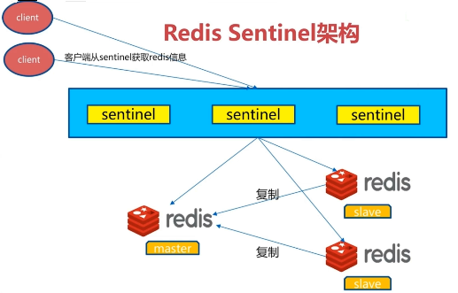

## 五. redis sentinel

redis单实例远远不能提供高效、具备数据冗余和高可用（High Availability）能力的键值存储服务。持久化和主从复制可以解决数据冗余备份问题，但是没有人工干预情况下，redis服务器宕机后不可能自动回复，所以单纯的主从复制和持久化技术不具备高可用特性。

高可用用来描述一个系统经过专门的设计，从而减少停工时间，从而保持服务的高度可用性。redis2.6提供了一个原生支持的技术：Sentinel（哨兵），利用Sentinel可以轻松地构建具备容错能力的redis服务。


### 5.1  redis sentinel架构

#### 5.1.1 主从复制问题

- 手动故障转移：当master节点宕机之后，如果不使用redis sentinel保证高可用，只能进行手动故障转移
- 写能力和存储能力受限：只有一个master节点，master节点才有写权限

#### 5.2.2 redis sentinel架构



当master节点出现故障时，redis sentinel户进行自动故障转移过程：

- 多个sentinel发现并确认master出现问题
- 选举出一个sentinel作为领导
- 选出一个slave作为master
- 领导sentinel通知其它slave结点成为新maste节点的slave节点
- 通知客户端主从变化
- 等待宕机的master节点上线，并成为新master节点的slave节点

除此之外，一套redis sentinel系统可以监控多套master-slave系统，通过master-name区分，可以大大节省系统资源。


### 5.2 sentinel配置

实现一个master-两个slave主从复制模式，并且有三个sentinel节点对这三个节点进行监

**注意**

- master、slave、sentinel节点**bind**配置时不要使用默认值，指定需要bind的ip或者设置protecteed-mode no

```properties
# *** IMPORTANT ***
#
# By default Sentinel will not be reachable from interfaces different than
# localhost, either use the 'bind' directive to bind to a list of network
# interfaces, or disable protected mode with "protected-mode no" by
# adding it to this configuration file.
#
# Before doing that MAKE SURE the instance is protected from the outside
# world via firewalling or other means.

# For example you may use one of the following:
#
# bind 127.0.0.1 192.168.1.1 （这里隐含了protected-mode yes）
#
# protected-mode no
```

- master、slave节点如果设置了密码应该保持一致（因为slave节点也有可能成为master节点），并且在sentinel配置文件中要进行配置：

```properties
sentinel auth-pass mymaster xxxxxx
```

- 从节点应该设置：masterauth xxxxxx
- 注意不同机器之间开放端口或者直接关闭防火墙

#### 5.2.1 master-slave节点配置

在192.168.227.128机器上配置一个master（端口7000），两个slave节点（端口7001、7002）：

```properties
# 主节点 simple-cnf-7000.conf
port 7000
daemonize yes
pidfile /var/run/redis-7000.pid
logfile "log-7000.log"
dir "/opt/soft/redis/data"
protected-mode no
requirepass tanglei

# 从节点
>> sed "s/7000/7001/g" simple-cnf-7000.conf > simple-cnf-7001.conf
>> sed "s/7000/7002/g" simple-cnf-7000.conf > simple-cnf-7002.conf
>> echo "slaveof 192.168.227.128 7000" >> simple-cnf-7001.conf
>> echo "masterauth tanglei" >> simple-cnf-7001.conf
>> echo "slaveof 192.168.227.128 7000" >> simple-cnf-7002.conf
>> echo "masterauth tanglei" >> simple-cnf-7002.conf

# 使用info命令查看master状态，slave节点状态类似
>> ./redis-cli -p 7000 info replication 
# Replication
role:master
connected_slaves:2
slave0:ip=127.0.0.1,port=7001,state=online,offset=406,lag=1
slave1:ip=127.0.0.1,port=7002,state=online,offset=406,lag=1
master_replid:345b7892002943b979ba12f7580ef1b6e6aca742
master_replid2:0000000000000000000000000000000000000000
master_repl_offset:406
second_repl_offset:-1
repl_backlog_active:1
repl_backlog_size:1048576
repl_backlog_first_byte_offset:1
repl_backlog_histlen:406
```

#### 5.2.2 sentinel配置

在192.168.227.129机器上配置三个sentinel节点，端口分别为：27000、27001、27002：

```properties
# sentinel sentinel-27000.conf
port 27000
daemonize yes
pidfile "/var/run/redis-sentinel-27000.pid"
logfile "log-27000"
dir "/opt/soft/redis/data"
# 监听的master-slave，取名为mymaster，2：至少2个sentinel认为该mater有问题，才认为真正不可用
sentinel monitor mymaster 192.168.227.128 7001 2
# 监听master是否可用的心跳线
sentinel down-after-milliseconds mymaster 15000
# 如果failover开始后18000ms内仍然没有触发failover操作，认为此次failover失败
sentinel failover-timeout mymaster 180000
# 当发生failover准备切换时，指定最多可以有多少个slave同时对新的master进行同步
# 该数字越小，failover时间越长，但是越大，导致越多的slave因为replication而不可用，不推荐修改
sentinel parallel-syncs mymaster 1
sentinel auth-pass mymaster tanglei
protected-mode no

# sentinel其它两个节点
sed "s/27000/27001/g" sentinel-27000.conf > sentinel-27001.conf
sed "s/27000/27002/g" sentinel-27000.conf > sentinel-27002.conf
```

启动三个sentinel节点：

```shell
>> ./redis-sentinel ../config/sentinel-27000.conf
>> ./redis-sentinel ../config/sentinel-27001.conf
>> ./redis-sentinel ../config/sentinel-27002.conf

# 查看sentinel-27000节点sentinel相关信息
>> ./redis-cli -p 27000 info sentinel
# Sentinel
sentinel_masters:1
sentinel_tilt:0
sentinel_running_scripts:0
sentinel_scripts_queue_length:0
sentinel_simulate_failure_flags:0
master0:name=mymaster,status=ok,address=192.168.227.128:7000,slaves=2,sentinels=3

# 原本sentinel-27000.conf配置文件也有变换，增加了以下内容：
# Generated by CONFIG REWRITE
sentinel leader-epoch mymaster 1
sentinel known-replica mymaster 192.168.227.128 7001
sentinel known-replica mymaster 192.168.227.128 7002
sentinel known-sentinel mymaster 192.168.227.129 27001 ee0a91044eb6a1bd9af1cb143b2924039fb76843
sentinel known-sentinel mymaster 192.168.227.129 27002 92ada4bb2d0fdd5c227a37b1dc7eb8cd737f57d8
sentinel current-epoch 1
```

查看**log-27000**日志文件：

```txt
1663:X 06 Jan 2020 03:19:06.672 # oO0OoO0OoO0Oo Redis is starting oO0OoO0OoO0Oo
1663:X 06 Jan 2020 03:19:06.672 # Redis version=5.0.7, bits=64, commit=00000000, modified=0, pid=1663, just started
1663:X 06 Jan 2020 03:19:06.672 # Configuration loaded
1664:X 06 Jan 2020 03:19:06.673 * Increased maximum number of open files to 10032 (it was originally set to 1024).
1664:X 06 Jan 2020 03:19:06.673 * Running mode=sentinel, port=27000.
1664:X 06 Jan 2020 03:19:06.673 # Sentinel ID is 93009b479b2832edc4ac0312e81edb2f58170396
1664:X 06 Jan 2020 03:19:06.673 # +monitor master mymaster 192.168.227.128 7000 quorum 2
1664:X 06 Jan 2020 03:19:36.692 # +sdown slave 192.168.227.128:7001 127.0.0.1 7001 @ mymaster 192.168.227.128 7000
1664:X 06 Jan 2020 03:19:36.692 # +sdown slave 192.168.227.128:7002 127.0.0.1 7002 @ mymaster 192.168.227.128 7000
```


### 5.3 演示故障转移

#### 5.3.1 Java客户端程序

```java
package fun.sherman.sentinel;

import org.slf4j.Logger;
import org.slf4j.LoggerFactory;
import redis.clients.jedis.Jedis;
import redis.clients.jedis.JedisSentinelPool;

import java.util.HashSet;
import java.util.Set;
import java.util.concurrent.TimeUnit;

/**
 * @author sherman
 */
public class FailOver {
    private static Logger logger = LoggerFactory.getLogger(FailOver.class);

    public static void main(String[] args) {

        final String masterName = "mymaster";
        final String password = "tanglei";
        Set<String> sentinels = new HashSet<String>();
        sentinels.add("192.168.227.129:27000");
        sentinels.add("192.168.227.129:27001");
        sentinels.add("192.168.227.129:27002");
        JedisSentinelPool sentinelPool = new JedisSentinelPool(masterName, sentinels);

        int cnt = 0;
        while (true) {
            Jedis jedis = null;
            try {
                jedis = sentinelPool.getResource();
                jedis.auth(password);
                ++cnt;
                String key = "key-" + cnt;
                String value = "value-" + cnt;
                jedis.set(key, value);
                TimeUnit.MICROSECONDS.sleep(10);
                if (cnt % 100 == 0) {
                    logger.info("{} value is {}", key, jedis.get(key));
                }
            } catch (Exception e) {
                logger.error(e.getMessage(), e);
            } finally {
                if (jedis != null) {
                    jedis.close();
                }
            }
        }
    }
}
```

#### 5.3.2 shutdown主节点

手动shutdown 192.168.227.128:7000主节点，上述Java一段时间ConnectException异常后能够正常执行，并查看sentinel对应的日志：


除此之外，还可以查看两个slave节点的配置文件变换：

- 成为新的master节点的slave节点（7001）：

```properties
# replicaof 192.168.128 7000
# masterauth "tanglei" 
# 以上两条指令已经被删除
port 7001
daemonize yes
pidfile "/var/run/redis-7001.pid"
logfile "log-7001.log"
dir "/opt/soft/redis/data"
protected-mode no
requirepass "tanglei"
```

- 另一个没有晋升为master节点的slave节点（7002）：

```properties
port 7002
daemonize yes
pidfile "/var/run/redis-7002.pid"
logfile "log-7002.log"
dir "/opt/soft/redis/data"
protected-mode no
requirepass "tanglei"

# replicaof 对应的端口发生变化，从7000转换成7001
replicaof 192.168.227.128 7001
masterauth "tanglei"
```

- 当宕机的master节点（7000）重新上线，查看对应配置文件：simple-cnf-7000.conf：

```properties
port 7000
daemonize yes
pidfile "/var/run/redis-7000.pid"
logfile "log-7000.log"
dir "/opt/soft/redis/data"
protected-mode no
requirepass "tanglei"
# 现在该节点已经是slave节点了
# Generated by CONFIG REWRITE
replicaof 192.168.227.128 7001
```

- 查看sentinel-27000.conf中指定的日志文件log-27000：

```properties
# 多了一句话：
2956:X 06 Jan 2020 06:15:38.717 * +convert-to-slave slave 192.168.227.128:7000 192.168.227.128 7000 @ mymaster 192.168.227.128 7001
```


### 5.4 三个定时任务

- 定时任务一：每10s每个sentinel对master和slave节点执行一次info操作，从而发现slave节点，确认主从关系


- 定时任务二：每2s每个sentinel通过master节点的\__sentinel__:hello频道进行交换信息，例如判断master是否宕机、领导者选举等都是通过该频道进行交互

```shell
127.0.0.1:7000> pubsub channels
1) "__sentinel__:hello"
```


- 每1秒每个sentinel节点对其它sentinel和redis节点执行ping命令，用于心跳检测和失败判断依据，和配置**sentinel down-after-milliseconds mymaster 30000**一起使用。当ping命令检测失败时，再过30秒如果仍然心跳检测失败，则认为该节点已经**主观宕机**，但是此时不能认为是真正宕机，还需要进行投票超过**quorum**数量才能认为已经**客观宕机**。


### 5.5 主观下线和客观下线

- 主观下线：每个sentinel节点对redis节点失败的“偏见”，第三个定时任务中，如果某个sentinel进行心跳检测失败，并且在down-after-milliseconds mymaster配置的时间后仍然检测失败，则认为该redis是已经主观下线
- 客观下线：多个sentinel对某个redis节点进行投票，投票数量超过**quorum**规定的数量之后，就认为该redis节点已经客观下线。注意客观下线只会针对master节点，slave节点不需要进行故障转移：sentinel is-master-down-by-addr


### 5.6 领导者选举

故障转移时只需要一个sentinel节点进行，因此需要多个sentinel进行领导者选举，执行最终的故障转移过程，通过：sentinel is-master-down-by-addr命令都希望自己成为领导者：

- 每个做主观下线的sentinel节点向其它sentinel节点发送命令，要求将它设置为领导者
- 收到命令的sentinel节点如果没有同意过其它sentinel节点发送的命令，那么将同意该请求，否则拒绝
- 如果该sentinel节点发现自己的票数超过sentinel集合半数并且超过quorum数，那么它将成为新的领导者


### 5.7 故障转移

领导者选举完成后，需要进行故障转移：

- 从slave节点中选择一个“**合适的**”节点作为master节点
- 对上面“合适的”节点执行slaveof no one命令，让其成为新的maste节点
- 向剩余的slave节点发送命令，让它们成为新的master节点的slave节点，复制规则和parallel-syncs参数有关
- 更新对原来master节点配置的slave，并保持关注（由第三个定时任务完成），当恢复后，命令它成为新的master节点的slave节点

如何选择“合适的”slave节点

- 选择slave-priority（slave节点优先级）更高的salve节点，一般情况下，多个slave的优先级是相同的，除非不同slave节点所在的机器配置不同，我们希望当故障发生时，优先由机器性能更好的slave节点成为master节点，才进行配置
- 选择复制偏移量最大的slave节点（该节点复制的最完整）
- 选择run id最小的salve节点，即选择最早启动的节点


### 5.8 总结

故障转移过程：

- 第三个定时任务（每秒ping其它sentinel和redis节点）检测失败时，对该节点标记为主观下线（+sdown）
- 为防止虚假警报，版本标记了+sdown的哨兵，发送请求给其它sentinel，要求它们检查该sentinel的状态，当最终投票结果大于quorum时，判定该节点为客观下线（+odown），并进行领导选举
- 选举出新的领导者后，开始进行故障转移过程，包括：新的master节点执行slaveof no one，其他slave节点执行slaveof <新master>，监听宕机的master节点，一旦它上线，让它成为新master的slave节点

几个重要的消息：

+sdown：主观下线

+odown：客观下线

+switch-master：切换主节点（从节点晋升为master节点）

+convert-to-slave：切换从节点（原master节点降为从节点）

