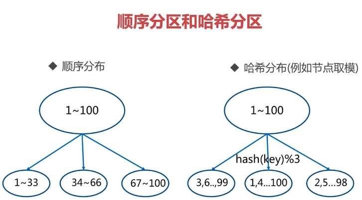
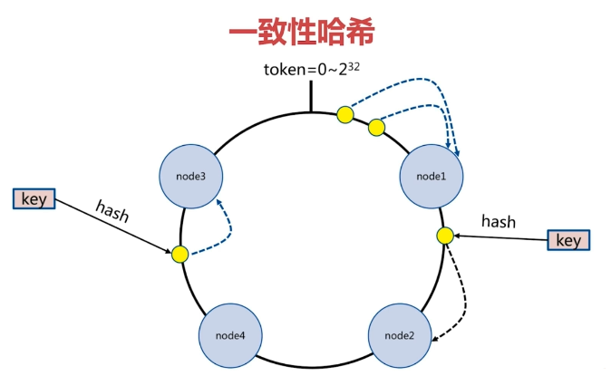
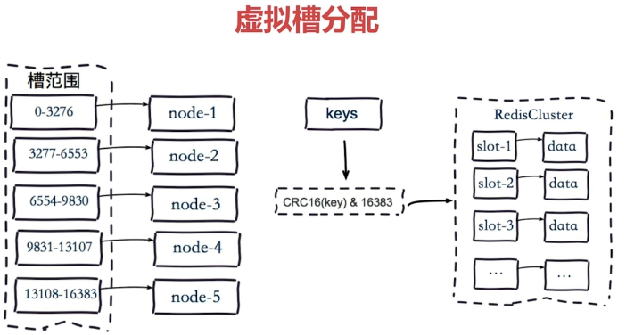
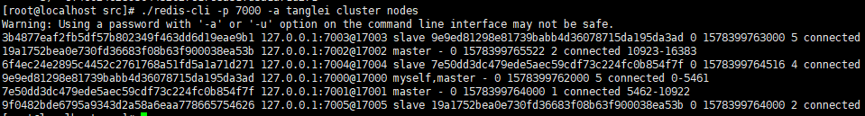
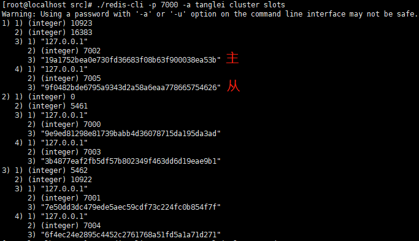

## 六. 集群——第一部分


### 6.1  数据分布

单机情况下，对一份特别大的全量数据无法全部保存，只能使用集群模式，将全量数据按照一定规则分配到各个节点上。常用的分区有两个方式：

- 顺序分区
- 哈希分区



**对比**

333

| 分布方式 | 特点                                                         | 典型产品                                                     |
| -------- | ------------------------------------------------------------ | ------------------------------------------------------------ |
| 顺序分布 | 1. 数据分散度容易倾斜<br />2. 键值业务相关<br />3. 可顺序访问<br />4. 支持批量操作 | 1. BigTable<br />2. HBase                                    |
| 哈希分布 | 1. 数据分散度高<br />2. 键值分布和业务无关<br />3. 无法顺序访问<br />4. 不支持批量操作 | 1. 一致性哈希Memcache<br />2. Redis Cluster<br />3. 其他缓存产品 |

### 6.2 哈希分布

#### 6.2.1 节点取余

节点取余分区（客户端分片）是最简单的哈希分布：**hash(key) % nodes**，但是它存在最大的问题是：数据扩容时，可能导致大规模数据发生搬迁。可以使用**多倍扩容方式**降低数据大规模搬迁（大约有50%的数据会搬迁）。

大规模数据迁移带来最直接的问题时：迁移完成后第一次访问会导致部分数据缓存失效，需要直接到数据库中重新查找数据，并回显给redis缓存，之后再次访问数据时，缓存数据才有效。

对于依靠缓存支撑的系统而言，节点取余法是不能接受的。但是对于一些小应用、可以接受缓存失效直接访问数据库回显的应用，节点取余非常简单。

#### 6.2.2 一致性哈希



一致性哈希分区也是客户端分片方式，通过**hash(key) % nodes + 顺时针**规则找到对应的数据节点，相比于节点取余分区方式，一致性哈希算法特点：

- 节点伸缩时：只会影响少量临近节点，hash环中节点数量越多，影响节点的数量越少，**但是还是会存在少量数据迁移问题**
- 无法保证负载均衡：一致性哈希能够保证最少迁移数据量，但是迁移的数据可能会过分的集中在某一个节点上，导致负载不均衡。解决方案：翻倍伸缩、引入虚拟槽

#### 6.2.3 虚拟槽

虚拟槽分区是为了解决一致性哈希分区中节点扩容时可能存在负载不均衡的问题。虚拟槽分区特点：

- 引入预设虚拟槽：每个槽映射一个数据子集，一般比节点数大，每个节点管理一部分数据槽，且节点之间信息共享
- 良好的哈希函数：一般使用CRC16
- 服务端管理节点、草、数据：例如使用Redis Cluster



###  6.3 Redis Cluster架构

相比于单机redis结构，redis cluster架构中，每个redis节点都负责读、写，并且节点之间是相互通信的，即某个key在由哪个节点负责的消息，各个节点之间相互共享的。当在一个节点上没有查找到对应的key时，该节点会告知其目标节点上查找。但是这种信息共享方式在节点非常多的时候不够高效，更加高效的方式是引入：智能客户端，客户端知道每个节点负责槽的范围，知道某个key在哪个节点上，直接通过智能客户端找到对应的目标节点进行查找。

redis cluster特点：

- 主从复制：每个master节点都有一个slave节点，完成主从复制
- 高可用：每个maste节点宕机之后，slave节点都能够顾晋升为master节点，保证高可用
- 分片的：多个主节点都可以执行读写操作

#### 6.3.1 基本安装架构

- 节点：比普通节点多一个配置：cluster-enabled:yes，表示该节点是cluster中的节点
- meet：节点之间会发送meet操作，通过gossip协议最终所有节点形成一个完整连通图，让cluster中节点相互通信
- 指派槽：redis默认有16384个槽，为了达到负载均衡效果，redis会为每个节点指派指定数量的槽

#### 6.3.2 安装

redis cluster有两种安装方式：原生命令安装和官方工具安装


**原生命令安装**（有利于理解redis cluster架构）

- 配置文件：6个配置文件，通过端口区分：7000-7005，并使用配置文件启动6个redis实例。

```properties
port 7000
daemonize yes
protected-mode no
pidfile "/var/run/redis-7000.pid"
dir "/opt/soft/redis/data/"
dbfilename "dump-7000.rdb"
logfile "log-7000.log"
cluster-enabled yes
cluster-config-file nodes-7000.conf
# 是否集群中所有节点都提供服务时才认为集群可用
cluster-require-full-coverage no
requirepass tanglei

>> sed "s/7000/7006/g" simple-cnf-7000.conf > simple-cnf-7000.conf
>> sed "s/7000/7001/g" simple-cnf-7000.conf > simple-cnf-7001.conf
>> sed "s/7000/7002/g" simple-cnf-7000.conf > simple-cnf-7002.conf
>> sed "s/7000/7003/g" simple-cnf-7000.conf > simple-cnf-7003.conf
>> sed "s/7000/7004/g" simple-cnf-7000.conf > simple-cnf-7004.conf
>> sed "s/7000/7005/g" simple-cnf-7000.conf > simple-cnf-7005.conf

./redis-server ../config/simple-cnf-7000.conf
./redis-server ../config/simple-cnf-7001.conf
./redis-server ../config/simple-cnf-7002.conf
./redis-server ../config/simple-cnf-7003.conf
./redis-server ../config/simple-cnf-7004.conf
./redis-server ../config/simple-cnf-7005.conf
```

启动完毕后，才是redis cluster还是处于下线状态：cat /opt/soft/redis/data/notes-7000.conf文件中能看到当前node节点还是只能看到自己：

```shell
>> cat nodes-7000.conf 
9e9ed81298e81739babb4d36078715da195da3ad :0@0 myself,master - 0 0 0 connected
vars currentEpoch 0 lastVoteEpoch 0
# 也可以使用：
>> ./src/redis-cli -p 7000 -a tanglei cluster nodes
9e9ed81298e81739babb4d36078715da195da3ad :7000@17000 myself,master - 0 0 0 connected
# 还可以使用：
>> ./redis-cli -p 7000 -a tanglei cluster info
cluster_state:fail
cluster_slots_assigned:0
cluster_slots_ok:0
cluster_slots_pfail:0
cluster_slots_fail:0
cluster_known_nodes:1
cluster_size:0
cluster_current_epoch:0
cluster_my_epoch:0
cluster_stats_messages_sent:0
cluster_stats_messages_received:0
```

- 节点握手（meet）：

```shell
>> ./redis-cli -p 7000 -a tanglei cluster meet 127.0.0.1 7001
>> ./redis-cli -p 7000 -a tanglei cluster meet 127.0.0.1 7002
>> ./redis-cli -p 7000 -a tanglei cluster meet 127.0.0.1 7003
>> ./redis-cli -p 7000 -a tanglei cluster meet 127.0.0.1 7004
>> ./redis-cli -p 7000 -a tanglei cluster meet 127.0.0.1 7005

# 查看手否握手成功：
>> ./redis-cli -p 7000 -a tanglei cluster info
...
cluster_known_nodes:6
...
```

- 分配槽：给节点分配一个槽的基本命令：./redis-cli -p {port} -a {password} cluster addslots {num}，redis默认有16384个节点，现在有三个master节点，可以使用shell脚本进行槽分配：

```shell
# addslots.sh
tart=$1
end=$2
port=$3
for slot in `seq $1 $2`  
do  
    echo "slot:${slot}"
    ./redis-cli -p ${port} -a tanglei cluster addslots ${slot}
done

# 执行sh脚本进行槽分配

# 给7000端口分配槽：0-5461
>> sh addslots.sh 0 5461 7000
# 给7001端口分配槽：5462-10922
>> sh addslots.sh 5462 10922 7001
# 给7002端口分配槽：10923-16383
>> sh addslots.sh 10923 16383 7002
```

- 主从分配：7000主——7003从、7001主——7004从、7002主——7005从

主从分配基本命令：./redis-cli -p {port} cluster {nodes-id}，nodes-id可以通过cluster nodes命令查看到：

```shell
# 7003节点成为7000节点的slave节点
./redis-cli -p 7003 -a tanglei cluster replicate 9e9ed81298e81739babb4d36078715da195da3ad # 9e9e...是7000节点的nodes-id
```

分配完毕后，仍然可以通过cluster nodes命令查看相关主从关系：



- 查看槽分配和主从关系情况：cluster slots命令：



- 启动redis cluster：./redis-cli **-c** -p 7000 -a tanglei，之后就能正常使用redis cluster了。可以使用cluster info查看cluster 相关信息：

```shell
>> ./redis-cli -c -p 7000 -a tanglei cluster info
Warning: Using a password with '-a' or '-u' option on the command line interface may not be safe.
cluster_state:ok
cluster_slots_assigned:16384
cluster_slots_ok:16384
cluster_slots_pfail:0
cluster_slots_fail:0
cluster_known_nodes:6
cluster_size:3
cluster_current_epoch:5
cluster_my_epoch:5
cluster_stats_messages_ping_sent:3111
cluster_stats_messages_pong_sent:3349
cluster_stats_messages_meet_sent:6
cluster_stats_messages_sent:6466
cluster_stats_messages_ping_received:3349
cluster_stats_messages_pong_received:3117
cluster_stats_messages_received:6466
```

- cluster相关命令：

  - cluster info：显示集群信息
  - cluster nodes：显示集群中已知的所有节点
  - cluster meet <ip> <port>：meet指定节点
  - cluster addslots <slot>  [slot ...]：将一个或者多个slot指派（assign）给当前节点
  - cluster delslots <slot> [slot ...]：移除一个或者多个slot对当前节点的指派
  - cluster slots：显示槽位、节点信息
  - cluster slave <master_node_id>：显示master节点相关的slave节点信息
  - cluster forget <node_id>：从集群中移除指定节点，过期时间为60s，60s后两个节点会继续完成握手
  - cluster failover：手动进行故障转移
  - cluster SET-CONFIG-EPOCH：设置节点epoch，只有节点加入集群前才进行设置
  - cluster keyslot <key>：列出key在那个槽上
  - cluster countkeysinslot <slot>：返回指定槽中目前包含的key数量
  - cluster getkeysinslot <slot> <count>：返回指定槽中count个key

  

**Ruby安装**：参考：https://www.cnblogs.com/xuliangxing/p/7146868.html


