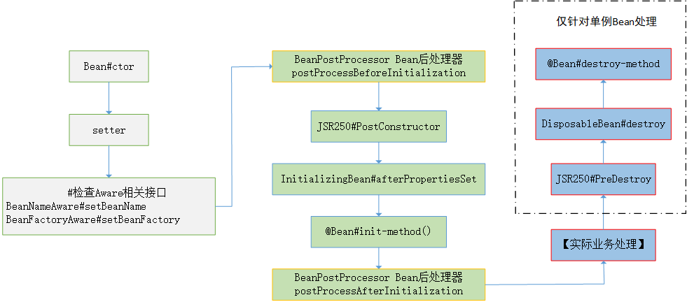

## Bean生命周期
### 1.1 概述
一个Bean生命周期流程图：



具体步骤包括：
- 【1】调用相应的构造函数
- 【2】如果需要，使用setter()方法属性赋值
- 若实现相关的Aware接口，则执行对象的实现方法：
    - 【3】BeanNameAware接口的setBeanName()方法
    - 【4】BeanFactoryAware接口的setBeanFactory()方法
- 【5】执行Bean后处理器postProcessBeforeInitialization()方法
- 【6】JSR250中的@PostConstruct()注解标注的方法
- 【7】若实现InitializingBean接口，则执行afterPropertiesSet()方法
- 【8】执行@Bean注解中使用了init-method属性指定了对应的方法（如果有指定的话）
- 【9】Bean后处理器的postProcessAfterInitialization()方法
- 【进行实际业务逻辑处理】
- 【10】如果Bean是单例，执行JSR250中的@PreDestroy()注解标注的方法
- 【11】如果Bean是单例，若实现DisposableBean接口，则执行destroy()方法
- 【12】如果Bean是单例，执行@Bean注解中使用了destroy-method属性指定了对应的方法（如果有指定的话）

### 1.2 ctor & setter()
Bean的构造需要构造函数进行初始化，如果有需要的话，可以使用setter()方法进行属性赋值，使用setter()方法进行
赋值的时机有很多，常见的是在配置类中使用@Bean进行注入的时候设置：
```java
/**
 * 该Bean对象用于演示Bean的生命周期流程
 *
 * @author sherman
 */
public class LifecycleBean implements BeanNameAware , BeanFactoryAware, InitializingBean , DisposableBean {
    private String foo;

    public LifecycleBean() {
         System.out.println("【1】---Constructor构造Bean对象...");
    }

    public String getFoo() {
        return foo;
    }

    public void setFoo(String foo) {
        System.out.println("【2】---setter()注入属性值...");
        this.foo = foo;
    }
    // ...
}

/**
 * 将LifecircleBean注入到IOC容器中
 */
@Bean(value = "lifecycleBean")
public LifecycleBean getLifecycleBean() {
    LifecycleBean lifecircleBean = new LifecycleBean();
    lifecircleBean.setFoo("foo");
    return lifecircleBean;
}
```

### 1.3 XxxAware接口
Bean对象实现了XxxAware接口，就可以在对应接口的方法中进行拦截：
```java
public class LifecycleBean implements BeanNameAware , BeanFactoryAware{
    // ...
    /**
     * BeanNameAware接口的setBeanName()
     */
    @Override
    public void setBeanName(String s) {
        System.out.println("【3】---BeanNameAware#setBeanName()...");
    }

    /**
     * BeanFactoryAware接口的setBeanFactory()
     */
    @Override
    public void setBeanFactory(BeanFactory beanFactory) throws BeansException {
        System.out.println("【4】---BeanFactoryAware#setBeanFactory()...");
    }
}
```

### 1.4 Bean后置处理器
Bean后置处理器（BeanPostProcessor）接口中两个方法可以在Bean对象初始化前后进行拦截：
```java
/**
 * 演示BeanPostProcessor在Bean的创建前后实现拦截功能
 *
 * 拦截到beanName为"lifecycleBean"并进行相应输出
 * @author sherman
 */
@Component
public class CustomBeanPostProcessor implements BeanPostProcessor {
    private final String targetBeanName = "lifecycleBean";
    @Override
    public Object postProcessBeforeInitialization(Object bean, String beanName) throws BeansException {
        if (targetBeanName.equals(beanName)) {
            System.out.println("【5】---BeanPostProcessor#postProcessBeforeInitialization()");
        }
        return bean;
    }

    @Override
    public Object postProcessAfterInitialization(Object bean, String beanName) throws BeansException {
        if (targetBeanName.equals(beanName)) {
            System.out.println("【9】---BeanPostProcessor#postProcessAfterInitialization()");
        }
        return bean;
    }
}
```

### 1.5 JSR250中注解
JSR250规范中提供了两个注解 **@PostConstructor** 和 **@PreDestroy**两个注解也可以用于Bean对象的拦截工作：
```java
public class LifecycleBean implements BeanNameAware , BeanFactoryAware {
    // ...
    /**
     * jsr250注解
     */
    @PostConstruct
    public void jsr250PostConstruct() {
        System.out.println("【6】---JSR250#PostConstruct()");
    }

    /**
     * jsr250注解
     */
    @PreDestroy
    public void jsr250PreDestroy(){
        System.out.println("【10】---JSR250#PreDestroy()");

    }
    // ...
}
```

### 1.6 InitializingBean & DisposableBean
InitializingBean & DisposableBean是两个相对的接口，分别在Bean对象的初始化和销毁过程中进行拦截：
```java
public class LifecycleBean implements BeanNameAware , BeanFactoryAware, InitializingBean , DisposableBean {
    // ...
    
    /**
     * InitializingBean接口的afterPropertiesSet()
     */
    @Override
    public void afterPropertiesSet() throws Exception {
        System.out.println("【7】---InitializingBean#afterPropertiesSet()");
    }
    
     /**
     * DisposableBean接口的destroy()方法
     * @throws Exception
     */
    @Override
    public void destroy() throws Exception {
        System.out.println("【11】---DisposableBean#destroy()");
    }
    
    // ...
}
```

### 1.7 @Bean中init-method & destroy-method
在配置类中将Bean对象通过@Bean注解注入到IOC容器中时，可以通过两个属性方法 **init-method** 和 **destroy-method**
指定Bean对象的init和destroy方法：
```java
public class LifecycleBean implements BeanNameAware , BeanFactoryAware, InitializingBean , DisposableBean {
    // ...
    /**
     * @Bean 注解中指定的init-method方法
     */
    public void initMethod() {
        System.out.println("【8】---@Bean#init-method()");
    }

    /**
     * @Bean 注解中指定的destroy-method方法
     */
    public void destroyMethod() {
        System.out.println("【12】---@Bean#destroy-method");
    }
    // ...
}

@ComponentScan("nwpu.sherman")
@Configuration
@Import({Red.class, CustomImportSelector.class, CustomImportBdRegistrar.class})
public class BeanConfig {
    // ...
    /**
     * 将LifecircleBean注入到IOC容器中
     */
    @Bean(value = "lifecycleBean", initMethod = "initMethod", destroyMethod = "destroyMethod")
    @Scope(scopeName = "singleton")
    public LifecycleBean getLifecycleBean() {
        LifecycleBean lifecircleBean = new LifecycleBean();
        lifecircleBean.setFoo("foo");
        return lifecircleBean;
    }
}
```  

### 1.8 Bean生命周期补充
Bean对象的生命周期【10】【11】【12】三个销毁方法，在IOC容器调用close()执行，但是仅仅销毁作用域为
**singleton**的Bean对象，如果Bean对象的作用域为**prototype**，则不会进行销毁操作。
