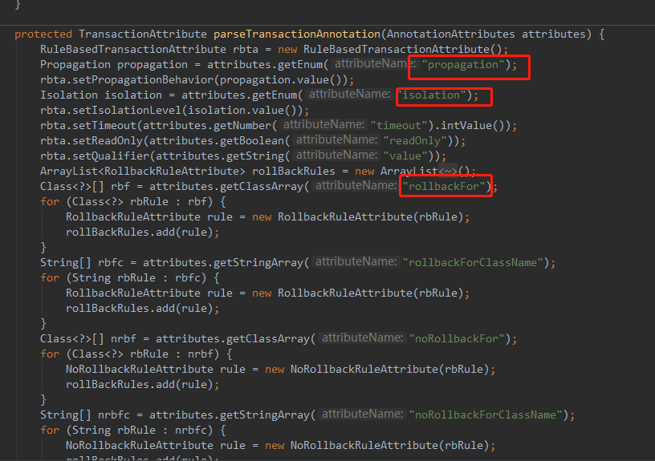

## 声明式事务源码分析

### 1.1 源码分析
和AOP源码分析类似，我们从@EnableTransactionManagement注解出发，该注解中使用@Import导入了(TransactionManagementConfigurationSelector.class)类，
继续查看TransactionManagementConfigurationSelector类：
```java
public class TransactionManagementConfigurationSelector extends AdviceModeImportSelector<EnableTransactionManagement> {
    @Override
    protected String[] selectImports(AdviceMode adviceMode) {
        switch (adviceMode) {
            case PROXY:
                return new String[] {AutoProxyRegistrar.class.getName(), ProxyTransactionManagementConfiguration.class.getName()};
            case ASPECTJ:
                return new String[] {TransactionManagementConfigUtils.TRANSACTION_ASPECT_CONFIGURATION_CLASS_NAME};
            default:
                return null;
        }
    }
}
```

TransactionManagementConfigurationSelector会根据**adviceMode**向IOC容器中导入不同的组件，默认情况下，@EnableTransactionManagement的mode是
AdviceMode.PROXY，因此会向IOC容器中注入：
- AutoProxyRegistrar类
- ProxyTransactionManagementConfiguration类

我们依次分析这两个类：

**AutoProxyRegistrar类**:
和AOP类似，AutoProxyRegistrar类也是ImportBeanDefinitionRegistrar接口的实现类，用于在运行期间向IOC容器中动态注入组件，具体来说它向IOC容器中
注入了一个：InfrastructureAdvisorAutoProxyCreator类的组件：
```java
@Override
public void registerBeanDefinitions(AnnotationMetadata importingClassMetadata, BeanDefinitionRegistry registry) {
    boolean candidateFound = false;
    Set<String> annoTypes = importingClassMetadata.getAnnotationTypes();
    for (String annoType : annoTypes) {
        AnnotationAttributes candidate = AnnotationConfigUtils.attributesFor(importingClassMetadata, annoType);
        if (candidate == null) {
            continue;
        }
        Object mode = candidate.get("mode");
        Object proxyTargetClass = candidate.get("proxyTargetClass");
        if (mode != null && proxyTargetClass != null && AdviceMode.class == mode.getClass() &&
                Boolean.class == proxyTargetClass.getClass()) {
            candidateFound = true;
            if (mode == AdviceMode.PROXY) {
                // 使用工具类向IOC容器中注册组件
                AopConfigUtils.registerAutoProxyCreatorIfNecessary(registry);
                if ((Boolean) proxyTargetClass) {
                    AopConfigUtils.forceAutoProxyCreatorToUseClassProxying(registry);
                    return;
                }
            }
        }
    }
    if (!candidateFound) {
        // ...
    }
}

public static BeanDefinition registerAutoProxyCreatorIfNecessary(BeanDefinitionRegistry registry) {
    return registerAutoProxyCreatorIfNecessary(registry, null);
}

// 注册InfrastructureAdvisorAutoProxyCreator组件
public static BeanDefinition registerAutoProxyCreatorIfNecessary(BeanDefinitionRegistry registry, Object source) {
    return registerOrEscalateApcAsRequired(InfrastructureAdvisorAutoProxyCreator.class, registry, source);
}
```

InfrastructureAdvisorAutoProxyCreator类查看它的继承树，它也实现了**SmartInstantiationAwareBeanPostProcessor, BeanFactoryAware**接口，
因此本质上它也是一个BeanPostProcessor，所以它的运行原理和AOP的AnnotationAwareAspectJAutoProxyCreator相同：

利用后置处理器机制在创建对象之后，包装对象，返回一个代理对象（增强器），代理对象执行方法利用拦截器链进行调用。

```java
// InfrastructureAdvisorAutoProxyCreator extends AbstractAdvisorAutoProxyCreator
//                                       extends AbstractAutoProxyCreator
// AbstractAutoProxyCreator类中的postProcessAfterInitialization()方法：                                                                    
@Override
public Object postProcessAfterInitialization(Object bean, String beanName) throws BeansException {
    if (bean != null) {
        Object cacheKey = getCacheKey(bean.getClass(), beanName);
        if (!this.earlyProxyReferences.contains(cacheKey)) {
            // 进行包装，实际就是返回代理对象
            return wrapIfNecessary(bean, beanName, cacheKey);
        }
    }
    return bean;
}
```

**ProxyTransactionManagementConfiguration**:
ProxyTransactionManagementConfiguration类本质上是一个配置了，拥有@Configuration注解，它向IOC容器中注册了三个组件：
- transactionAdvisor：事务增强器，beanName为internalTransactionAdvisor
- transactionAttributeSource：事务属性源
- transactionInterceptor：事务拦截器
并且它会将transactionAttributeSource组件和transactionInterceptor组件添加到事务增强器中：
```java
@Configuration
public class ProxyTransactionManagementConfiguration extends AbstractTransactionManagementConfiguration {

    // 向IOC容器中注入beanName为internalTransactionAdvisor的事务增强器
    @Bean(name = TransactionManagementConfigUtils.TRANSACTION_ADVISOR_BEAN_NAME)
    @Role(BeanDefinition.ROLE_INFRASTRUCTURE)
    public BeanFactoryTransactionAttributeSourceAdvisor transactionAdvisor() {
        BeanFactoryTransactionAttributeSourceAdvisor advisor = new BeanFactoryTransactionAttributeSourceAdvisor();
        // 将transactionAttributeSource加入到事务增强器中
        advisor.setTransactionAttributeSource(transactionAttributeSource());
        // 将拦截器加入
        advisor.setAdvice(transactionInterceptor());
        advisor.setOrder(this.enableTx.<Integer>getNumber("order"));
        return advisor;
    }
    
    // 向IOC容器中注入transactionAttributeSource
    @Bean
    @Role(BeanDefinition.ROLE_INFRASTRUCTURE)
    public TransactionAttributeSource transactionAttributeSource() {
        // 实际上new AnnotationTransactionAttributeSource
        return new AnnotationTransactionAttributeSource();
    }
    
    // 向IOC容器中注入transactionInterceptor
    @Bean
    @Role(BeanDefinition.ROLE_INFRASTRUCTURE)
    public TransactionInterceptor transactionInterceptor() {
        TransactionInterceptor interceptor = new TransactionInterceptor();
        interceptor.setTransactionAttributeSource(transactionAttributeSource());
        if (this.txManager != null) {
            interceptor.setTransactionManager(this.txManager);
        }
        return interceptor;
    }
}
```

我们先看transactionAttributeSource，它其实就是new AnnotationTransactionAttributeSource()，继续查看该源码，
它的构造函数中加入了多个**注解解析器**，用于解析注解的属性：
```java
public AnnotationTransactionAttributeSource(boolean publicMethodsOnly) {
    this.publicMethodsOnly = publicMethodsOnly;
    this.annotationParsers = new LinkedHashSet<TransactionAnnotationParser>(2);
    // SpringTransactionAnnotationParser
    this.annotationParsers.add(new SpringTransactionAnnotationParser());
    if (jta12Present) {
        // JtaTransactionAnnotationParser
        this.annotationParsers.add(new JtaTransactionAnnotationParser());
    }
    if (ejb3Present) {
        // Ejb3TransactionAnnotationParser
        this.annotationParsers.add(new Ejb3TransactionAnnotationParser());
    }
}
```
以SpringTransactionAnnotationParser解析器为例，查看它能解析的注解属性：



再看事务拦截器TransactionInterceptor，事务拦截器是MethodInterceptor接口的实现类，在重写invoke方法
内部调用了invokeWithinTransaction()方法：
```java
protected Object invokeWithinTransaction(Method method, Class<?> targetClass, final InvocationCallback invocation)
        throws Throwable {

    // If the transaction attribute is null, the method is non-transactional.
    // 拿到事务属性
    final TransactionAttribute txAttr = getTransactionAttributeSource().getTransactionAttribute(method, targetClass);
    // 拿到平台事务管理器
    // 注意这个方法的实现；
    // 它会先到尝试按照Qualifier拿到指定的平台事务管理器，如果没有添加任何指定的平台事务管理器
    // 它会从IOC容器中按照类型获取一个平台事务管理器，这也是为什么仅向IOC容器中注入一个平台事务管理器，不指定名称，
    // 也能成功拿到的原因
    final PlatformTransactionManager tm = determineTransactionManager(txAttr);
    final String joinpointIdentification = methodIdentification(method, targetClass, txAttr);

    if (txAttr == null || !(tm instanceof CallbackPreferringPlatformTransactionManager)) {
        // Standard transaction demarcation with getTransaction and commit/rollback calls.
        TransactionInfo txInfo = createTransactionIfNecessary(tm, txAttr, joinpointIdentification);
        Object retVal = null;
        try {
            // This is an around advice: Invoke the next interceptor in the chain.
            // This will normally result in a target object being invoked.
            retVal = invocation.proceedWithInvocation();
        }
        catch (Throwable ex) {
            // target invocation exception
            // 发生异常，需要回滚，内部调用：
            // txInfo.getTransactionManager().rollback(txInfo.getTransactionStatus());
            // 回滚操作是由平台事务管理器完成的
            completeTransactionAfterThrowing(txInfo, ex);
            throw ex;
        }
        finally {
            cleanupTransactionInfo(txInfo);
        }
        // 如果没有发生异常，直接提交，内部调用：
        // txInfo.getTransactionManager().commit(txInfo.getTransactionStatus());
        // commit操作也是由平台事务管理器完成的
        commitTransactionAfterReturning(txInfo);
        return retVal;
    }

    else {
        final ThrowableHolder throwableHolder = new ThrowableHolder();

        // It's a CallbackPreferringPlatformTransactionManager: pass a TransactionCallback in.
        try {
            // ...
        }
    }
}
```

总之：事务拦截器TransactionInterceptor执行目标方法的时候，执行拦截器链，然后获取事务相关属性、平台事务管理器，
在执行目标方法时，无论是正常执行还是发生异常，**对应的commit和rollback操作都是由平台事务管理器（PlatformTransactionManager）完成的**。