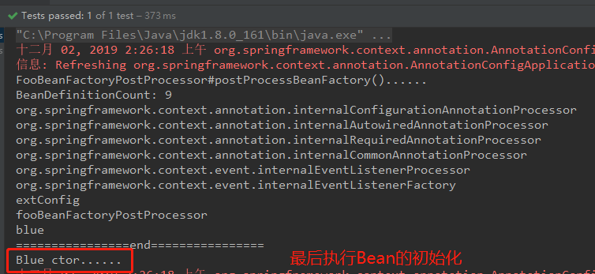
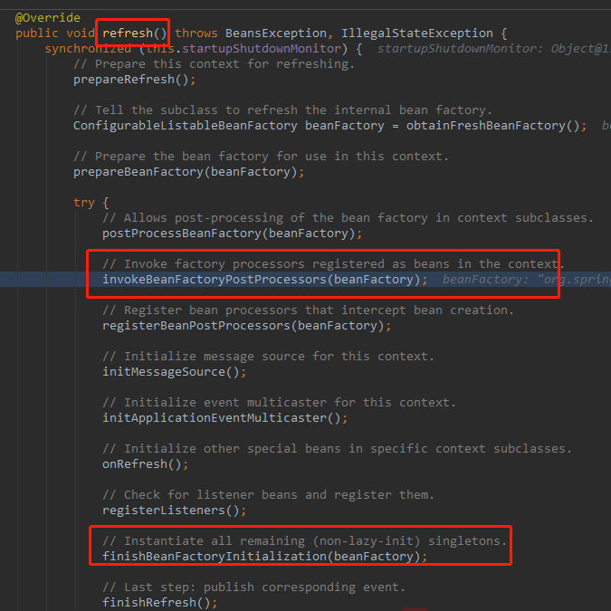
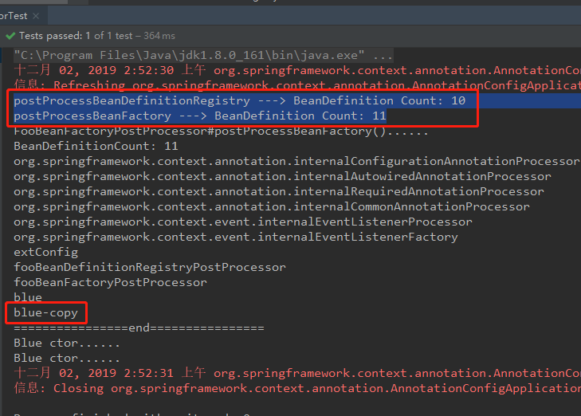
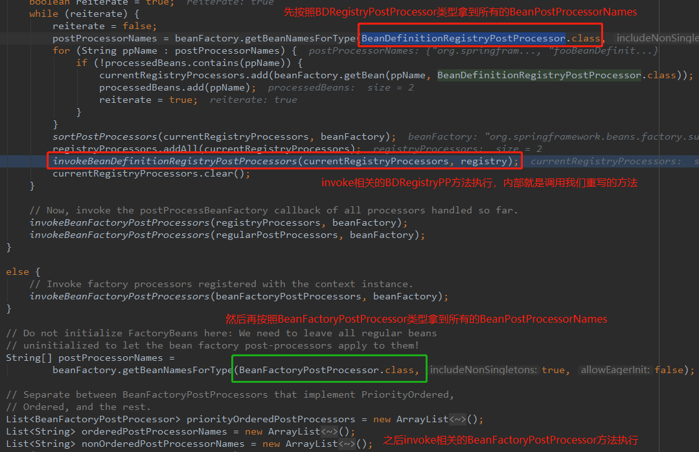

## 拓展原理

### 1.1 BeanFactoryPostProcessor
BeanPostProcessor是在Bean对象初始化前后完成相关的拦截操作，而BeanFactoryPostProcessor是在BeanFactor初始化之后进行调用的，具体时机：
所有的Bean定义已经保存加载到beanFactory中，但是Bean的实例还未创建。

演示上述创建时机是否正确：
- 新建一个ext包，并在ext包下创建BeanFactoryPostProcessor接口的实现类——FooBeanFactoryPostProcessor，并使用@Component注解将其纳入IOC容器管理范围：
```java
@Component
public class FooBeanFactoryPostProcessor implements BeanFactoryPostProcessor {
    @Override
    public void postProcessBeanFactory(ConfigurableListableBeanFactory beanFactory) throws BeansException {
        System.out.println("FooBeanFactoryPostProcessor#postProcessBeanFactory()......");
        System.out.println("BeanDefinitionCount: " + beanFactory.getBeanDefinitionCount());
        for (String beanDefinitionName : beanFactory.getBeanDefinitionNames()) {
            System.out.println(beanDefinitionName);
        }
        System.out.println("================end================");
    }
}
```
- 新建一个ExtConfig配置类，在该配置类中加入一个Blue的Bean对象，注意Blue类的构造器有输出，仅仅用于比较两者的执行时机：
```java
@Configuration
@ComponentScan("nwpu.sherman.ext")
public class ExtConfig {


    /**
     * 向IOC容器中注入该Bean对象只是为了比较Bean创建时机和BeanFactoryPostProcessor的执行时机
     * @return
     */
    @Bean
    public Blue blue() {
        return new Blue();
    }
}

public class Blue {
    public Blue(){
        System.out.println("Blue ctor......");
    }
}
```
- 测试类进行测试：
```java
/**
 * @author sherman
 */
public class ExtTest {

    @Test
    public void beanFactoryPostProcessorTest() {
        AnnotationConfigApplicationContext context = new AnnotationConfigApplicationContext(ExtConfig.class);
        context.close();
    }
}
```
- 输出顺序：



**从源码角度分析两者的执行时机顺序**：
给FooBeanFactoryPostProcessor类的postProcessBeanFactory()方法打上断点，debug方法运行，查看trace可以发现：
postProcessBeanFactory()是从refresh()方法中的 **invokeBeanFactoryPostProcessors(beanFactory);** 方法进入的，
而该方法是在 **finishBeanFactoryInitialization(beanFactory);** 之前，从源码角度也能清楚的看到两者的执行顺序。



**分析BeanFactoryPostProcessor执行流程**：
主要分析debug trace中的invokeBeanFactoryPostProcessors()方法，该方法的执行过程和BeanPostProcessor对应的方法执行过程类似：
- 根据BeanFactoryPostProcessor类型拿到所有的postProcessorNames
- 根据实现接口的不同，依次执行PriorityOrdered -> Ordered -> 普通的BeanFactoryPostProcessors
- 所谓执行对应的BeanFactoryPostProcessors（invokeBeanFactoryPostProcessors(nonOrderedPostProcessors, beanFactory);）
实际上就是遍历所有的BeanPostProcessor，然后依次调用它们的postProcessBeanFactory()方法，这个方法就是我们自定义
FooBeanFactoryPostProcessor类中重写的方法：
```java
private static void invokeBeanFactoryPostProcessors(
        Collection<? extends BeanFactoryPostProcessor> postProcessors, ConfigurableListableBeanFactory beanFactory) {

    for (BeanFactoryPostProcessor postProcessor : postProcessors) {
        // 该方法在FooBeanFactoryPostProcessor类中进行重写
        postProcessor.postProcessBeanFactory(beanFactory);
    }
}
```

### 1.2 BeanDefinitionRegistryPostProcessor
BeanDefinitionRegistryPostProcessor是BeanFactoryPostProcessor的子接口，它内部有一个抽象方法：postProcessBeanDefinitionRegistry()。它的执行时机：
在**所有Bean定义信息将要被加载**，Bean实例对象还未创建时执行，因此它应该在BeanFactoryPostProcessor接口之前执行。

:star:BeanDefinitionRegistryPostProcessor其实是Bean定义信息（id、是否是单例、name等等）的保存中心，以后BeanFactory就是按照BeanDefinitionRegistryPostProcessor中
保存的每一个Bean的定义信息创建Bean实例。

演示自定义一个BeanDefinitionRegistryPostProcessor类，验证它的执行时机：
- 在ext包下新建一个BeanDefinitionRegistryPostProcessor接口的实行类FooBeanDefinitionRegistryPostProcessor：
```java
@Component
public class FooBeanDefinitionRegistryPostProcessor implements BeanDefinitionRegistryPostProcessor {
    /**
     * BeanDefinitionRegistryPostProcessor接口的重写方法
     */

    @Override
    public void postProcessBeanDefinitionRegistry(BeanDefinitionRegistry registry) throws BeansException {
        System.out.println("postProcessBeanDefinitionRegistry ---> BeanDefinition Count: " + registry.getBeanDefinitionCount());
        /**
         * 向IOC容器中注册一个Bean
         */
        RootBeanDefinition blue = new RootBeanDefinition(Blue.class);
        registry.registerBeanDefinition("blue-copy", blue);

    }

    /**
     * BeanFactoryPostProcessor接口的重写方法
     */
    @Override
    public void postProcessBeanFactory(ConfigurableListableBeanFactory beanFactory) throws BeansException {
        System.out.println("postProcessBeanFactory ---> BeanDefinition Count: " + beanFactory.getBeanDefinitionCount());
    }
}
```
- 直接运行上一节测试方法，输出结果显示：确实是BeanDefinitionRegistryPostProcessor优先于BeanFactoryPostProcessor接口执行：



同时上述代码还显示了，实现BeanDefinitionRegistryPostProcessor接口后，再其需要重写的抽象方法中也可以通过registry向容器中
注册组件（例如beanName为blue-copy的Blue组件）。

**源码分析BeanDefinitionRegistryPostProcessor执行流程**：
在postProcessBeanDefinitionRegistry()方法出打上断点，debug模式查看trace，整体流程相似：
- ioc创建对象
- refresh方法() -> invokeBeanFactoryPostProcessors(beanFactory);
- 从容器中根据BeanDefinitionRegistryPostProcessor.class获取BeanPostProcessor的names
    - 执行invokeBeanDefinitionRegistryPostProcessors(currentRegistryProcessors, registry);
    - 上述方法的执行内部遍历所有的BeanDefinitionRegistryPostProcessor，执行postProcessBeanDefinitionRegistry()方法
    ```java
    private static void invokeBeanDefinitionRegistryPostProcessors(
            Collection<? extends BeanDefinitionRegistryPostProcessor> postProcessors, BeanDefinitionRegistry registry) {
    
        for (BeanDefinitionRegistryPostProcessor postProcessor : postProcessors) {
            postProcessor.postProcessBeanDefinitionRegistry(registry);
        }
    }
    ```
- 从容器中根据BeanFactoryPostProcessor.class拿到所有的BeanPostProcessor的names
    - 执行invokeBeanFactoryPostProcessors(priorityOrderedPostProcessors, beanFactory);
    - 上述方法的执行内部遍历所有的BeanFactoryPostProcessor，执行postProcessBeanFactory()方法：
    ```java
    private static void invokeBeanFactoryPostProcessors(
        Collection<? extends BeanFactoryPostProcessor> postProcessors, ConfigurableListableBeanFactory beanFactory) {

        for (BeanFactoryPostProcessor postProcessor : postProcessors) {
            postProcessor.postProcessBeanFactory(beanFactory);
        }
    }
    ```

源码大致流程如下：



### 1.3 ApplicationListener
监听容器中发布的事件，完成事件驱动模型开发，对应的接口为ApplicationListener\<E extends ApplicationEvent>，需要监听
ApplicationEvent及其子事件。

自己发布事件：
- 写一个监听器来监听某个事件（ApplicationEvent及其子类）
- 把监听器加入到容器中
- 只要容器中有相关事件的发布，我们就能够监听到这个事件，例如：
    - ContextRefreshedEvent：容器刷新完成（所有Bean都完全创建）会发布这个事件
    - ContextClosedEvent：关闭容器会发布这个事件
- 通过容器的publishEvent()方法进行发布

```java
/**
 * 自定义一个事件监听器
 *
 * @author sherman
 */
@Component
public class FooApplicationListener implements ApplicationListener<ApplicationEvent> {

    @Override
    public void onApplicationEvent(ApplicationEvent event) {
        System.out.println("收到事件：" + event);
    }
}

/**
 * ApplicationListener 测试
 */
@Test
public void applicationListenerTest(){
    AnnotationConfigApplicationContext context = new AnnotationConfigApplicationContext(ExtConfig.class);
    context.publishEvent(new ApplicationEvent("发布了一个新事件") {
    });
    context.close();
}
```

输出：


**ApplicationListener原理**：

上述测试结果，共收到三个事件：
- org.springframework.context.event.ContextRefreshedEvent
- nwpu.sherman.test.ExtTest$1[source=发布了一个新事件]
- org.springframework.context.event.ContextClosedEvent

以debug方式查看三个事件发布和监听的流程：

**ContextRefreshedEvent**:
- 容器创建对象，调用refresh()方法
- refresh()方法中最后一个方法finishRefresh();被调用
- publishEvent(new ContextRefreshedEvent(this));
- 继续调用，最后进入：publishEvent(Object event, ResolvableType eventType)方法内部：
    - 获取事件的多播器（派发器） ：getApplicationEventMulticaster()
    - 派发所有事件：getApplicationEventMulticaster().multicastEvent(applicationEvent, eventType);
        - 先拿到所有的ApplicationListener：
        - 判断Executor是否为null，不为null就可以使用Executor进行异步派发
        - 执行invokeListener()方法
        - 最终在doInvokeListener()方法内进行回调：listener.onApplicationEvent(event);
        
```java
protected void publishEvent(Object event, ResolvableType eventType) {
    // ...
    // Multicast right now if possible - or lazily once the multicaster is initialized
    if (this.earlyApplicationEvents != null) {
        this.earlyApplicationEvents.add(applicationEvent);
    }
    else {
        // 1. 先拿到事件多播器（派发器）
        // 2. 使用multicastEvent进行派发事件
        getApplicationEventMulticaster().multicastEvent(applicationEvent, eventType);
    }

    // Publish event via parent context as well...
    if (this.parent != null) {
        if (this.parent instanceof AbstractApplicationContext) {
            ((AbstractApplicationContext) this.parent).publishEvent(event, eventType);
        }
        else {
            this.parent.publishEvent(event);
        }
    }
}

@Override
public void multicastEvent(final ApplicationEvent event, ResolvableType eventType) {
    ResolvableType type = (eventType != null ? eventType : resolveDefaultEventType(event));
    // getApplicationListeners()方法拿到所有的ApplicationListener
    for (final ApplicationListener<?> listener : getApplicationListeners(event, type)) {
        Executor executor = getTaskExecutor();
        // 如果executor不为null，使用多线程进行异步派发
        if (executor != null) {
            executor.execute(new Runnable() {
                @Override
                public void run() {
                    invokeListener(listener, event);
                }
            });
        }
        else {
            // 否则直接执行invokeListener方法，最终调用doInvokeListener()方法
            invokeListener(listener, event);
        }
    }
}

private void doInvokeListener(ApplicationListener listener, ApplicationEvent event) {
    try {
        // 进行回调，该方法就是自定义ApplicationListener需要实现的方法
        listener.onApplicationEvent(event);
    }
    // ...
}
```

**自己发布的事件**：nwpu.sherman.test.ExtTest$1[source=发布了一个新事件]
容器刷新完成后发布ContextRefreshEvent事件后，自己发布的事件：
```java
context.publishEvent(new ApplicationEvent("发布了一个新事件") {
    });
```

**context.publishEvent**最终会执行到：getApplicationEventMulticaster().multicastEvent(applicationEvent, eventType);方法，
后面的执行逻辑和ContextRefreshedEvent事件相同。
    
    
**ContextClosedEvent**：容器关闭

容器关闭时间最开始是由 **context.close()** 触发的，在close()方法内部，继续调用doClose()方法，doClose()方法中调用了
publishEvent(new ContextClosedEvent(this)); -> getApplicationEventMulticaster().multicastEvent(applicationEvent, eventType);
后面的执行逻辑和上述两个事件相同。

**事件派发器**：

之前我们都是通过getApplicationEventMulticaster()方法获的一个事件多播器（派发器），接下来我们研究一下它是如何获取到的：

在容器刷新方法refresh()中，有一个：initApplicationEventMulticaster();主要逻辑：
- 先去容器中找是否有id为**applicationEventMulticaster**的组件
- 如果有直接就将拿到将其赋值给成员变量this.applicationEventMulticaster
- 如果没有就new SimpleApplicationEventMulticaster(beanFactory)，并将其加入到IOC容器中
- 之后我们要使用事件多播器，就直接查找即可
```java
protected void initApplicationEventMulticaster() {
    ConfigurableListableBeanFactory beanFactory = getBeanFactory();
    if (beanFactory.containsLocalBean(APPLICATION_EVENT_MULTICASTER_BEAN_NAME)) {
        this.applicationEventMulticaster =
                beanFactory.getBean(APPLICATION_EVENT_MULTICASTER_BEAN_NAME, ApplicationEventMulticaster.class);
        if (logger.isDebugEnabled()) {
            logger.debug("Using ApplicationEventMulticaster [" + this.applicationEventMulticaster + "]");
        }
    }
    else {
        this.applicationEventMulticaster = new SimpleApplicationEventMulticaster(beanFactory);
        beanFactory.registerSingleton(APPLICATION_EVENT_MULTICASTER_BEAN_NAME, this.applicationEventMulticaster);
        if (logger.isDebugEnabled()) {
            logger.debug("Unable to locate ApplicationEventMulticaster with name '" +
                    APPLICATION_EVENT_MULTICASTER_BEAN_NAME +
                    "': using default [" + this.applicationEventMulticaster + "]");
        }
    }
}

ApplicationEventMulticaster getApplicationEventMulticaster() throws IllegalStateException {
    // 直接判断成员变量this.applicationEventMulticaster是否为null
    if (this.applicationEventMulticaster == null) {
        throw new IllegalStateException("ApplicationEventMulticaster not initialized - " +
                "call 'refresh' before multicasting events via the context: " + this);
    }
    return this.applicationEventMulticaster;
}
```

除此之外，还应该留意在refresh()方法中还有一个 **registerListeners();** 方法：
```java
protected void registerListeners() {
    // 首先注册statically的监听器
    // Register statically specified listeners first.
    for (ApplicationListener<?> listener : getApplicationListeners()) {
        getApplicationEventMulticaster().addApplicationListener(listener);
    }

    // 根据ApplicationListener类型，拿到所有的listenerBeanNames
    // Do not initialize FactoryBeans here: We need to leave all regular beans
    // uninitialized to let post-processors apply to them!
    String[] listenerBeanNames = getBeanNamesForType(ApplicationListener.class, true, false);
    // 向派发器中注册所有的ApplicationListener
    // 保证IOC容器中如果有ApplicationListener，都已经向派发器进行注册，之后的从派发器中就可以直接获取到
    for (String listenerBeanName : listenerBeanNames) {
        getApplicationEventMulticaster().addApplicationListenerBean(listenerBeanName);
    }

    // Publish early application events now that we finally have a multicaster...
    Set<ApplicationEvent> earlyEventsToProcess = this.earlyApplicationEvents;
    this.earlyApplicationEvents = null;
    if (earlyEventsToProcess != null) {
        for (ApplicationEvent earlyEvent : earlyEventsToProcess) {
            getApplicationEventMulticaster().multicastEvent(earlyEvent);
        }
    }
}
```

### 1.4 @EventListener & SmartInitializingSingleton
@EventListener注解配合上普通的业务逻辑组件也能够完成事件监听功能：
```java
/**
 * 一个普通的业务逻辑组件，配合@EventListener注解也能完成事件监听工作
 * Service组件放在ext包下只是为了演示作用，方便包扫描能够扫到
 * 
 * @author sherman
 */
@Service
public class FooService {
    @EventListener
    public void fooService(ApplicationEvent event) {
        System.out.println("#### FooService: " + event);
    }
}
```

**@EventListener原理：**

@EventListener注解上有一个@see EventListenerMethodProcessor，我们继续查看EventListenerMethodProcessor，
EventListenerMethodProcessor是SmartInitializingSingleton接口的实现类，需要重写afterSingletonsInstantiated()方法，
我们在afterSingletonsInstantiated()方法处加上断点，查看执行流程：
- IOC容器创建对象并执行refresh()方法
- 执行finishBeanFactoryInitialization：初始化剩下所有的单实例Bean，一直调用到preInstantiateSingletons方法：
    - 先初始化所有单实例Bean对象，
    - 获取所有创建好的单实例Bean对象，判断是否是SmartInitializingSingleton接口的实例
    - 如果是直接回调需要重新写的afterSingletonsInstantiated()完成事件监听
    
```java
@Override
public void preInstantiateSingletons() throws BeansException {
    if (this.logger.isDebugEnabled()) {
        this.logger.debug("Pre-instantiating singletons in " + this);
    }

    // Iterate over a copy to allow for init methods which in turn register new bean definitions.
    // While this may not be part of the regular factory bootstrap, it does otherwise work fine.
    List<String> beanNames = new ArrayList<String>(this.beanDefinitionNames);

    // Trigger initialization of all non-lazy singleton beans...
    // 初始化所有单实例Bean
    for (String beanName : beanNames) {
        RootBeanDefinition bd = getMergedLocalBeanDefinition(beanName);
        if (!bd.isAbstract() && bd.isSingleton() && !bd.isLazyInit()) {
            if (isFactoryBean(beanName)) {
                final FactoryBean<?> factory = (FactoryBean<?>) getBean(FACTORY_BEAN_PREFIX + beanName);
                boolean isEagerInit;
                if (System.getSecurityManager() != null && factory instanceof SmartFactoryBean) {
                    isEagerInit = AccessController.doPrivileged(new PrivilegedAction<Boolean>() {
                        @Override
                        public Boolean run() {
                            return ((SmartFactoryBean<?>) factory).isEagerInit();
                        }
                    }, getAccessControlContext());
                }
                else {
                    isEagerInit = (factory instanceof SmartFactoryBean &&
                            ((SmartFactoryBean<?>) factory).isEagerInit());
                }
                if (isEagerInit) {
                    getBean(beanName);
                }
            }
            else {
                getBean(beanName);
            }
        }
    }
    // 遍历已创建好的单实例Bean
    // Trigger post-initialization callback for all applicable beans...
    for (String beanName : beanNames) {
        Object singletonInstance = getSingleton(beanName);
        // 如果是SmartInitializingSingleton类型实例对象
        if (singletonInstance instanceof SmartInitializingSingleton) {
            final SmartInitializingSingleton smartSingleton = (SmartInitializingSingleton) singletonInstance;
            if (System.getSecurityManager() != null) {
                AccessController.doPrivileged(new PrivilegedAction<Object>() {
                    @Override
                    public Object run() {
                        smartSingleton.afterSingletonsInstantiated();
                        return null;
                    }
                }, getAccessControlContext());
            }
            else {
                // 回调需要重写的方法
                smartSingleton.afterSingletonsInstantiated();
            }
        }
    }
}
```


    
    