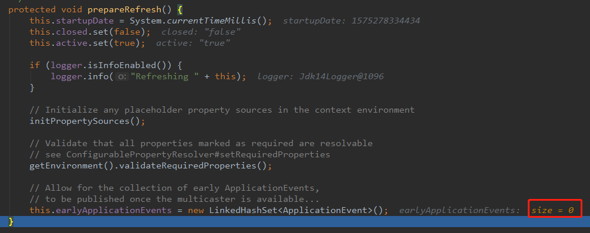

## BeanFactory预准备
refresh()中方法包括：

> 1. **prepareRefresh();** 
> 2. **ConfigurableListableBeanFactory beanFactory = obtainFreshBeanFactory();**
> 3. **prepareBeanFactory();**
> 4. **postProcessorBeanFactory();**
> 5. invokeBeanFactoryPostProcessors(beanFactory);
> 6. registerBeanPostProcessor(beanFactory);
> 7. initMessageSource();
> 8. initApplicationEventMulticaster();
> 9. onRefresh();
> 10. registerListeners();
> 11. finishBeanFactoryInitialization(beanFactory);
> 12. finishRefresh();

### 1.1 prepareRefresh();
prepareRefresh()方法用于容器刷新前的一些准备工作，包括：
- 一些启动时间、激活标志、属性源等设置
- 一个模板方法，用于容器环境中属性设置
- 如果上一步中有相关的属性设置，还可以对这些属性进行校验
- 初始化一个LinkedHashSet集合保存早期ApplicationEvent，一旦之后多播器（multicaster）可用，就可以进行事件分发

具体源码：

```java
/**
 * Prepare this context for refreshing, setting its startup date and
 * active flag as well as performing any initialization of property sources.
 */
protected void prepareRefresh() {
    // 启动时间、标志位设置
    this.startupDate = System.currentTimeMillis();
    this.closed.set(false);
    this.active.set(true);

    // Console输出：Refreshing ...调试信息
    if (logger.isInfoEnabled()) {
        logger.info("Refreshing " + this);
    }

    // 这是一个模板方法，子类继承并实现该方法，加入相关的property sources
    // Initialize any placeholder property sources in the context environment
    initPropertySources();

    // 如果上一步中设置了相关的property sources，这里还可以进行相关的属性验证
    // Validate that all properties marked as required are resolvable
    // see ConfigurablePropertyResolver#setRequiredProperties
    getEnvironment().validateRequiredProperties();

    // new LinkedHashSet作为early ApplicationEvents保存的集合
    // 一旦之后多播器（multicaster）可用，就可以用于分发事件
    // Allow for the collection of early ApplicationEvents,
    // to be published once the multicaster is available...
    this.earlyApplicationEvents = new LinkedHashSet<ApplicationEvent>();
}
```

具体调试过程截图：



### 1.2 ConfigurableListableBeanFactory beanFactory = obtainFreshBeanFactory();
这个方法的名字就是获取刷新后的BeanFactory，但是留意这条语句的注释中**subclass**这个词：
```java
// Tell the subclass to refresh the internal bean factory.
ConfigurableListableBeanFactory beanFactory = obtainFreshBeanFactory();
```

这个subclass实际上指的是AbstractApplicationContext的子类**GenericApplicationContext**，而所谓的
BeanFactory就是GenericApplicationContext的成员变量**this.beanFactory**。

继续看obtainFreshBeanFactory()方法调用过程：
```java
protected ConfigurableListableBeanFactory obtainFreshBeanFactory() {
    // 刷新BeanFactory，但是该方法内部其实没有任何操作刷新BeanFactory
    refreshBeanFactory();
    // 返回刷新后的BeanFactory，实际就是返回this.beanFactory
    ConfigurableListableBeanFactory beanFactory = getBeanFactory();
    if (logger.isDebugEnabled()) {
        logger.debug("Bean factory for " + getDisplayName() + ": " + beanFactory);
    }
    return beanFactory;
}

// refreshBeanFactory();方法调用过程
// 注意下面的refreshBeanFactory()方法，实际上是子类GenericApplicationContext中重写的方法
/**
 * Do nothing: We hold a single internal BeanFactory and rely on callers
 * to register beans through our public methods (or the BeanFactory's).
 * @see #registerBeanDefinition
 */
@Override
protected final void refreshBeanFactory() throws IllegalStateException {
    // 注意这里还有CAS算法，保证容器只被刷新一次，不能被多次刷新
    // this.refreshed类型：private final AtomicBoolean
    if (!this.refreshed.compareAndSet(false, true)) {
        throw new IllegalStateException(
                "GenericApplicationContext does not support multiple refresh attempts: just call 'refresh' once");
    }
    this.beanFactory.setSerializationId(getId());
}
```

从上面源码可以看到：

实际上refreshBeanFactory()中仅仅进行了CAS判断和对this.beanFactory进行了设置序列化id操作，那么this.beanFactory是在哪里进行初始化的呢？

答案是：构造器！既然调用了子类GenericApplicationContext重写的方法refreshBeanFactory()，那么子类必然被构造，可以看到子类的一个构造器：
```java
public GenericApplicationContext() {
    this.beanFactory = new DefaultListableBeanFactory();
}
```

所以：obtainFreshBeanFactory()最终返回的BeanFactory对象，其实就是在子类GenericApplicationContext构造器中初始化的BeanFactory对象，它的
具体类型还是**DefaultListableBeanFactory**。obtainFreshBeanFactory()方法内仅仅做了：
- 使用CAS算法保证容器不会被多次refresh
- 为BeanFactory设置序列化id

补充：虽然GenericApplicationContext类名中含有**Generic**单词，但是它不是抽象类，因此使用构造函数初始化该类对象。

### 1.3 prepareBeanFactory();
prepareBeanFactory();完成BeanFactory的预准备工作，即对BeanFactory进行一些设置，包括：
- 设置BeanFactory的类加载器、支持表达式解析器
- 添加部分BeanPostProcessor【ApplicationContextAwareProcessor】
- 设置忽略的自动装配的接口EnvironmentAware、EmbeddedValueResolverAware等
- 注册可以解析的自动装配，即可以直接使用@Autowired自动注入：
    - BeanFactory
    - ResourceLoader
    - ApplicationEventPublisher
    - ApplicationContext
- 添加BeanPostProcessor【ApplicationListenerDetector】
- 添加编译时AspectJ
- 给BeanFactory中注册一些能用的组件：
    - environment【ConfigurableEnvironment】
    - systemProperties【Map<String, Object>】
    - systemEnvironment【Map<String, Object>】
    
```java
/**
 * Configure the factory's standard context characteristics,
 * such as the context's ClassLoader and post-processors.
 * @param beanFactory the BeanFactory to configure
 */
protected void prepareBeanFactory(ConfigurableListableBeanFactory beanFactory) {
    // 设置ClassLoader、ExpressionResolver、PropertyEditorRegistrar
    // Tell the internal bean factory to use the context's class loader etc.
    beanFactory.setBeanClassLoader(getClassLoader());
    beanFactory.setBeanExpressionResolver(new StandardBeanExpressionResolver(beanFactory.getBeanClassLoader()));
    beanFactory.addPropertyEditorRegistrar(new ResourceEditorRegistrar(this, getEnvironment()));

    // 设置一些BeanPostProcessor【ApplicationContextAwareProcessor】
    // Configure the bean factory with context callbacks.
    beanFactory.addBeanPostProcessor(new ApplicationContextAwareProcessor(this));
    // 设置忽略的自动装配接口
    beanFactory.ignoreDependencyInterface(EnvironmentAware.class);
    beanFactory.ignoreDependencyInterface(EmbeddedValueResolverAware.class);
    beanFactory.ignoreDependencyInterface(ResourceLoaderAware.class);
    beanFactory.ignoreDependencyInterface(ApplicationEventPublisherAware.class);
    beanFactory.ignoreDependencyInterface(MessageSourceAware.class);
    beanFactory.ignoreDependencyInterface(ApplicationContextAware.class);

    // BeanFactory interface not registered as resolvable type in a plain factory.
    // MessageSource registered (and found for autowiring) as a bean.
    // 注册一些可以解析的自动装配，这些组件可以直接@Autowired进来
    beanFactory.registerResolvableDependency(BeanFactory.class, beanFactory);
    beanFactory.registerResolvableDependency(ResourceLoader.class, this);
    beanFactory.registerResolvableDependency(ApplicationEventPublisher.class, this);
    beanFactory.registerResolvableDependency(ApplicationContext.class, this);

    // 添加BeanPostProcessor【ApplicationListenerDetector】
    // Register early post-processor for detecting inner beans as ApplicationListeners.
    beanFactory.addBeanPostProcessor(new ApplicationListenerDetector(this));

    // 添加编译时AspectJ
    // Detect a LoadTimeWeaver and prepare for weaving, if found.
    if (beanFactory.containsBean(LOAD_TIME_WEAVER_BEAN_NAME)) {
        beanFactory.addBeanPostProcessor(new LoadTimeWeaverAwareProcessor(beanFactory));
        // Set a temporary ClassLoader for type matching.
        beanFactory.setTempClassLoader(new ContextTypeMatchClassLoader(beanFactory.getBeanClassLoader()));
    }

    // Register default environment beans.
    if (!beanFactory.containsLocalBean(ENVIRONMENT_BEAN_NAME)) {
        // 注册environment组件
        beanFactory.registerSingleton(ENVIRONMENT_BEAN_NAME, getEnvironment());
    }
    if (!beanFactory.containsLocalBean(SYSTEM_PROPERTIES_BEAN_NAME)) {
        // 注册systemProperties组件
        beanFactory.registerSingleton(SYSTEM_PROPERTIES_BEAN_NAME, getEnvironment().getSystemProperties());
    }
    if (!beanFactory.containsLocalBean(SYSTEM_ENVIRONMENT_BEAN_NAME)) {
        // 注册systemEnvironment组件
        beanFactory.registerSingleton(SYSTEM_ENVIRONMENT_BEAN_NAME, getEnvironment().getSystemEnvironment());
    }
}
```

### 1.4 postProcessorBeanFactory();
postProcessorBeanFactory();是在BeanFactory准备完成后进行一些后置处理工作，它也是一个模板方法，子类通过重写该方法来在
BeanFactory创建并预准备以后做进一步设置操作。