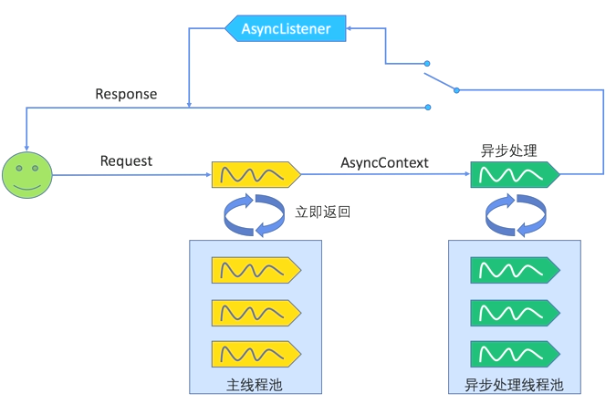
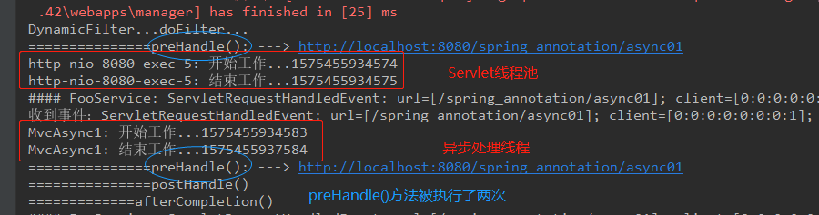
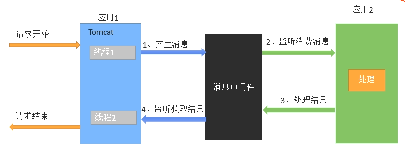

## 异步处理

### 1.1 异步处理
Servlet3.0支持异步请求，这里的异步请求是指服务端的异步请求，和AJAX（发生在客户端异步请求）没有关系。

Servlet是单例多线程的。当一个请求到达服务器后，服务器会为该请求创建一个相应的Servlet线程，为该请求服务。
但是并不是一个请求就会有一个Servlet线程为之服务，服务器会为每一个Servlet实例创建一个Servlet线程池，
线程池中该Servlet实例的线程对象是又上限的。当到达上限之后，再有请求要访问该Servlet，那么该请求就只能等待了。
只有又有了空闲的Servlet线程对象后，才能继续为该请求分配Servlet线程对象。

Servlet3.0支持异步请求模型示意图：



一个支持异步处理的Servlet示例：

```java
/**
 * 支持异步请求的Servlet示例
 *
 * @author sherman
 */
@WebServlet(value = "/async", asyncSupported = true)
public class AsyncServlet extends HttpServlet {
    @Override
    protected void doGet(HttpServletRequest request, HttpServletResponse response) throws ServletException, IOException {
        System.out.println("主线程开始工作..." + System.currentTimeMillis());
        final AsyncContext asyncContext = request.startAsync();
        asyncContext.start(() -> {
            timeConsumingTask();
            asyncContext.complete();
            try {
                asyncContext.getResponse().getWriter().write("hello async...");
            } catch (IOException e) {
                e.printStackTrace();
            }

        });
        System.out.println("主线程结束工作..." + System.currentTimeMillis());
    }

    /**
     * 一个耗时任务，演示异步请求工作方式
     */
    private void timeConsumingTask() {
        try {
            System.out.println("子线程开始工作..." + System.currentTimeMillis());
            Thread.sleep(3000);
        } catch (InterruptedException e) {
            e.printStackTrace();
        }
        System.out.println("子线程结束工作..." + System.currentTimeMillis());
    }
}
```

### 1.2 SpringMVC异步处理

SpringMVC完成异步处理有两种方式：Callable和DeferredResult。

**Callable完成异步处理**：

- 控制器返回Callable结果
- SpringMVC异步处理，将Callable返回结果提交到**TaskExecutor**中，使用一个隔离的线程进行执行
- DispatcherServlet和所有的Filter退出web容器的线程，但是response保持打开状态
- Callable返回结果，SpringMVC将请求**重新派发给容器**（也是这一步，导致拦截器两个拦截，见下图），恢复之前的处理
- 根据Callable返回结果，SpringMVC继续进行视图渲染流程等（重新接受请求-视图渲染）

```java
/**
 * 使用Callable接口完成SpringMVC异步处理请求
 *
 * @author sherman
 */

@Controller
public class AsyncController {

    @ResponseBody
    @RequestMapping("/async01")
    public Callable<String> asyncController() {
        System.out.println(Thread.currentThread().getName() + ": 开始工作..." + System.currentTimeMillis());
        Callable<String> callable = () -> {
            System.out.println(Thread.currentThread().getName() + ": 开始工作..." + System.currentTimeMillis());
            try {
                Thread.sleep(3000);
            } catch (InterruptedException e) {
                e.printStackTrace();
            }
            System.out.println(Thread.currentThread().getName() + ": 结束工作..." + System.currentTimeMillis());
            return "Callable<String> asyncController()";
        };
        System.out.println(Thread.currentThread().getName() + ": 结束工作..." + System.currentTimeMillis());
        return callable;
    }
}
```

输出：



**使用DeferredResultQueue完成异步处理**：

实际业务需求中，可能是以下场景：



应用1接受到请求（例如创建订单的请求），但是应用1本身不应该处理这样的请求，因此应用1将对应请求生成订单的消息
放入到消息中间件中，然后由应用2先从消息中间件中获取消息，然后异步执行，并将执行结果依次返回。

- 使用DeferredResult进行异步处理的Servlet：
```java
/**
 * 使用DeferredResult完成异步处理工作：
 * 应用1：接受请求 ----> 消息中间件 ----应用2：异步处理
 *
 * 1、应用1接受到请求，但是并不能处理，而是将请求创建订单的消息放入DeferredResultQueue（模拟消息中间件）中
 * 2、DeferredResultQueue中的消息如果3秒内没有被处理，则抛出异常
 * 3、应用2从DeferredResultQueue中拿到待处理的消息，并进行异步处理
 *
 * @author sherman
 */
@Controller
public class AsyncDeferredResultServlet {

    /**
     * 模拟应用1：接受生成订单的请求，但是该应用不能自己生成应用，将消息放入到DeferredResultQueue中
     * 应用启动后，先访问/createOrder，请求生成订单
     */
    @RequestMapping("/createOrder")
    @ResponseBody
    public DeferredResult<Object> createOrder() {
        DeferredResult<Object> deferredResult = new DeferredResult<>(3000L, "time out...");
        DeferredResultQueue.save(deferredResult);
        return deferredResult;
    }

    /**
     * 模拟应用2：从DeferredResultQueue中拿到订单生成消息，并异步处理
     * 应用启动后，先访问/createOrder，然后在3秒内访问/create，则能成功执行异步请求，返回结果
     */
    @ResponseBody
    @RequestMapping("/create")
    public String create() {
        String order = UUID.randomUUID().toString();
        DeferredResult<Object> deferredResult = DeferredResultQueue.get();
        deferredResult.setResult(order);
        return "success ===>" + order;
    }
}
```
- 创建一个队列，模拟消息中间件：
```java
/**
 * 模拟消息中间件
 *
 * @author sherman
 */
public class DeferredResultQueue {
    private static Queue<DeferredResult<Object>> queue = new ConcurrentLinkedQueue<>();

    public static void  save(DeferredResult<Object> deferredResult) {
        queue.add(deferredResult);
    }

    public static DeferredResult<Object> get() {
        return queue.poll();
    }
}
```