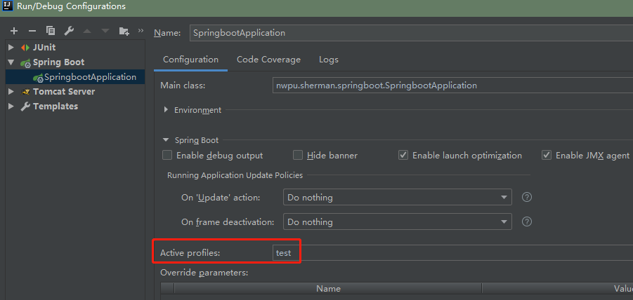

## 配置

[官方文档](https://docs.spring.io/spring-boot/docs/2.1.8.RELEASE/reference/html/boot-features-external-config.html)

### 1.1 Spring Boot全局配置文件
Spring Boot使用了一个全局的配置文件，配置文件名固定为**application**，可以有两种格式：properties和yml（或者yaml）。
这两个文件（application.properties，application.yml）都是存放在 **src/main/resources** 目录或者类路径 **/config** 下。

配置文件的作用：可以修改Spring Boot自动配置的默认值，这些默认值都是Spring Boot底层都给我们
配置好的。

[YAML](https://yaml.org/)（YAML Ain't Markup Language），以数据为中心，而不是将过多的关注点放在标签形式上，比json、xml等更加适合做配置文件：

* YAML A Markup Language：是一个标记语言
* YAML isn't Markup Language：不是一个标记语言

如果在application.properties和application.yml中都对相同属性（例如服务器的端口号等）进.properties中的配置属性，则**优先选择application.properties中的配置属性**。

### 1.2 YAML语法
YAML的基本语法形式：k:(**空格**)v：表示一对键值对（空格必须有），以空格的缩进来控制层级关系，只要左对齐的一列数据，都是属于同一层级，
属性和值都是大小写敏感的：
```yaml
server:
    port: 2571
```

YAML值的写法包括：
* 字面量：普通的值（数字、字符串、布尔）：字符串默认不需要加上单引号或者双引号，同时单、双引号都有特殊含义，要区别.properties中的
单、双引号：
```yaml
# 双引号：会转义特殊符号
name: "sherman \n tl"：输出: sherman 换行 tl

# 单引号：不会转义特殊符号，特殊符号最终只是一个普通的字符串数据
name: 'sherman \n tl': 输出: sherman \n tl
```
**注意**：

单双引号的区别，只在yml（yaml）文件中存在，在.properties文件中，单双引号都会转义！
* 对象（Map、属性和值）：k: v形式，在下一行写对象的属性和值的关系，注意缩进问题：
```yaml
friends:
    num: 1
    lastName: sherman
    age: 23
# 行内写法：
friends: {num: 1, lastName: sherman, age: 23}
```
* 数组（集合）：用- 值表示数组中的一个元素：
```yaml
pets:
  - cat
  - dog
  - pig
# 行内写法：
pets: [cat,dog,pig]
```

### 1.3 @ConfigurationProperties & yml语法
@ConfigurationProperties直接从主配置文件中读取配置的属性，可以通过**prefix**前缀指定对应的属性。

#### Person、Dog两个Bean对象
Person类中包含了Dog属性，以此来掩饰级联属性的package nwpu.sherman.springboot.bean;
```
/**
 * Person类，演示YAML语法和@ConfigurationProperties
 *
 * @author sherman
 */
@ConfigurationProperties(prefix = "person")
@Component
public class Person {
    private String name;
    private Integer age;
    /**
     * 注意这个属性值不要写成：isBoss，setter&getter方法会出错！
     */
    private Boolean boss;
    private Date birth;
    private Map<String, Object> hobbies;
    private List<Object> lang;
    private Dog dog;
    // setter & getter & toString
}

/**
 * Dog类，演示YAML语法使用
 *
 * @author sherman
 */
@Component
public class Dog {
    private String name;
    private Integer age;
    // setter & getter & toString
}
```

#### application.yml
在src/main/resources文件夹中新建一个：application.yml文件：
```yaml
server:
  port: 2571

# 配置Person&Dog类演示yaml语法
person:
  # 注意这里演示""中会发生转义，\t会被转义成水平制表符
  name: "sherman \t tl"
  age: 23
  boss: false
  birth: 1996/02/31
  hobbies:
    key1: value1
    key2: value2
  lang: [C++,Java,Python]
  dog:
    # 注意这里演示了''中不会发生转义
    name: 'dog\t11'
    age: 3
```
#### application.properties
```properties
# .properties文件中配置Person&Dog类演示
# 注意:
#   1. 相同属性在yml和.properties中都有配置的话，以.properties中文件为主
#   2. 单引号和双引号中的转义问题只在yml中存在，在.properties中无论是单双引号，都会转义
person.name="sherman \t lt"
person.age=22
person.boss=true
person.birth=1999/11/11
person.hobbies.key1=code
person.hobbies..key2=sleep
person.lang=c,c++,python
person.dog.name='dog\televen'
person.dog.age=10
```

#### 测试
在src/main/test中测试类：SpringbootApplicationTests：
```java
@RunWith(SpringRunner.class)
@SpringBootTest
public class SpringbootApplicationTests {
    @Autowired
    private Person person;

    @Test
    public void getPerson() {
        System.out.println(person);
    }
}
```
输出结果：

```shell
# yml配置测试结果：
Person{name='sherman   tl', age=23, boss=false, birth=Sat Mar 02 00:00:00 CST 1996,
hobbies={key1=value1, key2=value2}, lang=[C++, Java, Python], dog=Dog{name='dog\t11', age=3}}

# yml和properties共存情况下，测试结果：
Person{name='"sherman 	 lt"', age=22, boss=true, birth=Thu Nov 11 00:00:00 CST 1999, 
hobbies={key1=code, key2=sleep}, lang=[c, c++, python], dog=Dog{name=''dog	eleven'', age=10}}
```

### 1.4 @Value
@Value注解相当于<bean>标签中的value属性，可以从字面量/${key}、环境变量、配置文件/#{SpEL}中取值，它是Spring的注解：
```java
@Value("${spring.http.encoding.charset}")
private String name;
@Value("#{11 * 2}")
private Integer age;
@Value("true")
private Boolean boss;
```

@Value获取值和@ConfigurationProperties获取值比较：

| |  @ConfigurationProperties | @Value |
|---|--- |---|
|功能| 批量注入配置文件中的属性 | 一个一个指定  |
| 松散绑定语法|支持|不支持|
|SpEL|不支持|支持|
|JSR303数据校验|支持|不支持|
|复杂类型封装|支持|不支持|

总结：


- 如果只是在某个业务逻辑中获取一下配置文件中的某项值，使用@Value注解；
- 如果需要专门编写一个JavaBean来和配置文件进行映射，那么需要使用@ConfigurationProperties注解。

### 1.5 @PropertySource & @ImportResource

#### @PropertySource
如果对于一个Bean对象的类仅仅加入了@ConfigurationProperties注解，那么默认是从主配置文件中获取该类的对应属性，
随着需要配置的属性不断增加，会导致主配置文件冗长。为了解决这个问题，引入了@PropertySource注解来指定需要加载的
配置文件的位置:
* 新建一个Cat的Bean对象进行演示：
```java
/**
 * 演示@PropertySource和@Value注解取配置文件中的值
 *
 * @author sherman
 */
@Component
@PropertySource("classpath:config/cat.properties")
public class Cat {
    @Value("${name}")
    private String name;
    @Value("${age}")
    private int age;

    // setter & getter & toString
}
```
* 在src/main/resource/config下新建一个cat.properties配置文件：
```properties
name=tom
age=20
```

补充：

如果@PropertySource和@ConfigurationProperties两个注解指定的配置文件对某一个属性值都有指定，最终结果以
@ConfigurationProperties为准，因为它是主配置文件，src/main/resource/person.properties文件就是为了说明这一点。

#### @ImportResource
@ImportResource导入Spring的配置文件，让配置文件中的内容生效，这是基于xml配置版本，还是推荐使用注解版：
* 在src/main/resource/config目录下新建一个:beans.xml配置文件，在其中配置一个XmlObj的Bean对象
```xml
<?xml version="1.0" encoding="UTF-8"?>
<beans xmlns="http://www.springframework.org/schema/beans"
       xmlns:xsi="http://www.w3.org/2001/XMLSchema-instance"
       xsi:schemaLocation="http://www.springframework.org/schema/beans http://www.springframework.org/schema/beans/spring-beans.xsd">
<bean id="xmlObj" class="nwpu.sherman.springboot.bean.XmlObj"/>
</beans>
```
* 在配置类（可以是主配置类上）加入@ImportResource注解，指定xml配置文件位置，即可获取到该bean对象：
```java
@ImportResource("classpath:config/beans.xml")
@SpringBootApplication
public class SpringbootApplication {

    public static void main(String[] args) {
        SpringApplication.run(SpringbootApplication.class, args);
    }
}
```
* 直接使用@Autowired获取配置文件中注入的Bean：
```java
@RunWith(SpringJUnit4ClassRunner.class)
@SpringBootTest
public class SpringbootApplicationTests {
    /**
     * 从xml中拿到配置的beans
     */
    @Autowired
    private XmlObj xmlObj;
    @Test
    public void contextLoads() {
        System.out.println(xmlObj);
    }
}
```

但是Spring Boot更加推荐使用注解方式，具体来说就是使用：@Configuration和@Bean注解：
* 新建一个Bean对象的配置类:BeanConfig：
```java
/**
 * Bean对象的配置类，注解形式注入到IOC容器中
 *
 * @author sherman
 */
@Configuration
public class BeanConfig {

    @Bean
    public ConfigBean configBean() {
        return new ConfigBean();
    }
}
```
* 这样即可访问直接从容器中获取Bean对象：
```java
@RestController
public class TestController {
    @Autowired
    private ConfigBean configBean;

    /**
     * 使用@Configuration & @Bean注解给容器中注入组件
     */
    @RequestMapping("/test/config_bean")
    public String getConfigBean() {
        return configBean.toString();
    }

    @Autowired
    private ApplicationContext applicationContext;

    /**
     * 使用@ImportResource导入xml配置文件，并注入配置文件中的Bean对象
     */
    @RequestMapping("/test/xml_import_resource")
    @Autowired
    private String getXmlBbj() {
        return applicationContext.getBean("xmlObj").toString();
    }
}
```

### 1.6 配置文件中占位符
配置文件中可以使用占位符，占位符可以表示随机数以及属性配置：

```properties
${random.value}
${random.int}
${random.long}
${random.int(10)}
${random.int[1024,65535]}
# 如果之前有配置过person.name就是用person，否则使用sherman
${person.name:sherman}
```

### 1.7 Profile

#### properties文件配置
Profile是Spring对不同环境提供不同配置功能的支持，可以通过激活、指定参数等方式快速切换环境：
* 多profile文件形式：在类路径下简历多个properties配置文件，命名格式为application-{profile}.properties：
    * application-dev.properties：
    ```properties
    # profile —— dev
    server.port=25711
    ```
    * application-test.properties:
    ```properties
    server.port=25712
    ```
* 在application.properties指定激活哪个profile：
```properties
# 激活profile环境dev
spring.profiles.active=dev
```

#### yml文件配置
多profile文档快方式：如果使用yaml方式配置，则可以使用多文档块方式，在yaml中---会将上下两个部分分成不同的Document段，
不同的Document块就类似于不同的profile文件：
```yaml
server:
  port: 2571
spring:
  profiles:
    active: dev # 指定激活的profile环境
--- # ---将所有配置分割成多个profile区（Document区）

spring:
  profiles: dev
server:
  port: 25712

---
spring:
  profiles: test
server:
  port: 25711
```

#### 激活方式
* 在application.properties或者application.yml文件中通过： **spring.profiles.active=${profile}** 进行激活
* 命令行方式激活：
```shell
java -jar ${project_name}.jar --spring.profiles.active=${profile}
```
如果实在IDEA中，只需要在Program argument中指定：--spring.profiles.active=${profile}，或者直接：


* JVM参数方式激活：在VM options中指定参数：-Dspring.profiles.active=${profile}

### 1.8 配置文件加载位置
Spring Boot启动时会扫描一下位置的application.properties/yml文件作为Spring Boot的默认配置文件：
* file:./config/
* file:./
* classpath:/config/
* classpath:/

以上是按照 **优先级从高到低** 的顺序，所有位置的文件 **都会被加载** ，如果出现相同的配置，
**高优先级配置内容会覆盖低优先级配置内容，同时它们之间会形成互补配置**。

项目打包后，需要我们修改少量参数运维重新启动时，在启动项目时使用命令行参数形式指定**spring.config.location**参数
来改变默认的配置文件位置：
```shell
java -jar ${project_name}.jar --spring.config.location=G:/application.properties
```
注意spring.config.location这个参数不是在项目的application.properties中使用的，而是在命令行中指定本地的项目配置文件。

**自定义配置文件加载位置:star:**：

Spring Boot可以通过**spring.config.localtion**自定义配置文件的 [加载位置](https://docs.spring.io/spring-boot/docs/2.1.8.RELEASE/reference/html/boot-features-external-config.html#boot-features-external-config-application-property-files) ，注意：
- 指定其它自定义配置文件的顺序和实际加载优先级是**相反**的，并且是在默认四个默认加载位置之前加载的，具体来说：
- 自定义配置文件必须以 **/** 结尾

如果通过spring.config.location指定了两个加载位置：
```properties
spring.config.location = classpath:/location1/,file:./location2/
```
那么完整的加载顺序（优先级从高到低）为：
- file:./location2/
- classpath:/location1/
- file:./config/
- file:./
- classpath:/config/
- classpath:/

### 1.9 外部配置加载顺序
Spring Boot除了内部加载配置外，还支持外部配置文件加载，以下是主要的外部配置加载，优先级从高到低，高优先级覆盖低优先级，
所有配置会形成互补配置。
* 命令行参数:star:：形式以--配置项=值，多个配置用空格分开：
```shell
java -jar {project_name.jar} --server.port=8088 --server.context-path=/boot
```
* 来自java:comp/env的JNDI属性
* Java系统属性（System.getProperties()）
* 操作系统环境变量
* RandomValuePropertySource配置的random.*属性值
* jar包外部的application-{profile}.properties/yml配置文件:star:
* jar包内部的application-{profile}.properties/yml配置文件:star:
* jar包外部的application.properties/yml配置文件:star:
* jar包内部的application.properties/yml配置文件:star:
* @Configuration注解类上的@PropertySource
* 通过SpringApplication.setDefaultProperties指定的默认属性

注意上述四个jar包形式外部文件配置遵循：优先加载profile，jar包从外向内查找。

### 1.10 自动配置原理

#### 自动配置原理：
* Spring Boot启动时候就加载主配置类，开启了自动配置功能@EnableAutoConfiguration，总的来说它有两个功能：
    * 将主配置类所在包及其所有子包中的组件都加入到IOC容器中；
    * 通过getCandidateConfigurations、SpringFactoriesLoader.loadFactoryNames等方法，扫描类路径下
    META-INF/spring.factories，把这些扫描到的文件内容包装成properties对象，最后从properties中获取到
    EnableAutoConfiguration.class类（类名）对应的值，然后把它们添加到IOC容器中;
* 类路径下的META-INF/spring.factories中每一个这样的xxxAutoConfiguration类都是容器中的一个组件，都将加入
到容器中，用他们来做自动配置。

#### 以HttpEncodingAutoConfiguration为例
* HttpEncodingAutoConfiguration类的注解信息：
```java
// 表示这是一个配置类，可以给容器中添加组件
@Configuration
// 启动指定类的ConfigurationProperties功能，即将配置文件中对应的值和
// HttpEncodingProperties的值绑定起来，并把其加入到IOC容器中
@EnableConfigurationProperties(HttpProperties.class)
// 它依赖Spring底层@Conditional注解，根据不同的条件，如果满足指定条件，整个配置类配置才会生效，
// 如果当前应用是web应用，则配置类生效
@ConditionalOnWebApplication(type = ConditionalOnWebApplication.Type.SERVLET)
// 判断当前项目有没有这个类，SpringMVC中进行乱码问题解决的过滤器
@ConditionalOnClass(CharacterEncodingFilter.class)
// 判断配置文件中是否存在某个配置——spring.http.encoding，matchIfMissing=true，
// 即使不存在，也会返回true
@ConditionalOnProperty(prefix = "spring.http.encoding", value = "enabled", matchIfMissing = true)
public class HttpEncodingAutoConfiguration {
    // 该properties以及和Spring Boot中的配置文件绑定了
    private final HttpProperties.Encoding properties;
    
    // 只要一个有参构造器情况下，参数的值就会从容器中获取
    public HttpEncodingAutoConfiguration(HttpProperties properties) {
        this.properties = properties.getEncoding();
    }
    
    // 给容器中添加一个组件，这个组件中的某些值需要从properties中获取
    @Bean
    @ConditionalOnMissingBean
    public CharacterEncodingFilter characterEncodingFilter() {
        CharacterEncodingFilter filter = new OrderedCharacterEncodingFilter();
        filter.setEncoding(this.properties.getCharset().name());
        filter.setForceRequestEncoding(this.properties.shouldForce(Type.REQUEST));
        filter.setForceResponseEncoding(this.properties.shouldForce(Type.RESPONSE));
        return filter;
    }
    // ...
}
```

自动配置类实际上就是根据当前不同的条件进行判断，来决定这个配置类是否生效。一旦这个配置类生效，这个配置类
就会给容器中添加各种组件，这些组件的属性是从properties中获取，这些类中的每一个属性又是和配置文件绑定的.

#### Spring Boot自动配置精髓
* Spring Boot在启动时候会加载大量的自动配置类；
* 我们看我们需要的功能在Spring Boot中默认有没有相应的自动配置类；
* 再查看这些自动配置类中到底配置了哪些组件，只有我们需要用的组件存在，就不需要再来配置这些组件了；
* 给容器中自动配置类添加组件的时候，会从properties类中获取某些属性，我们就可以在配置文件中指定这些属性的值；

### 1.11 @ConditionalXxx
@Conditional注解：Spring注解版中原生的，Spring Boot对该注解进行了拓展，只有在@Conditional指定的条件成立时，
才给容器中添加组件，配置里面的所有内容才会生效：

| @Conditional拓展注解| 作用（判断是否满足当前指定条件） |
|---|---|
|@ConditionalOnJava |系统的Java版本符合要求  |
|@ConditionalOnBean|容器中存在指定的Bean|
|@ConditionalOnMissingMissingBean|系统中不存在指定的Bean|
|@ConditionalOnExpression|满足SpEL表达式|
|@ConditionalOnClass|系统中有指定的class|
|@ConditionalOnMissingClass|系统中不存在指定的class|
|@ConditionalOnSingleCandidate|系统中只有一个指定的Bean或者该Bean是首选的|
|@ConditionalOnProperty|系统中指定的属性是否有指定的值|
|@ConditionalOnResource|类路径下是否存在指定资源文件|
