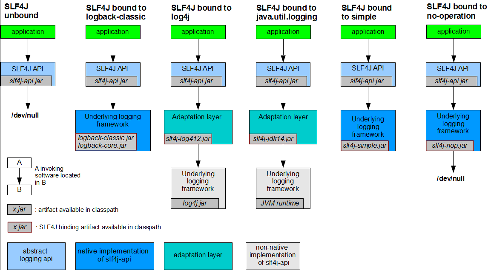
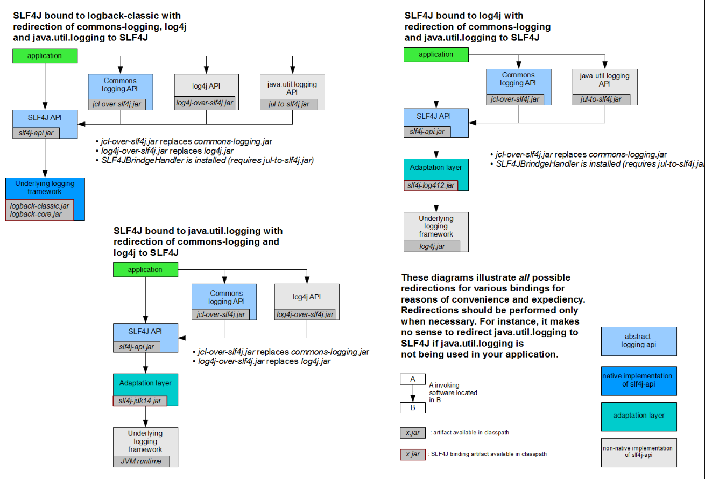
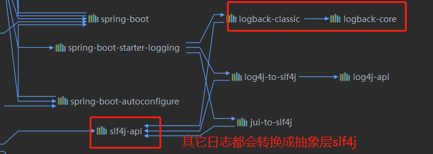

## 日志

[官方文档](https://docs.spring.io/spring-boot/docs/2.1.8.RELEASE/reference/html/boot-features-logging.html)
### Spring Boot简介
Spring Boot底层日志实现是开放的，默认支持Java Util Logging、Log4J2和Logback，默认情况下，如果使用的是启动器，
那么导入的是Logback日志框架。

### SLF4J使用
* 如何在系统中使用SLF4J：以后开发时候，日志记录方法的调用，不应该直接调用日志的实现类，而是调用日志抽象层里面的方法。如果使用默认场景启动器，
就会导入SLF4J相关依赖：
```java
@Test
public void getLog() {
    Logger logger = LoggerFactory.getLogger(SpringbootApplicationTests.class);
    logger.error("######log######");
}
```
* SLF4J图示说明：



#### 其它日志框架统一转换成SLF4J
每一个日志的实现框架都有自己的配置文件，使用SLF4J，配置文件还是要做成日志实现框架自己本身的配置文件。

某个应用可能使用了其它框架，但是其它框架并没有使用SLF4J的日志系统，例如：Spring（commons-logging）、
Hibernate（jboss-logging）、MyBatis，现在希望统一日志记录，即使是别的框架也能统一使用SLF4J进行输出：
某个应用可能使用了其它框架，但是其它框架并没有使用SLF4J的日志系统，例如：Spring（commons-logging）、Hibernate（jboss-logging）、MyBatis，现在希望统一日志记录，即使是别的框架也能一起统一使用SLF4J进行输出：



**如何统一使用SLF4J**：

* 将系统中其它日志系统排除出去
* 用中间包来替换原有的日志框架
* 导入SLF4J的其它实现

Spring Boot底层把其它日志框架转换成slf4j框架，然后使用logback方式实现并输出：



#### 日志使用
Spring Boot默认配置好了日志，日志的五个级别：error -> warn -> info -> debug - > trace，并且可以通过logging.file或者logging.path指定日志的输出
位置（两个选项选择一个即可，推荐使用path）：
```properties
logging.path=my.log
```

**日志输出格式**：
- %d：表示日期时间
- %thread：表示线程名
- %-5levle：日志级别，左对齐，宽度为5个字符
- %logger{50}：表示logger名字最长为50个字符，否则按照据点分割
- %msg：日志消息
- %n：换行符

**在application.properties中配置**：
```properties
# ===============================日志配置===============================
logging.level.nwpu.sherman=trace
logging.path=./log
# 更改输出到console中的日志格式
logging.pattern.console=%d{yyyy-MM-dd HH:mm:ss.SSS} [%thread] %-5level %logger{50} - %msg%n
# 更改输出到file中的日志格式
logging.pattern.file=%d{yyyy-MM-dd} [%thread] %-5level %logger{50} === %msg%n
```

**自定义日志配置文件**：
Spring Boot底层支持三种日志JDK Logging、Log4J2、Logback，三种日志都有对应默认的日志配置文件：

| Logging System|Customization  |
|---|---|
| Logback |logback-spring.xml, logback-spring.grovy, logback.xml or logback.groovy  |
| Log4j2|log4j2-spring.xml or log4j.xml |
|JDK(Java Util Logging) | logging.properties|

推荐加上 **-spring** 后缀名，例如：logback.xml直接被日志框架是别别别，而logback-spring.xml日志框架
不会直接加载日志的配置项，由Spring Boot加载。

**以Logback自定义配置文件为例**：

logback官网 [示例](https://wiki.base22.com/btg/how-to-setup-slf4j-and-logback-in-a-web-app-fast-35488048.html)

在src/main/resource下新建一个logback-spring.xml文件：
```xml
<?xml version="1.0" encoding="UTF-8"?>
<configuration>

    <property name="LOG_HOME" value="./logback_log"/>
    <property name="appName" value="springboot"/>

    <appender name="console" class="ch.qos.logback.core.ConsoleAppender">
        <layout class="ch.qos.logback.classic.PatternLayout">
            <springProfile name="dev">
                <Pattern>%d{HH:mm:ss.SSS}-->[%thread] %-5level %logger{36} - %msg%n</Pattern>
            </springProfile>
            <springProfile name="prod">
                <Pattern>%d{HH:mm:ss.SSS}==>[%thread] %-5level %logger{36} - %msg%n</Pattern>
            </springProfile>
        </layout>
    </appender>

    <appender name="file" class="ch.qos.logback.core.rolling.RollingFileAppender">
        <!-- 指定文件名称 -->
        <springProfile name="dev">
            <file>${LOG_HOME}/${appName}-dev.log</file>
        </springProfile>
        <springProfile name="prod">
            <file>${LOG_HOME}/${appName}-prod.log</file>
        </springProfile>

        <layout class="ch.qos.logback.classic.PatternLayout">
            <springProfile name="dev">
                <Pattern>%d{HH:mm:ss.SSS}-->[%thread] %-5level %logger{36} - %msg%n</Pattern>
            </springProfile>
            <springProfile name="prod">
                <Pattern>%d{HH:mm:ss.SSS}==>[%thread] %-5level %logger{36} - %msg%n</Pattern>
            </springProfile>
        </layout>

        <!-- 最常用的滚动策略，它根据时间来指定滚动策略 -->
        <rollingPolicy class="ch.qos.logback.core.rolling.TimeBasedRollingPolicy">
            <fileNamePattern>${LOG_HOME}/${appName}.%d{yyyy-MM-dd-HH-mm}.log</fileNamePattern>
            <maxHistory>10</maxHistory>
            <totalSizeCap>100KB</totalSizeCap>
        </rollingPolicy>
    </appender>
    <root level="INFO">
        <appender-ref ref="console"/>
        <appender-ref ref="file"/>
    </root>
</configuration>
```