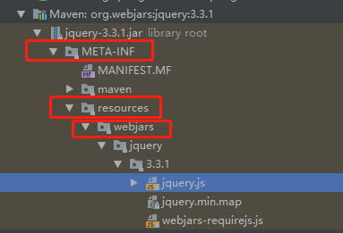
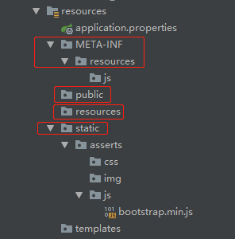
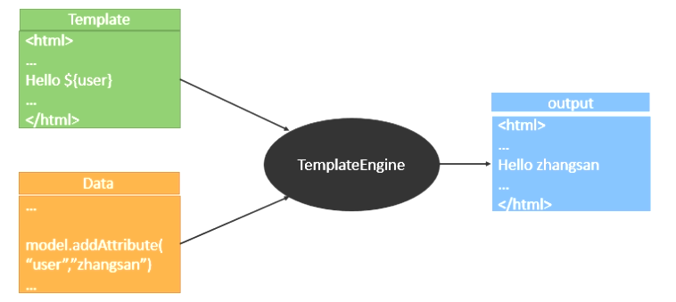

## Spring Boot和Web开发

### 4.1 Web开发简介
使用Spring Boot开发Web应用步骤：
- 创建Spring Boot应用，选中我们需要的模块
- Spring Boot已经将默认这些场景配置好了，我们只需要在配置文件中指定少量的配置就可以运行起来
- 自己编写业务代码

自动配置原理：

这个场景Spring Boot帮助我们配置了什么，能不能修改，能修改哪些配置，能不能拓展？
- xxxAutoConfiguration：帮助我们给容器中自动配置组件
- @ConfigurationProperties：配置类来封装配置文件的内容

### 4.2 Spring Boot对静态资源的映射规则
Spring Boot对静态资源的映射通过WebMvcAutoConfiguration这个自动配置类完成：
```java
@Configuration
@ConditionalOnWebApplication(type = Type.SERVLET)
@ConditionalOnClass({ Servlet.class, DispatcherServlet.class, WebMvcConfigurer.class })
@ConditionalOnMissingBean(WebMvcConfigurationSupport.class)
@AutoConfigureOrder(Ordered.HIGHEST_PRECEDENCE + 10)
@AutoConfigureAfter({ DispatcherServletAutoConfiguration.class, TaskExecutionAutoConfiguration.class,
		ValidationAutoConfiguration.class })
public class WebMvcAutoConfiguration {
    @Configuration
    @Import(EnableWebMvcConfiguration.class)
    // 这里引入了ResourceProperties配置类
    @EnableConfigurationProperties({ WebMvcProperties.class, ResourceProperties.class })
    @Order(0)
    public static class WebMvcAutoConfigurationAdapter implements WebMvcConfigurer {
        // 配置MVC需要的bean
        // InternalResourceViewResolver
        // BeanNameViewResolver
        // ConditionalOnMissingBean
        // LocaleResolver
        // ...
    }
}

@ConfigurationProperties(prefix = "spring.resources", ignoreUnknownFields = false)
public class ResourceProperties {
    
    private static final String[] CLASSPATH_RESOURCE_LOCATIONS = { "classpath:/META-INF/resources/",
            "classpath:/resources/", "classpath:/static/", "classpath:/public/" };
    
    /**
     * Locations of static resources. Defaults to classpath:[/META-INF/resources/,
     * /resources/, /static/, /public/].
     */
    private String[] staticLocations = CLASSPATH_RESOURCE_LOCATIONS;
    
    /**
     * Whether to enable default resource handling.
     */
    private boolean addMappings = true;
    
    private final Chain chain = new Chain();
    
    private final Cache cache = new Cache();
    
    // ... 
}
```

- 所有的[webjars](https://www.webjars.org/)，都会去classpath:/META-INF/resources/webjars/目录下寻找资源，webjars是以jar包像是引入静态资源，先引入jquery的依赖：
```xml
<!-- 加入jquery webjar的maven依赖 -->
<dependency>
    <groupId>org.webjars</groupId>
    <artifactId>jquery</artifactId>
    <version>3.3.1</version>
</dependency>
```
可以直接通过浏览器访问**localhost:8080/webjars/jquery/3.3.1/jquery.js**：



- "/**"访问当前项目的任何资源（静态资源的文件夹）：
```java
@ConfigurationProperties(prefix = "spring.resources", ignoreUnknownFields = false)
public class ResourceProperties {

	private static final String[] CLASSPATH_RESOURCE_LOCATIONS = { "classpath:/META-INF/resources/",
			"classpath:/resources/", "classpath:/static/", "classpath:/public/" };
			// ...
}			
```

Spring Boot提供静态资源的文件夹包括：
- classpath:/META-INF/resources/
- classpath:/resources/
- classpath:/static/
- classpath:/public/



通过浏览器访问时：以上述文件夹为根路径，例如要访问上述的bootstrap.min.js文件，浏览器输入：**http://localhost:8080/asserts/js/bootstrap.min.js**

- 欢迎页面：静态资源文件夹下的所有index.html页面，被 **/\*\*** 映射，例如localhost:8080/ ===> 找到index页面
- 所有的**/favicon.ico都是在静态资源文件夹下找到

同时也能自定义配置Spring Boot的静态资源文件夹的位置：
```properties
spring.resources.static-locations=classpath:/hello/,classpath:/world/
```
## 4.3 模板引擎


SpringBoot推荐的模板引擎，语法更加简单，功能更加强大：
- 引入[thymeleaf](https://www.thymeleaf.org/index.html)模板引擎
```xml
<dependency>
    <groupId>org.springframework.boot</groupId>
    <artifactId>spring-boot-starter-thymeleaf</artifactId>
</dependency>
```
- 切换thymeleaf默认版本
```xml
<properties>
    <java.version>1.8</java.version>
    <!-- 这两个版本的对应关系最好对应上，可以在Maven的中央仓库中都选择最新版本 -->
    <thymeleaf.version>3.0.11.RELEASE</thymeleaf.version>
    <thymeleaf-layout-dialect.version>2.4.1</thymeleaf-layout-dialect.version>
</properties>
```
在Spring Boot官方文档thymeleaf章节中找到对应的thymeleaf需要的配置，当前Spring Boot版本2.1.8为例，[官方文档](https://docs.spring.io/spring-boot/docs/2.1.8.RELEASE/reference/html/howto-hotswapping.html#howto-reload-thymeleaf-content)中提到将spring.thymeleaf.cache设置为false。

如果上述配置之后，仍然不能访问templates路径下的文件，推荐本地Maven的repository目录清空，重新启动程序加载Maven依赖。

## 4.4 thymeleaf语法
ThymeleafProperties类中封装了thymeleaf的默认规则：
```java
@ConfigurationProperties(prefix = "spring.thymeleaf")
public class ThymeleafProperties {

	private static final Charset DEFAULT_ENCODING = StandardCharsets.UTF_8;

	// 只要把HTML页面放在classpath:/templates/目录下，thymeleaf就能够自动渲染
	public static final String DEFAULT_PREFIX = "classpath:/templates/";

	public static final String DEFAULT_SUFFIX = ".html";
	// ...
}	
```
- th: 任意html属性：来替换原生属性，官方文档提供如下：

| Feature  | describe   | Attributes   |
|---|---|---|
| Fragment inclusion  | jsp:include   | th:insert th:replace   |
| Fragment iteration  | c:foreach   | th:each   |
| Condition evaluation  | c:if   | th:if th:unless th:switch th:case  |
| Fragment inclusion  | jsp:include   | th:insert   |
| Local variable definition  | c:set | th:object th:with |
| General attribute modification | 支持prepend和append | th:attr th:attrprepend th:attrappend |
| Specific attribute modification  | 修改定制属性的值   | th:value th:href th:src ... |
| Text(tag body modification)  | 修改标签内容   | th:text th:utext   |
| Fragment specification  | 片段声明 | th:fragment |
| Fragment removal  | 片段删除 | th:remove |

* 表达式语法
```shell
# Simple expressions:
# 获取变量值；OGNL
    1）、获取对象的属性、调用方法
    2）、获取内置对象
        #ctx : the context object.
        #vars: the context variables.
        #locale : the context locale.
        #request : (only in Web Contexts) the HttpServletRequest object.
        #response : (only in Web Contexts) the HttpServletResponse object.
        #session : (only in Web Contexts) the HttpSession object.
        #servletContext : (only in Web Contexts) the ServletContext object.
    3）、内置的工具对象
        #execInfo : information about the template being processed.
        #messages : methods for obtaining externalized messages inside variables expressions, in the same way as they would be obtained using #{…} syntax.
        #uris : methods for escaping parts of URLs/URIs
        #conversions : methods for executing the configured conversion service (if any).
        #dates : methods for java.util.Date objects: formatting, component extraction, etc.
        #calendars : analogous to #dates , but for java.util.Calendar objects.
        #numbers : methods for formatting numeric objects.
        #strings : methods for String objects: contains, startsWith, prepending/appending, etc.
        #objects : methods for objects in general.
        #bools : methods for boolean evaluation.
        #arrays : methods for arrays.
        #lists : methods for lists.
        #sets : methods for sets.
        #maps : methods for maps.
        #aggregates : methods for creating aggregates on arrays or collections.
        #ids : methods for dealing with id attributes that might be repeated (for example, as a result of an iteration)
Variable Expressions: ${...}
# 选择表达式，类似于${...}，但是有一个补充功能：
    <div th:object="${session.user}">
    <p>Name: <span th:text="*{firstName}">Sebastian</span>.</p>
    <p>Surname: <span th:text="*{lastName}">Pepper</span>.</p>
    <p>Nationality: <span th:text="*{nationality}">Saturn</span>.</p>
    </div>
Selection Variable Expressions: *{...}
# 获取国际化内容
Message Expressions: #{...}
# 定义URL链接：
    <!-- Will produce '/gtvg/order/details?orderId=3' (plus rewriting) -->
    <a href="details.html" th:href="@{/order/details(orderId=${o.id},execType='FAST')}">view</a>
Link URL Expressions: @{...}
# 片段引用表达式
Fragment Expressions: ~{...}
# Literals
Text literals: 'one text' , 'Another one!' ,…
Number literals: 0 , 34 , 3.0 , 12.3 ,…
Boolean literals: true , false
Null literal: null
Literal tokens: one , sometext , main ,…

# Text operations:
String concatenation: +
Literal substitutions: |The name is ${name}|
Arithmetic operations:
Binary operators: + , - , * , / , %
Minus sign (unary operator): -

# Boolean operations:
Binary operators: and , or
Boolean negation (unary operator): ! , not

# Comparisons and equality:
Comparators: > , < , >= , <= ( gt , lt , ge , le )
Equality operators: == , != ( eq , ne )
Conditional operators:
If-then: (if) ? (then)
If-then-else: (if) ? (then) : (else)
Default: (value) ?: (defaultvalue)

# Special tokens:
No-Operation: _
```
举例：

```java
@Controller
public class HelloController {
    @RequestMapping("/success")
    // 默认去classpath:/templates/中寻找success.html进行渲染
    public String successController(Map<String, Object> maps){
        maps.put("user", Arrays.asList("<h1>ZhangSan</h1>", "<h1>LiSi</h1>"));
        maps.put("hello", "<h1>你好</h1>");
        return "success";
    }
}
```
success.html
```html
<!DOCTYPE html>
<html lang="en" xmlns:th="http://www.thymeleaf.org">
<head>
    <meta charset="UTF-8">
    <title>Title</title>
</head>
<body>
<h1>success</h1>
<div th:text="${#locale.country}">这是默认内容</div>
<div th:utext="${hello}">hello</div>
<div th:text="${hello}">hello</div>
<hr/>

<!-- th:each每次遍历时候都会生成当前这个标签：3个h4标签-->
<h4 th:text="${user}" th:each="user:${user}"></h4>
<hr/>
<h4>
    <!--[[]]: 不会进行转义，输出原始字符串，相当于th:utext-->
    <span th:each="user:${user}"> [[${user}]] </span>
</h4>
<h4>
    <!--[()]: 会进行转义，相当于th:text-->
    <span th:each="user:${user}"> [(${user})] </span>
</h4>
</body>
</html>
```