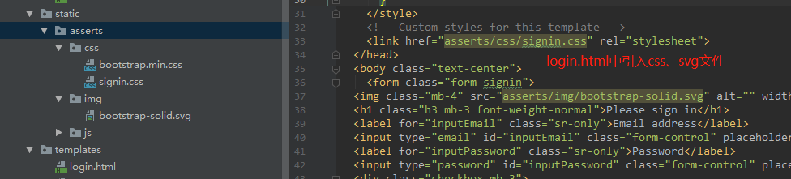
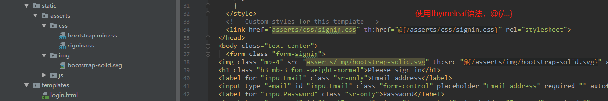
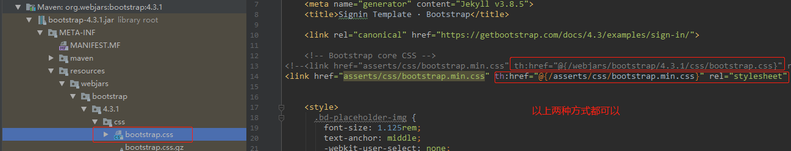

## Restful-crud

### 5.1 引入资源
**将多个路径映射到同一页面的三种方法**

- 使用@RequestMapping注解：
```java
@Controller
public class HelloController {
    @RequestMapping({"/", "/index", "/login"})
    public String loginController(){
        return "login";
    }
}
```

- 使用配置类**实现WebMvcConfigurer接口**，并重写addViewControllers()方法：
```java

@Configuration
public class MyConfig implements WebMvcConfigurer {
   @Override
   public void addViewControllers(ViewControllerRegistry registry) {
       registry.addViewController("/").setViewName("login");
       registry.addViewController("/index").setViewName("login");
       registry.addViewController("/login").setViewName("login");
   }
}
```

- 使用配置类，在配置类中将WebMvcConfigurer对象注入到容器中：
```java
@Configuration
public class MyConfig{
    @Bean
    public WebMvcConfigurer webMvcConfigurer() {
        return new WebMvcConfigurer() {
            @Override
            public void addViewControllers(ViewControllerRegistry registry) {
                registry.addViewController("/").setViewName("login");
                registry.addViewController("/index").setViewName("login");
                registry.addViewController("/login").setViewName("login");
            }
        };
    }
}
```

**在html中引入css、img、js等资源两种方式**

- 不使用thymeleaf，直接引入（没有修改默认的**CLASSPATH_RESOURCE_LOCATIONS**的值情况下）



因为默认的**CLASSPATH_RESOURCE_LOCATIONS**中包含了"classpath:/static/"路径，因此引用是直接写asserts/...，最终就会拼接成：classpath:/static/asserts/...
- 使用thymeleaf模板引擎
    - 先导入bootstrap依赖：
    ```xml
    <!-- bootstrap依赖 -->
    <dependency>
        <groupId>org.webjars</groupId>
        <artifactId>bootstrap</artifactId>
        <version>4.3.1</version>
    </dependency>
    ```
    - 使用thymeleaf模板引擎，在html中加入thymeleaf的名称空间：
    

    
注意第一步中导入了bootstrap依赖，如果html中没有提供自定义的bootstrap.css文件，也可以引入Webjars下的bootstrap.css依赖：



### 5.2 国际化

**在SpringMVC中国际化的流程**
- 编写国际化配置文件
- 使用ResourceBundleMessageSource管理国际化资源文件
- 在（jsp）页面中使用fmt:message取出国际化内容

**在Spring Boot中国际化流程**
- 编写配置文件，IDEA中可以很方便的Resource Bundle视图下编写
- Spring Boot已经自动配置好了管理国际化资源文件的组件：
```java
@Configuration
@ConditionalOnMissingBean(value = MessageSource.class, search = SearchStrategy.CURRENT)
@AutoConfigureOrder(Ordered.HIGHEST_PRECEDENCE)
@Conditional(ResourceBundleCondition.class)
@EnableConfigurationProperties
public class MessageSourceAutoConfiguration {

    private static final Resource[] NO_RESOURCES = {};
    
    @Bean
    @ConfigurationProperties(prefix = "spring.messages")
    public MessageSourceProperties messageSourceProperties() {
        return new MessageSourceProperties();
    }
    
    @Bean
    public MessageSource messageSource(MessageSourceProperties properties) {
        ResourceBundleMessageSource messageSource = new ResourceBundleMessageSource();
        if (StringUtils.hasText(properties.getBasename())) {
            messageSource.setBasenames(StringUtils
                    .commaDelimitedListToStringArray(StringUtils.trimAllWhitespace(properties.getBasename())));
        }
        if (properties.getEncoding() != null) {
            messageSource.setDefaultEncoding(properties.getEncoding().name());
        }
        messageSource.setFallbackToSystemLocale(properties.isFallbackToSystemLocale());
        Duration cacheDuration = properties.getCacheDuration();
        if (cacheDuration != null) {
            messageSource.setCacheMillis(cacheDuration.toMillis());
        }
        messageSource.setAlwaysUseMessageFormat(properties.isAlwaysUseMessageFormat());
        messageSource.setUseCodeAsDefaultMessage(properties.isUseCodeAsDefaultMessage());
        return messageSource;
    }
    // ...
}

// MessageSourceProperties类中重要的（默认）属性
public class MessageSourceProperties {

    /**
     * Comma-separated list of basenames (essentially a fully-qualified classpath
     * location), each following the ResourceBundle convention with relaxed support for
     * slash based locations. If it doesn't contain a package qualifier (such as
     * "org.mypackage"), it will be resolved from the classpath root.
     */
    // 我们默认的国际化配置文件可以直接放在类路径下，就叫message.properties就可直接使用，但是不推荐
    // 可以通过spring.messages.basename来进行设置
    private String basename = "messages";
    
    /**
     * Message bundles encoding.
     */
    private Charset encoding = StandardCharsets.UTF_8;
    
    /**
     * Loaded resource bundle files cache duration. When not set, bundles are cached
     * forever. If a duration suffix is not specified, seconds will be used.
     */
    @DurationUnit(ChronoUnit.SECONDS)
    private Duration cacheDuration;
    // ...
}
```
- 在application.properties中进行国际化文件配置：
```shell
# 国际化文件配置
spring.messages.basename=i18n/sign
```
- 在页面中获取国际化的值：通过thymeleaf模板引擎中 **#{}** 就是为了获取国际化的值
```xml
<h1 class="h3 mb-3 font-weight-normal" th:text="#{signin.tip}">Please sign in</h1>

<input type="email" id="inputEmail" class="form-control" placeholder="Email address" th:placeholder="#{signin.username}" required="" autofocus="">
<input type="password" id="inputPassword" class="form-control" placeholder="Password" th:placeholder="#{signin.password}" required="">

<!-- 注意input标签没有对应的th:input，只能使用行内语法 -->
<label>
	<input type="checkbox" value="remember-me"/> [[#{signin.remember}]]
</label>

<button class="btn btn-lg btn-primary btn-block" type="submit" th:text="#{signin.signin}">Sign in</button>
```

**优化：根据用户点击浏览器中语言设置自动切换国际化**
- 原理：国家化是根据国际化Locale（区域信息对象）来进行语言选择，Spring Boot自动配置了LocaleResolver来获取区域信息对象，具体来说：如果没有提供区域信息对象，它就会使用默认的区域信息对象，
否则会使用自定义的区域信息对象。获取自定义区域信息对象的方法是从请求头中获取。因此我们可以通过点击浏览器上面的语言选项，将区域信息对象放在request请求头中，让LocaleResolver来获取：
```java
@Bean
@ConditionalOnMissingBean
@ConditionalOnProperty(prefix = "spring.mvc", name = "locale")
public LocaleResolver localeResolver() {
    if (this.mvcProperties.getLocaleResolver() == WebMvcProperties.LocaleResolver.FIXED) {
        return new FixedLocaleResolver(this.mvcProperties.getLocale());
    }
    AcceptHeaderLocaleResolver localeResolver = new AcceptHeaderLocaleResolver();
    localeResolver.setDefaultLocale(this.mvcProperties.getLocale());
    return localeResolver;
}

// 从请求头中获取区域信息对象
@Override
public Locale resolveLocale(HttpServletRequest request) {
    Locale defaultLocale = getDefaultLocale();
    if (defaultLocale != null && request.getHeader("Accept-Language") == null) {
        return defaultLocale;
    }
    Locale requestLocale = request.getLocale();
    List<Locale> supportedLocales = getSupportedLocales();
    if (supportedLocales.isEmpty() || supportedLocales.contains(requestLocale)) {
        return requestLocale;
    }
    Locale supportedLocale = findSupportedLocale(request, supportedLocales);
    if (supportedLocale != null) {
        return supportedLocale;
    }
    return (defaultLocale != null ? defaultLocale : requestLocale);
}
```

- 在超链接上携带区域信息：
```html
<!-- 注意这里不要写成@{/signin.html(lang='zh_CN')}，不需要拓展名.html-->
<a class="btn btn-sm" th:href="@{/signin(lang='zh_CN')}">中文</a>
<a class="btn btn-sm" th:href="@{/signin(lang='en_US')}">English</a>
```

- 创建一个自定义的LocaleResolver，并将其注入到Spring Boot容器中：
```java	
package nwpu.sherman.restfulcrud.conponent;
// import ...
public class MyLocaleResolver implements LocaleResolver {
    @Override
    public Locale resolveLocale(HttpServletRequest request) {
        String lang = request.getParameter("lang");
        Locale locale = Locale.getDefault();
        if (!StringUtils.isEmpty(lang)){
            String[] s = lang.split("_");
            locale = new Locale(s[0], s[1]);
        }
        return locale;
    }
    
    @Override
    public void setLocale(HttpServletRequest request, HttpServletResponse response, Locale locale) {
    }
}

// 在配置类中将该区域信息解析器注入到容器中：
package nwpu.sherman.restfulcrud.config;
// import ...
@Configuration
public class MyConfig implements WebMvcConfigurer {
    /**
     * 向容器中注入一个LocaleResolver对象
     */
    @Bean
    public LocaleResolver localeResolver(){
        return new MyLocaleResolver();
    }
}
```
### 5.3 登录&拦截器
**登录**

- 在表单中加入登录请求的路径以及对应的请求方法，同时为登录失败添加错误提示：
```html
<form class="form-signin" th:action="@{/user/login}" th:method="post">
<!-- 错误提示 -->
 <p style="color: red" th:text="${msg}" th:if="${not #strings.isEmpty(msg)}"></p>
```

- LoginController
```java
@Controller
public class LoginController {

    //@RequestMapping(value = "/user/login", method = RequestMethod.POST)
    /*
    @GetMapping
    @PutMapping
    @DeleteMapping
    */
    @PostMapping(value = "/user/login")
    public String loginController(@RequestParam("username") String username,
                                  @RequestParam("password") String password,
                                  Map<String, Object> maps) {
        if (!StringUtils.isEmpty(username) && "123456".equals(password))
            return "dashboard";
        else {
            maps.put("msg", "用户名或者密码不正确");
            return "signin";
        }
    }
}
```
- 注意事项：
    - thymeleaf默认时开启缓存的，因此需要禁用缓存，防止更改代码页面并没有及时显示，或者通过CTRL+F9重新编译
    - 防止表单重复提交：在loginController()方法中，是直接return "dashboard"的，这将导致重复提交问题，给服务器带来很大压力，可以使用重定向方式解决:
```java
@Controller
public class LoginController {
    @PostMapping(value = "/user/login")
    public String loginController(@RequestParam("username") String username,
                                  @RequestParam("password") String password,
                                  Map<String, Object> maps) {
        if (!StringUtils.isEmpty(username) && "123456".equals(password))
            //return "dashboard";
            return "redirect:/main";
        else {
            maps.put("msg", "用户名或者密码不正确");
            return "signin";
        }
    }
}

@Configuration
public class MyConfig implements WebMvcConfigurer {
    @Override
    public void addViewControllers(ViewControllerRegistry registry) {
        registry.addViewController("/main").setViewName("dashboard");
    }
    /**
     * 向容器中注入一个LocaleResolver对象
     */
    @Bean
    public LocaleResolver localeResolver(){
        return new MyLocaleResolver();
    }
}
```

上述虽然使用重定向方式解决了表单重复提交问题，但是此时如果使用其它浏览器直接就可以登录到dashboard.html页面，使得signin.html页面失去作用。为了解决这个问题，引入了拦截器。

**拦截器**
- 在loginController()方法中，如果用户登录成功，就将用户名放在**session**中，作为拦截的依据
```java
@Controller
public class LoginController {
    @PostMapping(value = "/user/login")
    public String loginController(@RequestParam("username") String username,
                                  @RequestParam("password") String password,
                                  Map<String, Object> maps, HttpSession session) {
        if (!StringUtils.isEmpty(username) && "123456".equals(password)){
            session.setAttribute("loginUser", username);
            return "redirect:/main";
        }
        else {
            maps.put("msg", "用户名或者密码不正确");
            return "signin";
        }
    }
}
```
- 实现HandlerInterceptor接口的preHandle()方法，在处理之前判断session中是否有用户名存在
```java
public class LoginHandlerInterceptor implements HandlerInterceptor {
    @Override
    public boolean preHandle(HttpServletRequest request, HttpServletResponse response, Object handler) throws Exception {
        Object loginUser = request.getSession().getAttribute("loginUser");
        if (loginUser == null) {
            request.setAttribute("msg", "您没有访问权限，请先登录");
            request.getRequestDispatcher("/index").forward(request, response);
            return false;
        } else {
            return true;
        }
    }
}
```
- 将拦截器注入到容器中，并且指定需要拦截的请求以及需要排除的请求：
```java
package nwpu.sherman.restfulcrud.config;
@Configuration
public class MyConfig implements WebMvcConfigurer {

    @Override
    public void addViewControllers(ViewControllerRegistry registry) {
        registry.addViewController("/sherman").setViewName("success");
        registry.addViewController("/").setViewName("signin");
        registry.addViewController("/index").setViewName("signin");
        registry.addViewController("/signin").setViewName("signin");
        registry.addViewController("/main").setViewName("dashboard");
    }

    @Bean
    public WebMvcConfigurer webMvcConfigurer(){
        return new WebMvcConfigurer() {
            @Override
            public void addInterceptors(InterceptorRegistry registry) {
                registry.addInterceptor(new LoginHandlerInterceptor()).addPathPatterns("/**").
                        excludePathPatterns("/", "/index", "/user/login", "/signin");
            }
        };
    }
}
```
- **注意登录及相关页面不能拦截**，否则就会一直递归dispatcher到登录页面，导致栈溢出：**java.lang.StackOverflowError: null**

### 5.4 Restful实验要求

Restful风格的CRUD：URI满足：/资源名称/资源标识 HTTP请求方式来区分对资源的CRUD操作：

|  |普通CRUD（URI来区分操作） | RestfulCRUD |
|---|---|---|
|查询  |getEmp  |emp--GET  |
|添加|addEmp?xxx|emp--POST|
|修改|updateEmp?id=xxx&ii=xx|emp/{id}--PUT|
|删除|deleteEmp?id=xxx|emp/{id}--DELETE|

实验请求的架构：

|  |  请求URI|请求方式|
|---|---|---|
| 查询所有员工 |emps  |GET  |
|查询某个员工(来到修改页面)|emp/{id}|GET|
|来到添加页面|emp|GET|
|添加员工|emp|POST|
|修改员工|emp|PUT|
|删除员工|emp/id|DELETE|

### 5.5 公共页面的抽取

**抽取公共片段**
```html
<body>
    <div th:fragment="copy">
    &copy; 2011 The Good Thymes Virtual Grocery
    </div>
</body>
```

**引入公共片段**
~{templatename::selector}：模板名::选择器
~{tempaltename::fragmentname}：模板名::片段名
```html
	<!-- 两种方式都可以, ~{}可以省略 -->
	<div th:insert="~{footer :: copy}"></div>
	<div th:insert="footer :: copy"></div>
```

如果使用th:insert等属性进行引入，可以不写\~{} ，但是行内写法需要加上[[\~{}]]、[(\~{})]

**三种引入公共片段的th属性**
- th:insert：将公共片段整个插入到声明引入的元素中
- th:replace：将声明引入的元素替换为公共片段
- th:include：将被引入的片段的内容包含进这个标签中

**区别:**
```html
<footer th:fragment="copy">
&copy; 2011 The Good Thymes Virtual Grocery
</footer>

<body>
    ...
    <div th:insert="footer :: copy"></div>
    <div th:replace="footer :: copy"></div>
    <div th:include="footer :: copy"></div>
</body>

<body>
    <!-- insert -->
    <div>
        <footer>
            &copy; 2011 The Good Thymes Virtual Grocery
        </footer>
    </div>
    
    <!-- replace -->
    <footer>
        &copy; 2011 The Good Thymes Virtual Grocery
    </footer>
    
    <!-- include -->
    <div>
        &copy; 2011 The Good Thymes Virtual Grocery
    </div>
</body>
```
### 5.6 链接高亮&列表完成
**连接高亮**

通过对th:replace等属性传递参数，然后在接受参数时通过三元运算符进行判断，然后选择是否需要高亮：
```html
<div th:replace="commons/bar::#sidebar(activeUri='main')"></div>

<a class="nav-link active"
    th:class="${activeUri=='main'?'nav-link active':'nav-link'}"
    href="#" th:href="@{/main}">
    <svg xmlns="http://www.w3.org/2000/svg" width="24" height="24" viewBox="0 0 24 24" fill="none" stroke="currentColor" stroke-width="2" stroke-linecap="round" stroke-linejoin="round" class="feather feather-home">
        <path d="M3 9l9-7 9 7v11a2 2 0 0 1-2 2H5a2 2 0 0 1-2-2z"></path>
        <polyline points="9 22 9 12 15 12 15 22"></polyline>
    </svg>
    Dashboard <span class="sr-only">(current)</span>
</a>
```
**列表完成**

查询出来所有员工都放在Model的emps属性中，通过th:each遍历获得：
```java
@Controller
public class EmployeeController {
    @Autowired
    private EmployeeDao employeeDao;

    @GetMapping("/emps")
    public String list(Model model) {
        Collection<Employee> employees = employeeDao.getAll();
        // 将查询出来的所有员工放在请求域中
        model.addAttribute("emps", employees);
        // thymeleaf会自动拼接：classpath:/template/ xxx .html
        return "emp/list";
    }
}
```
```html
<tbody>
    <tr th:each="emp:${emps}">
        <td th:text="${emp.id}"></td>
        <td>[[${emp.lastName}]]</td>
        <td th:text="${emp.email}"></td>
        <td th:text="${emp.gender}==0?'女':'男'"></td>
        <td th:text="${emp.department.departmentName}"></td>
        <td th:text="${#dates.format (emp.birth, 'yyyy-MM-dd HH:mm')}"></td>
        <td>
            <a class="btn btn-sm btn-primary" th:href="@{/emp/}+${emp.id}">编辑</a>
            <button th:attr="del_uri=@{/emp/}+${emp.id}" class="btn btn-sm btn-danger deleteBtn">删除</button>
        </td>
    </tr>
</tbody>
```

### 5.7 员工添加
**来到员工添加页面**

```html
<h2><a class="btn btn-sm btn-success" href="emp" th:href="@{/emp}">员工添加</a></h2>
```

**增加员工添加页面的处理器**
```java
 @Autowired
private DepartmentDao departmentDao;

@GetMapping("/emp")
  public String addPage(Model model) {
      // 查出所有部门选择
      Collection<Department> departments = departmentDao.getDepartments();
      model.addAttribute("depts", departments);
      return "emp/add";
}
```

**员工添加功能**

- 员工添加的form表单：
```html
<form th:action="@{/emp}" method="post">
    <!--发送put请求修改员工数据-->
    <!--
    1、SpringMVC中配置HiddenHttpMethodFilter;（SpringBoot自动配置好的）
    2、页面创建一个post表单
    3、创建一个input项，name="_method";值就是我们指定的请求方式
    -->
    <input type="hidden" name="_method" value="put" th:if="${emp!=null}"/>
    <input type="hidden" name="id" th:if="${emp!=null}" th:value="${emp.id}">
    <div class="form-group">
        <label>LastName</label>
        <input name="lastName" type="text" class="form-control" placeholder="zhangsan" th:value="${emp!=null}?${emp.lastName}">
    </div>
    <div class="form-group">
        <label>Email</label>
        <input name="email" type="email" class="form-control" placeholder="zhangsan@atguigu.com" th:value="${emp!=null}?${emp.email}">
    </div>
    <div class="form-group">
        <label>Gender</label><br/>
        <div class="form-check form-check-inline">
            <input class="form-check-input" type="radio" name="gender" value="1" th:checked="${emp!=null}?${emp.gender==1}">
            <label class="form-check-label">男</label>
        </div>
        <div class="form-check form-check-inline">
            <input class="form-check-input" type="radio" name="gender" value="0" th:checked="${emp!=null}?${emp.gender==0}">
            <label class="form-check-label">女</label>
        </div>
    </div>
    <div class="form-group">
        <label>department</label>
        <!--提交的是部门的id-->
        <select class="form-control" name="department.id">
            <option th:selected="${emp!=null}?${dept.id == emp.department.id}" th:value="${dept.id}" th:each="dept:${depts}" th:text="${dept.departmentName}">1</option>
        </select>
    </div>
    <div class="form-group">
        <label>Birth</label>
        <input name="birth" type="text" class="form-control" placeholder="zhangsan" th:value="${emp!=null}?${#dates.format(emp.birth, 'yyyy-MM-dd HH:mm')}">
    </div>
    <button type="submit" class="btn btn-primary" th:text="${emp!=null}?'修改':'添加'">添加</button>
</form>
```

- 处理员工添加的Controller：Put方式，URI为/emp，添加完成之后被redirect到/emps页面上
```java
@PostMapping("/emp")
// SpringMVC自动将请求参数和入参对象的属性一一绑定
// 要求：请求参数的名称和JavaBean对象的属性名一致
public String addEmployee(Employee employee){
    employeeDao.save(employee);
    return "redirect:/emps";
}
```

- 注意的问题：提交数据的格式不正确，特别是日期类的格式（xxx/xx/xx xxxx-xx-xx），格式不正确汇报400错误码。默认情况下，SpringMVC是按照/方式进行处理，因此我们需要将页面提交的值转换为指定的类型。在application.properties配置文件中修改：
```shell
# 更改日期格式
spring.mvc.date-format=yyyy-MM-dd
```

### 5.8员工修改

员工修改可以和员工添加重用，都是访问emp/{id}页面，但是注意员工修改是put请求，而员工添加时post请求。

**访问员工修改页面的控制器**

重用emp/add页面，同时员工修改会将获取到的emp放在model中，用于区分修改和添加
```java
@GetMapping("/emp/{id}")
public String toEditPage(@PathVariable("id") Integer id, Model model){
    Employee employee = employeeDao.get(id);
    model.addAttribute("emp", employee);
    Collection<Department> departments = departmentDao.getDepartments();
    model.addAttribute("depts", departments);
    return "emp/add";
 }
```

**员工修改表单**
```html
<!-- 员工修改按钮，点击该按钮回来到修改页面 -->
<a class="btn btn-sm btn-primary" th:href="@{/emp/}+${emp.id}">编辑</a>

<form th:action="@{/emp}" method="post">
    <!--发送put请求修改员工数据-->
    <!--
    1、SpringMVC中配置HiddenHttpMethodFilter;（SpringBoot自动配置好的）
    2、页面创建一个post表单
    3、创建一个input项，name="_method";值就是我们指定的请求方式
    -->
    <input type="hidden" name="_method" value="put" th:if="${emp!=null}"/>
    <input type="hidden" name="id" th:if="${emp!=null}" th:value="${emp.id}">
    <div class="form-group">
        <label>LastName</label>
        <input name="lastName" type="text" class="form-control" placeholder="zhangsan" th:value="${emp!=null}?${emp.lastName}">
    </div>
    <div class="form-group">
        <label>Email</label>
        <input name="email" type="email" class="form-control" placeholder="zhangsan@atguigu.com" th:value="${emp!=null}?${emp.email}">
    </div>
    <div class="form-group">
        <label>Gender</label><br/>
        <div class="form-check form-check-inline">
            <input class="form-check-input" type="radio" name="gender" value="1" th:checked="${emp!=null}?${emp.gender==1}">
            <label class="form-check-label">男</label>
        </div>
        <div class="form-check form-check-inline">
            <input class="form-check-input" type="radio" name="gender" value="0" th:checked="${emp!=null}?${emp.gender==0}">
            <label class="form-check-label">女</label>
        </div>
    </div>
    <div class="form-group">
        <label>department</label>
        <!--提交的是部门的id-->
        <select class="form-control" name="department.id">
            <option th:selected="${emp!=null}?${dept.id == emp.department.id}" th:value="${dept.id}" th:each="dept:${depts}" th:text="${dept.departmentName}">1</option>
        </select>
    </div>
    <div class="form-group">
        <label>Birth</label>
        <input name="birth" type="text" class="form-control" placeholder="zhangsan" th:value="${emp!=null}?${#dates.format(emp.birth, 'yyyy-MM-dd HH:mm')}">
    </div>
    <button type="submit" class="btn btn-primary" th:text="${emp!=null}?'修改':'添加'">添加</button>
</form>
```

**修改员工时需要传递员工id**
```html
<input type="hidden" name="id" th:if="${emp!=null}" th:value="${emp.id}">
```

**修改员工的Controller**
```java
// 员工修改
@PutMapping("/emp")
public String updateEmployee(Employee employee) {
    System.out.println(employee);
    employeeDao.save(employee);
    return "redirect:/emps";
}
```

### 5.8 员工删除
员工删除访问的页面是/emp/{id}，请求方式为delete。

**删除员工按钮自定义一个属性**
```html
<button th:attr="del_uri=@{/emp/}+${emp.id}" class="btn btn-sm btn-danger deleteBtn">删除</button>
```

**点击删除按钮，使用JS方式提交表单**:
```html
<form id="deleteEmpForm"  method="post">
    <input type="hidden" name="_method" value="delete"/>
</form>

<!-- JS提交表单 -->
<script>
    $(".deleteBtn").click(function(){
        //删除当前员工的
        $("#deleteEmpForm").attr("action",$(this).attr("del_uri")).submit();
        return false;
    });
</script>
```