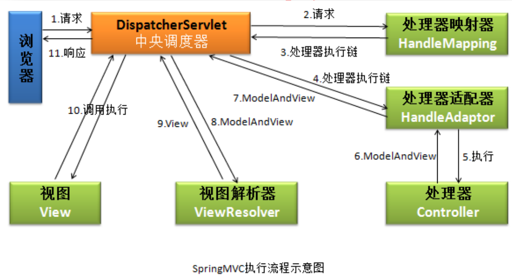

## Spring MVC运行流程图&Spring整合

### 1.1 Spring MVC运行流程图

**运行流程图1**：

**运行流程图2**：

一个正常请求的具体流程：
- 浏览器提交请求到DispatcherServlet
- DispatcherServlet将请求直接转给HandleMapping
- HandleMapping会根据请求，找到处理该请求的处理器，并将其封装成HandlerExecutionChain（处理器执行链）返还给
DispatcherServlet
- DispatcherServlet根据处理器执行链中的处理器，找到能够执行该处理器的HandlerAdapter
- HandlerAdapter调用对应的目标方法，并将处理结果数据和要跳转的页面封装成一个ModelAndView对象，并返回给HandleAdapter
- HandlerAdapter将得到的ModelAndView直接返回给DispatcherServlet
- DispatcherServlet将得到的ModelAndView对象传给ViewResolver，由ViewResolver将其封装成View对象
- ViewResolver将封装的View对象返还给DispatcherServlet
- DispatcherServlet调用视图对象，让其进行渲染，然后进行数据填充，形成响应对象返还给DispatcherServlet
- DispatcherServlet将响应对象返还给浏览器

### 1.1 Spring整合
**问题**：
> 1. 需要Spring和Spring MVC进行整合么？
> 2. 是否需要再加入Spring的IOC容器
> 3. 是否需要在web.xml文件中配置启动Spring IOC容器的ContextLoaderListener

上述三个问题其实就是一个问题，不同的说法。

**两种观点**：
- 不需要：所有的配置都放在Spring MVC中，或者分成多个Spring MVC的子文件，然后通过import导入
- 需要：有关数据源、事务和整合其它框架的配置以及IOC容器中的Service、Dao都应该放入到Spring配置文件中，而Spring MVC的配置文件就是来处理Controller，这样两者形成父子容器。

Spring官方推荐的就是第二种：

具体来说：

在Spring和Spring MVC各自配置文件中\<context:component-scan/\>标签中通过：
\<context:include-filter/\>和\<context:exclude-filter/\>两个子标签配合使用，形成互补配置，
- Spring将Controller相关的类排除掉
- Spring MVC包含Controller相关的类