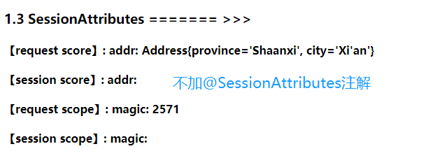
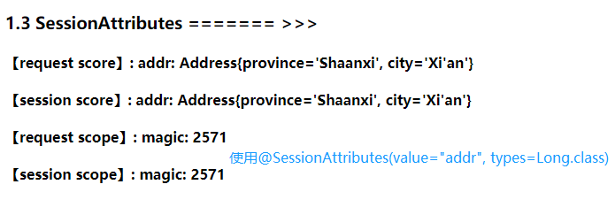
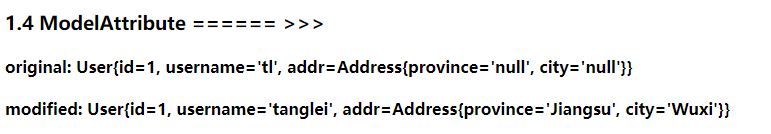

## 处理模型数据
MVC设计模式中，当客户端发送请求到目标处理器时，目标处理器会调用相应的业务方法，业务方法执行完毕后可能会有
返回值（一个对象或者一个集合等等），并转发到页面。转发到页面时候需要将之前的返回值显示出来，现在问题是：

**如何把模型数据放到（request）域对象中？**

为了解决这个问题：Spring MVC提供了四种解决方式：
> 1. ModelAndView：处理方法返回值类型为ModelAndView时，方法体即可通过该对象添加模型数据
> 2. Map&Model&ModelMap：入参为Model、ModelMap或者Map时，处理方法返回时，Map中的数据会自动添加到模型中
> 3. @SessionAttributes：将模型中的某个属性暂存到HttpSession中，以便多个请求之间共享这些属性
> 4. @ModelAttribute：方法入参标注该注解后，入参的对象就会放到数据模型中

### 1.1 ModelAndView
控制器处理方法的返回值如果为ModelAndView，则器既包含视图信息，又包含模型数据信息。Spring MVC会把ModelAndView
中数据放入到request域对象中，几个常用方法：
- ModelAndView addObject(String attributeName, Object AttributeValue)：添加单个对象
- ModelAndView addAllObject(Map<String, ?> modelMap)：添加多个对象
- void setView(View view)：设置视图
- void setViewName(String viewName)：设置视图名称
```java
@Controller
public class HandleModelController {
    public static final String VIEW_NAME = "success";

    /**
     * 如果返回值是ModelAndView，则返回结果既包含了视图信息，又被包含了模型数据信息，
     * Spring MVC会把ModelAndView的model数据放入到request域中
     */
    @RequestMapping("/test/model/model_and_view")
    public ModelAndView testModelAndView() {
        ModelAndView modelAndView = new ModelAndView(VIEW_NAME);
        modelAndView.addObject("time", new Date());
        return modelAndView;
    }
}
```

返回页面是通过ModelAndView的构造器设置的，在返回页面success.jsp中拿到**time**属性的值：
```xml
<h3>1.1 ModelAndView ======>>> time: ${requestScope.time}</h3>
```

### 1.2 Map & Model & ModelMap
目标方法可以添加Map、Model、ModelMap类型作为入参，整个Map也会被放入请求域中，
整个Map也会被添加到Request域中：
```java
@Controller
public class HandleModelController {
    public static final String VIEW_NAME = "success";
    /**
     * 目标方法可以添加Map、Model类型以及ModelMap类型参数，整个Map也会被添加到request域中
     */
    @RequestMapping("/test/model/map")
    public String testMap(Map<String, Object> maps) {
        // 注意这个Map的实际类型：
        // org.springframework.validation.support.BindingAwareModelMap
        System.out.println(maps.getClass().getName());
        maps.put("names", Arrays.asList("sherman", "tl"));
        return VIEW_NAME;
    }
}
```
在返回页面中拿到**names**属性值：
```xml
<h3>1.2 Map ======>>> names: ${names}</h3>
```

### 1.3 @SessionAttributes
上述两个方法都是将模型数据放入到Request域中，如果想让多个请求之间共享相同的模型数据，则对应的模型数据必须放到session中。
@SessionAttributes注解可以通过：指定属性名（value属性）；指定对象的类型（types属性）来讲模型数据放入到session中。

**注意**：@SessionAttributes注解只能注解在类上，不能注解在方法上

```java
// 将属性名为addr的属性和类型为Long的属性模型数据全部放入到Session域中
@SessionAttributes(value = {"addr"}, types = Long.class)
@Controller
public class HandleModelController {
    public static final String VIEW_NAME = "success";
    
    /**
     * 演示@SessionAttributes注解将Address对象和Long对象放入到session中
     */
    @RequestMapping("/test/model/session_attributes")
    public String testSessionAttributes(Map<String, Object> maps) {
        maps.put("addr", new Address("Shaanxi", "Xi'an"));
        maps.put("magic", 2571L);
        return VIEW_NAME;
    }
}
```
返回页面中的输出信息：
**不使用@SessionAttributes注解，对应属性只存在Request域中：**



**使用@SessionAttributes注解，对应属性存在Request和Session域中：**



### 1.4 @ModelAttribute
@ModelAttribute适用于以下场景：先从数据库中取出一条记录，然后表单提交数据后，提交的数据只需要对取出来的记录中
部分字段进行更新，此时就可以使用@ModelAttribute注解，具体来说：
- 模拟从数据库中取出一条User记录，假设User的属性为：id=1, username=tl, addr=null
- index.jsp提交一个表单，对于中取出的记录，该表单不更新id，修改username为sherman，并添加addr.province=Jiangsu, city=Wuxi

**提交的表单：**
```xml
<h2>@ModelAttribute测试</h2>
<form action="test/model/model_attribute" method="post"><br/>
  <%-- id: <input type="text" name="id"><br/> 不更新此字段，不要填写--%>
  <%-- 或者通过隐藏域提交：<input type="hidden" name="id" value="1"> --%>
  username: <input type="text" name="username"><br/>
  province: <input type="text" name="addr.province"><br/>
  city: <input type="text" name="addr.city"><br/>
  <input type="submit" value="submit"><br/>
</form>
```

**目标方法：**
```java
@Controller
public class HandleModelController {
    public static final String VIEW_NAME = "success";
    
    @RequestMapping("/test/model/model_attribute")
    public String testModelAttribute(@ModelAttribute(value = "user") User user, Map<String, Object> maps) {
        maps.put("modified", user);
        return VIEW_NAME;
    }

    @ModelAttribute
    private void getUserFromDB(Map<String, Object> maps) {
        // 这里直接new一个User模拟从数据库中获取一个User
        User user = new User(1, "tl", new Address());
        maps.put("user", user);
        maps.put("original", user.toString());
    }
}    
```
**返回页面获取结果**：
```shell
<h3>1.4 ModelAttribute ====== >>></h3>
    <h4>original: ${requestScope.original}</h4>
    <h4>modified: ${requestScope.modified}</h4>
```

**输出结果**：



**@ModelAttribute执行流程**：
- 有@ModelAttribute注解的方法在每个目标方法执行直接都会先调用，即 **getUserFromDB()** 方法会先执行，并将
从数据库中查询到的User记录放入到Map中，假设该条记录的键名为 **key**
- 表单提交属性后，会根据 **key** 从Map中查询对应的记录，并进行部分更新
- 最后将更新过后的值传递给目标方法中@ModelAttribute(value = "user")注解对应的value属性，即user

### 1.5 @ModelAttribute源码分析流程
- 调用@ModelAttribute注解修饰的方法，实际上把@ModelAttribute方法中Map里的数据放在了implicitModel中
- 解析请求处理器的目标参数，实际上该目标参数实际上来自WebDataBinder对象的target属性
    - 创建WebDataBinder对象，创建该对象需要确定target和objectName属性
        - 若传入的attrName属性值为""，则objectName为类名第一个字母小写
        - 注意，对于attrName，如果目标方法的POJO属性使用@ModelAttribute来修饰，则attrName值即为@ModelAttribute的value属性值
    - 确定target属性：在implicitModel中进行查找attrName对应的属性值
        - 若不存在，则验证当前Handler是否使用了@SessionAttributes进行修饰，
            - 若使用了，则尝试从Session中获取attrName所对应的的属性值
            - 若session中没有对应的属性值，则抛出了异常
        - 若对应的Handler没有使用@SessionAttributes修饰或者@SessionAttributes中没有使用value值指定的key和attrName匹配，则通过反射方式创建POJO对象
- Spring MVC把表单的请求参数赋值给了WebDataBinder的target对应的属性
- SpringMVC会把WebDataBinder的attrName和target传给implicitModel，进而传到request域对象中
- 把WebDataBinder的target作为参数传递给目标方法的入参


总结：

- 确定一个key：
    - 目标方法的POJO类型参数没有使用@ModelAttribute作为修饰，则key为POJO类名第一个字母的小写
    - 若使用了@ModelAttribute修饰，则key为@ModelAttribute注解的value属性值
- 查找key：
    - 先在implicitModel中查找key对应的对象，若存在，则作为入参传入。存在条件：@ModelAttribute注解标记的方法中在Map里面保存过，且key和上一步骤中确定的key一致时，则会获取成功
    - 若implicitModel中不存在key对应的对象，则检查当前的Handler是否使用@SessionAttributes注解修饰
        - 若使用了该注解，且@SessionAttributes注解的value属性值中包含了key，则会从HttpSession中获取key所对应的value值，若存在则直接传入目标方法的入参
        - 否则直接抛出异常
    - 若Handler没有表示@SessionAttributes注解或者@SessionAttributes注解的value值不包含key，则会通过反射创建POJO类型参数，传入为目标方法的参数     
- Spring MVC会把key和value保存到implicitModel中，进而会保存到request中 

@ModelAttribute注解中value属性的作用：
- Spring MVC会使用value属性值在implicitModel中查找对应的对象，若存在则会直接传入到目标方法的入参中
- Spring MVC会以value为Map的key，POJO类型的对象为Map的value，存入到request中