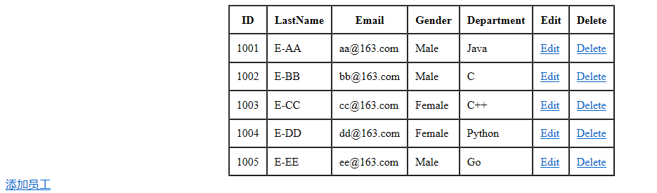
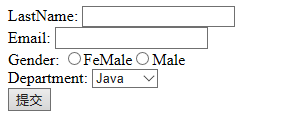
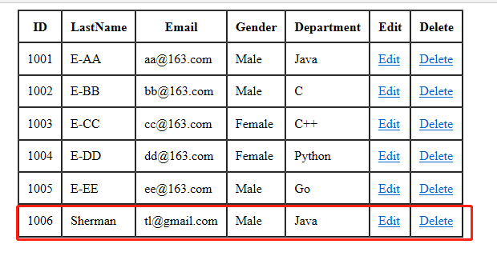

## REST风格CRUD
### 1.1 需求分析
有两个实体类：Employee、Department，Department和Employee是一对多关系，需要对Employee进行CRUD操作，
具体而言：
- 查询：查询所有的Employee信息【list_employees.jsp】 -> /crud/emps GET
- 增加：增加员工信息，注意这里有两个需求，虽然url相同，但是请求方式不同：
    - 显示添加页面 【add_employee.jsp】-> /crud/emp GET
    - 添加员工信息，且添加完成后重定向到所有员工信息页面 【list_employees.jsp】-> /crud/emp POST
- 删除：删除员工信息，删除操作的Controller逻辑简单，但是删除是通过超链接（get请求）完成的，而HiddenHttpMethodFilter
能够将post请求转换成delete和put请求，这里需要引入jquery来解决，同时又带来新的问题：
    - jquery是静态资源，静态资源如何处理
    - jquery和form表单隐藏域如何完成将get请求先转换post请求，然后转换成delete请求
- 修改：修改员工信息，并且员工的LastName属性不能修改，整个过程也分为两部分；
    - 显示修改页面，涉及到表单回显
    - 修改员工信息，重定向到list_employees.jsp页面
    
### 1.2 查询所有Employee信息
查询操作并没有直接从数据库中查找，而是使用static数据模拟从数据中查找的过程：

**EmployeeDao**：
```java
/**
 * 员工实体类的Dao层
 *
 * @author sherman
 */
@Repository
public class EmployeeDao {
    private static Map<Integer, Employee> employees = null;

    private Integer initId = 1006;

    @Autowired
    private DepartmentDao departmentDao;

    static {
        employees = new HashMap<>();
        employees.put(1001, new Employee(1001, "E-AA", "aa@163.com", 1, new Department(101, "Java")));
        employees.put(1002, new Employee(1002, "E-BB", "bb@163.com", 1, new Department(102, "C")));
        employees.put(1003, new Employee(1003, "E-CC", "cc@163.com", 0, new Department(103, "C++")));
        employees.put(1004, new Employee(1004, "E-DD", "dd@163.com", 0, new Department(104, "Python")));
        employees.put(1005, new Employee(1005, "E-EE", "ee@163.com", 1, new Department(105, "Go")));
    }

    /**
     * 查询所有员工信息
     */
    public Collection<Employee> getAll() {
        return employees.values();
    }

    /**
     * 根据id查询某个员工
     */
    public Employee getEmployee(Integer id) {
        return employees.get(id);
    }

    /**
     * 根据id删除某个员工
     */
    public void delete(Integer id) {
        employees.remove(id);
    }

    /**
     * 保存员工
     */
    public void save(Employee employee) {
        if (employee.getId() == null){
            employee.setId(initId++);
        }
        employee.setDepartment(departmentDao.getDepartment(employee.getDepartment().getId()));
        employees.put(employee.getId(), employee);
    }
}
```

**DepartmentDao**：
```java
/**
 * 部门实体类的Dao层，这里实际使用static块模拟从数据库中获取数据
 *
 * @author sherman
 */
@Repository
public class DepartmentDao {
    private static Map<Integer, Department> departments = null;

    static {
        departments = new HashMap<>();
        departments.put(101, new Department(101, "Java"));
        departments.put(102, new Department(102, "C"));
        departments.put(103, new Department(103, "C++"));
        departments.put(104, new Department(104, "Python"));
        departments.put(105, new Department(105, "Go"));
    }

    /**
     * 查询所有部门
     */
    public Collection<Department> getDepartments() {
        return departments.values();
    }

    /**
     * 根据id查询部门
     */
    public Department getDepartment(Integer id) {
        return departments.get(id);
    }
}
```

**Controller**：
```java
@Controller
public class CRUDController {
    @Autowired
    private EmployeeDao employeeDao;

    @Autowired
    private DepartmentDao departmentDao;

    /**
     * 获取所有的employees并保存到request域中
     */
    @RequestMapping("/crud/emps")
    public String getAllEmployees(Map<String, Object> maps) {
        maps.put("employees", employeeDao.getAll());
        return "/crud/list_employees";
    }
}
```

**查询结果页面list_employees.jsp**：
``` jsp
<%@ page contentType="text/html;charset=UTF-8" language="java" %>
<%@ taglib prefix="c" uri="http://java.sun.com/jsp/jstl/core_1_1" %>
<html>
<head>
    <title>list all employees</title>
</head>
<body>
<c:if test="${empty requestScope.employees}">
    没有任何员工信息!
</c:if>
<c:if test="${!empty requestScope.employees}">
    <table border="1" cellpadding="10" cellspacing="0" align="center" width="50">
        <tr>
            <th>ID</th>
            <th>LastName</th>
            <th>Email</th>
            <th>Gender</th>
            <th>Department</th>
            <th>Edit</th>
            <th>Delete</th>
        </tr>
        <c:forEach items="${requestScope.employees}" var="emp">
            <tr>
                <td>${emp.id}</td>
                <td>${emp.lastName}</td>
                <td>${emp.email}</td>
                <td>${emp.gender == 0? 'Female': 'Male'}</td>
                <td>${emp.department.departmentName}</td>
                <td><a href="">Edit</a></td>
                <td><a href="">Delete</a></td>
            </tr>
        </c:forEach>
    </table>
</c:if>
<a href="${pageContext.request.contextPath}/crud/emp">添加员工</a>
</body>
</html>
```

在index.jsp中加入一个超链接：
```jsp
<h2>CRUD</h2>
<a href="${pageContext.request.contextPath}/crud/emps">显示所有员工列表</a>
```



### 1.3 添加用户信息
添加用户首先需要转到添加用户信息的界面，是一个GET请求，list_employees.jsp下方有一个url：
<a href="${pageContext.request.contextPath}/crud/emp"\>添加员工</a\>，然后提交表单进行添加，是一个POST请求，
url仍然为/crud/emp：

**/crud/emp GET**：
在list_employees.jsp中点击 **添加员工** 的超链接，来到对应的Controller：
```java
@Controller
public class CRUDController {
    @Autowired
    private EmployeeDao employeeDao;

    @Autowired
    private DepartmentDao departmentDao;
    
    /**
     * GET方式添加新员工
     */
    @RequestMapping(value = "/crud/emp", method = RequestMethod.GET)
    public String addEmployeeGET(Map<String, Object> maps) {
        maps.put("departments", departmentDao.getDepartments());
        /**
         * modelAttribute默认从request域对象中获取，否则报错
         * 因此即使第一次访问，也应该向Map中put一个空的Employee对象，且key和
         * modelAttribute属性相同
         */
        maps.put("employee", new Employee());
        return "/crud/add_employee";
    }
}
```
Controller中对应的get请求方法会将获取到的所有department和一个name为employee的空bean对象放入到Map中，传递
到request域对象中，然后返回到add_employee.jsp页面。

**POST方式提交表单页面add_employee.jsp**：
```jsp
<%@ page import="java.util.HashMap" %>
<%@ page contentType="text/html;charset=UTF-8" language="java" %>
<%@ taglib prefix="form" uri="http://www.springframework.org/tags/form" %>
<html>
<head>
    <title>add employee</title>
</head>
<%--
    使用Spring MVC form标签：
        1. 开发效率高
        2. 表单值回显
    注意：
        Spring MVC的form标签要能正常使用，request域中必须要有一个bean，bean的属性需要和表单字段一一对应。
        该bean对象由modelAttribute指定，默认bean名称为command，所以在Controller中，也需要加入一个空的Employee
--%>
<body>
<!-- 注意这里要写成绝对路径，相对路径后面会出错！ -->
<form:form action="${pageContext.request.contextPath}/crud/emp" method="post" modelAttribute="employee">
    <%-- path属性就对应html表单中name属性值 --%>
    LastName: <form:input path="lastName"/><br/>
    Email: <form:input path="email"/><br/>
    <%
        Map<String, String> genders = new HashMap<>();
        genders.put("1", "Male");
        genders.put("0", "FeMale");
        request.setAttribute("genders", genders);
    %>
    Gender: <form:radiobuttons path="gender" items="${genders}"/><br/>
    <%-- 1、如果不指定id，id默认和path相同
         2、itemLabel：下拉菜单显示的属性
         3、itemValue：下来菜单最终传递给后台的属性
     --%>
    Department: <form:select path="department.id" id="deptId"
                             items="${departments}" itemLabel="departmentName" itemValue="id"/><br/>
    <input type="submit" value="提交"/>
</form:form>
</body>
</html>
```

**添加用户页面**：



添加完成后进行提交，即发送POST请求，url仍然为/crud/post，在对应的方法中重定向到list_employees.jsp页面
显示所有用户信息：

注意因为list_employees.jsp是在WEB-INF下，不能直接redirect到该路径下，需要重定向映射url，而不是重定向页面url：
```java
@Controller
public class CRUDController {
    @Autowired
    private EmployeeDao employeeDao;

    @Autowired
    private DepartmentDao departmentDao;
    
    /**
     * POST方式添加新员工
     */
    @RequestMapping(value = "/crud/emp", method = RequestMethod.POST)
    public String addEmployeePOST(Employee employee) {
        employeeDao.save(employee);
        // 不能写成 return "redirect:/WEB-INF/views/crud/emps";
        return "redirect:/crud/emps";
    }
}
```
**重定向回显的页面**：



### 1.4 删除操作和处理静态资源
**删除操作的Controller**：
```java
/**
 * 删除给定id的employee
 */
@RequestMapping("/crud/emp/{id}")
public String deleteEmployee(@PathVariable("id") Integer id) {
    employeeDao.delete(id);
    return "redirect:/crud/emps";
}
```

**删除操作的超链接**：
```xml
<!-- 也可以使用相对路径：
    不以/开头，无论是前台路径还是后台路径，都是相对于当前资源的路径，当前页面的路径为：
    http://localhost:8080/springmvc/crud/emps，则当前资源路径为：http://localhost:8080/springmvc/crud/
    因此拼接上：emp/${emp.id}就是最终的路径http://localhost:8080/springmvc/crud/emp/${emp.id}
    <td><a href="emp/${emp.id}">Delete</a></td>
-->
<td><a href="${pageContext.request.contextPath}/crud/emp/${emp.id}">Delete</a></td>
```

**问题**：

超链接使用的是get请求方式提交，HiddenHttpMethodFilter能够将post请求转换成put或者delete请求，如何将get
请求转换成post请求？

**解决**：

使用jquery和form表单的隐藏域将get请求转变成post请求，然后再由HiddenHttpMethodFilter将post请求转换成put或者delete请求。

**引入jquery产生的问题**：

jquery属于静态资源，Spring MVC使用DispatcherServlet请求映射配置为/，则Spring MVC会拦截所有请求，包括静态资源，
Spring MVC会将它们当成普通请求处理，因此找不到对应的处理器导致错误。

**解决静态资源问题**：

在Spring MVC配置文件中配置 **<mvc:default-servlet-handler/>** 标签即可，注意要配合 **<mvc:annotation-driven/>** 一起使用。

**整个list_employees.jsp解决方案**：
```xml
<%@ page contentType="text/html;charset=UTF-8" language="java" %>
<%@ taglib prefix="c" uri="http://java.sun.com/jsp/jstl/core_1_1" %>
<html>
<head>
    <title>list all employees</title>
    <!-- 注意这里也可以使用相对路径：../scripts/jequery-3.4.1.min.js -->
    <script type="text/javascript" src="${pageContext.request.contextPath}/scripts/jquery-3.4.1.min.js"></script>
    <script type="text/javascript">
        $(function () {
            $(".delete").click(function () {
                var href = $(this).attr("href");
                $("form").attr("action", href).submit();
                return false;
            });
        })
    </script>
</head>
<body>
<form action="" method="post">
    <input type="hidden" name="_method" value="delete">
</form>
<c:if test="${empty requestScope.employees}">
    没有任何员工信息!
</c:if>
<c:if test="${!empty requestScope.employees}">
    <table border="1" cellpadding="10" cellspacing="0" align="center" width="50">
        <tr>
            <th>ID</th>
            <th>LastName</th>
            <th>Email</th>
            <th>Gender</th>
            <th>Department</th>
            <th>Edit</th>
            <th>Delete</th>
        </tr>
        <c:forEach items="${requestScope.employees}" var="emp">
            <tr>
                <td>${emp.id}</td>
                <td>${emp.lastName}</td>
                <td>${emp.email}</td>
                <td>${emp.gender == 0? 'Female': 'Male'}</td>
                <td>${emp.department.departmentName}</td>
                <td><a href="">Edit</a></td>
                <td><a class="delete" href="${pageContext.request.contextPath}/crud/emp/${emp.id}">Delete</a></td>
            </tr>
        </c:forEach>
    </table>
</c:if>
<a href="${pageContext.request.contextPath}/crud/emp">添加员工</a>
</body>
</html>
```

### 1.5 更新Employee信息
首先超链接 **<td\><a href="${pageContext.request.contextPath}/crud/emp/${emp.id}"\>Edit</a\></td\>** 中跳转到对应回显用户信息的
Controller，url为/crud/emp/{id}，get请求，然后返回到add_employee.jsp进行回显：
```java
/**
 * 修改employee信息，第一步：先回显员工信息
 */
@RequestMapping(value = "/crud/emp/{id}", method = RequestMethod.GET)
public String getEmployee(@PathVariable("id") Integer id, Map<String, Object> maps) {
    maps.put("employee", employeeDao.getEmployee(id));
    maps.put("departments", departmentDao.getDepartments());
    return "/crud/add_employee";
}
```

**修改add_employee.jsp**：

现在是回显用户信息，因此用户的id必然存在，且不应该修改LastName属性，因此需要使用<c:if>标签进行判断，同时需要使用form表单
将post请求转换成PUT请求：
```xml
<form:form action="${pageContext.request.contextPath}/crud/emp" method="post" modelAttribute="employee">
    <%-- path属性就对应html表单中name属性值 --%>
    <c:if test="${employee.id == null}">
        LastName: <form:input path="lastName"/><br/>
    </c:if>
    <c:if  test="${employee.id != null}">
        <form:hidden path="id"/>
        <input type="hidden" name="_method" value="PUT"/>
    </c:if>
    Email: <form:input path="email"/><br/>
    <%
        Map<String, String> genders = new HashMap<>();
        genders.put("1", "Male");
        genders.put("0", "FeMale");
        request.setAttribute("genders", genders);
    %>
    Gender: <form:radiobuttons path="gender" items="${genders}"/><br/>
    <%-- 1、如果不指定id，id默认和path相同
         2、itemLabel：下拉菜单显示的属性
         3、itemValue：下来菜单最终传递给后台的属性
     --%>
    Department: <form:select path="department.id" id="deptId"
                             items="${departments}" itemLabel="departmentName" itemValue="id"/><br/>
    <input type="submit" value="提交"/>
</form:form>
```

**更新Employee信息Controller**：
提交表单后，会到对应映射的POST请求方法处执行，注意不能更新LastName属性，因此执行目标方法之前，还需要执行@ModelAttribute
注解的方法：
```java
/**
 * 修改employee信息，第二步：更新employee信息
 */
@RequestMapping(value = "/crud/emp", method = RequestMethod.PUT)
public String updateEmployee(Employee employee) {
    employeeDao.save(employee);
    return "redirect:/crud/emps";
}

/**
 * 不更新LastName属性，因此需要使用@ModelAttribute注解
 */
@ModelAttribute("employee")
public void getEmployeeMA(@RequestParam(value = "id", required = false) Integer id, Map<String, Object> maps) {
    if (id != null) {
        maps.put("employee", employeeDao.getEmployee(id));
    }
}
```