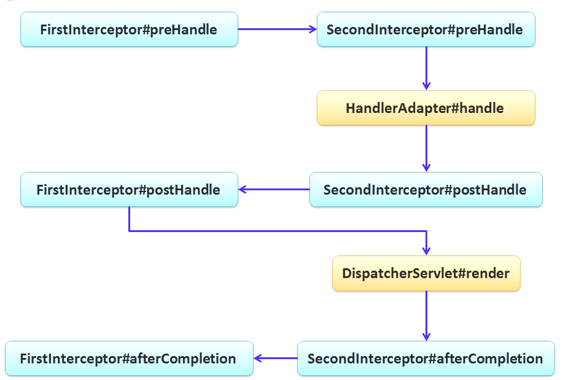
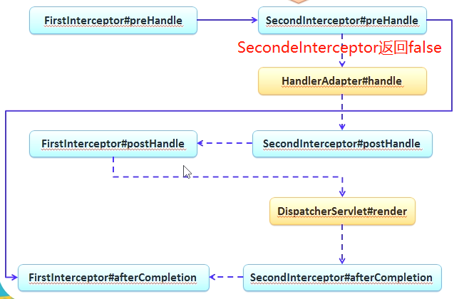

## 文件上传&拦截器

### 1.1 文件上传
Spring MVC为文件上传提供了直接的支持，这种支持是通过即插即用的**MultipartResolver**实现的，Spring中各有一个实现
类：**CommonsMultipartResolver**，Spring MVC上下文中默认没有装配MultipartResolver，因此默认情况下不能处理文件上传工作，如果想使用Spring的文件上传功能，需要在上下文中配置MultipartResolver，并且id不不必须为multipartResolver。

- 引入依赖，注意如果后续有问题，将以下两个jar包复制到Tomcat目录中lib下：
```xml
<dependency>
    <groupId>commons-fileupload</groupId>
    <artifactId>commons-fileupload</artifactId>
    <version>1.3.1</version>
</dependency>

<dependency>
    <groupId>commons-io</groupId>
    <artifactId>commons-io</artifactId>
    <version>2.5</version>
</dependency>
```
- 上传文件表单提交：
```xml
<h2>文件上传</h2>
<form:form action="${pageContext.request.contextPath}/file_upload" method="post" enctype="multipart/form-data">
  File:  <input type="file" name="file">
  Desc: <input type="text" name="desc">
  <input type="submit" value="上传">
</form:form>
```
- 接受文件上传的Controller：
```java
/**
 * 文件上传的Controller
 *
 * @author sherman
 */
@Controller
public class FileUploadController {
    @RequestMapping(value = "/file_upload", method = RequestMethod.POST)
    public String fileUpload(@RequestParam("file") MultipartFile mf, @RequestParam("desc") String desc) {
        System.out.println("desc: " + desc);
        System.out.println("originFileName：" + mf.getOriginalFilename());
        return "success";
    }
}
```
- 如果提示**No WebApplicationContext found**错误，还需要在web.xml中配置：ContextLoaderListener：
```xml
<context-param>
    <param-name>contextConfigLocation</param-name>
    <param-value>classpath:spring-mvc.xml</param-value>
</context-param>

<listener>
    <listener-class>org.springframework.web.context.ContextLoaderListener</listener-class>
</listener>
```

### 1.2 拦截器
Spring MVC也可以使用拦截器对请求进行拦截处理，用户可以自定义拦截器来实现特定功能，自定义拦截器必须实现**HandlerInterceptor**接口，
有三个方法需要重写：
- preHandle：业务处理器处理请求之前调用，在方法中对用户请求request进行处理。
    - 如果该拦截器对请求处理后还要调用其他拦截器，或者业务处理器去进行处理，返回true
    - 如果不需要调用其他组件处理请求，直接返回false
- postHandle：业务处理器处理完请求后执行，但是DispatcherServlet向客户端返回响应前调用，在该方法中对用户请求
request进行处理。
- afterCompletion：在DispatcherServlet完全处理完请求后被调用，可以在该方法中进行一些资源清理操作。

**自定义拦截器**：
- 自定义一个拦截器类，实现HandlerInterceptor接口：
```
/**
 * 自定义拦截器
 *
 * @author sherman
 */
@Component
public class CustomIntercept implements HandlerInterceptor {
    @Override
    public boolean preHandle(HttpServletRequest request, HttpServletResponse response, Object handler) throws Exception {
        System.out.println("=======preHandle==========");
        /**
         * 如果这个直接返回false，后续的拦截器不会执行，而且该拦截器的postHandle和afterCompletion也不会执行
         * 因此可以考虑做：权限管理、事务管理等等
         */
        return true;
    }

    /**
     * 可以考虑对请求域中的属性或者视图做出修改
     */
    @Override
    public void postHandle(HttpServletRequest request, HttpServletResponse response, Object handler, ModelAndView modelAndView) throws Exception {
        System.out.println("=======postHandle==========");
    }

    /**
     * 可以考虑用来释放资源
     */
    @Override
    public void afterCompletion(HttpServletRequest request, HttpServletResponse response, Object handler, Exception ex) throws Exception {
        System.out.println("=======afterCompletion==========");
    }
}
```
- 在spring-mvc.xml中配置自定义拦截器：
```xml
<!-- 配置自定义拦截器，将bean直接放在mvc:interceptors标签下，会拦截所有请求 -->
<mvc:interceptors>
    <bean class="nwpu.sherman.intercept.CustomIntercept"/>
</mvc:interceptors>
```
- 请求任意有效的路径，查看拦截器的输出即可

**拦截器配置**：
之前自定义拦截器在spring-mvc.xml进行配置使用的是\<mvc:interceptors\>标签，除此之外还可以使用：\<mvc:interceptors\>标签进行
自定义配置。

例如，现在希望刚刚配置的拦截器只拦截：/locale/change请求：
```xml
<!-- 配置自定义拦截器 -->
<mvc:interceptors>
    <mvc:interceptor>
        <mvc:mapping path="/i18n/change"/>
        <bean class="nwpu.sherman.intercept.CustomIntercept"/>
    </mvc:interceptor>
</mvc:interceptors>
```

**拦截器执行流程**：
拦截器的执行流程和Filter的执行流程类似：



注意如果有某个拦截器的preHandle直接返回false了，那么之后的拦截器就不会执行：



