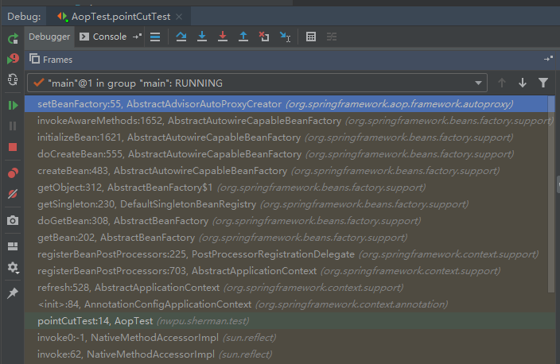
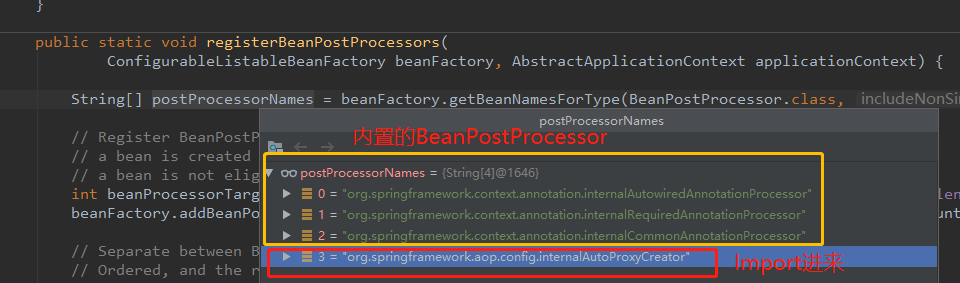
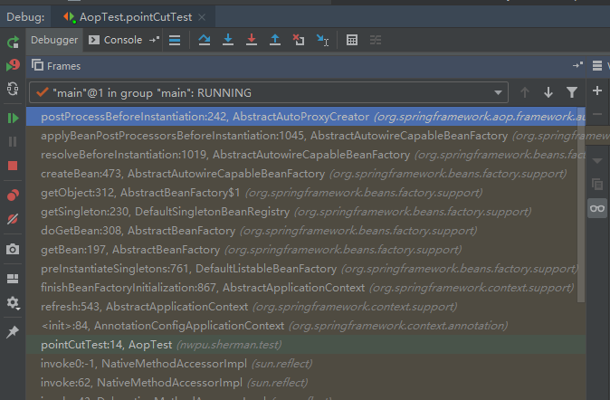
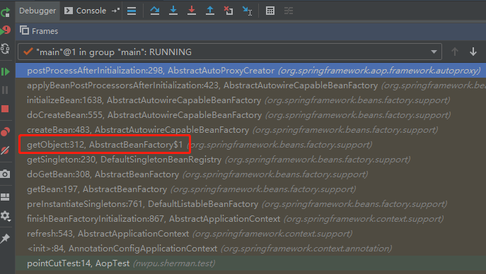
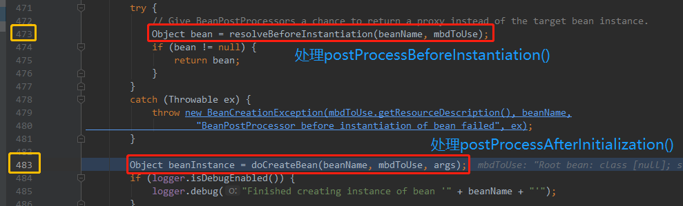
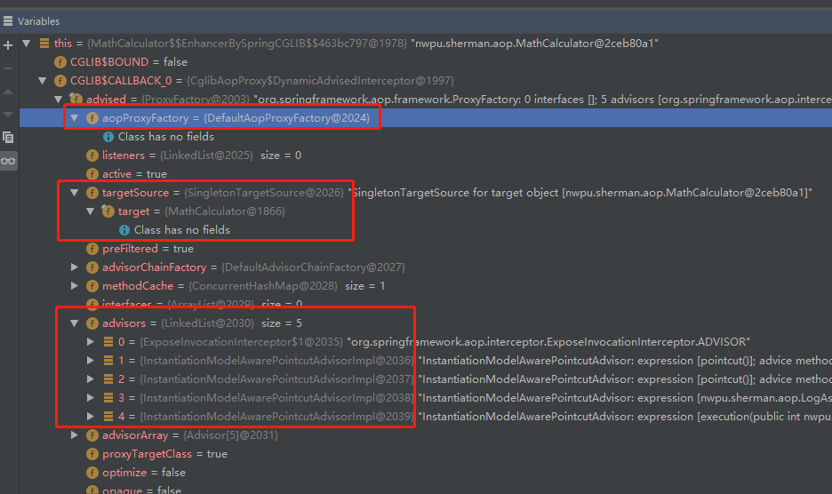
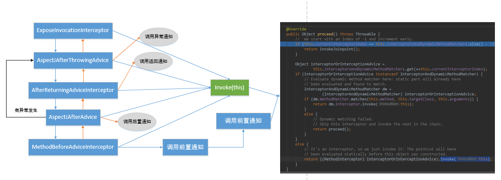

## AOP源码分析

### 1.1 创建和注册AnnotationAwareAspectJAutoProxyCreator
在AOP功能测试环节，AOP功能能够实现，最主要在于 **@EnableAspectJAutoProxy** 注解，该注解内部实际通过
@Import注解引入了一个**AspectJAutoProxyRegistrar.class**：
```java
@Target(ElementType.TYPE)
@Retention(RetentionPolicy.RUNTIME)
@Documented
@Import(AspectJAutoProxyRegistrar.class)
public @interface EnableAspectJAutoProxy {
    // ...
}
```

接下来分析AspectJAutoProxyRegistrar类。首先，该类实现了**ImportBeanDefinitionRegistrar**，注意该接口在IOC容器
组件注册小节中有介绍过，主要功能：在程序运行期间，动态向IOC容器中注册Bean定义信息。这个动态注册Bean定义信息是通过：
重写registerBeanDefinitions()方法完成的。因此，我们在接下来分析AspectJAutoProxyRegistrar类重写的registerBeanDefinitions()
方法：

在该方法的第一条语句：AopConfigUtils.registerAspectJAnnotationAutoProxyCreatorIfNecessary(registry);加入断点，
并一直step into，直到遇到：
```java
private static BeanDefinition registerOrEscalateApcAsRequired(Class<?> cls, BeanDefinitionRegistry registry, Object source) {
    Assert.notNull(registry, "BeanDefinitionRegistry must not be null");
    
    // 如果registry中包含了BeanName为internalAutoProxyCreator的bean定义信息，则执行下面逻辑
    // 注意该internalAutoProxyCreator bean的类型为AnnotationAwareAspectJAutoProxyCreator
    
    if (registry.containsBeanDefinition("org.springframework.aop.config.internalAutoProxyCreator")) {
        BeanDefinition apcDefinition = registry.getBeanDefinition("org.springframework.aop.config.internalAutoProxyCreator");
        if (!cls.getName().equals(apcDefinition.getBeanClassName())) {
            int currentPriority = findPriorityForClass(apcDefinition.getBeanClassName());
            int requiredPriority = findPriorityForClass(cls);
            if (currentPriority < requiredPriority) {
                apcDefinition.setBeanClassName(cls.getName());
            }
        }

        return null;
    } else {
    // 刚开始，registry中并没有包含BeanName为internalAutoProxyCreator的Bean定义信息，因此程序跳到这里
    
        // 开始向IOC容器中注册一个cls【AnnotationAwareAspectJAutoProxyCreator】并返回
        
        RootBeanDefinition beanDefinition = new RootBeanDefinition(cls);
        beanDefinition.setSource(source);
        beanDefinition.getPropertyValues().add("order", -2147483648);
        beanDefinition.setRole(2);
        registry.registerBeanDefinition("org.springframework.aop.config.internalAutoProxyCreator", beanDefinition);
        return beanDefinition;
    }
}
```

以上源码可以看出，实际上@EnableAspectJAutoProxy要向IOC容器中注入一个**AnnotationAwareAspectJAutoProxyCreator**的Bean

解析来我们继续分析AnnotationAwareAspectJAutoProxyCreator类，首先查看该类的继承结构：

```txt
AnnotationAwareAspectJAutoProxyCreator
    extends AspectJAwareAdvisorAutoProxyCreator
        extends AbstractAdvisorAutoProxyCreator
            extends AbstractAutoProxyCreator
                extends ProxyProcessorSupport 
                implements SmartInstantiationAwareBeanPostProcessor, BeanFactoryAware
```
对于上面的类继承结构，着重关注最后一行，即：

**AnnotationAwareAspectJAutoProxyCreator类实现类某个BeanPostProcessor和BeanFactoryAware接口**

而我们知道，BeanPostProcessor主要是在Bean的初始化前后完成拦截工作，BeanFactoryAware接口主要是让指定类拿到IOC容器底层的BeanFactory
组件。因此AnnotationAwareAspectJAutoProxyCreator实际上具有Bean后处理器的特性，也具有BeanFactoryAware的特性，我们只要分析它在对应
特性下完成了哪些工作，就可以了解AOP的具体实现过程。

从父类往子类进行分析，先看AbstractAutoProxyCreator类，该类中和上述两个特性有关的方法都打上断点：
- AbstractAutoProxyCreator.setBeanFactory()
- AbstractAutoProxyCreator.postProcessXxx()方法

再看下一个子类AbstractAdvisorAutoProxyCreator类：
- AbstractAdvisorAutoProxyCreator.setBeanFactory()，注意在set方法中又调用了initBeanFactory方法

再看下一个子类AspectJAwareAdvisorAutoProxyCreator类，该类没有和上述两个特性相关的方法，跳过即可。

在看AnnotationAwareAspectJAutoProxyCreator类：
- AnnotationAwareAspectJAutoProxyCreator.initBeanFactory，即最开始的setBeanFactory()方法在该类中由initBeanFactory进行重写

使用debug进行调试，程序首先停在setBeanFactory()方法出，查看调用栈：



我们从最开始的pointCutTest处开始分析：
- pointCutTest:14 AopTest：传入配置类，创建IOC容器
```
@Test
public void pointCutTest(){
    【break point】AnnotationConfigApplicationContext context = new AnnotationConfigApplicationContext(AopConfig.class);
    MathCalculator mathCalculator = (MathCalculator) context.getBean("mathCalculator");
    mathCalculator.div(15, 2);
    System.out.println("======================");
    //mathCalculator.div(1, 0);
}
```
- \<init>:84, AnnotationConfigApplicationContext：注册配置类，调用refresh()刷新容器：
```java
public AnnotationConfigApplicationContext(Class<?>... annotatedClasses) {
    this();
    register(annotatedClasses);
    【break point】refresh();
}
```
- refresh:528，AbstractApplicationContext：该方法用于刷新容器，内部过程非常重要，在Spring Boot中也非常重要，之后介绍。现在主要看里面
registerBeanPostProcessors(beanFactory);注释已经非常清晰说明其功能：注册BeanPostProcessor，用于拦截Bean的创建：
```java
@Override
public void refresh() throws BeansException, IllegalStateException {
    // ...
    // Register bean processors that intercept bean creation.
    【break point】registerBeanPostProcessors(beanFactory);
    // ...
}
```
- registerBeanPostProcessor:703,AbstractApplicationContext：通过PostProcessorRegistrationDelegate（代理）完成BeanPostProcessor的
注册，注意它传递的参数BeanFactory实际类型是一个【DefaultListableBeanFactory】类型
```java
protected void registerBeanPostProcessors(ConfigurableListableBeanFactory beanFactory) {
    PostProcessorRegistrationDelegate.registerBeanPostProcessors(beanFactory, this);
}
```
- registerBeanPostProcessors:225,PostProcessorRegistrationDelegate：完成BeanPostProcessor的注册，这个方法内部逻辑非常重要：
    - 根据BeanPostProcessor类型拿到所有的BeanPostProcessor名称：包括内置和@Import导入进来的BeanPostProcessor
    
    
    - 优先注册实现了PriorityOrdered接口的BeanPostProcessor
    - 其次注册实现了Ordered接口的BeanPostProcessor，internalAutoProxyCreator就是实现了该接口
    - 最后注册普通的BeanPostProcessor
    - 排序所有的BeanPostProcessor并将它们注册：
    ```java
    sortPostProcessors(orderedPostProcessors, beanFactory);
    registerBeanPostProcessors(beanFactory, orderedPostProcessors);
    
    /**
     * Register the given BeanPostProcessor beans.
     */
    private static void registerBeanPostProcessors(
            ConfigurableListableBeanFactory beanFactory, List<BeanPostProcessor> postProcessors) {
        for (BeanPostProcessor postProcessor : postProcessors) {
            beanFactory.addBeanPostProcessor(postProcessor);
        }
    }
    ```
    registerBeanPostProcessors()方法整个过程源码大致流程：
    ```java
    public static void registerBeanPostProcessors(
        ConfigurableListableBeanFactory beanFactory, AbstractApplicationContext applicationContext) {
        // 根据BeanPostProcess类型拿到所有的BeanPostProcessor的名称，这里就包括了internalAutoProxyCreator，见上图
        String[] postProcessorNames = beanFactory.getBeanNamesForType(BeanPostProcessor.class, true, false);
        // Register BeanPostProcessorChecker that logs an info message when
        // a bean is created during BeanPostProcessor instantiation, i.e. when
        // a bean is not eligible for getting processed by all BeanPostProcessors.
        // int beanProcessorTargetCount = beanFactory.getBeanPostProcessorCount() + 1 + postProcessorNames.length;
        beanFactory.addBeanPostProcessor(new BeanPostProcessorChecker(beanFactory, beanProcessorTargetCount));
        // Separate between BeanPostProcessors that implement PriorityOrdered,
        // Ordered, and the rest.
         
        // ... 
        // 以下三个部分，按照实现接口的顺序PriorityOrdered->Ordered->普通BeanPostProcessor进行注册
        // internalAutoProxyCreator对象实现了Ordered接口
        
        // First, register the BeanPostProcessors that implement PriorityOrdered.
        sortPostProcessors(priorityOrderedPostProcessors, beanFactory);
        registerBeanPostProcessors(beanFactory, priorityOrderedPostProcessors);
        
        // Next, register the BeanPostProcessors that implement Ordered.
        List<BeanPostProcessor> orderedPostProcessors = new ArrayList<BeanPostProcessor>();
        for (String ppName : orderedPostProcessorNames) {
            【break point】BeanPostProcessor pp = beanFactory.getBean(ppName, BeanPostProcessor.class);
            orderedPostProcessors.add(pp);
            if (pp instanceof MergedBeanDefinitionPostProcessor) {
                internalPostProcessors.add(pp);
            }
        }
        // 排序
        sortPostProcessors(orderedPostProcessors, beanFactory);
        // 注册，源码见上面片段
        registerBeanPostProcessors(beanFactory, orderedPostProcessors);
        
        // Now, register all regular BeanPostProcessors.
        
        // ...
        
        // Finally, re-register all internal BeanPostProcessors.
        sortPostProcessors(internalPostProcessors, beanFactory);
        registerBeanPostProcessors(beanFactory, internalPostProcessors);
        
        // Re-register post-processor for detecting inner beans as ApplicationListeners,
        // moving it to the end of the processor chain (for picking up proxies etc).
        beanFactory.addBeanPostProcessor(new ApplicationListenerDetector(applicationContext));
    }
    ```
- getBean:202, AbstractBeanFactory: 调用doGetBean方法
```java
@Override
public <T> T getBean(String name, Class<T> requiredType) throws BeansException {
    【break point】return doGetBean(name, requiredType, null, false);
}
```
- doGetBean:308, AbstractBeanFactory：内部调用getSingleton方法，尝试获取一个单例Bean
```java
// Create bean instance.
if (mbd.isSingleton()) {
    【break point】sharedInstance = getSingleton(beanName, new ObjectFactory<Object>() {
    }
}
```
- getSingleton()依次调用getObject() -> createBean() -> doCreateBean()，最终来到：initializeBean
- initializeBean:1621, AbstractAutowireCapableBeanFactory，该方法内部逻辑：
```java
protected Object initializeBean(final String beanName, final Object bean, RootBeanDefinition mbd) {
    if (System.getSecurityManager() != null) {
        AccessController.doPrivileged(new PrivilegedAction<Object>() {
            @Override
            public Object run() {
                invokeAwareMethods(beanName, bean);
                return null;
            }
        }, getAccessControlContext());
    }
    else {
        // 激活Aware相关方法
        【break point】invokeAwareMethods(beanName, bean);
    }

    // 对Bean进行包装
    Object wrappedBean = bean;
    if (mbd == null || !mbd.isSynthetic()) {
        // 应用BeanPostProcessor的BeforeInitialization方法
        wrappedBean = applyBeanPostProcessorsBeforeInitialization(wrappedBean, beanName);
    }

    try {
        // 激活Init相关方法，这个就是@Bean注解中init-method & destroy-method
        invokeInitMethods(beanName, wrappedBean, mbd);
    }
    catch (Throwable ex) {
        throw new BeanCreationException(
                (mbd != null ? mbd.getResourceDescription() : null),
                beanName, "Invocation of init method failed", ex);
    }
    if (mbd == null || !mbd.isSynthetic()) {
        // 应用BeanPostProcessor的AfterInitialization方法
        wrappedBean = applyBeanPostProcessorsAfterInitialization(wrappedBean, beanName);
    }
    // 返回包装后的Bean对象
    return wrappedBean;
}
```
- invokeAwareMethods:1652, AbstractAutowireCapableBeanFactory：因为internalAutoProxyCreator也实现了BeanFactoryAware接口，
因此也许执行相应逻辑：
```java
private void invokeAwareMethods(final String beanName, final Object bean) {
    if (bean instanceof Aware) {
        if (bean instanceof BeanNameAware) {
            ((BeanNameAware) bean).setBeanName(beanName);
        }
        if (bean instanceof BeanClassLoaderAware) {
            ((BeanClassLoaderAware) bean).setBeanClassLoader(getBeanClassLoader());
        }
        if (bean instanceof BeanFactoryAware) {
            【break point】((BeanFactoryAware) bean).setBeanFactory(AbstractAutowireCapableBeanFactory.this);
        }
    }
}
```
- setBeanFactory:55, AbstractAdvisorAutoProxyCreator：在setBeanFactory内部调用子类重写的initBeanFactory方法：
```java
public void setBeanFactory(BeanFactory beanFactory) {
    super.setBeanFactory(beanFactory);
    if (!(beanFactory instanceof ConfigurableListableBeanFactory)) {
        throw new IllegalArgumentException("AdvisorAutoProxyCreator requires a ConfigurableListableBeanFactory: " + beanFactory);
    } else {
        this.initBeanFactory((ConfigurableListableBeanFactory)beanFactory);
    }
}

protected void initBeanFactory(ConfigurableListableBeanFactory beanFactory) {
    this.advisorRetrievalHelper = new AbstractAdvisorAutoProxyCreator.BeanFactoryAdvisorRetrievalHelperAdapter(beanFactory);
}
```

**总结**：

@EnableAspectJAutoProxy注解内部通过@Import注解引入了AspectJAutoProxyRegistrar类，该类是ImportBeanDefinitionRegistrar接口的实现类，
因此它能够完成运行期间向IOC容器中动态注入Bean对象的功能。分析重写方法源码，发现它实际想向IOC容器中注册一个类型为AnnotationAwareAspectJAutoProxyCreator，
beanName为internalAutoProxyCreator类Bean对象。

接着我们就继续分析AnnotationAwareAspectJAutoProxyCreator类，在它的继承树中发现：这个类实现了SmartInstantiationAwareBeanPostProcessor, BeanFactoryAware
接口，因此它具有BeanPostProcessor和BeanFactoryAware功能。

继续分析源码，也就是上述断点调试过程：整个过程最终主要的就是容器刷新方法中refresh()调用registerBeanPostProcessors()方法，以及之后调用的initializeBean()，
在initializeBean内部完成了BeanPostProcessor的拦截工作。最终将注册好的BeanPostProcessor【这个Bean后处理器就是AnnotationAwareAspectJAutoProxyCreator】放入到BeanFactory中。
实际上创建出来的BeanPostProcessor就是AnnotationAwareAspectJAutoProxyCreator类，然后被加入到BeanFactory中。

### 1.2 AnnotationAwareAspectJAutoProxyCreator执行时机
在上一节，分析了向BeanFactory中注册一个AnnotationAwareAspectJAutoProxyCreator类，该类是InstantiationAwareBeanPostProcessor接口实现类，主要这虽然是一个
BeanPostProcessor，但是要区别开来，它是一个Xxx**Aware**BeanPostProcessor，并且需要实现的方法都是postProcessorBefore|After**Instantiation**，具体区别之后介绍：

放行上一节中停留在setBeanFactory处的断点，最终停留在postProcessorBeforeInstantiation处，以下是调用栈：



仿照上一节，继续从pointCutTest开始分析：
- pointCutTest:14, AopTest：加载配置类
- \<init>:84, AnnotationConfigApplicationContext：注册配置类，使用refresh()方法刷新容器
- refresh:543, AbstractApplicationContext：调用finishBeanFactoryInitialization(beanFactory);完成剩余non-lazy-init单例bean的Instantiate工作：
```java
// Instantiate all remaining (non-lazy-init) singletons.
finishBeanFactoryInitialization(beanFactory);
```
- finishBeanFactoryInitialization:867, AbstractApplicationContext：继续调用preInstantiateSingletons:761方法，依次遍历所有的beanNames，调用对应的getBean方法，
getBean内部继续调用doGetBean()方法
- doGetBean:308, AbstractBeanFactory：尝试从缓存中拿到单例Bean对象（sharedInstance），保证Bean是单例的。如果没有拿到，再进行创建Bean的过程：
```java
// Eagerly check singleton cache for manually registered singletons.
Object sharedInstance = getSingleton(beanName);
if (sharedInstance != null && args == null) {
    // 缓存命中，直接拿
    // ...
}

// ...

// 缓存未命中，只能继续创建：实际调用getSingleton()
// Create bean instance.
if (mbd.isSingleton()) {
    sharedInstance = getSingleton(beanName, new ObjectFactory<Object>() {
        @Override
        public Object getObject() throws BeansException {
            try {
                return createBean(beanName, mbd, args);
            }
            catch (BeansException ex) {
                // Explicitly remove instance from singleton cache: It might have been put there
                // eagerly by the creation process, to allow for circular reference resolution.
                // Also remove any beans that received a temporary reference to the bean.
                destroySingleton(beanName);
                throw ex;
            }
        }
    });
    bean = getObjectForBeanInstance(sharedInstance, name, beanName, mbd);
}
```
- getSingleton:230, DefaultSingletonBeanRegistry：一直调用getObject()->createBean()
- createBean:473, AbstractAutowireCapableBeanFactory：该方法内部断点停留的位置，注意它的**注释信息**：
```java
@Override
protected Object createBean(String beanName, RootBeanDefinition mbd, Object[] args) throws BeanCreationException {
    if (logger.isDebugEnabled()) {
        logger.debug("Creating instance of bean '" + beanName + "'");
    }
    // Bean的定义信息
    RootBeanDefinition mbdToUse = mbd;

    // Make sure bean class is actually resolved at this point, and
    // clone the bean definition in case of a dynamically resolved Class
    // which cannot be stored in the shared merged bean definition.
    Class<?> resolvedClass = resolveBeanClass(mbd, beanName);
    if (resolvedClass != null && !mbd.hasBeanClass() && mbd.getBeanClassName() != null) {
        mbdToUse = new RootBeanDefinition(mbd);
        mbdToUse.setBeanClass(resolvedClass);
    }

    // Prepare method overrides.
    try {
        mbdToUse.prepareMethodOverrides();
    }
    catch (BeanDefinitionValidationException ex) {
        throw new BeanDefinitionStoreException(mbdToUse.getResourceDescription(),
                beanName, "Validation of method overrides failed", ex);
    }

    try {
        // 给BeanPostProcessor一个机会，让它返回目标Bean实例的代理对象，而不是对象本身
        // Give BeanPostProcessors a chance to return a proxy instead of the target bean instance.
        【break point】Object bean = resolveBeforeInstantiation(beanName, mbdToUse);
        // 如果能够返回代理对象，直接返回代理对象
        if (bean != null) {
            return bean;
        }
    }
    catch (Throwable ex) {
        throw new BeanCreationException(mbdToUse.getResourceDescription(), beanName,
                "BeanPostProcessor before instantiation of bean failed", ex);
    }

    // 如果不能返回代理对象，还是要继续执行1.1小节中分析的doCreateBean()->initializeBean()等方法过程
    Object beanInstance = doCreateBean(beanName, mbdToUse, args);
    if (logger.isDebugEnabled()) {
        logger.debug("Finished creating instance of bean '" + beanName + "'");
    }
    return beanInstance;
}
```
- resolveBeforeInstantiation:1019, AbstractAutowireCapableBeanFactory：该方法内部会在判断**bean!=null**前后分别执行
applyBeanPostProcessorsBeforeInstantiation()方法和applyBeanPostProcessorsAfterInitialization()方法：
```java
protected Object resolveBeforeInstantiation(String beanName, RootBeanDefinition mbd) {
    Object bean = null;
    if (!Boolean.FALSE.equals(mbd.beforeInstantiationResolved)) {
        // Make sure bean class is actually resolved at this point.
        if (!mbd.isSynthetic() && hasInstantiationAwareBeanPostProcessors()) {
            Class<?> targetType = determineTargetType(beanName, mbd);
            if (targetType != null) {
                bean = applyBeanPostProcessorsBeforeInstantiation(targetType, beanName);
                if (bean != null) {
                    bean = applyBeanPostProcessorsAfterInitialization(bean, beanName);
                }
            }
        }
        mbd.beforeInstantiationResolved = (bean != null);
    }
    return bean;
}
```
- applyBeanPostProcessorsBeforeInstantiation:1045, AbstractAutowireCapableBeanFactory：继续调用postProcessBeforeInstantiation方法
```java
protected Object applyBeanPostProcessorsBeforeInstantiation(Class<?> beanClass, String beanName) {
    for (BeanPostProcessor bp : getBeanPostProcessors()) {
        // AnnotationAwareAspectJAutoProxyCreator确实是InstantiationAwareBeanPostProcessor的实现类
        if (bp instanceof InstantiationAwareBeanPostProcessor) {
            InstantiationAwareBeanPostProcessor ibp = (InstantiationAwareBeanPostProcessor) bp;
            Object result = ibp.postProcessBeforeInstantiation(beanClass, beanName);
            if (result != null) {
                return result;
            }
        }
    }
    return null;
}
- postProcessBeforeInstantiation:242, AbstractAutoProxyCreator：下一节详细介绍
```
**总结**：

:star:BeanPostProcessor是在Bean对象创建完成初始化前后调用的；

:star:InstantiationAwareBeanPostProcessor是在创建Bean实例之前尝试用BeanPostProcessor返回对象代理的

又因为AnnotationAwareAspectJAutoProxyCreator是InstantiationAwareBeanPostProcessor的实现类，因此：

:star:AnnotationAwareAspectJAutoProxyCreator会在任何Bean实例创建之前尝试返回Bean实例的代理对象。

### 1.3 创建AOP代理
在每一个Bean对象创建之前，都会调用该方法试图返回一个代理对象而不是Bean对象本身，先重新回看一下调用过程：


将程序运行到beanName等于mathCalculator处，查看postProcessBeforeInstantiation源码：

```java
@Override
public Object postProcessBeforeInstantiation(Class<?> beanClass, String beanName) throws BeansException {
    // 此时beanName == "mathCalculator"
    【break point】Object cacheKey = getCacheKey(beanClass, beanName);

    if (beanName == null || !this.targetSourcedBeans.contains(beanName)) {
        // 判断当前bean是否保存在adviseBans中（保存了所有需要增强的Bean）
        if (this.advisedBeans.containsKey(cacheKey)) {
            return null;
        }
        // 判断当前bean是否是基础类型（Pointcut、Advisor、AopInfrastructureBean）
        // 是否需要跳过
        if (isInfrastructureClass(beanClass) || shouldSkip(beanClass, beanName)) {
            this.advisedBeans.put(cacheKey, Boolean.FALSE);
            return null;
        }
    }

    // Create proxy here if we have a custom TargetSource.
    // Suppresses unnecessary default instantiation of the target bean:
    // The TargetSource will handle target instances in a custom fashion.
    if (beanName != null) {
        TargetSource targetSource = getCustomTargetSource(beanClass, beanName);
        if (targetSource != null) {
            this.targetSourcedBeans.add(beanName);
            Object[] specificInterceptors = getAdvicesAndAdvisorsForBean(beanClass, beanName, targetSource);
            Object proxy = createProxy(beanClass, beanName, specificInterceptors, targetSource);
            this.proxyTypes.put(cacheKey, proxy.getClass());
            return proxy;
        }
    }

    return null;
}
```

关于上面 **shouldSkip(beanClass, beanName)** 方法：


获取候选的增强器（切面里面的通知方法，被封装成了一个List\<Advisor> candidateAdvisors），每一个封装的通知方法类型都是**InstantiationModelAwarePointcutAdvisor**
需要判断每一个增强器是否是AspectJPointcutAdvisor类型。

postProcessBeforeInstantiation()在每个Bean对象创建之前都会尝试调用该方法返回Bean的代理对象，之后才会调用postProcessAfter(Before)Initialization()方法在Bean
初始化前后拦截，先查看调用栈：



两个方法分开的地方：



分析postProcessBeforeInstantiation()执行流程:

如果需要的情况（有通知方法进行切入操作）下进行包装wrapIfNecessary(bean, beanName, cacheKey):
- 找到当前bean的所有增强器（通知方法）Object[] specificInterceptors，对应的方法为：getAdvicesAndAdvisorsForBean()
    - 找到候选的所有增强器（找哪些通知方法是需要切入当前bean方法的）
    - 获取到能在bean使用的增强器
    - 给增强器排序
- 保存当前bean到advisedBean中
- 如果当前bean需要增强，创建当前bean的代理对象：createProxy()方法完成：
    - 获取所有的增强器（通知方法）：buildAdvisors
    - 保存所有增强器到proxyFactory中
    - 创建代理对象：Spring自动决定
        - JdkDynamicAopProxy(config)；jdk动态代理
        - ObjenesisCglibAopProxy(config)：cglib动态代理
    - 给容器中返回当前组件使用cglib增强的代理对象
    - 以后容器中获取到的就是这个组件的代理对象，执行目标方法的时候，代理对象就会执行通知方法的流程
  
通过源码详细分析：

postProcessAfterInitialization()方法执行流程：
```java
@Override
public Object postProcessAfterInitialization(Object bean, String beanName) throws BeansException {
    if (bean != null) {
        Object cacheKey = getCacheKey(bean.getClass(), beanName);
        if (!this.earlyProxyReferences.contains(cacheKey)) {
            // 如果需要，就进行包装，即是否有通知方法进行切入
            return wrapIfNecessary(bean, beanName, cacheKey);
        }
    }
    return bean;
}
```

wrapIfNecessary()方法执行流程：
```java
protected Object wrapIfNecessary(Object bean, String beanName, Object cacheKey) {
    // 先进行一系列判断
    if (beanName != null && this.targetSourcedBeans.contains(beanName)) {
        return bean;
    }
    if (Boolean.FALSE.equals(this.advisedBeans.get(cacheKey))) {
        return bean;
    }
    if (isInfrastructureClass(bean.getClass()) || shouldSkip(bean.getClass(), beanName)) {
        this.advisedBeans.put(cacheKey, Boolean.FALSE);
        return bean;
    }

    // 如果有通知方法，就创建代理对象
    // Create proxy if we have advice.
    
    // getAdvicesAndAdvisorsForBean找到当前bean的所有增强器（specificInterceptors）
    Object[] specificInterceptors = getAdvicesAndAdvisorsForBean(bean.getClass(), beanName, null);
    if (specificInterceptors != DO_NOT_PROXY) {
        // 当前bean加入到advisedBeans中
        this.advisedBeans.put(cacheKey, Boolean.TRUE);
        // 创建代理
        Object proxy = createProxy(
                bean.getClass(), beanName, specificInterceptors, new SingletonTargetSource(bean));
        this.proxyTypes.put(cacheKey, proxy.getClass());
        return proxy;
    }

    this.advisedBeans.put(cacheKey, Boolean.FALSE);
    return bean;
}
```

getAdvicesAndAdvisorsForBean()方法源码：
```java
@Override
protected Object[] getAdvicesAndAdvisorsForBean(Class<?> beanClass, String beanName, TargetSource targetSource) {
    if (this.beanNames != null) {
        for (String mappedName : this.beanNames) {
            if (FactoryBean.class.isAssignableFrom(beanClass)) {
                if (!mappedName.startsWith(BeanFactory.FACTORY_BEAN_PREFIX)) {
                    continue;
                }
                mappedName = mappedName.substring(BeanFactory.FACTORY_BEAN_PREFIX.length());
            }
            if (isMatch(beanName, mappedName)) {
                return PROXY_WITHOUT_ADDITIONAL_INTERCEPTORS;
            }
            BeanFactory beanFactory = getBeanFactory();
            if (beanFactory != null) {
                String[] aliases = beanFactory.getAliases(beanName);
                for (String alias : aliases) {
                    if (isMatch(alias, mappedName)) {
                        return PROXY_WITHOUT_ADDITIONAL_INTERCEPTORS;
                    }
                }
            }
        }
    }
    return DO_NOT_PROXY;
}
```

创建代理createProxy()源码:
```java
protected Object createProxy(
        Class<?> beanClass, String beanName, Object[] specificInterceptors, TargetSource targetSource) {

    if (this.beanFactory instanceof ConfigurableListableBeanFactory) {
        AutoProxyUtils.exposeTargetClass((ConfigurableListableBeanFactory) this.beanFactory, beanName, beanClass);
    }

    // 拿到proxyFactory
    ProxyFactory proxyFactory = new ProxyFactory();
    proxyFactory.copyFrom(this);

    if (!proxyFactory.isProxyTargetClass()) {
        if (shouldProxyTargetClass(beanClass, beanName)) {
            proxyFactory.setProxyTargetClass(true);
        }
        else {
            evaluateProxyInterfaces(beanClass, proxyFactory);
        }
    }

    // 拿到所有的增强器加入到proxyFactory中
    Advisor[] advisors = buildAdvisors(beanName, specificInterceptors);
    proxyFactory.addAdvisors(advisors);
    proxyFactory.setTargetSource(targetSource);
    customizeProxyFactory(proxyFactory);

    proxyFactory.setFrozen(this.freezeProxy);
    if (advisorsPreFiltered()) {
        proxyFactory.setPreFiltered(true);
    }

    // 通过proxyFactory继续创建代理
    return proxyFactory.getProxy(getProxyClassLoader());
}
```

proxyFactory.getProxy()经过一系列调用，最终来到createAopProxy()方法：
```java
@Override
public AopProxy createAopProxy(AdvisedSupport config) throws AopConfigException {
    if (config.isOptimize() || config.isProxyTargetClass() || hasNoUserSuppliedProxyInterfaces(config)) {
        Class<?> targetClass = config.getTargetClass();
        if (targetClass == null) {
            throw new AopConfigException("TargetSource cannot determine target class: " +
                    "Either an interface or a target is required for proxy creation.");
        }
        if (targetClass.isInterface() || Proxy.isProxyClass(targetClass)) {
            // jdk动态代理
            return new JdkDynamicAopProxy(config);
        }
        // cglib动态代理
        return new ObjenesisCglibAopProxy(config);
    }
    else {
        return new JdkDynamicAopProxy(config);
    }
}
```
**总结**：

:star:AOP代理实际上是在BeanPostProcessor的postProcessAfterInitialization()方法中进行创建的，具体来说：它通过proxyFactory工厂，
并且根据需要，选择创建jdk动态代理或者cglib动态代理。

### 1.4 获取拦截器链——MethodInterceptor
上一小节中研究了AOP是如何生成代理对象的，解析来要继续分析：目标方法执行过程中，是如何能够执行@Before、@After、@AfterReturning等方法的。

在测试类中执行div方法处加入断点分析：
```java
@Test
public void pointCutTest(){
    AnnotationConfigApplicationContext context = new AnnotationConfigApplicationContext(AopConfig.class);
    MathCalculator mathCalculator = (MathCalculator) context.getBean("mathCalculator");
    【break point】mathCalculator.div(15, 2);
    System.out.println("======================");
    //mathCalculator.div(1, 0);
}
```

step into进入到intercept方法中，在trace的上一个调用过程中可以很清楚的看到容器中保存了组件的代理对象（cglib增强后的对象），该对象
里面保存了详细信息（增强器、目标对象、aop代理工厂等）：



接下来分析CglibAopProxy.intercept()拦截目标方法的执行：
- 根据ProxyFactory对象获取将要执行的目标方法拦截器链：List<Object> chain = this.advised.getInterceptorsAndDynamicInterceptionAdvice(method, targetClass);
    - List<Object> chain这里保存了5个拦截器（一个默认的ExposeInvocationInterceptor和4个通知方法（增强器））
    - 遍历所有的增强器，将其转为Interceptor
    - 将增强器转为List\<MethodInterceptor>，转换完成后返回MethodInterceptor数组
        - 如果增强器本身就是MethodInterceptor，直接加入到集合中
        - 否则先使用AdvisorAdapter将增强器转换为MethodInterceptor
- 如果没有拦截器链（chain == null），直接执行目标方法：拦截器链（每一个通知方法又被包装为方法拦截器），后来方法的执行都是利用MethodInterceptor机制
- 如果有拦截器链，用执行的目标对象、目标方法，拦截器链等信息来构造一个CglibMethodInvocation对象，并调用该对象的proceed方法


具体看源码分析：

CglibAopProxy.intercept()拦截目标方法：
```java
@Override
public Object intercept(Object proxy, Method method, Object[] args, MethodProxy methodProxy) throws Throwable {
    Object oldProxy = null;
    boolean setProxyContext = false;
    Class<?> targetClass = null;
    Object target = null;
    try {
        if (this.advised.exposeProxy) {
            // Make invocation available if necessary.
            oldProxy = AopContext.setCurrentProxy(proxy);
            setProxyContext = true;
        }
        // May be null. Get as late as possible to minimize the time we
        // "own" the target, in case it comes from a pool...
        target = getTarget();
        if (target != null) {
            targetClass = target.getClass();
        }
        // 获取将要执行的目标方法拦截器链
        List<Object> chain = this.advised.getInterceptorsAndDynamicInterceptionAdvice(method, targetClass);
        Object retVal;
        // Check whether we only have one InvokerInterceptor: that is,
        // no real advice, but just reflective invocation of the target.
        // 如果拦截器链为空，则直接执行目标方法
        if (chain.isEmpty() && Modifier.isPublic(method.getModifiers())) {
            // We can skip creating a MethodInvocation: just invoke the target directly.
            // Note that the final invoker must be an InvokerInterceptor, so we know
            // it does nothing but a reflective operation on the target, and no hot
            // swapping or fancy proxying.
            Object[] argsToUse = AopProxyUtils.adaptArgumentsIfNecessary(method, args);
            retVal = methodProxy.invoke(target, argsToUse);
        }
        else {
            // 将目标方法、参数、拦截器链等构造一个CglibMethodInvocation，并执行proceed方法
            // We need to create a method invocation...
            retVal = new CglibMethodInvocation(proxy, target, method, args, targetClass, chain, methodProxy).proceed();
        }
        retVal = processReturnType(proxy, target, method, retVal);
        return retVal;
    }
    finally {
        if (target != null) {
            releaseTarget(target);
        }
        if (setProxyContext) {
            // Restore old proxy.
            AopContext.setCurrentProxy(oldProxy);
        }
    }
}
```

获取拦截器链：
```java
public List<Object> getInterceptorsAndDynamicInterceptionAdvice(Method method, Class<?> targetClass) {
    MethodCacheKey cacheKey = new MethodCacheKey(method);
    List<Object> cached = this.methodCache.get(cacheKey);
    if (cached == null) {
        cached = this.advisorChainFactory.getInterceptorsAndDynamicInterceptionAdvice(
                this, method, targetClass);
        this.methodCache.put(cacheKey, cached);
    }
    return cached;
}

@Override
public List<Object> getInterceptorsAndDynamicInterceptionAdvice(
        Advised config, Method method, Class<?> targetClass) {

    // This is somewhat tricky... We have to process introductions first,
    // but we need to preserve order in the ultimate list.
    List<Object> interceptorList = new ArrayList<Object>(config.getAdvisors().length);
    Class<?> actualClass = (targetClass != null ? targetClass : method.getDeclaringClass());
    boolean hasIntroductions = hasMatchingIntroductions(config, actualClass);
    AdvisorAdapterRegistry registry = GlobalAdvisorAdapterRegistry.getInstance();

    // 遍历所有的通知方法（增强器）
    for (Advisor advisor : config.getAdvisors()) {
        if (advisor instanceof PointcutAdvisor) {
            // Add it conditionally.
            PointcutAdvisor pointcutAdvisor = (PointcutAdvisor) advisor;
            if (config.isPreFiltered() || pointcutAdvisor.getPointcut().getClassFilter().matches(actualClass)) {
                // 将通知方法通过适配器转换成MethodInterceptor类型
                MethodInterceptor[] interceptors = registry.getInterceptors(advisor);
                MethodMatcher mm = pointcutAdvisor.getPointcut().getMethodMatcher();
                if (MethodMatchers.matches(mm, method, actualClass, hasIntroductions)) {
                    if (mm.isRuntime()) {
                        // Creating a new object instance in the getInterceptors() method
                        // isn't a problem as we normally cache created chains.
                        for (MethodInterceptor interceptor : interceptors) {
                            interceptorList.add(new InterceptorAndDynamicMethodMatcher(interceptor, mm));
                        }
                    }
                    else {
                        interceptorList.addAll(Arrays.asList(interceptors));
                    }
                }
            }
        }
        else if (advisor instanceof IntroductionAdvisor) {
            IntroductionAdvisor ia = (IntroductionAdvisor) advisor;
            if (config.isPreFiltered() || ia.getClassFilter().matches(actualClass)) {
                // 适配操作
                Interceptor[] interceptors = registry.getInterceptors(advisor);
                interceptorList.addAll(Arrays.asList(interceptors));
            }
        }
        else {
            // 适配操作
            Interceptor[] interceptors = registry.getInterceptors(advisor);
            interceptorList.addAll(Arrays.asList(interceptors));
        }
    }

    return interceptorList;
}

// registry.getInterceptors(advisor);适配操作
@Override
public MethodInterceptor[] getInterceptors(Advisor advisor) throws UnknownAdviceTypeException {
    List<MethodInterceptor> interceptors = new ArrayList<MethodInterceptor>(3);
    Advice advice = advisor.getAdvice();
    // 如果advisor本身就是MethodInterceptor类型，直接添加
    if (advice instanceof MethodInterceptor) {
        interceptors.add((MethodInterceptor) advice);
    }
    // 如果有适配器能够适配，则进行适配操作，转换成MethodInterceptor
    for (AdvisorAdapter adapter : this.adapters) {
        if (adapter.supportsAdvice(advice)) {
            interceptors.add(adapter.getInterceptor(advisor));
        }
    }
    if (interceptors.isEmpty()) {
        throw new UnknownAdviceTypeException(advisor.getAdvice());
    }
    return interceptors.toArray(new MethodInterceptor[interceptors.size()]);
}
```
上述过程还未执行proceed()方法，目前为止：

只是将增强器（advisor）转换成拦截器链（以List\<MethodInterceptor>形式存在），然后根据拦截器链构造一个CglibMethodInvocation
对象。

接下继续介绍 **proceed()** 方法的执行过程：



拦截器链的触发过程：

- 如果没有拦截器执行目标方法，或者拦截器的索引==拦截器数组大小-1（已经到达最后一个拦截器），执行目标方法；
- 链式获取每一个拦截器，拦截器执行invoke方法，每一个拦截器等待下一个拦截器执行完毕返回以后再进行执行；

通过拦截器链的机制，保证通知方法和目标方法的执行顺序。

### 1.5 AOP总结

- @EnableAspectJAutoProxy开启AOP功能
- @EnableAspectJAutoProxy会给容器中注册一个AnnotationAwareAspectJAutoProxyCreator组件
- AnnotationAwareAspectJAutoProxyCreator它本质上是一个BeanPostProcessor：
- 容器的创建流程中主要涉及AOP的有两个方法：
    - registerBeanPostProcessor()：注册Bean后处理器
    - finishBeanFactoryInitialization()：初始化剩余的（no-lazy-bean）单实例bean
        - 创建业务逻辑组件和切面组件
        - AnnotationAwareAspectJAutoProxyCreator来拦截组件的创建过程
        - 在组件创建完成之后，调用postProcessorAfterInitialization()方法判断组件是否需要增强，如果需要，则给切面的通知方法
        包装成增强器（Advisor）；给业务逻辑组件创建一个代理对象（cglib）
- 执行目标方法：
    - 由代理对象执行目标方法
    - 由CglibAopProxy.intercept()进行拦截：
        - 得到目标方法的拦截器链（实际有增强器包装的，是一个List）
        - 利用拦截器的链式机制，依次进入每一个拦截器进行执行
        - 效果：1）正常执行：前置通知->目标方法->后置通知->返回通知；2）异常执行：前置通知->目标方法->后置通知->异常通知

