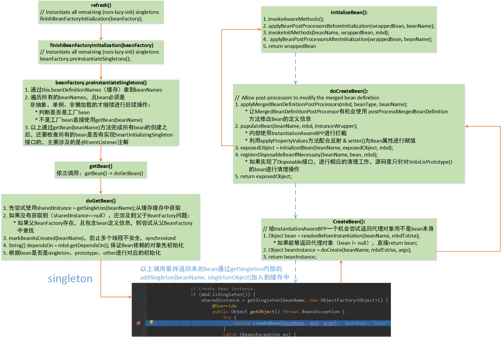

## Bean创建完成

refresh()中方法包括：

> 1. prepareRefresh(); 
> 2. ConfigurableListableBeanFactory beanFactory = obtainFreshBeanFactory();
> 3. prepareBeanFactory();
> 4. postProcessorBeanFactory();
> 5. invokeBeanFactoryPostProcessors(beanFactory);
> 6. registerBeanPostProcessor(beanFactory);
> 7. initMessageSource();
> 8. initApplicationEventMulticaster();
> 9. onRefresh();
> 10. registerListeners();
> 11. **finishBeanFactoryInitialization(beanFactory);**
> 12. **finishRefresh();**

### 1.1 finishBeanFactoryInitialization(beanFactory)
finishBeanFactoryInitialization(beanFactory)初始化所有剩下的单实例Bean，整体流程图：



总体流程：
- beanFactory.preInstantiateSingletons()
    - 通过this.beanDefinitionNames（是一个List缓存）拿到所有beanNames
    - 遍历所有的beanNames，如果beanName对应的bean是**非抽象、单例、非懒加载的**，才进行一下判断：
        - 判断是否是工厂bean，执行相应的方法
        - 不是工厂bean直接调用getBean(beanName)方法
    - getBean()方法完成所有Bean创建之后，还要检查所有的bean中是否有是SmartInitializingSingleton接口的，
    如果有，就执行smartSingleton.afterSingletonsInstantiated();方法
```java
@Override
public void preInstantiateSingletons() throws BeansException {
    if (this.logger.isDebugEnabled()) {
        this.logger.debug("Pre-instantiating singletons in " + this);
    }

    // Iterate over a copy to allow for init methods which in turn register new bean definitions.
    // While this may not be part of the regular factory bootstrap, it does otherwise work fine.
    // this.beanDefinitionNames是一个缓存，保存所有的beanNames
    List<String> beanNames = new ArrayList<String>(this.beanDefinitionNames);

    // Trigger initialization of all non-lazy singleton beans...
    // 遍历所有的beanNames
    for (String beanName : beanNames) {
        RootBeanDefinition bd = getMergedLocalBeanDefinition(beanName);
        if (!bd.isAbstract() && bd.isSingleton() && !bd.isLazyInit()) {
            // 判断对应的bean是否是工厂bean
            if (isFactoryBean(beanName)) {
                final FactoryBean<?> factory = (FactoryBean<?>) getBean(FACTORY_BEAN_PREFIX + beanName);
                boolean isEagerInit;
                if (System.getSecurityManager() != null && factory instanceof SmartFactoryBean) {
                    isEagerInit = AccessController.doPrivileged(new PrivilegedAction<Boolean>() {
                        @Override
                        public Boolean run() {
                            return ((SmartFactoryBean<?>) factory).isEagerInit();
                        }
                    }, getAccessControlContext());
                }
                else {
                    isEagerInit = (factory instanceof SmartFactoryBean &&
                            ((SmartFactoryBean<?>) factory).isEagerInit());
                }
                if (isEagerInit) {
                    getBean(beanName);
                }
            }
            // 如果不是工厂bean直接调用getBean(beanName)方法
            else {
                getBean(beanName);
            }
        }
    }
    // 以上通过getBean(beanName)方法完成所有bean的创建，
    // 接着检查所有的bean中是否有是SmartInitializingSingleton接口的
    // 这一步主要涉及的是@EventListener注解
    // Trigger post-initialization callback for all applicable beans...
    for (String beanName : beanNames) {
        Object singletonInstance = getSingleton(beanName);
        if (singletonInstance instanceof SmartInitializingSingleton) {
            final SmartInitializingSingleton smartSingleton = (SmartInitializingSingleton) singletonInstance;
            if (System.getSecurityManager() != null) {
                AccessController.doPrivileged(new PrivilegedAction<Object>() {
                    @Override
                    public Object run() {
                        smartSingleton.afterSingletonsInstantiated();
                        return null;
                    }
                }, getAccessControlContext());
            }
            else {
                smartSingleton.afterSingletonsInstantiated();
            }
        }
    }
}
```
- getBean(beanName)接着调用doGetBean()
- doGetBean():
    - 先尝试使用sharedInstance=getSingleton(beanName);从缓存中获取
    - 如果没有获取到（sharedInstance==null），还要考虑是否父BeanFactory存在，且父BeanFactory中包含对应bean定义信息
    则尝试从父BeanFactory中查找
    - markBeanAsCreated(beanName)，使用synchronized方法多个线程对同一个bean进行初始化，保证写线程安全
    - String\[] dependsOn = mbd.getDependsOn();保证Bean依赖的对象先初始化
    - 根据bean是singleton、prototype、other进行对应的初始化
```java
protected <T> T doGetBean(
        final String name, final Class<T> requiredType, final Object[] args, boolean typeCheckOnly)
        throws BeansException {

    final String beanName = transformedBeanName(name);
    Object bean;

    // Eagerly check singleton cache for manually registered singletons.
    // 尝试从缓存中查找
    Object sharedInstance = getSingleton(beanName);
    if (sharedInstance != null && args == null) {
        if (logger.isDebugEnabled()) {
            if (isSingletonCurrentlyInCreation(beanName)) {
                logger.debug("Returning eagerly cached instance of singleton bean '" + beanName +
                        "' that is not fully initialized yet - a consequence of a circular reference");
            }
            else {
                logger.debug("Returning cached instance of singleton bean '" + beanName + "'");
            }
        }
        bean = getObjectForBeanInstance(sharedInstance, name, beanName, null);
    }
    else {
        // Fail if we're already creating this bean instance:
        // We're assumably within a circular reference.
        if (isPrototypeCurrentlyInCreation(beanName)) {
            throw new BeanCurrentlyInCreationException(beanName);
        }

        // 如果父BeanFactory存在，且包含了bean的定义信息
        // Check if bean definition exists in this factory.
        BeanFactory parentBeanFactory = getParentBeanFactory();
        if (parentBeanFactory != null && !containsBeanDefinition(beanName)) {
            // Not found -> check parent.
            String nameToLookup = originalBeanName(name);
            if (args != null) {
                // Delegation to parent with explicit args.
                // 尝试在父BeanFactory中获取
                return (T) parentBeanFactory.getBean(nameToLookup, args);
            }
            else {
                // No args -> delegate to standard getBean method.
                return parentBeanFactory.getBean(nameToLookup, requiredType);
            }
        }

        // 多线程安全，synchronized标记对应的bean已经被创建
        if (!typeCheckOnly) {
            markBeanAsCreated(beanName);
        }

        try {
            final RootBeanDefinition mbd = getMergedLocalBeanDefinition(beanName);
            checkMergedBeanDefinition(mbd, beanName, args);

            // Guarantee initialization of beans that the current bean depends on.
            // 如果该bean对象有依赖的bean，则先创建所依赖的bean
            String[] dependsOn = mbd.getDependsOn();
            if (dependsOn != null) {
                for (String dep : dependsOn) {
                    if (isDependent(beanName, dep)) {
                        throw new BeanCreationException(mbd.getResourceDescription(), beanName,
                                "Circular depends-on relationship between '" + beanName + "' and '" + dep + "'");
                    }
                    registerDependentBean(dep, beanName);
                    try {
                        getBean(dep);
                    }
                    catch (NoSuchBeanDefinitionException ex) {
                        throw new BeanCreationException(mbd.getResourceDescription(), beanName,
                                "'" + beanName + "' depends on missing bean '" + dep + "'", ex);
                    }
                }
            }

            // 以下根据bean的类型，分别调用不同的方法创建bean
            // Create bean instance.
            if (mbd.isSingleton()) {
                sharedInstance = getSingleton(beanName, new ObjectFactory<Object>() {
                    @Override
                    public Object getObject() throws BeansException {
                        try {
                            // 单例bean实际调用的是该方法
                            return createBean(beanName, mbd, args);
                        }
                        catch (BeansException ex) {
                            // Explicitly remove instance from singleton cache: It might have been put there
                            // eagerly by the creation process, to allow for circular reference resolution.
                            // Also remove any beans that received a temporary reference to the bean.
                            destroySingleton(beanName);
                            throw ex;
                        }
                    }
                });
                bean = getObjectForBeanInstance(sharedInstance, name, beanName, mbd);
            }

            else if (mbd.isPrototype()) {
                // It's a prototype -> create a new instance.
                Object prototypeInstance = null;
                try {
                    beforePrototypeCreation(beanName);
                    prototypeInstance = createBean(beanName, mbd, args);
                }
                finally {
                    afterPrototypeCreation(beanName);
                }
                bean = getObjectForBeanInstance(prototypeInstance, name, beanName, mbd);
            }

            else {
                String scopeName = mbd.getScope();
                final Scope scope = this.scopes.get(scopeName);
                if (scope == null) {
                    throw new IllegalStateException("No Scope registered for scope name '" + scopeName + "'");
                }
                try {
                    Object scopedInstance = scope.get(beanName, new ObjectFactory<Object>() {
                        @Override
                        public Object getObject() throws BeansException {
                            beforePrototypeCreation(beanName);
                            try {
                                return createBean(beanName, mbd, args);
                            }
                            finally {
                                afterPrototypeCreation(beanName);
                            }
                        }
                    });
                    bean = getObjectForBeanInstance(scopedInstance, name, beanName, mbd);
                }
                catch (IllegalStateException ex) {
                    throw new BeanCreationException(beanName,
                            "Scope '" + scopeName + "' is not active for the current thread; consider " +
                            "defining a scoped proxy for this bean if you intend to refer to it from a singleton",
                            ex);
                }
            }
        }
        catch (BeansException ex) {
            cleanupAfterBeanCreationFailure(beanName);
            throw ex;
        }
    }

    // Check if required type matches the type of the actual bean instance.
    if (requiredType != null && bean != null && !requiredType.isInstance(bean)) {
        try {
            return getTypeConverter().convertIfNecessary(bean, requiredType);
        }
        catch (TypeMismatchException ex) {
            if (logger.isDebugEnabled()) {
                logger.debug("Failed to convert bean '" + name + "' to required type '" +
                        ClassUtils.getQualifiedName(requiredType) + "'", ex);
            }
            throw new BeanNotOfRequiredTypeException(name, requiredType, bean.getClass());
        }
    }
    return (T) bean;
}
```
- 考虑bean是单实例的，通过getSingleton中重写的**getObject()**方法，内部**createBean**来完成bean的创建

.png)

- createBean():
    - 给InstantiationAwareBeanPostProcessor一个机会，尝试返回bean的代理对象（如果能够返回代理对象，直接return结束），而不是bean对象本身。
    - 如果不能返回代理对象，继续调用Object beanInstance = doCreateBean(beanName, mbdToUse, args);
    - return beanInstance;
```java
@Override
protected Object createBean(String beanName, RootBeanDefinition mbd, Object[] args) throws BeanCreationException {
    if (logger.isDebugEnabled()) {
        logger.debug("Creating instance of bean '" + beanName + "'");
    }
    RootBeanDefinition mbdToUse = mbd;

    // Make sure bean class is actually resolved at this point, and
    // clone the bean definition in case of a dynamically resolved Class
    // which cannot be stored in the shared merged bean definition.
    Class<?> resolvedClass = resolveBeanClass(mbd, beanName);
    if (resolvedClass != null && !mbd.hasBeanClass() && mbd.getBeanClassName() != null) {
        mbdToUse = new RootBeanDefinition(mbd);
        mbdToUse.setBeanClass(resolvedClass);
    }

    // Prepare method overrides.
    try {
        mbdToUse.prepareMethodOverrides();
    }
    catch (BeanDefinitionValidationException ex) {
        throw new BeanDefinitionStoreException(mbdToUse.getResourceDescription(),
                beanName, "Validation of method overrides failed", ex);
    }

    try {
        // 给InstantiationAwareBeanPostProcessor一个机会返回代理对象，而不是返回bean对象本身
        // Give BeanPostProcessors a chance to return a proxy instead of the target bean instance.
        Object bean = resolveBeforeInstantiation(beanName, mbdToUse);
        // 如果能返回bean的代理对象，直接返回
        if (bean != null) {
            return bean;
        }
    }
    catch (Throwable ex) {
        throw new BeanCreationException(mbdToUse.getResourceDescription(), beanName,
                "BeanPostProcessor before instantiation of bean failed", ex);
    }
    // 不能返回代理对象，则继续执行doCreatebean()方法
    Object beanInstance = doCreateBean(beanName, mbdToUse, args);
    if (logger.isDebugEnabled()) {
        logger.debug("Finished creating instance of bean '" + beanName + "'");
    }
    return beanInstance;
}
```
- doCreateBean():
    - 让MergedBeanDefinitionPostProcessor有机会试用postProcessorMergedBeanDefinition方法修改Bean的定义信息
    - populateBean(beanName, mbd, instanceWrapper);
        - 内部使用InstantiationAwareBeanBeanPostProcessor进行拦截
        - 利用applyPropertyValues方法配合反射&setter()方法对bean属性进行赋值
    - exposedObject = initializedBean(beanName, exposedObject, mbd);进行bean的初始化工作
    - registerDisposableBeanIfNecessary(beanName, bean, mbd)：如果bean实现了Disposable接口，进行相应的清理工作，注意源码里有明确说明
    只会针对 **!mbd.isPrototype()** 的bean进行清理操作
    - return exposedObject;
```java
protected Object doCreateBean(final String beanName, final RootBeanDefinition mbd, final Object[] args)
        throws BeanCreationException {

    // Instantiate the bean.
    BeanWrapper instanceWrapper = null;
    if (mbd.isSingleton()) {
        instanceWrapper = this.factoryBeanInstanceCache.remove(beanName);
    }
    if (instanceWrapper == null) {
        instanceWrapper = createBeanInstance(beanName, mbd, args);
    }
    final Object bean = (instanceWrapper != null ? instanceWrapper.getWrappedInstance() : null);
    Class<?> beanType = (instanceWrapper != null ? instanceWrapper.getWrappedClass() : null);
    mbd.resolvedTargetType = beanType;

    // Allow post-processors to modify the merged bean definition.
    synchronized (mbd.postProcessingLock) {
        if (!mbd.postProcessed) {
            try {
                // 给MergedBeanDefinitionPostProcessor一个机会，尝试修改bean的定义信息
                applyMergedBeanDefinitionPostProcessors(mbd, beanType, beanName);
            }
            catch (Throwable ex) {
                throw new BeanCreationException(mbd.getResourceDescription(), beanName,
                        "Post-processing of merged bean definition failed", ex);
            }
            mbd.postProcessed = true;
        }
    }

    // Eagerly cache singletons to be able to resolve circular references
    // even when triggered by lifecycle interfaces like BeanFactoryAware.
    boolean earlySingletonExposure = (mbd.isSingleton() && this.allowCircularReferences &&
            isSingletonCurrentlyInCreation(beanName));
    if (earlySingletonExposure) {
        if (logger.isDebugEnabled()) {
            logger.debug("Eagerly caching bean '" + beanName +
                    "' to allow for resolving potential circular references");
        }
        addSingletonFactory(beanName, new ObjectFactory<Object>() {
            @Override
            public Object getObject() throws BeansException {
                return getEarlyBeanReference(beanName, mbd, bean);
            }
        });
    }

    // Initialize the bean instance.
    Object exposedObject = bean;
    try {
        // 为bean对象属性赋值
        // 内部其实使用applyPropertyValues方法配合反射和setter()方法给bean属性赋值
        populateBean(beanName, mbd, instanceWrapper);
        if (exposedObject != null) {
            // 开始初始化bean对象
            exposedObject = initializeBean(beanName, exposedObject, mbd);
        }
    }
    catch (Throwable ex) {
        if (ex instanceof BeanCreationException && beanName.equals(((BeanCreationException) ex).getBeanName())) {
            throw (BeanCreationException) ex;
        }
        else {
            throw new BeanCreationException(
                    mbd.getResourceDescription(), beanName, "Initialization of bean failed", ex);
        }
    }

    if (earlySingletonExposure) {
        Object earlySingletonReference = getSingleton(beanName, false);
        if (earlySingletonReference != null) {
            if (exposedObject == bean) {
                exposedObject = earlySingletonReference;
            }
            else if (!this.allowRawInjectionDespiteWrapping && hasDependentBean(beanName)) {
                String[] dependentBeans = getDependentBeans(beanName);
                Set<String> actualDependentBeans = new LinkedHashSet<String>(dependentBeans.length);
                for (String dependentBean : dependentBeans) {
                    if (!removeSingletonIfCreatedForTypeCheckOnly(dependentBean)) {
                        actualDependentBeans.add(dependentBean);
                    }
                }
                if (!actualDependentBeans.isEmpty()) {
                    throw new BeanCurrentlyInCreationException(beanName,
                            "Bean with name '" + beanName + "' has been injected into other beans [" +
                            StringUtils.collectionToCommaDelimitedString(actualDependentBeans) +
                            "] in its raw version as part of a circular reference, but has eventually been " +
                            "wrapped. This means that said other beans do not use the final version of the " +
                            "bean. This is often the result of over-eager type matching - consider using " +
                            "'getBeanNamesOfType' with the 'allowEagerInit' flag turned off, for example.");
                }
            }
        }
    }

    // Register bean as disposable.
    try {
        registerDisposableBeanIfNecessary(beanName, bean, mbd);
    }
    catch (BeanDefinitionValidationException ex) {
        throw new BeanCreationException(
                mbd.getResourceDescription(), beanName, "Invalid destruction signature", ex);
    }

    return exposedObject;
}
```
- initializeBean():
    - invokeAwareMethods();
    - applyBeanPostProcessorBeforeInitialization(wrappedBean, beanName);
    - invokeInitMethods();
    - applyBeanPostProcessorAfterInitialization(wrappedBean, beanName);
    - return wrappedBean;
```java
// initializeBean内部四个方法之前都有过介绍
protected Object initializeBean(final String beanName, final Object bean, RootBeanDefinition mbd) {
    if (System.getSecurityManager() != null) {
        AccessController.doPrivileged(new PrivilegedAction<Object>() {
            @Override
            public Object run() {
                invokeAwareMethods(beanName, bean);
                return null;
            }
        }, getAccessControlContext());
    }
    else {
        // 激活Aware接口相关的方法
        invokeAwareMethods(beanName, bean);
    }

    Object wrappedBean = bean;
    if (mbd == null || !mbd.isSynthetic()) {
        // BeanPostProcessor的applyBeanPostProcessorsBeforeInitialization方法
        wrappedBean = applyBeanPostProcessorsBeforeInitialization(wrappedBean, beanName);
    }

    try {
        // 激活@Bean注解中init-method方法（如果有的话）
        invokeInitMethods(beanName, wrappedBean, mbd);
    }
    catch (Throwable ex) {
        throw new BeanCreationException(
                (mbd != null ? mbd.getResourceDescription() : null),
                beanName, "Invocation of init method failed", ex);
    }
    if (mbd == null || !mbd.isSynthetic()) {
        // BeanPostProcessor的applyBeanPostProcessorsAfterInitialization方法
        wrappedBean = applyBeanPostProcessorsAfterInitialization(wrappedBean, beanName);
    }
    return wrappedBean;
}
```

### 1.2 finishRefresh()
finishRefresh();完成BeanFactory的初始化创建工作，这一步之后IOC容器就创建完成。
- initLifecycleProcessor()：初始化和生命周期相关的BeanPostProcessor【LifecycleProcessor】：
    - 默认情况下是从容器中寻找是否有id为lifecycleProcessor组件，如果没有就new DefaultLifecycleProcessor()，
    并加入到IOC容器中。
    - 也可以编写一个LifecycleProcessor的实现类，并重写它的onRefresh()和onClose()方法
- getLifecycleProcessor().onRefresh()：回调生命周期处理器的onRefresh()方法
- publishEvent(new ContextRefreshedEvent(this))：发布容器刷新完成事件
```java
protected void finishRefresh() {
    // Initialize lifecycle processor for this context.
    initLifecycleProcessor();

    // Propagate refresh to lifecycle processor first.
    getLifecycleProcessor().onRefresh();

    // Publish the final event.
    publishEvent(new ContextRefreshedEvent(this));

    // Participate in LiveBeansView MBean, if active.
    LiveBeansView.registerApplicationContext(this);
}
```