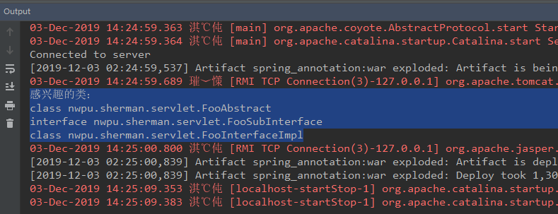

## Servlet3.0使用

### 1.1 简介和测试
Servlet3.0规范是JavaEE6.0规范中的子规范。其要求运行环境最低是JDK6.0，Tomcat7.0。而之前学习的Servlet2.5版本的规范，是JavaEE5.0规范的子规范。其要求运行环境最低是JDK5.0，Tomcat5.0。
在创建Web工程时，如果使用的是Servlet3.0规范，则可以选择不创建web.xml文件。Servlet3.0规范中允许在定义Servlet、Filter和Listener三大组件时使用注解，而不用在web.xml中进行注册。

**@WebServlet注解注册Servlet**：
```java
/**
 * 使用@WebSErvlet注解注册一个Servlet
 *
 * @author sherman
 */
@WebServlet(value = "/hello")
public class HelloServlet extends HttpServlet {

    @Override
    protected void doGet(HttpServletRequest req, HttpServletResponse resp) throws ServletException, IOException {
        resp.getWriter().write("hello servlet3.0!");
    }
}
```

将项目部署到Tomcat上，然后启动应用，访问 **http://localhost:8080/spring_annotation_war_exploded/hello** 路径就能看到页面输出：hello servlet3.0!

Servlet中三大组件使用方式相同，分别借助：@WebServlet、@WebFilter、@WebListener。

### 1.2 ServletContainerInitializer
在Servlet3.0注解和可插拔性中有一个重要机制：**shared libraries/ runtime pluggability**，该机制在之后的框架整合中应用非常广泛。

具体来说：

当Tomcat启动应用时候，会扫描当前应用每一个jar包里面**META-INF/services/javax.servlet.ServletContainerInitializer**指定的实现类，启动并运行这个实现类的方法。

测试：最终将它放在src/main/resources/META-INF/services/javax.servlet.ServletContainerInitializer处是有效的。

- 新建一个ServletContainerInitializer接口的实现类FooServletContainerInitializer
- 将FooServletContainerInitializer类的全限定类名放在javax.servlet.ServletContainerInitializer中
- 新建FooServletContainerInitializer的抽象类、子接口、实现类用于测试：
    - FooAbstract
    - FooSubInterface
    - FooInterfaceImpl
- 在FooServletContainerInitializer上使用@HandlesTypes注解表明感兴趣的类
```java
/**
 * 自定义ServletContainerInitializer接口的实现类
 * 容器启动的时候会将@HandlersTypes指定类型所有的子类（实现类、抽象类、子接口）传递过来
 *
 * @author sherman
 */

@HandlesTypes({FooInterface.class})
public class FooServletContainerInitializer implements ServletContainerInitializer {
    @Override
    public void onStartup(Set<Class<?>> set, ServletContext servletContext) throws ServletException {
        System.out.println("感兴趣的类：");
        for (Class<?> clazz : set) {
            System.out.println(clazz);
        }
    }
}
```
- 启动容器查看输出结果：



### 1.3 使用ServletContext注册三大组件
Servlet3.0对于ServletContext进行了功能增强，可以对Servlet、Filter及Listener进行动态注册。所谓动态注册是指：Web应用在运行过程中通过代码对Servlet、Filter或者Listener进行注册，为了系统安全考虑，这个动态注册是有限制的：只能在应用启动时进行，而不能在应用运行过程中进行注册。这个应用启动的时间点，可以通过ServletContextListener监听器来监听。

具体实现：
- 新建三个组件DynamicFilter、DynamicListener、DynamicFilter，但是不使用@WebServlet、@WebFilter、@WebListener注解
```java
/**
 * 动态创建Servlet：注意这个Servlet没有@WebServlet注解
 *
 * @author sherman
 */
public class DynamicServlet extends HttpServlet {

    @Override
    protected void doGet(HttpServletRequest request, HttpServletResponse response) throws ServletException, IOException {
        response.getWriter().write("dynamicServlet");
    }
}

/**
 * @author sherman
 */
public class DynamicListener implements ServletContextListener {
    @Override
    public void contextInitialized(ServletContextEvent sce) {
        System.out.println("DynamicListener...contextInitialized...");
    }

    @Override
    public void contextDestroyed(ServletContextEvent sce) {

    }
}

/**
 * DynamicFilter：注意这个Filter是动态注册的，没有@WebFilter注解
 *
 * @author sherman
 */
public class DynamicFilter implements Filter {
    @Override
    public void init(FilterConfig filterConfig) throws ServletException {
    }

    @Override
    public void doFilter(ServletRequest servletRequest, ServletResponse servletResponse, FilterChain filterChain) throws IOException, ServletException {
        System.out.println("DynamicFilter...doFilter...");
        filterChain.doFilter(servletRequest, servletResponse);
    }

    @Override
    public void destroy() {
    }
}
```
- 使用ServletContext进行动态注册，以FooServletContainerInitializer类的onStartup()方法为例，该方法的第二个参数就是ServletContext：
```java
@Override
public void onStartup(Set<Class<?>> set, ServletContext sc) throws ServletException {
    System.out.println("感兴趣的类：");
    for (Class<?> clazz : set) {
        System.out.println(clazz);
    }

    // 注册Servlet组件
    ServletRegistration.Dynamic dynamicServlet = sc.addServlet("dynamicServlet", new DynamicServlet());
    // 配置映射信息
    dynamicServlet.addMapping("/dynamic");

    // 注册Listener
    sc.addListener(DynamicListener.class);

    // 注册Filter
    FilterRegistration.Dynamic dynamicFilter = sc.addFilter("dynamicFilter", DynamicFilter.class);
    dynamicFilter.addMappingForUrlPatterns(EnumSet.of(DispatcherType.REQUEST), true, "/*");
}
```
这样组件就在运行期间，通过ServletContext注册进容器中了。访问 **http://localhost:8080/spring_annotation_war_exploded/dynamic** 路径也会有相应的消息输出。