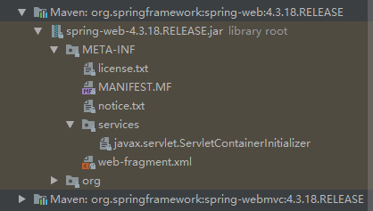
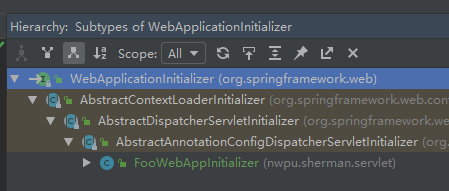

## 整合SpringMVC

### 1.1全注解整合SpringMVC原理
**SpringMVC全注解原理：**
在web容器启动时候，会扫描每个jar包下 **META-INF/services/java.servlet.ServletContainInitializer** 文件，并加载该文件中指定的类。查看spring-web-4.3.18.jar:



该文件中对应指定的类为：**org.springframework.web.SpringServletContainerInitializer** ，也就是说当web容器启动时候，会自动加载SpringServletContainerInitializer这个类。

下面继续分析SpringServletContainerInitializer类源码：
```java
// 指定感兴趣的类型是WebApplicationInitializer，也就是会向onStartup方法的第一个参数中传递
// WebApplicationInitializer的子类型
@HandlesTypes(WebApplicationInitializer.class)
public class SpringServletContainerInitializer implements ServletContainerInitializer {

    public abstract class AbstractAnnotationConfigDispatcherServletInitializer
		extends AbstractDispatcherServletInitializer {

	/**
	 * {@inheritDoc}
	 * <p>This implementation creates an {@link AnnotationConfigWebApplicationContext},
	 * providing it the annotated classes returned by {@link #getRootConfigClasses()}.
	 * Returns {@code null} if {@link #getRootConfigClasses()} returns {@code null}.
	 */
	@Override
	protected WebApplicationContext createRootApplicationContext() {
		Class<?>[] configClasses = getRootConfigClasses();
		if (!ObjectUtils.isEmpty(configClasses)) {
			AnnotationConfigWebApplicationContext rootAppContext = new AnnotationConfigWebApplicationContext();
			rootAppContext.register(configClasses);
			return rootAppContext;
		}
		else {
			return null;
		}
	}

	/**
	 * {@inheritDoc}
	 * <p>This implementation creates an {@link AnnotationConfigWebApplicationContext},
	 * providing it the annotated classes returned by {@link #getServletConfigClasses()}.
	 */
	@Override
	protected WebApplicationContext createServletApplicationContext() {
		AnnotationConfigWebApplicationContext servletAppContext = new AnnotationConfigWebApplicationContext();
		Class<?>[] configClasses = getServletConfigClasses();
		if (!ObjectUtils.isEmpty(configClasses)) {
			servletAppContext.register(configClasses);
		}
		return servletAppContext;
	}

	/**
	 * Specify {@link org.springframework.context.annotation.Configuration @Configuration}
	 * and/or {@link org.springframework.stereotype.Component @Component} classes to be
	 * provided to the {@linkplain #createRootApplicationContext() root application context}.
	 * @return the configuration classes for the root application context, or {@code null}
	 * if creation and registration of a root context is not desired
	 */
	protected abstract Class<?>[] getRootConfigClasses();

	/**
	 * Specify {@link org.springframework.context.annotation.Configuration @Configuration}
	 * and/or {@link org.springframework.stereotype.Component @Component} classes to be
	 * provided to the {@linkplain #createServletApplicationContext() dispatcher servlet
	 * application context}.
	 * @return the configuration classes for the dispatcher servlet application context or
	 * {@code null} if all configuration is specified through root config classes.
	 */
	protected abstract Class<?>[] getServletConfigClasses();

}

}
```

上述源码分析中：SpringServletContainerInitializer感兴趣的类型为：**WebApplicationInitializer**，并会将其子类型传递到重写方法onStartup的第一个参数中，继续查看WebApplicationInitializer有哪些子类型：



接下来依次WebApplicationInitializer接口的子类型：
- AbstractContextLoaderInitializer：
```java
public abstract class AbstractContextLoaderInitializer implements
    WebApplicationInitializer {

    protected final Log logger = LogFactory.getLog(getClass());
    
    @Override
    public void onStartup(ServletContext servletContext) throws ServletException {
        registerContextLoaderListener(servletContext);
    }
    
    protected void registerContextLoaderListener(ServletContext servletContext) {
        // 调用子类重写的createRootApplicationContext方法创建根容器
        WebApplicationContext rootAppContext = createRootApplicationContext();
        if (rootAppContext != null) {
            // 创建ContextLoader监听器，并将其加入到servletContext中
            ContextLoaderListener listener = new ContextLoaderListener(rootAppContext);
            listener.setContextInitializers(getRootApplicationContextInitializers());
            servletContext.addListener(listener);
        }
        else {
            logger.debug("No ContextLoaderListener registered, as " +
                    "createRootApplicationContext() did not return an application context");
        }
    }
    
    protected abstract WebApplicationContext createRootApplicationContext();
    
    protected ApplicationContextInitializer<?>[] getRootApplicationContextInitializers() {
        return null;
    }
}
```
- AbstractDispatcherServletInitializer：
    - 创建一个web的IOC容器：createServletApplicationContext();
    - 创建DispatcherServlet：createDispatcherServlet();
    - 将创建的DispatcherServlet添加到ServletContext中;
```java
public abstract class AbstractDispatcherServletInitializer extends AbstractContextLoaderInitializer {

    public static final String DEFAULT_SERVLET_NAME = "dispatcher";
    
    @Override
    public void onStartup(ServletContext servletContext) throws ServletException {
        super.onStartup(servletContext);
        registerDispatcherServlet(servletContext);
    }
    
    protected void registerDispatcherServlet(ServletContext servletContext) {
        String servletName = getServletName();
        Assert.hasLength(servletName, "getServletName() must not return empty or null");
    
        // 创建一个Web的IOC容器
        WebApplicationContext servletAppContext = createServletApplicationContext();
        Assert.notNull(servletAppContext,
                "createServletApplicationContext() did not return an application " +
                "context for servlet [" + servletName + "]");
    
        // 创建DispatcherServlet，并将其放入IOC容器中
        FrameworkServlet dispatcherServlet = createDispatcherServlet(servletAppContext);
        dispatcherServlet.setContextInitializers(getServletApplicationContextInitializers());
        // 使用动态Servlet注册
        ServletRegistration.Dynamic registration = servletContext.addServlet(servletName, dispatcherServlet);
        Assert.notNull(registration,
                "Failed to register servlet with name '" + servletName + "'." +
                "Check if there is another servlet registered under the same name.");
    
        registration.setLoadOnStartup(1);
        registration.addMapping(getServletMappings());
        registration.setAsyncSupported(isAsyncSupported());
    
        // 注册过滤器
        Filter[] filters = getServletFilters();
        if (!ObjectUtils.isEmpty(filters)) {
            for (Filter filter : filters) {
                registerServletFilter(servletContext, filter);
            }
        }
    
        customizeRegistration(registration);
    }
    
    protected String getServletName() {
        return DEFAULT_SERVLET_NAME;
    } 
    protected abstract WebApplicationContext createServletApplicationContext();
    
    protected FrameworkServlet createDispatcherServlet(WebApplicationContext servletAppContext) {
        return new DispatcherServlet(servletAppContext);
    }
    
    protected ApplicationContextInitializer<?>[] getServletApplicationContextInitializers() {
        return null;
    }
    
    // 由子类实现指定Mapping
    protected abstract String[] getServletMappings();
    
    protected Filter[] getServletFilters() {
        return null;
    }
    
    protected FilterRegistration.Dynamic registerServletFilter(ServletContext servletContext, Filter filter) {
        String filterName = Conventions.getVariableName(filter);
        Dynamic registration = servletContext.addFilter(filterName, filter);
        if (registration == null) {
            int counter = -1;
            while (counter == -1 || registration == null) {
                counter++;
                registration = servletContext.addFilter(filterName + "#" + counter, filter);
                Assert.isTrue(counter < 100,
                        "Failed to register filter '" + filter + "'." +
                        "Could the same Filter instance have been registered already?");
            }
        }
        registration.setAsyncSupported(isAsyncSupported());
        registration.addMappingForServletNames(getDispatcherTypes(), false, getServletName());
        return registration;
    }
    
    private EnumSet<DispatcherType> getDispatcherTypes() {
        return (isAsyncSupported() ?
                EnumSet.of(DispatcherType.REQUEST, DispatcherType.FORWARD, DispatcherType.INCLUDE, DispatcherType.ASYNC) :
                EnumSet.of(DispatcherType.REQUEST, DispatcherType.FORWARD, DispatcherType.INCLUDE));
    }
    
    protected boolean isAsyncSupported() {
        return true;
    }
    
    protected void customizeRegistration(ServletRegistration.Dynamic registration) {
    }
}
```
- AbstractAnnotationConfigDispatcherServletInitializer：利用注解方式配置的DispatcherServlet初始化器
    - 创建根容器：createRootApplicationContext();
    - 创建Web IOC容器：createServletApplicationContext();
    - 根容器和Web IOC容器形成父子容器
```java
public abstract class AbstractAnnotationConfigDispatcherServletInitializer
    extends AbstractDispatcherServletInitializer {

    @Override
    protected WebApplicationContext createRootApplicationContext() {
        Class<?>[] configClasses = getRootConfigClasses();
        if (!ObjectUtils.isEmpty(configClasses)) {
            // 创建根容器
            AnnotationConfigWebApplicationContext rootAppContext = new AnnotationConfigWebApplicationContext();
            // 指定配置类
            rootAppContext.register(configClasses);
            return rootAppContext;
        }
        else {
            return null;
        }
    }
    
    @Override
    protected WebApplicationContext createServletApplicationContext() {
        // 创建web ioc容器
        AnnotationConfigWebApplicationContext servletAppContext = new AnnotationConfigWebApplicationContext();
        // 抽象类，需要自己实现
        Class<?>[] configClasses = getServletConfigClasses();
        if (!ObjectUtils.isEmpty(configClasses)) {
            // 注册配置类
            servletAppContext.register(configClasses);
        }
        return servletAppContext;
    }
    
    protected abstract Class<?>[] getRootConfigClasses();
    
    protected abstract Class<?>[] getServletConfigClasses();
}
```
**总结**：使用注解方式启动SpringMVC，就是要继承AbstractAnnotationConfigDispatcherServletInitializer，实现抽象方法指定DispatcherServlet的配置信息。

### 1.2 全注解启动SpringMVC示例
**环境准备**：

- 全注解方式整合SpringMVC，可以先将WEB-INF/目录下的两个文件 **applicationContext.xml** 和 **dispatcher-servlet.xml**文件删除，
然后将web.xml文件也删除
- pom.xml文件中导入相关依赖，同时因为删除web.xml，可以在pom.xml中加入插件防止不报错：
```xml
<!-- 防止因为删除了web.xml文件报错 -->
<build>
    <plugins>
        <plugin>
            <groupId>org.apache.maven.plugins</groupId>
            <artifactId>maven-war-plugin</artifactId>
            <configuration>
                <failOnMissingWebXml>false</failOnMissingWebXml>
            </configuration>
        </plugin>
    </plugins>
</build>

<dependency>
    <groupId>javax.servlet</groupId>
    <artifactId>javax.servlet-api</artifactId>
    <version>4.0.1</version>
</dependency>

<dependency>
    <groupId>org.springframework</groupId>
    <artifactId>spring-webmvc</artifactId>
    <version>4.3.18.RELEASE</version>
</dependency>
```

**自定义AbstractAnnotationConfigDispatcherServlet实现类**
```java
public class WebAppInitializerImpl extends AbstractAnnotationConfigDispatcherServletInitializer {
    /**
     * 获取根容器配置类，指定Spring的配置类
     */
    @Override
    protected Class<?>[] getRootConfigClasses() {
        return new Class<?>[]{RootConfig.class};
    }

    /**
     * 获取web容器的配置类，指定SpringMVC的配置类
     */
    @Override
    protected Class<?>[] getServletConfigClasses() {
        return new Class<?>[]{AppConfig.class};
    }

    /**
     * 获取DispatcherServlet的映射信息，注意不要写成/*
     * 因为它要拦截所有请求，但是不包括：*.jsp
     * /*：会把*.jsp也拦截了，导致jsp页面无法查看
     */
    @Override
    protected String[] getServletMappings() {
        return new String[]{"/"};
    }
}
```

**指定父子容器的配置类**：根容器扫描业务逻辑相关的组件，因此要排除掉Controller，而SpringMVC只扫描Controller，两者形成**互补配置**:
```java
/**
 * Spring的配置类，不扫描Controller
 *
 * @author sherman
 */
@ComponentScan(value = "nwpu.sherman", excludeFilters = {
        @ComponentScan.Filter(type = FilterType.ANNOTATION, classes = {Controller.class})
})
public class RootConfig {
}

/**
 * SpringMvc的配置文件
 * 只扫描Controller，形成互补配置
 *
 * 注意，以为是只包含Controller，因此需要使用useDefaultFilters禁用默认规则
 * @author sherman
 */
@ComponentScan(value = "nwpu.sherman", includeFilters = {
        @ComponentScan.Filter(type = FilterType.ANNOTATION, classes = {Controller.class})
}, useDefaultFilters = false)
public class AppConfig {
}
```

**编写相关的Controller和Service辅助测试**：
```java
/**
 * @author sherman
 *
 * 辅助全注解的SpringMVC测试，有WebAppInitController调用
 */
@Service
public class WebAppInitService {
    public String say(String name) {
        return "hello: " + name;
    }
}

/**
 * 演示全注解方式启动SpringMVC是否能够正确访问
 *
 * @author sherman
 */
@Controller
public class WebAppInitController {
    @Autowired
    WebAppInitService webAppInitService;

    @ResponseBody
    @RequestMapping("/webAppInit")
    public String webAppInit() {
        String result = webAppInitService.say("sherman");
        return result;
    }
}
```

运行程序，访问对应的url，即可看到页面输出：hello: sherman


### 1.3 SpringMVC定制和接管

在SpringMVC xml方式配置中，要开启一个高级功能，需要加入：
```xml
<mvc:annotation-driven/>
```

使用全注解开发，如果要开启SpringMVC定制配置功能需要借助：**@EnableWebMvc**注解，该注解可以加载配置类上，
也可以直接加载上一小节中**AppConf**SpringMVC的配置文件上。

**定制配置组件**：包括视图解析器、视图映射、静态资源映射、拦截器等等
- 实现WebMvcConfigurer接口：但是需要实现所有的方法，比较繁琐
- 继承WebMvcConfigurerAdapter：可以定制需要配置的组件

示例说明：

直接使用AppConfig类，继承WebMvcConfigurerAdapter类：
```java
/**
 * SpringMvc的配置文件
 * 只扫描Controller，形成互补配置
 *
 * 注意：
 * 1、因为是只扫描Controller，因此需要使用useDefaultFilters禁用默认规则
 * 2、这个类不加@Configuration注解也能正常工作，但是WebAppInitController中 success()会提示找不到View Resolver
 *    且对应方法旁边没有"Related Views"的图标，加上之后就能正常显示
 *
 * @author sherman
 */
@EnableWebMvc
@ComponentScan(value = "nwpu.sherman", includeFilters = {
        @ComponentScan.Filter(type = FilterType.ANNOTATION, classes = {Controller.class})
}, useDefaultFilters = false)
@Configuration
public class AppConfig extends WebMvcConfigurerAdapter {

    /**
     * 注册ViewResolver
     */
    @Override
    public void configureViewResolvers(ViewResolverRegistry registry) {
        // 默认前缀"/WEB-INF/", 后缀".jsp"
        registry.jsp("/WEB-INF/views/", ".jsp");
    }

    /**
     * 静态资源访问
     */
    @Override
    public void configureDefaultServletHandling(DefaultServletHandlerConfigurer configurer) {
        configurer.enable();
    }

    /**
     * 定制拦截器
     */
    @Override
    public void addInterceptors(InterceptorRegistry registry) {
        /**
         * 将自定义的拦截器加入进来，拦截任意级路径
         * 也可以将拦截器注入进来，这里直接new
         */
        registry.addInterceptor(new CustomIntercept()).addPathPatterns("/**");
    }
}
```
视图解析器需要解析的视图：在webapp文件夹下新建/WEB-INF/views/success.jsp，用于视图解析器解析后跳转到指定页面

静态资源解析器：在webapp文件夹下放入pig.jpeg图片，然后/WEB-INF/views/success.jsp中加入标签

自定义的拦截器：CustomIntercept.java
```java
/**
 * @author sherman
 *
 * SpringMVC定制拦截器
 */
public class CustomIntercept implements HandlerInterceptor {
    @Override
    public boolean preHandle(HttpServletRequest request, HttpServletResponse response, Object handler) throws Exception {
        System.out.println("===============preHandle()");
        return true;
    }

    @Override
    public void postHandle(HttpServletRequest request, HttpServletResponse response, Object handler, ModelAndView modelAndView) throws Exception {
        System.out.println("===============postHandle()");
    }

    @Override
    public void afterCompletion(HttpServletRequest request, HttpServletResponse response, Object handler, Exception ex) throws Exception {
        System.out.println(("=============afterCompletion()"));
    }
}
```
访问 **http://localhost:8080/spring_annotation/success** 路径就可以看到视图解析器、静态资源解析器、拦截器都能正常工作。

