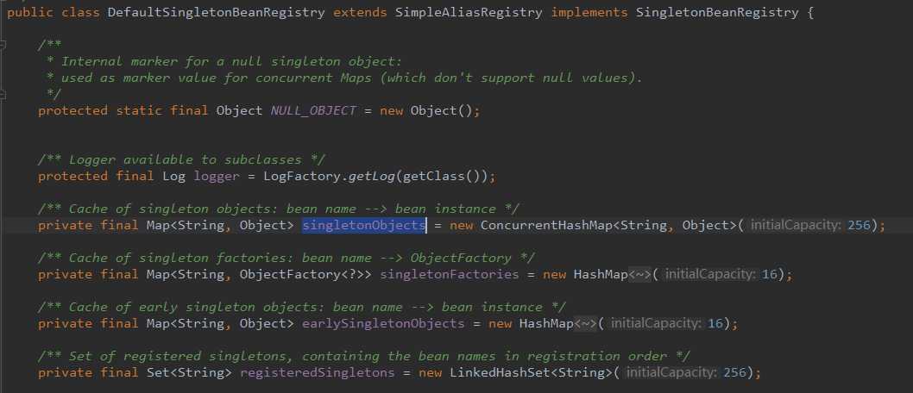

## IOC容器总结

refresh()中方法包括：

> 1. prepareRefresh(); 
> 2. ConfigurableListableBeanFactory beanFactory = obtainFreshBeanFactory();
> 3. prepareBeanFactory();
> 4. postProcessorBeanFactory();
> 5. invokeBeanFactoryPostProcessors(beanFactory);
> 6. registerBeanPostProcessor(beanFactory);
> 7. initMessageSource();
> 8. initApplicationEventMulticaster();
> 9. onRefresh();
> 10. registerListeners();
> 11. finishBeanFactoryInitialization(beanFactory);
> 12. finishRefresh();

**关于IOC容器，要把握以下几点**：
- Spring容器启动的时候，会先保存所有注册到IOC容器中定义信息，这里的注册包括：
    - xml配置中注册：\<bean>
    - 注解注册：@Service、@Repository、@Component、@Controller、@Bean等等
- Spring会在合适的时机创建这些Bean，这里合适的时机包括：
    - 懒加载：用到某个bean时候，利用getBean创建bean对象，并将其保存到IOC容器中
    - 统一创建剩下所有bean的时候：实际就是 **finishFactoryInitialization()** 方法调用过程
- :star:Bean后处理器：BeanPostProcessor：每个bean对象创建完成后，都会有各种BeanPostProcessor进行拦截，来增强bean的功能：
    - AutowiredAnnotationBeanPostProcessor：自动注入@Autowired相关
    - AnnotationAwareAspectJAutoProxyCreator：和AOP功能有关
    - AsyncAnnotationBeanPostProcessor：和异步处理相关
    - InstantiationAwareBeanPostProcessor：尝试返回bean对象的代理，而不是bean对象本身
    - MergedBeanDefinitionPostProcessor：尝试修改bean的定义信息
    - 等等
- Spring是基于事件驱动模型：
    - ApplicationListener：事件监听
    - ApplicationEventMulticaster：事件派发器
    
- :star:IOC容器：所谓IOC容器，本质上就是一系列的Map，缓存着Spring默认的组件和用户注入的组件。

