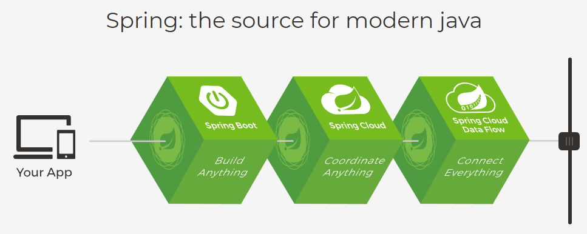
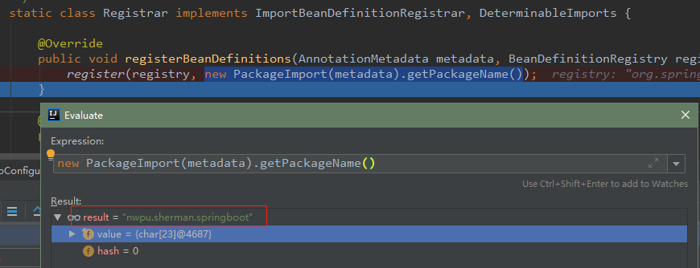
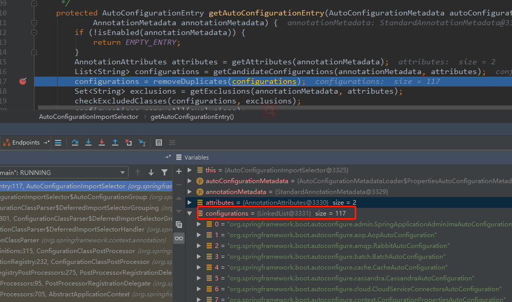

## Hello World

### 1.1 SpringBoot 简介
简化Spring应用开发的一个框架，是整个Spring技术栈的大整合，着眼于J2EE开发的一站式解决方案。
* 优点：
		 1. 快速创建独立运行的Spring项目以及与其主流框架继承
		 2. 使用嵌入式的Servlet容器，应用无需打包成WAR包
		 3. starts自动依赖和版本控制
		 4. 大量的自动配置，简化开发，也可以修改默认值
		 5. 无需配置xml，无代码生成，开箱即用
		 6. 准生产环境的运行时应用监控
		 7. 与云计算天然继承
* 缺点：学习难度大，精通困难。
### 1.2 微服务
相对于单体应用（All IN ONE，所有的服务都写在一个应用中），微服务的架构风格是一组小型的服务，通过HTTP方式进行
轻量级互通，即每一个功能元素最终都是一个可 **独立替换** 和 **独立升级** 的软件单元。



### 1.3 环境准备
* JDK1.8：Spring Boot要求JDK1.7及以上
* Maven3.x
* IDEA
* [SpringBoot 2.1.11.RELEASE](https://repo.spring.io/webapp/#/artifacts/browse/tree/General/libs-release-local/org/springframework/boot/spring-boot/2.1.11.RELEASE/spring-boot-2.1.11.RELEASE.pom)
* Maven设置：在Maven的settings.xml中加入：
```xml
<profiles>
    <profile>    
        <id>jdk-1.8</id>    
        <activation>    
            <activeByDefault>true</activeByDefault>    
            <jdk>1.8</jdk>    
        </activation>    
        <properties>    
            <maven.compiler.source>1.8</maven.compiler.source>    
            <maven.compiler.target>1.8</maven.compiler.target>    
            <maven.compiler.compilerVersion>1.8</maven.compiler.compilerVersion>    
        </properties>     
    </profile>  
</profiles>
```
* IDEA设置：在IDEA中将Maven设置为本地的Maven，不使用IDEA默认自带的Maven：
在Settings -> Build, Execution, Deployment -> Build Tools -> Maven设置。

### 1.4 Spring Boot HelloWorld
创建一个SpringBoot的Hello World项目，完成以下功能：浏览器发送hello请求，服务器接收请求并处理，响应Hello World字符串。
* 在IDEA中使用Maven方式创建一个工程：spring-boot-01-helloworld
* 导入Spring Boot相关的依赖
```xml
<parent>
    <groupId>org.springframework.boot</groupId>
    <artifactId>spring-boot-starter-parent</artifactId>
    <version>2.1.11.RELEASE</version>
</parent>

<dependencies>
    <dependency>
        <groupId>org.springframework.boot</groupId>
        <artifactId>spring-boot-starter-web</artifactId>
    </dependency>
    <dependency>
        <groupId>org.springframework.boot</groupId>
        <artifactId>spring-boot-starter-test</artifactId>
        <scope>test</scope>
    </dependency>
</dependencies>
```
* 编写一个主程序，用于启动Spring Boot应用：
```java
@SpringBootApplication
public class MainApplication {
    public static void main(String[]args) {
        SpringApplication.run(MainApplication.class, args);
    }
}
```
* 编写相关的Controller、Service
```java
@Controller
public class HelloController {
    @RequestMapping("/hello")
    @ResponseBody
    public String hello() {
        return "hello world";
    }
}
```
* 从MainApplication的main方法中启动SpringBoot应用，并访问：http\://localhost:8080/hello
* 部署Spring Boot项目，将其打包成一个可执行的Jar包：
    * 在pom.xml中加入插件：
    ```xml
    <build>
        <plugins>
            <plugin>
                <groupId>org.springframework.boot</groupId>
                <artifactId>spring-boot-maven-plugin</artifactId>
            </plugin>
        </plugins>
    </build>
    ```
    * 在IDEA中打包成Jar包：在IDEA中Maven -> spring-boot-01-helloworld -> Lifecycle中点击package命令进行打包。
* 找到对应的Jar包所在目录：执行**java -jar spring-boot-01-helloworld-1.0-SNAPSHOT.jar**启动Spring Boot应用。

### 1.5 探究——场景启动器
* POM文件：在pom.xml中依赖的父项目是：spring-boot-starter-parent
```xml
<parent>
    <groupId>org.springframework.boot</groupId>
    <artifactId>spring-boot-starter-parent</artifactId>
    <version>2.1.11.RELEASE</version>
</parent>
```
* 点击进去，发现这个父项目又依赖于：spring-boot-dependencies：
```xml
<parent>
    <groupId>org.springframework.boot</groupId>
    <artifactId>spring-boot-dependencies</artifactId>
    <version>2.1.11.RELEASE</version>
    <relativePath>../../spring-boot-dependencies</relativePath>
</parent>
```
* 再点击进去才是Spring Boot真正的依赖，在spring-boot-dependencies-2.1.11.RELEASE.pom文件中，**properties**标签中管理着Spring Boot所有依赖的版本号，它是Spring Boot的版本仲裁中心。版本仲裁中心可以让我们导入默认依赖时不需要再指定版本号，当然如果没有在dependencies中管理的依赖还是需要声明版本号。
* pom.xml中导入的依赖：spring-boot-starter-web：
```xml
<dependency>
    <groupId>org.springframework.boot</groupId>
    <artifactId>spring-boot-starter-web</artifactId>
</dependency>
```
* 继续点进去spring-boot-starter-web之后发现，其已经引入了tomcat、hibernate-validate、spring-mvc之类的依赖：
```xml
<dependency>
    <groupId>org.springframework.boot</groupId>
    <artifactId>spring-boot-starter-tomcat</artifactId>
    <version>2.1.11.RELEASE</version>
    <scope>compile</scope>
</dependency>
<dependency>
    <groupId>org.hibernate.validator</groupId>
    <artifactId>hibernate-validator</artifactId>
    <version>6.0.18.Final</version>
    <scope>compile</scope>
</dependency>
<dependency>
    <groupId>org.springframework</groupId>
    <artifactId>spring-web</artifactId>
    <version>5.1.12.RELEASE</version>
    <scope>compile</scope>
</dependency>
<dependency>
    <groupId>org.springframework</groupId>
    <artifactId>spring-webmvc</artifactId>
    <version>5.1.12.RELEASE</version>
    <scope>compile</scope>
</dependency>
```
**总结**：

Spring Boot中有很多的启动器，Spring Boot将所有功能都抽取出来，做成一个个的starter（启动器），
只需要在项目中引入这些starter，相关场景的依赖就都会被导入进来，即需要什么功能，就导入什么场景启动器。

### 1.6 探究——自动配置
Spring Boot的主配置类上使用了 **@SpringBootApplication** 注解，Spring Boot就应该运行这个类的main方法来启动Spring Boot应用。该注解是一个复合注解，它包含另外三个非常重要的注解：
```java
@Target(ElementType.TYPE)
@Retention(RetentionPolicy.RUNTIME)
@Documented
@Inherited
@SpringBootConfiguration
@EnableAutoConfiguration
@ComponentScan(excludeFilters = { @Filter(type = FilterType.CUSTOM, classes = TypeExcludeFilter.class),
		@Filter(type = FilterType.CUSTOM, classes = AutoConfigurationExcludeFilter.class) })
public @interface SpringBootApplication{...}
```

以下分别说明：
#### @SpringBootConfiguration

该注解标注在某个类上，表明该类是Spring Boot的配置类，其内部使用的是spring的@Configuration注解，进一步
@Configuration注解内部又是使用的@Component注解。

#### @EnableAutoConfiguration

开启自动配置功能，该注解会帮助我们配置以前我们需要手动配置的东西。该注解内部依赖@AutoConfigurationPackage和
@Import注解：
```java
@Target(ElementType.TYPE)
@Retention(RetentionPolicy.RUNTIME)
@Documented
@Inherited
@AutoConfigurationPackage
@Import(AutoConfigurationImportSelector.class)
public @interface EnableAutoConfiguration{...}
```
* @AutoConfigurationPackage：该注解底层使用@Import(AutoConfigurationPackages.Registrar.class)注解，
查看该类的源码可以看到：调用了一个register方法，以debug方式查看该方法的
new PackageImport(metadata).getPackageName()的值，可以看到该值即为@SpringBootApplication标注的
主配置类所在包的包名，因此@Import(主配置类所在包的包名)的作用是：
**将主配置所在包及其所有子包的所有组件都扫描到Spring容器中**：


		
* @Import(AutoConfigurationImportSelector.class)：导入哪些组件的选择器，将所有需要导入的组件以全限定类名
的方式返回，这些组件就会被添加到容器中。这一条注解会给容器中导入非常多的自动配置类（xxxAutoConfiguration），
就是给容器中导入这个场景所需要的所有组件，并配置好这些组件：		



有了自动配置类，就免去了我们手动编写配置类以及诸如功能组件功能，而这些自动配置工作底层流程如下：

```java
// 现在getCandidateConfigurations方法中调用SpringFactoriesLoader.loadFactoryNames方法
protected List<String> getCandidateConfigurations(AnnotationMetadata metadata, AnnotationAttributes attributes) {
    List<String> configurations = SpringFactoriesLoader.loadFactoryNames(getSpringFactoriesLoaderFactoryClass(),
                                                                         getBeanClassLoader());
        ...
}
// 通过loadFactoryNames从类路径的META/spring.factories中获取EnableAutoConfiguration的值
SpringFactoriesLoader.loadFactoryNames(getSpringFactoriesLoaderFactoryClass(),
                                          getBeanClassLoader());
                                           
public static List<String> loadFactoryNames(Class<?> factoryClass, @Nullable ClassLoader classLoader) {
    String factoryClassName = factoryClass.getName();
    return loadSpringFactories(classLoader).getOrDefault(factoryClassName, Collections.emptyList());
}
    
private static Map<String, List<String>> loadSpringFactories(@Nullable ClassLoader classLoader) {
    ...
    try {
        Enumeration<URL> urls = (classLoader != null ?
        // 这里FACTORIES_RESOURCE_LOCATION = "META-INF/spring.factories";
        classLoader.getResources(FACTORIES_RESOURCE_LOCATION) :
        ClassLoader.getSystemResources(FACTORIES_RESOURCE_LOCATION));
        ...
    }
}									   										   
```

在spring-boot-autoconfigure-2.1.11.RELEASE.jar这个Jar包下可以查看到，Spring Boot启动时候从类路径下的
**META-INF/spring.factories**中获取EnableAutoConfiguration指定的值，将这些值作为自动配置类导入到容器中，
自动配置类就会生效，帮助我们进行自动配置工作：


#### @ComponentScan

注意@ComponentScan注解没有指定扫描的base-package，已经由上一步中@AutoConfigurationPackage注解确定，这里只是用了
@Filter注解将某些类排除在外：
```java
@ComponentScan(excludeFilters = { @Filter(type = FilterType.CUSTOM, classes = TypeExcludeFilter.class),
		@Filter(type = FilterType.CUSTOM, classes = AutoConfigurationExcludeFilter.class) })
``` 

### 1.7 使用Spring Initializer创建项目
IDEA和STS都支持使用Spring的项目向导来快速创建一个Spring Boot项目，根据我们选择的模块, 联网之后会自动下载所需要
的模块。自动生成的默认项目:

* 主程序已经生成好了，我们只需要生成自己的业务逻辑
* 默认文件夹的结构:
```shell
src/
 +- main/
 |   +- java/
 |   |    +- com
 |   |        +- example
 |   |            +- project
 |   |                +- MainApplication.java
 |   |     	 		  |
 |   |     			  +- domain
 |   |     			  |   +- <source code>
 |   |     			  +- service
 |   |     			  |   +- <source code>
 |   +- resources/
 |   |    +- static/
 |   |    |
 |   |    +- templates/
 |   |    |
 |   |    +- application.properties  
 +- test/
 |   +- java/
 |       + <test code>
pom.xml
xxx.iml
```
* resources文件夹说明：
    * static: 保存所有的静态资源: js css images；
    * template: 保存所有的模板页面(Spring Boot默认Jar包使用的是嵌入的Tomcat服务器，默认不支持使用JSP页面)，
    可以使用模板引擎(freemarker、thymeleaf)；
    * application.properties: Spring Boot的配置文件，可以修改一些配置，例如默认端口等；