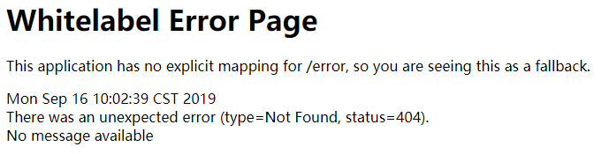

## Spring Boot错误处理机制
### 6.1 Spring Boot默认的错误处理机制
* 返回一个默认的错误页面


* 如果是其它客户端，默认响应一个json数据
* 原理：参照**ErrorMvcAutoConfiguration**类的自动配置
    * 注入DefaultErrorAttributes：用于错误属性设置和获取
    * 注入BasicErrorController：基本的错误页面控制器，用于发生错误后处理和跳转
    * 注入ErrorPageCustomizer：自定义ErrorPage
    * 注入DefaultErrorViewResolver：错误视图解析器
```java
@Configuration
@ConditionalOnWebApplication(type = Type.SERVLET)
@ConditionalOnClass({ Servlet.class, DispatcherServlet.class })
// Load before the main WebMvcAutoConfiguration so that the error View is available
@AutoConfigureBefore(WebMvcAutoConfiguration.class)
@EnableConfigurationProperties({ ServerProperties.class, ResourceProperties.class, WebMvcProperties.class })
public class ErrorMvcAutoConfiguration {
	@Bean
	@ConditionalOnMissingBean(value = ErrorAttributes.class, search = SearchStrategy.CURRENT)
	public DefaultErrorAttributes errorAttributes() {
		return new DefaultErrorAttributes(this.serverProperties.getError().isIncludeException());
	}

	@Bean
	@ConditionalOnMissingBean(value = ErrorController.class, search = SearchStrategy.CURRENT)
	public BasicErrorController basicErrorController(ErrorAttributes errorAttributes) {
		return new BasicErrorController(errorAttributes, this.serverProperties.getError(), this.errorViewResolvers);
	}

	@Bean
	public ErrorPageCustomizer errorPageCustomizer() {
		return new ErrorPageCustomizer(this.serverProperties, this.dispatcherServletPath);
	}
	@Bean
	@ConditionalOnBean(DispatcherServlet.class)
	@ConditionalOnMissingBean
	public DefaultErrorViewResolver conventionErrorViewResolver() {
		return new DefaultErrorViewResolver(this.applicationContext, this.resourceProperties);
	}
}
```
* 错误处理步骤：

    -   一旦系统出现4xx或者5xx之类的错误；ErrorPageCustomizer就会生效（定制错误的响应规则），默认来到/error页面，如果指定了**error.path，**就跳转到指定的页面

    ```java
    @Value("${error.path:/error}")
    private String path = "/error";
    ```

    -   系统出现错误之后，就会被BasicErrorController进行处理：

    ```java
    @Controller
    @RequestMapping("${server.error.path:${error.path:/error}}")
    public class BasicErrorController extends AbstractErrorController {
        // 浏览器(html)发送的请求优先来到这里
        @RequestMapping(produces = MediaType.TEXT_HTML_VALUE)
        public ModelAndView errorHtml(HttpServletRequest request, HttpServletResponse response) {
            HttpStatus status = getStatus(request);
            Map<String, Object> model = Collections
                    .unmodifiableMap(getErrorAttributes(request, isIncludeStackTrace(request, MediaType.TEXT_HTML)));
            response.setStatus(status.value());
            // 去哪个错误页面，包含页面地址和页面内容
            ModelAndView modelAndView = resolveErrorView(request, response, status, model);
            return (modelAndView != null) ? modelAndView : new ModelAndView("error", model);
        }
    
        // 其它浏览器请求来到这里，默认返回Json数据
        @RequestMapping
        public ResponseEntity<Map<String, Object>> error(HttpServletRequest request) {
            Map<String, Object> body = getErrorAttributes(request, isIncludeStackTrace(request, MediaType.ALL));
            HttpStatus status = getStatus(request);
            return new ResponseEntity<>(body, status);
        }
    }
    ```

    -   根据resolveErrorView决定要去那个页面，并在resolveErrorView方法内进行处理：

    ```java
    protected ModelAndView resolveErrorView(HttpServletRequest request, HttpServletResponse response, HttpStatus status,
    		Map<String, Object> model) {
    	// 遍历所有的ErrorViewResolver得到对应的modelAndView
    	for (ErrorViewResolver resolver : this.errorViewResolvers) {
    		ModelAndView modelAndView = resolver.resolveErrorView(request, status, model);
    		if (modelAndView != null) {
    			return modelAndView;
    		}
    	}
    	return null;
    }
    ```

    -   最终错误有DefaultErrorViewResolver进行处理：

    ```java
    private ModelAndView resolve(String viewName, Map<String, Object> model) {
    	// 默认Spring Boot可以去找一个页面 error/404
    	String errorViewName = "error/" + viewName;
    	// 如果模板引擎可以解析该页面，就优先使用模板引擎解析
    	TemplateAvailabilityProvider provider = this.templateAvailabilityProviders.getProvider(errorViewName,
    			this.applicationContext);
    	if (provider != null) {
    		return new ModelAndView(errorViewName, model);
    	}
    	// 模板引擎不可用，就是用resolveResource
    	return resolveResource(errorViewName, model);
    }
    ```

    -   默认错误属性的值格式及获取，通过DefaultErrorAttributes.getErrorAttributes()方法：

    ```java
    public Map<String, Object> getErrorAttributes(WebRequest webRequest, boolean includeStackTrace) {
        Map<String, Object> errorAttributes = new LinkedHashMap();
        // 时间戳
        errorAttributes.put("timestamp", new Date());
        // 状态码
        this.addStatus(errorAttributes, webRequest);
        // 错误详细信息
        this.addErrorDetails(errorAttributes, webRequest, includeStackTrace);
        // 错误属性 
        this.addPath(errorAttributes, webRequest);
        return errorAttributes;
    }
    ```

    -   错误信息的获取：

    ```html
    <body>
    <h1> 404 </h1>
    <h1> [[${timestamp}]]</h1>
    <h1> [[${status}]]</h1>
    <h1> [[${error}]]</h1>
    <h1> [[${exception}]]</h1>
    <h1> [[${message}]]</h1>
    <h1> [[${trace}]]</h1>
    <h1> [[${path}]]</h1>
    </body>
    ```


### 6.2  如何定制错误页面

* 如果有模板引擎的情况下，error/状态码 ，将错误页面命名为错误状态码.html，放在templates的error文件夹下。如果不想为每个状态码都设计一个页面，可以使用4xx.html、5xx.html来匹配所有的状态码
* 如果没有模板引擎的情况下，都是在静态资源文件夹中获取
* 如果以上两个都没有，就会来到Spring Boot的默认错误提示页面


### 6.3 如何定制错误的json数据
* 自定义异常处理&返回定制json数据，但是下面这种写法没有自适应功能，浏览器和客户端都会返回json格式数据：
```java
@ControllerAdvice
public class UserNotExistExceptionController {
    @ResponseBody
    @ExceptionHandler(UserNotExistException.class)
    public Map<String, Object> handleException(Exception e) {
        Map<String, Object> maps = new HashMap<>();
        maps.put("code", "user not exist");
        maps.put("message", e.getMessage());
        return maps;
    }
}
```
* 转发到/error进行自适应处理效果，但是**必须传入自定义的错误状态码，否则错误状态码为200**:
```java
@ExceptionHandler(UserNotExistException.class)
public String handleException(Exception e, HttpServletRequest request) {
    Map<String, Object> maps = new HashMap<>();
    request.setAttribute("javax.servlet.error.status_code", 500);
    maps.put("code", "user not exist");
    maps.put("message", e.getMessage());
    return "forward:/error";
}
```

* 既要自适应处理效果，还要将定制的错误数据携带出去：

  出现错误之后，会来到/error请求，被BasicErroController处理，响应出去可以获取的数据是由getErrorAttributes来得到的（是AbstractErrorController（ErrorController））规定的方法实现的

  -   完全编写一个ErrorController实现类（或者编写AbstractErrorController的子类）放在容器中

  -   页面上数据或者json返回值，都是通过errorAttributes.getErrorAttributes得到，因此可以在容器中加入自定义的ErrorAttributes

  -   同时还希望在ExceptionController中处理添加的字段以及ErrorAttribute中添加的字段全部显示出来

```java
@ExceptionHandler(UserNotExistException.class)
public String handleException(Exception e, HttpServletRequest request) {
    Map<String, Object> maps = new HashMap<>();
    request.setAttribute("javax.servlet.error.status_code", 500);
    maps.put("code", "user not exist");
    maps.put("message", e.getMessage());
    request.setAttribute("ext", maps);
    return "forward:/error";
}

@Component
public class MyErrorAttribute extends DefaultErrorAttributes {
    @Override
    public Map<String, Object> getErrorAttributes(WebRequest webRequest, boolean includeStackTrace) {
        Map<String, Object> errorAttributes = super.getErrorAttributes(webRequest, includeStackTrace);
        errorAttributes.put("code", "user not exist!");
        errorAttributes.put("school", "nwpu");
        Map<String, Object> ext = (Map<String, Object>) webRequest.getAttribute("ext", 0);
        errorAttributes.put("ext", ext);
        return errorAttributes;
    }
}
```