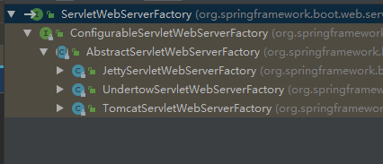

## 嵌入式Servlet容器
### 7.1 默认Servelt容器——Tomcat
Spring Boot默认使用的是嵌入式的Servlet容器（tomcat）
* 如何定制和修改Servlet容器相关的配置：

    -   在配置文件中修改：

    ```java
    # 修改server相关的配置（ServerProperties）
    server.port=2571
    server.context-path=/crud
    
    # 通用的Servlet容器设置
    server.xxx
    # Tomcat的设置
    server.tomcat.xxx
    ```

    -   编写EmbeddedServletContainerCustomizer（Spring Boot2.x使用WebServerFactoryCustomizer）,嵌入式的Servlet容器定制器，来修改Servlet容器的配置：

    ```java
    @Bean
    public WebServerFactoryCustomizer<ConfigurableWebServerFactory> webServerFactoryCustomizer(){
        return new WebServerFactoryCustomizer<ConfigurableWebServerFactory>() {
            @Override
            public void customize(ConfigurableWebServerFactory factory) {
                factory.setPort(25711);
            }
        };
    }
    ```


### 7.2 注册Servelt三大组件

在web应用中，Servlet三大组件可以注册在webapp/WEB-INF/web.xml中进行注册。Spring Boot提供了也对Servlet、Filter、Listener分别提供了三种注册方法：
* ServeltRegistrationBean
* FilterRegistrationBean
* ServletListenerRegistrationBean 

**以Servelt注册举例**:

```java
@Configuration
public class MyServerConfig {
    // 注册三大组件
    @Bean
    public ServletRegistrationBean<MyServlet> servletRegistrationBean() {
        return new ServletRegistrationBean<>(new MyServlet(), "/myServlet");
    }

	@Bean
    public FilterRegistrationBean<MyFilter> filterFilterRegistrationBean(){
        FilterRegistrationBean<MyFilter> filterRegistrationBean = new FilterRegistrationBean<>();
        filterRegistrationBean.setFilter(new MyFilter());
        filterRegistrationBean.setUrlPatterns(Arrays.asList("/hello", "/myServlet"));
        return filterRegistrationBean;
    }
    
	@Bean
	public ServletListenerRegistrationBean<MyListener> servletListenerRegistrationBean() {
	    return new ServletListenerRegistrationBean<>(new MyListener());
	}
}

//*************************************************************************
public class MyServlet extends HttpServlet {
    @Override
    protected void doGet(HttpServletRequest request, HttpServletResponse response) throws ServletException, IOException {
        response.setContentType("text/html;charset=utf-8");
        response.getWriter().write("hello myServlet");
    }

    @Override
    protected void doPost(HttpServletRequest req, HttpServletResponse resp) throws ServletException, IOException {
        doGet(req, resp);
    }
}

//*************************************************************************
public class MyFilter extends HttpFilter {
    public MyFilter() {
        super();
    }

    @Override
    public void doFilter(ServletRequest request, ServletResponse response, FilterChain chain) throws IOException, ServletException {
        System.out.println("before doFilter");
        super.doFilter(request, response, chain);
        System.out.println("after doFilter");
    }

    @Override
    protected void doFilter(HttpServletRequest request, HttpServletResponse response, FilterChain chain) throws IOException, ServletException {
        super.doFilter(request, response, chain);
    }
}

//*************************************************************************
public class MyListener implements ServletContextListener {
    @Override
    public void contextInitialized(ServletContextEvent sce) {
        System.out.println("contextInitialized");
    }

    @Override
    public void contextDestroyed(ServletContextEvent sce) {
        System.out.println("contextDestroyed");
    }
}
```
Spring Boot帮我们自动配置SpringMVC的时候，注册了SpringMVC的前端控制器DispatcherServlet：
```java
@Bean(name = DEFAULT_DISPATCHER_SERVLET_REGISTRATION_BEAN_NAME)
@ConditionalOnBean(value = DispatcherServlet.class, name = DEFAULT_DISPATCHER_SERVLET_BEAN_NAME)
public DispatcherServletRegistrationBean dispatcherServletRegistration(DispatcherServlet dispatcherServlet) {
	DispatcherServletRegistrationBean registration = new DispatcherServletRegistrationBean(dispatcherServlet,
			this.webMvcProperties.getServlet().getPath());
	// 默认拦截/，即所有请求，包括静态资源，但是不拦截.jsp、.html等后缀路径请求， /*会拦截jsp请求
	// 可以通过server.servletPath来修改SpringMVC前段控制器默认拦截的请求路径
	registration.setName(DEFAULT_DISPATCHER_SERVLET_BEAN_NAME);
	registration.setLoadOnStartup(this.webMvcProperties.getServlet().getLoadOnStartup());
	if (this.multipartConfig != null) {
		registration.setMultipartConfig(this.multipartConfig);
	}
	return registration;
}
```

### 7.3 切换其它嵌入式Servelt容器
Spring Boot也可以支持Undertow和Jetty服务器
* Undertow：不支持jsp页面，但是是高性能、非阻塞的Servlet容器，并发性非常好
* Jetty：长连接应用


**切换到其它服务器**：

* 在pom.xml文件中将Tomcat容器exclude
* 在pom.xml文件中引入Undertow或者Jetty依赖
```xml
<dependency>
    <groupId>org.springframework.boot</groupId>
    <artifactId>spring-boot-starter-web</artifactId>
    <exclusions>
        <exclusion>
            <artifactId>spring-boot-starter-tomcat</artifactId>
            <groupId>org.springframework.boot</groupId>
        </exclusion>
    </exclusions>
</dependency>
<dependency>
    <artifactId>spring-boot-starter-jetty</artifactId>
    <groupId>org.springframework.boot</groupId>
</dependency>
```


### 7.4 嵌入式Servlet容器自动配置原理

嵌入式Servelt容器自动配置在Spring Boot2.x中是放在org.springframework.boot.autoconfigure.web.servlet.**ServletWebServerFactoryAutoConfiguration**中进行配置：
```java
@Configuration
@AutoConfigureOrder(Ordered.HIGHEST_PRECEDENCE)
@ConditionalOnClass(ServletRequest.class)
@ConditionalOnWebApplication(type = Type.SERVLET)
@EnableConfigurationProperties(ServerProperties.class)
@Import({ ServletWebServerFactoryAutoConfiguration.BeanPostProcessorsRegistrar.class,
		ServletWebServerFactoryConfiguration.EmbeddedTomcat.class,
		ServletWebServerFactoryConfiguration.EmbeddedJetty.class,
		ServletWebServerFactoryConfiguration.EmbeddedUndertow.class })
public class ServletWebServerFactoryAutoConfiguration {...}
```
注意自动配置类中Import了Spring Boot支持的三个Servlet容器：Tomcat, Jetty, Undertow，注意在一下三个Servlet容器导入时，都有：

@ConditionalOnMissingBean(value = ServletWebServerFactory.class, search = SearchStrategy.CURRENT)

判断，如果该Bean对象存在，则不会导入：

​											
该ServletWebServerFactory接口有三个实现类，实现方法只有一个： **getWebServer**()，该方法会在三个Servlet容器创建的时候进行实现。

```java
@Configuration
class ServletWebServerFactoryConfiguration {

	@Configuration
	@ConditionalOnClass({ Servlet.class, Tomcat.class, UpgradeProtocol.class })
	//  当前容器中没有用户自定义的ServletWebServerFactory（嵌入式Servlet容器工厂），则会自己创建嵌入式Servlet容器
	@ConditionalOnMissingBean(value = ServletWebServerFactory.class, search = SearchStrategy.CURRENT)
	public static class EmbeddedTomcat {
		@Bean
		public TomcatServletWebServerFactory tomcatServletWebServerFactory() {
			return new TomcatServletWebServerFactory();
		}
	}

	/**
	 * Nested configuration if Jetty is being used.
	 */
	@Configuration
	@ConditionalOnClass({ Servlet.class, Server.class, Loader.class, WebAppContext.class })
	@ConditionalOnMissingBean(value = ServletWebServerFactory.class, search = SearchStrategy.CURRENT)
	public static class EmbeddedJetty {
		@Bean
		public JettyServletWebServerFactory JettyServletWebServerFactory() {
			return new JettyServletWebServerFactory();
		}
	}

	/**
	 * Nested configuration if Undertow is being used.
	 */
	@Configuration
	@ConditionalOnClass({ Servlet.class, Undertow.class, SslClientAuthMode.class })
	@ConditionalOnMissingBean(value = ServletWebServerFactory.class, search = SearchStrategy.CURRENT)
	public static class EmbeddedUndertow {
		@Bean
		public UndertowServletWebServerFactory undertowServletWebServerFactory() {
			return new UndertowServletWebServerFactory();
		}
	}
}
```
**以Tomcat创建为例**：
```java
@Configuration
@ConditionalOnClass({ Servlet.class, Tomcat.class, UpgradeProtocol.class })
@ConditionalOnMissingBean(value = ServletWebServerFactory.class, search = SearchStrategy.CURRENT)
public static class EmbeddedTomcat {

	@Bean
	public TomcatServletWebServerFactory tomcatServletWebServerFactory() {
		return new TomcatServletWebServerFactory();
	}

}

// 重写了ServletWebServerFactory接口中的getWebServer方法
public WebServer getWebServer(ServletContextInitializer... initializers) {
	// 创建Tomcat
    Tomcat tomcat = new Tomcat();
    // 配置Tomcat基本环节
    File baseDir = this.baseDirectory != null ? this.baseDirectory : this.createTempDir("tomcat");
    tomcat.setBaseDir(baseDir.getAbsolutePath());
    Connector connector = new Connector(this.protocol);
    tomcat.getService().addConnector(connector);
    this.customizeConnector(connector);
    tomcat.setConnector(connector);
    tomcat.getHost().setAutoDeploy(false);
    this.configureEngine(tomcat.getEngine());
    Iterator var5 = this.additionalTomcatConnectors.iterator();

    while(var5.hasNext()) {
        Connector additionalConnector = (Connector)var5.next();
        tomcat.getService().addConnector(additionalConnector);
    }

    this.prepareContext(tomcat.getHost(), initializers);
	// 注意下面这个方法，这个方法内部会依次调用：
	// 1. new TomcatWebServer(tomcat, this.getPort() >= 0);
	// 2. initialize();
	// 3. this.tomcat.start();
	// 即调用下面这个方法会导致Tomcat服务器启动
    return this.getTomcatWebServer(tomcat);
}
```
**对Tomcat服务器的配置是如何生效的？**

* 通过修改配置文件方式：配置文件中的配置是和**ServerProperties**进行绑定的
* 通过**WebServerFactoryCustomizer**对服务器配置进行定制，即通过代码方式

***
WebServerFactoryCustomizer帮助我们定制服务器的配置，具体原理？
* 在ServletWebServerFactoryAutoConfiguration中还Import：

    ServletWebServerFactoryAutoConfiguration.BeanPostProcessorsRegistrar.class这个配置类

* 在该配置类中最重要的是注册Bean定义方法，该方法中会导入WebServerFactoryCustomizer的Bean后置处理器：
```java
@Override
public void registerBeanDefinitions(AnnotationMetadata importingClassMetadata,
		BeanDefinitionRegistry registry) {
	if (this.beanFactory == null) {
		return;
	}
	registerSyntheticBeanIfMissing(registry, "webServerFactoryCustomizerBeanPostProcessor",
			WebServerFactoryCustomizerBeanPostProcessor.class);
	registerSyntheticBeanIfMissing(registry, "errorPageRegistrarBeanPostProcessor",
			ErrorPageRegistrarBeanPostProcessor.class);
}
```
* WebServerFactoryCustomizer的后置处理器和前置处理器主要完成的工作：
```java
// bean对象初始化完成之前
public Object postProcessBeforeInitialization(Object bean, String beanName) throws BeansException {
    if (bean instanceof WebServerFactory) {
        this.postProcessBeforeInitialization((WebServerFactory)bean);
    }
    return bean;
}
// 获取所有的定制器，调用每一个定制器的customize方法来给servlet容器进行属性赋值
private void postProcessBeforeInitialization(WebServerFactory webServerFactory) {
	((Callbacks)LambdaSafe.callbacks(WebServerFactoryCustomizer.class, this.getCustomizers(), webServerFactory, new Object[0]).withLogger(WebServerFactoryCustomizerBeanPostProcessor.class)).invoke((customizer) -> {
    customizer.customize(webServerFactory);
});
}
```

**Servlet容器自动配置步骤**

* 根据导包（Maven）给容器中添加相应的嵌入式容器工厂，以tomcat为例：tomcatServletWebServerFactory()
* 容器工厂被添加到容器中后，一旦容器中某个组件要创建对象，就会通知bean后置处理器，后置处理器会判断该Bean对象是否为WebServerFactory的子类
* 只要该Bean对象是嵌入式的Servlet容器工厂，后置处理器就会工作：从容器中获取所有的嵌入式Servlet容器的定制器，并调用每一个定制器的customize方法来给Servlet容器进行属性赋值 


### 7.5 嵌入式Servlet容器启动原理
Spring Boot什么时候创建嵌入式的Servlet容器工厂？什么时候获取嵌入式的Servlet容器并启动Tomcat？

获取嵌入式的Servlet容器工厂：
* Spring Boot启动应用运行run方法
* refreshContext(context)：SpringBoot刷新IOC容器（创建IOC容器对象，并根据当前环境初始化IOC容器，Bean的初始化） ，如果是Web应用，创建AnnotationConfigEmbeddedWebApplicationContext，否则创建ConfigurableWebApplicationContext环境
* refresh(context)：刷新刚刚创建好的IOC容器
* onRefresh()：web的IOC容器重写了onRefresh()方法，并创建嵌入式的Servlet容器：createWebServer()
* 获取嵌入式的Servlet容器工厂：ServletWebServerFactory factory = this.getWebServerFactory();
* 从IOC容器中获取到ServletWebServerFactory组件，tomcatServletWebServerFactory对象被创建，惊动后置处理器，后置处理器会获取所有的定制器来对Servlet容器进行相关配置
* 使用容器工厂获取嵌入式的Servlet容器： this.webServer = factory.getWebServer(new ServletContextInitializer[]{this.getSelfInitializer()});

-   嵌入式的Servlet容器创建对象并启动Servlet容器，先启动嵌入式的Servlet容器，再将IOC容器中剩下没有创建出来的对象去处理。

**总之：** IOC容器启动的时候创建嵌入式的Servlet容器


### 7.6使用外部Servlet容器&JSP支持
**嵌入式的Servlet容器**：应用打包成war包

* 优点：简单、边界
* 缺点：默认不支持JSP、优化定制比较复杂（使用定制器【ServerPropertiesWebServerFactoryCustomizer】、自己编写嵌入式Servlet容器的创建工厂）

**外置的Servlet容器**：外面安装Tomcat——引用war包的方式打包
步骤：

* 必须创建一个war项目
* 将嵌入式的Tomcat指定为provided
```xml
<dependency>
	<groupId>org.springframework.boot</groupId>
	<artifactId>spring-boot-starter-tomcat</artifactId>
	<scope>provided</scope>
</dependency>
```
* 必须编写一个SpringBootServletInitializer的子类，并调用configure方法
```java
public class ServletInitializer extends SpringBootServletInitializer{
	@Override
	protected SpringApplicationBuilder configure(SpringApplicationBuilder application){	
		// 传入Spring Boot应用的主程序
		return application.sources(SpringBootWebJspApplication.class);
	}
}
```
* 启动服务器就可以使用


### 7.7外部Servlet容器Spring Boot应用原理
* jar包：执行Spring Boot主类的main方法，启动IOC容器，创建嵌入式的Servlet容器
* war包：启动服务器，服务器启动Spring Boot应用【SpringBootServletInitializer】，启动IOC容器
***
**外部启动的原理**

* SpringBootServletInitializer重写configure方法

* SpringApplicationBuilder类中builder.source(@SpringBootApplication类)

* Servlet3.0标准ServletContainerInitializer扫描所有jar包中：

    META-INF/services/javax.servlet.ServletContainerInitializer文件中指定的类

* 加载Spring web包下的SpringServletContainerInitializer

* 扫描@HandleType（WebApplicationInitializer）

* 加载SpringBootServletInitializer并运行onStartup方法

* 加载@SpringBootApplication主类，启动容器等