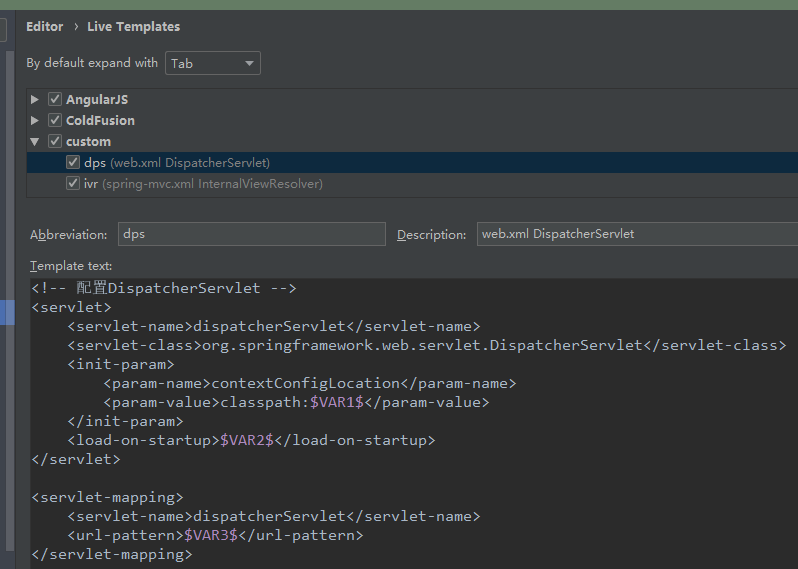
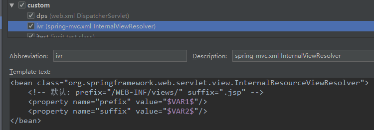

## hello world

### 1.1 准备工作
**pom.xml导入相关依赖**：
```xml
<dependencies>
    <dependency>
        <groupId>org.springframework</groupId>
        <artifactId>spring-webmvc</artifactId>
        <version>5.1.9.RELEASE</version>
    </dependency>
    <!-- 
        注意如果不导入servlet-api依赖，在web.xml配置DispatcherServlet时会报错：
        DispatcherServlet is not assignable to javax.servlet.Servlet
    -->
    <dependency>
        <groupId>javax.servlet</groupId>
        <artifactId>javax.servlet-api</artifactId>
        <version>4.0.1</version>
    </dependency>
</dependencies>
```

**IDEA模板**：

可以在IDEA中编写DispatcherServlet和视图解析器相关模板的快捷方式，加入到XML group中，这样在.xml配置文件中可以快速编写相关配置：
- DispatcherServlet相关模板:
```xml
<!-- 配置DispatcherServlet -->
<servlet>
    <servlet-name>dispatcherServlet</servlet-name>
    <servlet-class>org.springframework.web.servlet.DispatcherServlet</servlet-class>
    <init-param>
        <param-name>contextConfigLocation</param-name>
        <param-value>classpath:$VAR1$</param-value>
    </init-param>
    <load-on-startup>$VAR2$</load-on-startup>
</servlet>

<servlet-mapping>
    <servlet-name>dispatcherServlet</servlet-name>
    <url-pattern>$VAR3$</url-pattern>
</servlet-mapping>
```

截图说明：



- InternalViewResolver相关模板:
```xml
<bean class="org.springframework.web.servlet.view.InternalResourceViewResolver">
    <!-- 默认: prefix="/WEB-INF/views/" suffix=".jsp" -->
    <property name="prefix" value="$VAR1$"/>
    <property name="suffix" value="$VAR2$"/>
</bean>
```

截图说明：




### 1.2 Spring MVC的hello world
一个基本完整的Spring MVC工程主要包括：
- web.xml中配置DispatcherServlet：在里面可以指定Spring MVC的配置文件位置，如果不指定位置，默认位置为：**/WEB-INF/dispatcherServelt-servelt.xml**
```xml
<?xml version="1.0" encoding="UTF-8"?>
<!-- web.xml -->
<web-app xmlns="http://xmlns.jcp.org/xml/ns/javaee"
         xmlns:xsi="http://www.w3.org/2001/XMLSchema-instance"
         xsi:schemaLocation="http://xmlns.jcp.org/xml/ns/javaee http://xmlns.jcp.org/xml/ns/javaee/web-app_4_0.xsd"
         version="4.0">
    <!-- 配置DispatcherServlet -->
    <servlet>
        <servlet-name>dispatcherServlet</servlet-name>
        <servlet-class>org.springframework.web.servlet.DispatcherServlet</servlet-class>
        <!-- 如果不指定springmvc的配置文件，默认在/WEB-INF下查找dispatcherServlet-servlet.xml文件 -->
        <init-param>
            <param-name>contextConfigLocation</param-name>
            <param-value>classpath:spring-mvc.xml</param-value>
        </init-param>
        <!-- 应用被加载时候直接创建 -->
        <load-on-startup>1</load-on-startup>
    </servlet>

    <servlet-mapping>
        <servlet-name>dispatcherServlet</servlet-name>
        <url-pattern>/</url-pattern>
    </servlet-mapping>
</web-app>
```
- Spring MVC配置文件中至少配置：
    - 包自动扫描：component-scan
    - 视图解析器：InternalViewResolver
```xml
<?xml version="1.0" encoding="UTF-8"?>
<!-- spring-mvc.xml -->
<beans xmlns="http://www.springframework.org/schema/beans"
       xmlns:xsi="http://www.w3.org/2001/XMLSchema-instance"
       xmlns:context="http://www.springframework.org/schema/context"
       xsi:schemaLocation="http://www.springframework.org/schema/beans http://www.springframework.org/schema/beans/spring-beans.xsd http://www.springframework.org/schema/context https://www.springframework.org/schema/context/spring-context.xsd">

    <!-- 配置包自动扫描 -->
    <context:component-scan base-package="nwpu.sherman"/>

    <!-- 配置视图解析器：把Controller返回的字符串解析成实际物理视图 -->
    <bean class="org.springframework.web.servlet.view.InternalResourceViewResolver">
        <!-- 默认: prefix="/WEB-INF/views/" suffix=".jsp" -->
        <property name="prefix" value="/WEB-INF/views/"/>
        <property name="suffix" value=".jsp"/>
    </bean>
</beans>
```
- 创建/WEB-INF/views/success.jsp页面
- 编写相关的处理器的逻辑部分
```java
/**
 * Spring MVC hello world程序，相关处理器
 *
 * @author sherman
 */
@Controller
public class HelloController {

    /**
     * 一个基本Spring MVC工程测试
     */
    @ResponseBody
    @RequestMapping("/hello")
    public String hello() {
        return "hello spring mvc!";
    }

    /**
     * 跳转/WEB-INF/views/success.jsp页面，而输出json数据
     */
    @RequestMapping("/hello/success")
    public String success() {
        return "success";
    }
}
```
将应用部署到Tomcat上，应用启动后，访问 **http://localhost:8080/springmvc/hello** 即可看到页面输出：hello spring mvc!

### @RequestMapping
@RequestMapping可以指定value、method、params、heads等属性，并且这些条件之间是**与**的关系，联合使用多个条件
可以让请求映射更加精确，主要用于：指定URL请求路径和请求方法：
```java
@Target({ElementType.TYPE, ElementType.METHOD})
@Retention(RetentionPolicy.RUNTIME)
@Documented
@Mapping
public @interface RequestMapping {
    
    String name() default "";
    
    @AliasFor("path")
    String[] value() default {};
    
    @AliasFor("value")
    String[] path() default {};
    
    RequestMethod[] method() default {};
    
    String[] params() default {};
    
    String[] headers() default {};
    
    String[] consumes() default {};
    
    String[] produces() default {};
}
```
params和headers还支持简单的表达式：
- param1：请求中必须包含名为param1的params|headers
- !param1：表示请求不能包含名为param1的params|headers
- param1 != value1：请求中必须包含名为param1的params|headers，但是其值不能为value1
- {"param1=value1", "param2"}：请求中必须包含名为param1和param2的两个params|headers，且param1的值必须为value1
```java
/**
 * params支持简单的表达式
 */
@ResponseBody
@RequestMapping(value = "/param1", params = {"name!=sherman", "gender=man"})
public String param1() {
    return "params: name!=sherman, gender=man";
}
```

@RequestMapping注解还支持**Ant**风格资源地址的通配符形式：
- ?：匹配一个字符
    - /usr/createUser??：
        - /usr/createUser01 :ok: 
        - /usr/createUser99 :ok:
        - /usr/createUser571 :no_entry: 
- *：匹配任意多字符，但是只能在同一级目录下
    - /usr/*/createUser:
        - /usr/aaa/createUser :ok:
        - /usr/bb/createUser :ok:
        - /usr/aaa/bb/createUser :no_entry: 
- **：匹配多层路径，包括0层：
    - /usr/**/createUser:
        - /usr/aaa/createUser :ok:
        - /usr/bb/createUser :ok:
        - /usr/aaa/bb/createUser :no_entry: 
        
注意上面路径：/user/aaa/createUser可以被路径 **/usr/*/createUser** 和  **/usr/\*\*/createUser** 同时拦截，最终运行结果是：
被更加简单的拦截处理，即 **/usr/*/createUser** 。

### 1.3 @PathVariable
@PathVariable映射URL绑定的占位符，带占位符的URL是Spring3.0的新特性，该功能在Spring MVC向REST目标挺进发展过程中具有
里程碑的意义。通过@PathVariable可以将URL中的占位符参数绑定到方法的入参上：
```java
/**
 * 使用@PathVariable捕获url路径中的占位符
 * 注意如果url路径为：/usr/2571/createUser，这个url也能被上面ant02()和ant03()匹配，
 * 但是运行并没有被捕获
 */
@ResponseBody
@RequestMapping("/usr/{user_id}/createUser")
public String createUser(@PathVariable("user_id") int userId) {
    return "userId: " + userId;
}
```