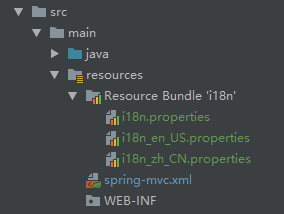
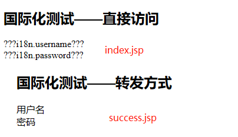

## 视图和视图解析器

### 1.1 概念
请求处理方法执行完成后，最终返回一个ModelAndView对象，对于那些返回String、View或者ModelMap等类型的处理方法，
Spring MVC也会在内部将它们装配成一个ModelAndView对象，它包含了逻辑名和模型对象的视图。

Spring MVC开始渲染视图工作：借助视图解析器（ViewResolver）得到最终的视图对象，最终的视图可以是JSP，也可以是
Excel、JFreeChart等各种表现形式的视图。

视图对象由视图解析器负责实例化，由于视图是无状态的（每次请求都会创建一个新的视图），所以视图不会有线程安全问题。

**视图**：
视图的作用是渲染模型数据，将模型里的数据以各种形式呈现给客户，为了实现视图模型和具体实现技术的解耦，Spring在
org.springframework.web.servlet包中定义了一个高度抽象的View接口：
```java
public interface View {
    String RESPONSE_STATUS_ATTRIBUTE = View.class.getName() + ".responseStatus";
    
    String PATH_VARIABLES = View.class.getName() + ".pathVariables";
    
    String SELECTED_CONTENT_TYPE = View.class.getName() + ".selectedContentType";
    
    @Nullable
    default String getContentType() {
        return null;
    }
    
    void render(@Nullable Map<String, ?> model, HttpServletRequest request, HttpServletResponse response)
            throws Exception;
}
```

**视图解析器**：
Spring MVC为逻辑视图名的解析提供了不同的策略，可以在Spring WEB上下文中配置一种或者多种解析策略，并为它们之间指定先后
顺序。每一种映射策略对应一个具体的视图解析器实现类。视图解析器的作用单一：将逻辑视图解析为一个具体的视图对象，所有的视图
解析器都必须实现ViewResolver接口。

### 1.2 配置国际化
- 在类路径下编写国际化配置文件，在对应的配置文件中加入配置信息，例如i18n.username，用户名，i18n.password，密码



- 导入jstl-1.2jar包：
    - 方式一：在web/WEB-INF下新建lib文件夹，将jstl-1.2.jar和taglibs-standard-impl-1.2.5.jar加入，并右击：Add As Library
    - 方式二：直接在pom.xml中引入：
```xml
<dependency>
    <groupId>javax.servlet</groupId>
    <artifactId>jstl</artifactId>
    <version>1.2</version>
</dependency>

<dependency>
    <groupId>org.apache.taglibs</groupId>
    <artifactId>taglibs-standard-impl</artifactId>
    <version>1.2.5</version>
</dependency>
```
- 引入fmt标签：注意标签的url:
```xml
<!-- url不要写成：uri="http://java.sun.com/jstl/fmt -->
<%@ taglib prefix="fmt" uri="http://java.sun.com/jsp/jstl/fmt" %>
```

- 在spring-mvc.xml中配置MessageSource：
```xml
<!-- 配置支持国际化的Bean MessageSource -->
<bean id ="messageSource" class="org.springframework.context.support.ResourceBundleMessageSource">
    <property name="basename" value="i18n"/>
</bean>
```
- 在对应jsp页面中访问国际化文件中的信息：
```xml
<!-- index.jsp -->
<h2>国际化测试——直接访问</h2>
<fmt:message key="i18n.username"/><br/>
<fmt:message key="i18n.password"/><br/>

<!-- success.jsp -->
<h2>国际化测试——转发方式</h2>
<fmt:message key="i18n.username"/><br/>
<fmt:message key="i18n.password"/><br/>
```

**:star:注意结果区别**：
index.jsp中不能正确加载国际化配置文件中信息，但是success.jsp中能够正确加载国际化配置文件中信息。
- index.jsp是直接访问的页面，不需要转发
- success.jsp需要访问 **http://localhost:8080/springmvc/hello/success** 进行了一次转发操作

要使用基于页面的国际化信息，需要使用转发的方式才能生效。



### 1.3 mvc:view-controller
有时候希望能够直接通过url路径跳转到某个页面，而不需要经过任何Controller，那么就可以使用 **mvc:controller** 标签，且实际开发
中还应该配合 **mvc:annotation-driven** 标签一起使用。在spring-mvc.xml中配置一个mvc:controller标签，将/view_controller/success
路径直接映射到/WEB-INF/views/success.jsp上：
```xml
<!-- 希望直接转发到对应的页面，而不需要经过任何Controller，需要使用mvc:view-controller，
     且实际开发中，该标签需要和<mvc:annotation-driven>配合使用，防止出错
-->
<mvc:view-controller path="/view_controller/success" view-name="success"/>
<mvc:annotation-driven/>
```

### 1.4 自定义视图

**spring-mvc.xml中配置视图解析器**：

自定义视图，使用**BeanNameViewResolver**解析器完成。首先在spring-mvc.xml中配置该视图解析器：
```xml
<!-- 自定义视图解析器 InternalResourceViewResolver的默认优先级为：Integer.MAX_VALUE -->
<bean class="org.springframework.web.servlet.view.BeanNameViewResolver">
    <property name="order" value="100"/>
</bean>
```
spring-mvc.xml中原先还配置了InternalResourceViewResolver视图解析器，当两个视图解析器同时存在时候，
需要**使用order属性指定优先级，该数值越大，优先级越低**。

InternalResourceViewResolver默认的order值为Integer.MAX_VALUE，因此只要配置了其它视图处理器，其它视图解析器优先执行。
如果最后InternalResourceViewResolver解析失败，则整个视图解析过程异常。

**自定义视图类**：

```java
/**
 * 自定义视图
 * 该视图通过@Component加入到IOC容器中，并指定视图名称为customView
 * 之后Controller直接返回的就是该视图的名称，如果找不到，则尝试使用InternalResourceViewResolver继续解析
 *
 * @author sherman
 */
@Component("customView")
public class CustomView implements View {
    @Override
    public String getContentType() {
        return "text/html";
    }

    @Override
    public void render(Map<String, ?> model, HttpServletRequest request, HttpServletResponse response) throws Exception {
        System.out.println("custom view");
        response.getWriter().print("custom view, time: " + new SimpleDateFormat("yyyy-MM-dd HH:mm:ss:SSS").format(new Date()));
    }
}
```

**定义自定义视图相关映射控制器**：
```java
/**
 * 自定义视图相关的控制器，注意该控制器返回的是自定义视图的名称，默认类名首字母小写
 *
 * @author sherman
 */
@Controller
public class CustomViewController {
    @RequestMapping("/view/custom_view")
    public String testCustomView() {
        return "customView";
    }
}
```

**访问自定义视图页面**：

访问 **http://localhost:8080/springmvc/view/custom_view** 路径即可看到自定义视图页面的信息：custom view, time: 2019-12-08 23:25:41:106

### 1.5 转发和重定向：
请求转发只是把请求转发给服务器的另一个组件（Servlet或者JSP），而重定向则是告诉客户浏览器请求的资源需要访问另一个URL（可能在同一个Web内，
也可能在其他站点）。因此，请求转发和重定向最主要的区别是：**请求转发发生在服务器（行为），重定向发生在客户端（行为）**，因为这个区别，会导致：
- 请求转发只会返回一个响应，而重定向会返回两个响应，状态码302
- 请求转发地址栏并不会改变，但是重定向地址栏会改变
- 请求转发可以共享request域中的数据，重定向因为是两次请求，不能共享request域中数据
- 请求转发相对于重定向而言效率要高一些

要使用转发或者重定向，只需要在最终return的字符串中加上 **forward:** 或者 **redirect:** 前缀即可。

注意：
- 转发和重定向会使得InternalResourceViewResolver配置的前缀和后缀都失效，因此需要完整的前缀和后缀：
- WEB-INF下的目录是禁止直接在url地址栏中输入访问的，而重定向发生在客户端，相当于直接在地址栏中输入url地址，因此
重定向不能定向到WEB-INF下的文件

**index.jsp**:
```xml
<h2>转发&重定向</h2>
<a href="${pageContext.request.contextPath}/view/forward">转发</a><br/>
<a href="${pageContext.request.contextPath}/view/redirect">重定向</a><br/>
<a href="${pageContext.request.contextPath}/view/web_inf/forward">WEB-INF：转发</a><br/>
<a href="${pageContext.request.contextPath}/view/web_inf/redirect">WEB-INF：重定向</a><br/>
```
**对应的Controller**:
```java
/**
 * 1、自定义视图相关的控制器，注意该控制器返回的是自定义视图的名称，默认类名首字母小写
 * 2、演示转发和重定向
 *
 * @author sherman
 */
@Controller
public class CustomViewController {
    /**
     * 访问自定义视图
     */
    @RequestMapping("/view/custom_view")
    public String testCustomView() {
        return "customView";
    }

    /**
     * 转发
     * 注意url地址变化：
     * localhost:8080/index.jsp -> localhost:8080/view/forward
     */
    @RequestMapping("/view/forward")
    public String testForward() {
        return "forward:/views/forward.jsp";
    }

    /**
     * 重定向
     * 注意url地址变化：
     * localhost:8080/index.jsp -> localhost:8080/views/redirect.jsp
     */
    @RequestMapping("/view/redirect")
    public String testRedirect() {
        return "redirect:/views/redirect.jsp";
    }

    /**
     * 转发，且转发路径在WEB-INF下，没有影响
     * 注意url地址变化：
     * localhost:8080/index.jsp -> localhost:8080/view/web_inf/forward
     */
    @RequestMapping("/view/web_inf/forward")
    public String testWebInfForward() {
        return "forward:/WEB-INF/views/success.jsp";
    }

    /**
     * 重定向，且转发路径在WEB-INF下，404！
     * 原因：
     *
     * 重定向发生在客户端，即redirect的路径就相当于直接在url地址栏中输入对应的地址
     * WEB-INF目录下的文件有保护，转发可以访问，但是直接访问不行（重定向就相当于直接访问！）
     *
     * 注意url地址变化：
     * localhost:8080/index.jsp -> localhost:8080/WEB-INF/views/success.jsp
     */
    @RequestMapping( "/view/web_inf/redirect")
    public String testWebInfRedirect() {
        return "redirect:/WEB-INF/views/success.jsp";
    }
}
```