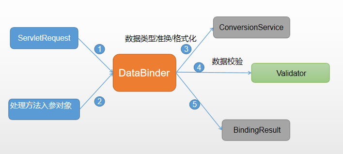
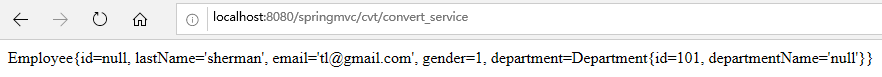
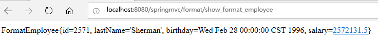
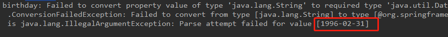

## 数据转换&格式化&校验
实际开发中通常需要解决一下问题：
> 1. 数据格式转换问题——字符串转换成Date类型
> 2. 数据格式化问题——转换成Date类型时，输入的字符串分隔符的格式
> 3. 数据校验问题——转换的最终Date类型不能是不合法的值

### 1.1 数据绑定流程
- Spring MVC将ServletRequest对象及目标方法的入参传递给WebBinderFactory实例，用于创建**DataBinder**实例对象
- DataBinder调用Spring MVC上行下文中的**ConversionService**组件进行数据类型格式转换、数据格式化工作，将Servlet中请求信息
填充到入参对象中
- 调用 **Validator** 组件对已经绑定了请求消息的入参对象进行数据合法性校验，并最终生成数据绑定结果 **BindingResult** 对象
- Spring MVC抽取BindingResult中入参对象和校验错误对象，将它们附给处理方法的响应入参。



**自定义类型转换器（了解）**：

将String字符串（格式为：lastName-email-gender-department.id）直接转换成Employee对象

- index.jsp中提交form表单提交post请求，只提交一个字符串：
```xml
<h2>ConvertService</h2>
<form action="cvt/convert_service" method="post">
  格式：lastName-email-gender-department.id<br/>
  employee: <input type="text" name="employee"><br/>
  <input type="submit" value="submit">
</form>
```
- 处理表单请求对应的Controller:
```java
/**
 * 将字符串直接转换成Employee对象
 *
 * @author sherman
 */
@Controller
public class ConvertController {
    @RequestMapping("/cvt/convert_service")
    @ResponseBody
    public String convertStringToEmployee(@RequestParam("employee") Employee employee) {
        return employee.toString();
    }
}
```
- 自定义ConversionService：
```java
/**
 * 自定义ConversionService，将字符串转换成Employee对象
 *
 * @author sherman
 */
@Component
public class CustomConversionService implements Converter<String, Employee> {
    /**
     * 将字符串转换成Employee对象
     */
    @Override
    public Employee convert(String source) {
        if (source != null) {
            // 格式：lastName-email-gender-department.id
            String[] arr = source.split("-");
            if (arr.length != 4) {
                return null;
            }
            Employee employee = new Employee();
            employee.setLastName(arr[0]);
            employee.setEmail(arr[1]);
            employee.setGender(Integer.parseInt(arr[2]));
            Department dept = new Department();
            dept.setId(Integer.parseInt(arr[3]));
            employee.setDepartment(dept);
            return employee;
        }
        return null;
    }
}
```
- 在Spring-mvc.xml中配置自定义的ConversionService：
```xml
<mvc:annotation-driven conversion-service="conversionService"/>
<!-- 配置一个ConversionService -->
<bean id="conversionService"
      class="org.springframework.context.support.ConversionServiceFactoryBean">
    <property name="converters">
        <set>
            <ref bean="customConversionService"/>
        </set>
    </property>
</bean>
```
- 执行效果截图：



### 1.2 annotation-driven配置
目前为止，<annotation-driven/\>标签一共在三个地方使用过：
- \<mvc:controller/\>：用于直接映射url请求到对应的页面，而不经过Controller
- \<mvc:default-servlet-handler/\>：处理静态资源，防止DispatcherServlet直接将静态资源拦截处理
- 装配自定义ConversionService时需要使用

总的来说，该标签有以下功能；
- 自动注册三个Bean：
    - RequestMappingHandlerMapping
    - RequestMappingHandlerAdapter
    - ExceptionHandlerExceptionResolver
- 其它支持功能：
    - 支持ConversionService实例对表单参数进行类型转换
    - 支持使用@NumberFormat、@DataTimeFormat注解完成数据类型的格式化
    - 支持使用@Valid注解对JavaBean实例进行JSR303验证
    - 支持使用@RequestBody和@ResponseBody注解


### 1.3 @InitBinder
由@InitBinder标识的方法，可以对WebDataBinder对象初始化，WebDataBinder是DataBinder的子类，用于完成由表单字段到JavaBean属性的绑定，注意：
- @InitBinder对象不能有返回值，必须是void
- @InitBinder方法的参数通常是WebDataBinder

示例：

在**CRUDController**中，加入：
```java
/**
 * 使用@InitBinder注解在对把表单提交的JavaBean对象的字段进行绑定处理
 */
@InitBinder
public void initBinder(WebDataBinder webDataBinder) {
    // 忽略表单提交的lastName字段
    webDataBinder.setDisallowedFields("lastName");
}
```
当提交表单后，用户的lastName属性会被忽略。

### 1.4 数据格式化
当需要限定JavaBean对象属性的格式事后，可以使用Spring MVC提供的数据格式化功能，FormattingConversionServiceFactoryBean，
其内部已经注册了：

- NumberFormatAnnotationFormatterFactory：支持对数字类型的属性使用@NumberFormat注解
- JodaDateTimeFormatAnnotationFormatterFactory：支持对日期类型的属性，使用@DataTmeFormat注解

**使用数据格式化功能**：
- spring-mvc.xml中配置\<mvc:annotation-driven\/>标签，注意不要装配之前自定义的ConversionService组件，否则会报错
- 创建一个新的FormatEmployee类，避免和之前Employee对象混淆，该对象的birthday和salary就是需要格式化的属性
- index.jsp中添加超链接来到提交表单页面：
```xml
<h2>数据格式化</h2>
<a href="${pageContext.request.contextPath}/format/format_employee">格式化数据</a>
```
- 对应处理器FormatController相关的方法转发到提交表单页面，注意这里也是用的是Spring MVC的表单，因此也需要在Map中添加一个空的FormatEmployee对象，防止ModelAttribute出错：
```java
public class FormatEmployee {
    private Integer id;
    private String lastName;
    @DateTimeFormat(pattern = "yyyy-MM-dd")
    private Date birthday;
    @NumberFormat(pattern = "#,###,###.#")
    private Float salary;
    // setter & getter & ctor & toString
}
```
- add_format_employee.jsp中，填写表单信息，然后发送post请求提交表单：
```xml
<body>
<form:form action="${pageContext.request.contextPath}/format/show_format_employee" method="post" modelAttribute="formatEmployee">
    id: <form:input path="id"/><br/>
    LastName: <form:input path="lastName"/><br/>
    birthday: <form:input path="birthday"/><br/>
    salary：<form:input path="salary"/><br/>
    <input type="submit" value="提交"/>
</form:form>
</body>
```
- FormatController相关方法拦截对应请求，将FormatEmployee对象直接调用toString()方法，输出到页面中



**补充**：上面已经说过，在\<mvc:annotation-driven\/>标签中不能装配之前自定义的ConversionService，但是如果想让自己配置的ConversionService和Spring MVC默认的数据格式化组件同时生效，可以使用**FormattingConversionServiceFactoryBean**：

```xml
<!--
    当使用@DateTimeFormat和@NumberFormat时，装配自定义ConversionService会出错！
    若想自定义ConversionService和Spring MVC默认的同时存在，可以使用：
    FormattingConversionServiceFactoryBean
 -->
<!--<mvc:annotation-driven conversion-service="conversionService"/>-->
<mvc:annotation-driven conversion-service="conversionService"/>

<!-- 处理静态资源 -->
<mvc:default-servlet-handler/>

<!-- class="org.springframework.context.support.ConversionServiceFactoryBean"  -->
<!-- 配置一个ConversionService -->
<bean id="conversionService"
      class="org.springframework.format.support.FormattingConversionServiceFactoryBean">
    <property name="converters">
        <set>
            <ref bean="customConversionService"/>
        </set>
    </property>
</bean>
```

**数据格式转换异常**：

上述能够完成对数据格式化操作，但是一旦格式化操作失败，错误信息都会放入到**BindingResult**对象中，
这一点1.1节——数据绑定流程图中可以体现：
```java
@ResponseBody
@RequestMapping(value = "/format/show_format_employee", method = RequestMethod.POST)
public String showFormatEmployee(FormatEmployee formatEmployee, BindingResult bindingResult) {
    /**
     * 如果格式转化错误，使用BindingResult来接受错误信息
     */
    if (bindingResult.getErrorCount() > 0) {
        for (FieldError fieldError : bindingResult.getFieldErrors()) {
            System.out.println(fieldError.getField() + ": " + fieldError.getDefaultMessage());
        }
    }
    return formatEmployee.toString();
}
```
现在提交表单的birthday属性是：**1996-02-31**，对应的错误信息为：



### 1.5 数据校验
数据校验包括：
- 合法的Email、合法的日期、合理的数值范围验证等等
- 如果验证失败应该转向到哪一个页面
- 错误消息如何显示、错误消息进行国际化问题

**JSR 303**：

JSR303是Java为Bean数据合法性校验提供的标准框架，它包含在JavaEE6.0中，JSR303通过在Bean属性上标注
指定规则的校验规则注解，并通过标准的验证接口对Bean进行验证：
- @Null、@NotNull
- @AssertTrue、@AssertFalse
- @Min(value)、@Max(value)、@DecimalMin(value)、@DecimalMax(value)
- @Size(max, min)
- @Digits(integer, fraction)
- @Past、@Future
- @Pattern(value)

**Hibernate Validator**：

JSR 303是一个标准，而Hibernate Validator则是该标准的一个参考实现，除了支持所有标准的校验注解之外，它支持一下
拓展注解：
- @Email
- @Length
- @NotEmpty
- @Range

**Spring MVC数据校验**：
Spring4.0拥有自己独立的数据校验框架，同时支持JSR303标准的校验框架，Spring在进行数据绑定时候，可同时调用校验框架完成数据
校验工作。在Spring MVC中，可直接通过注解驱动的方式进行数据校验。

Spring的**LocalValidatorFactoryBean**既实现了Spring的Validator接口，也实现了JSR303的Validator接口。因此只要在Spring容器中
定义一个LocalValidatorFactoryBean，即可将其注入到需要的数据校验的Bean中。注意：\<mvc:annotation-driven/\>默认会装配好一个
LocalValidatorFactoryBean，通过在处理方法的入参上标注@Valid注解即可让Spring MVC在完成数据绑定后执行数据校验工作。

Spring本身没有提供JSR303实现，所以必须导入JSR303实现的相关jar包或者相关依赖。

**具体示例：**
- 导入相关依赖：
```xml
<dependency>
    <groupId>org.hibernate.validator</groupId>
    <artifactId>hibernate-validator</artifactId>
    <version>6.0.18.Final</version>
</dependency>
```
- spring-mvc.xml中配置\<mvc:annotation-driven/\>标签，默认导入一个LocalValidatorFactoryBean
- 创建对应的Domain对象，并在对象属性上加入对应的校验注解：
```java
public class ValidateEmployee {
    @NotNull
    private Integer id;
    @NotNull
    private String lastName;
    @Email
    private String email;
    @DateTimeFormat(pattern = "yyyy-MM-dd")
    @Past
    private Date birthday;
    @Size(min = 10000, max = 20000)
    private Float salary;
    // setter & getter & ctor & toString
}
```
- index.jsp中加入超链接，相关Controller的方法拦截超链接请求，返回到post提交表单页面：
```xml
<h2>数据校验</h2>
<a href="${pageContext.request.contextPath}/validate/validate_employee">校验数据</a>
```
```java
@Controller
public class ValidateEmployeeController {
    @RequestMapping("/validate/validate_employee")
    public String validateEmployee(Map<String, Object> maps) {
        maps.put("validateEmployee", new ValidateEmployee());
        return "crud/add_validate_employee";
    }
}
```
- 对应表单页面：add_validate_employee.jsp：
```xml
<body>
<form:form action="${pageContext.request.contextPath}/validate/show_validate_employee" method="post" modelAttribute="validateEmployee">
    id: <form:input path="id"/><br/>
    lastName: <form:input path="lastName"/><br/>
    email: <form:input path="email"/><br/>
    birthday: <form:input path="birthday"/><br/>
    salary：<form:input path="salary"/><br/>
    <input type="submit" value="提交"/>
</form:form>
</body>
```
- 接受到表单提交的post请求，验证能进行校验：
```java
@Controller
public class ValidateEmployeeController {

    @RequestMapping(value = "/validate/show_validate_employee", method = RequestMethod.POST)
    public String showValidateEmployee(@Valid ValidateEmployee validateEmployee, BindingResult bindingResult) {
        if(bindingResult.getErrorCount() > 0) {
            for (FieldError fieldError : bindingResult.getFieldErrors()) {
                System.out.println(fieldError.getField() + ": " + fieldError.getDefaultMessage());
            }
        }
        System.out.println(validateEmployee);
        return "crud/add_validate_employee";
    }
}
```
- 注意：需要校验的Bean对象和其绑定结果对象或者错误对象成对出现时，**它们之间不允许声明其它入参**。

**错误消息显示**：
如果格式化失败，则错误消息会放入到BindingResult中，页面向读取错误消息可以通过\<form:errors/\>标签完成：
```xml
<body>
<form:form action="${pageContext.request.contextPath}/validate/show_validate_employee" method="post" modelAttribute="validateEmployee">
    <%--<form:errors path="*"/><br/>--%>
    id: <form:input path="id"/><br/>
    lastName: <form:input path="lastName"/><br/>
    email: <form:input path="email"/><br/>
    birthday: <form:input path="birthday"/><br/>
    <form:errors path="birthday"/><br/>
    salary：<form:input path="salary"/><br/>
    <input type="submit" value="提交"/>
</form:form>
</body>
```

**错误消息国际化**：
只需要在国际化文件中加入：
```shell
校验注解类名.待校验类名.属性类型名=错误信息
例如：
Past.ValidateEmployee.birthday=生日日期不合法
```

