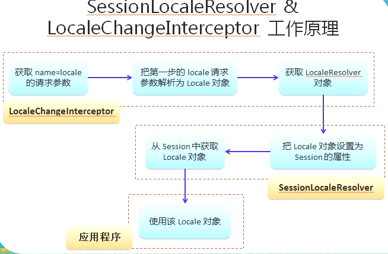

## JSON&国际化

### 1.1 返回JSON
- 引入对应依赖：
```xml
<dependency>
    <groupId>com.fasterxml.jackson.core</groupId>
    <artifactId>jackson-core</artifactId>
    <version>2.8.8</version>
</dependency>
<dependency>
    <groupId>com.fasterxml.jackson.core</groupId>
    <artifactId>jackson-annotations</artifactId>
    <version>2.8.8</version>
</dependency>
<dependency>
    <groupId>com.fasterxml.jackson.core</groupId>
    <artifactId>jackson-databind</artifactId>
    <version>2.8.8</version>
</dependency>
```
- 在对应方法上加入@ResponseBody注解：
```java
/**
 * 返回Json数据测试
 *
 * @author sherman
 */
@Controller
public class JsonController {
    @Autowired
    private EmployeeDao employeeDao;

    @ResponseBody
    @RequestMapping("/json/all_employees")
    public Collection<Employee> getAllEmployees() {
        return employeeDao.getAll();
    }
}
```

### 1.2 国际化
- 关于国际化：
    - 在页面上能够根据浏览器语言设置的情况对文本（不是内容）、时间、数值进行本地化处理
    - 可以在bean中获取国际化资源文件Locale对应的消息：
    ```java
    @Controller
    public class I18nController {
        @Autowired
        MessageSource messageSource;
    
        @ResponseBody
        @RequestMapping("/i18n")
        public String i18n(Locale locale) {
            /**
             * 为浏览器切换不同语言，输出不同国际化密码
             */
            String res = messageSource.getMessage("i18n.password", null, locale);
            System.out.println(res);
            return "i18n";
        }
    }
    ```
    - 通过超链接切换Locale，而不依赖于浏览器的语言设置情况
- 解决方案：
    - 使用JSTL的fmt标签：在之前章节介绍过
    - 在bean中注入ResourceBundleMessageSource的示例，使用其对应的getMessage方法即可
    ```java
    @Controller
    public class I18nController {
        @Autowired
        MessageSource messageSource;
    
        @ResponseBody
        @RequestMapping("/i18n")
        // 入参可以直接拿到Locale
        public String i18n(Locale locale) {
            /**
             * 为浏览器切换不同语言，输出不同国际化密码
             */
            String res = messageSource.getMessage("i18n.password", null, locale);
            System.out.println(res);
            return "i18n";
        }
    }
    ```
    - 配置LocalResolver和LocaleChangeInterceptor


关于第三点配置LocalResolver&LocaleChangeInterceptor：

- 在spring-mvc.xml中配置相应的组件：
```xml
<!--
     配置SessionLocalResolver
     注意id名称现在必须为LocaleResolver
-->
<bean id="localeResolver"
      class="org.springframework.web.servlet.i18n.SessionLocaleResolver"/>

<!-- 配置LocaleChangeInterceptor -->
<mvc:interceptors>
    <bean class="org.springframework.web.servlet.i18n.LocaleChangeInterceptor"/>
</mvc:interceptors>
```
- index.jsp中加入两个超链接，注意这两个超链接携带**locale**参数：
```xml
<h2>i18n</h2>
<a href="${pageContext.request.contextPath}/i18n/change?locale=zh_CN">中文</a>
<a href="${pageContext.request.contextPath}/i18n/change?locale=en_US">英文</a>
```
- 对应Controller转发到success.jsp页面（正好该页面之前里面有两个fmt\:message标签）:
```java
/**
 * 该Controller处理两个超链接，这两个超链接携带了locale参数
 */
@RequestMapping("/i18n/change")
public String i18nChange( ){
    return "success";
}
```

