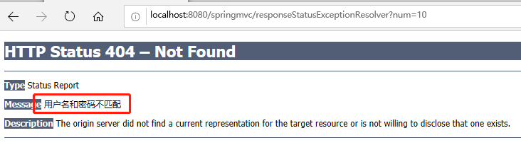

## 异常处理

### 1.1 @ExceptionHandler注解
Spring MVC通过**HandlerExceptionResolver**处理程序中的异常，包括Handler映射、数据绑定以及目标方法执行
时发生的异常。

Spring MVC提供HandlerExceptionResolver的实现类：


DispatcherServlet默认装配的HandlerExceptionResolver，具体来说：
- 没有使用\<mvc:annotation-driven/\>配置：
    - ~~AnnotationMethodHandlerExceptionResolver~~
    - ResponseStatusExceptionResolver
    - DefaultHandlerExceptionResolver
- 使用了\<mvc:annotation-driven/\>配置：
    - ExceptionHandlerExceptionResolver
    - ResponseStatusExceptionResolver
    - DefaultHandlerExceptionResolver
    

以**ExceptionHandlerExceptionResolver**为例：
- 请求参数中携带num参数，当num等于0时，抛出ArithmeticException：
- 当发生异常时，首先在该类中寻找@ExceptionHandler注解标注的方法去处理：
```java
@Controller
public class ExceptionController {
    @RequestMapping("/exception_handler")
    public String handleException(@RequestParam("num") int num) {
        System.out.println(10 / num);
        return "success";
    }

    /**
     * 当发生异常时，会寻找@ExceptionHandler注解标注的方法去处理
     * 注意如果要保存异常，不用使用Map（不能成功），需要使用ModelAndView
     */
    @ExceptionHandler({ArithmeticException.class})
    public ModelAndView handleArithmeticException(Exception ex) {
        ModelAndView mv = new ModelAndView("error_page");
        mv.addObject("error", ex);
        return mv;
    }
}
```
- 如果当前类中没有@ExceptionHandler标注的方法，那么还会去有@ControllerAdvice注解标注的类中去查找
是否有@ExceptionHandler标注的方法：
```java
/**
 * 当异常发生时，且当前Handler中找不到@ExceptionHandler方法来处理当前异常，则会去
 * 有@ControllerAdvice注解的类中继续查找@ExceptionHandler标记的方法来处理
 *
 * 注意：
 * 演示该方法使用时，可以将ExceptionController.java中handleArithmeticException方法
 * 注释，当发生ArithmeticException，该类下到的方法仍然能够捕获到。
 *
 * @author sherman
 */
@ControllerAdvice
public class CustomExceptionHandler {
    @ExceptionHandler({ArithmeticException.class})
    public ModelAndView handlerArithmeticException(Exception ex) {
        ModelAndView mv = new ModelAndView("error_page");
        mv.addObject("error", ex);
        return mv;
    }
}
```
- 发生错误时跳转的页面error_page.jsp：
```java
<%@ page contentType="text/html;charset=UTF-8" language="java" %>
<html>
<head>
    <title>Error page</title>
    <h4>error page</h4>
    ${error}
</head>
<body>

</body>
</html>
```
**补充**：当一个异常被多个有@ExceptionHandler都能捕获时，存在异常优先级问题，异常优先有**最匹配（转换最少的）**异常处理器捕获。

### 1.2 ResponseStatusExceptionResolver
ResponseStatusExceptionResolver使用@ResponseStatus注解将异常映射为Http状态码：
- 请求参数中携带num参数，当num等于10时，直接抛出自定义异常：CustomResponseStatusException
```java
@Controller
public class ExceptionController {
    /**
     * 测试ResponseStatusExceptionResolver
     */
    @RequestMapping("/responseStatusExceptionResolver")
    public String testResponseStatusExceptionResolver(@RequestParam("num") int num) {
        if (10 == num) {
            throw new CustomResponseStatusException();
        }
        return "error_page";
    }
}
```
- 在自定义异常CustomResponseStatusException类上加入@ResponseStatus注解，将对应的错误映射成Http状态码：
```java
/**
 * 将异常转换成Http status
 *
 * @author sherman
 */
@ResponseStatus(value = HttpStatus.NOT_FOUND, reason = "用户名和密码不匹配")
public class CustomResponseStatusException extends RuntimeException {
}
```


**注意**：

@ResponseStatus也可以直接标注在方法上，表示对应方法映射的路径一旦被请求，直接抛出对应的Http状态码。

### 1.3 DefaultHandlerExceptionResolver
DefaultHandlerExceptionResolver处理Spring内部一些默认的异常，并且将这些异常转换成对应的Http状态码，
具体哪些异常，直接查看该类的源码：

```java
protected ModelAndView doResolveException(
        HttpServletRequest request, HttpServletResponse response, @Nullable Object handler, Exception ex) {

    try {
        if (ex instanceof HttpRequestMethodNotSupportedException) {
            return handleHttpRequestMethodNotSupported(
                    (HttpRequestMethodNotSupportedException) ex, request, response, handler);
        }
        else if (ex instanceof HttpMediaTypeNotSupportedException) {
            //...
        }
        else if (ex instanceof HttpMediaTypeNotAcceptableException) {
            //...
        }
        else if (ex instanceof MissingPathVariableException) {
             //...
        }
        else if (ex instanceof MissingServletRequestParameterException) {
             //...
        }
        else if (ex instanceof ServletRequestBindingException) {
             //...
        }
        else if (ex instanceof ConversionNotSupportedException) {
             //...
        }
        else if (ex instanceof TypeMismatchException) {
             //...
        }
        else if (ex instanceof HttpMessageNotReadableException) {
             //...
        }
        else if (ex instanceof HttpMessageNotWritableException) {
             //...
        }
        else if (ex instanceof MethodArgumentNotValidException) {
             //...
        }
        else if (ex instanceof MissingServletRequestPartException) {
             //...
        }
        else if (ex instanceof BindException) {
             //...
        }
        else if (ex instanceof NoHandlerFoundException) {
             //...
        }
        else if (ex instanceof AsyncRequestTimeoutException) {
             //...
        }
    }
    catch (Exception handlerEx) {
        if (logger.isWarnEnabled()) {
            logger.warn("Failure while trying to resolve exception [" + ex.getClass().getName() + "]", handlerEx);
        }
    }
    return null;
}
```

### 1.4 SimpleMappingExceptionResolver
SimpleMappingExceptionResolver可以直接在spring-mvc.xml中进行配置，当某中异常出现时，直接跳转到对应页面：
- 在控制器对应方法中创建一个长度为10的数组，请求参数len如果大于等于10，对应方法会抛出数组越界异常：
```java
/**
 * 测试SimpleMappingExceptionResolver
 */
@RequestMapping("/simpleMappingExceptionResolver")
public String testSimpleMappingExceptionResolver(@RequestParam("len") int len) {
    /**
     * 当传递过来的参数len>=10，抛出数组越界异常
     */
    String[] strs = new String[10];
    System.out.println(strs[len]);
    return "error_page";
}
```
- 在spring-mvc.xml中配置SimpleMappingExceptionResolver，当发生数组越界异常时候直接跳转到error_page页面中，且还可以将错误信息放入到request域中，在error_page中获取到：
```xml
<!-- 配置使用SimpleMappingExceptionResolver来映射ArrayIndexOutOfBoundsException -->
<bean class="org.springframework.web.servlet.handler.SimpleMappingExceptionResolver">
    <!-- 默认情况下，exceptionAttributes值为exception，这里修改它方面将错误信息传递当error_page中 -->
    <property name="exceptionAttribute" value="error"/>
    <property name="exceptionMappings">
        <props>
            <prop key="java.lang.ArrayIndexOutOfBoundsException">error_page</prop>
        </props>
    </property>
</bean>
```

