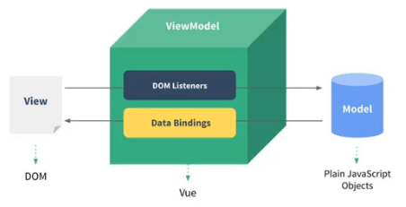

# 一、邂逅Vue

## 1.1 认识Vue

### 简介

Vue（读音 /vju:/，类似于**view**），是一个渐进式的框架，什么是渐进式？

- 渐进式以为着可以将Vue作为应用的一部分嵌入到其中，带来更加丰富的体验

- 或者如果希望将更多的业务逻辑使用Vue实现，那么Vue的核心库及其生态系统（Vue全家桶：Core + Vue-router + Vuex）能够很好地满足各种各样的需求

### 特点

Vue有很多特点和Web开发中常见的高级功能：

- 解耦视图和组件

- 可复用的组件

- 前端路由技术

- 状态管理

- 虚拟DOM

### 安装

Vue安装三种方式：

-  直接CND引入

```xml
<!-- 开发环境版本，包含了有帮助的命令行警告 -->
<script src="https://cdn.jsdelivr.net/npm/vue/dist/vue.js"></script>

<!-- 生产环境版本，优化了尺寸和速度 -->
<script src="https://cdn.jsdelivr.net/npm/vue"></script>
```

-  下载和引入

    -  开发环境：https://vuejs.org/js/vue.js

    -  生产环境：https://vuejs.org/js/vue.min.js

-  NPM安装

后续通过webpack和CLI的使用，介绍NPM安装方式：

```vue
npm install vue
```

## 1.2 Vue响应式初体验

编写第一个Vue程序来体验Vue响应式特点，Vue是页面和数据相分离（解耦），即修改数据后，页面会进行响应。

### 第一个Vue程序

- new Vue({...})：说明**function Vue**这样的定义必定存在引入的vue.js中，并且入参接受的是一个对象，该对象类型实际为**Options**

- el: "#div1"：将当前Vue实例挂载到id=div1的元素上，即id=div1的元素交由Vue来管理

- data: {...}：存储一些数据，数据可以自定义，也可以来自网络，从服务器上加载

- 编程范式：传统JS是命令式，Vue是声明式

- 页面和数据分离：页面和数据分离带来最大的好处是**解耦**，特别的，对于下面的代码，通过浏览器的Console中设置：app.message=“change message”，页面会立即进行**响应**，显示修改后的message值。

```html
<!DOCTYPE html>
<html>
  <title>hello vuejs</title>
  <script src="../js/vue.js"></script>
  <head>
    <meta charset="utf-8" />
  </head>
  <bod>
    <!-- div1 交由vue实例管理，div2未交由vue实例管理 -->
    <div id="div1">
      <h1>{{name}}</h1>
      <h2>{{message}}</h2>
    </div>
    <div id="div2">{{message}}</div>
  </bod>
  <script>
    // es6使用let/const代替var
    // 编程范式转换：命令式 -> 声明式 ---> 页面和数据完全分离，降低耦合度
    const app = new Vue({
      el: "#div1", // Vue实例挂载到哪个html元素上
      data: {      // 通常存储一些数据，数据可以自定义，也可以来自网络，从服务器加载
        message: "hello vuejs!",
        name: "sherman"
      }
    });

    // 命令式范式：原始js实现
    // 1. 创建div元素，设置id属性
    // 2. 定义一个message变量
    // 3. 将message变量赋值给对应id的div元素进行显示
  </script>
</html>

```

### Vue列表程序

使用Vue来显示一个列表：

- v-for：v-for进行对指定数组进行遍历，不需要重复写<li>标签，同时也是因为id=div1的元素交由Vue管理，所以能够解析v-for

- 响应式：在浏览器的Console中加入：**app.language.push("JS")**，页面会立即响应添加一个名为JS的<li>

```html
<!DOCTYPE html>
<html>
  <script src="../js/vue.js"></script>
  <head>
    <meta charset="utf-8" />
  </head>
  <body>
    <div id="div1">
      <ul>
          <!-- v-for进行遍历，也是因为id=div1的元素交由Vue管理，所以能够解析v-for -->
        <li v-for="item in language">{{item}}</li>
      </ul>
    </div>
  </body>
  <script>
    const app = new Vue({
      el: "#div1",
      data: {
        language: ["C", "C++", "Java", "Python"]
      }
    });
  </script>
</html>
```

### 计数器

- v-on:click="..."：因为id=div1的元素交由Vue管理，才能解析到v-on:click

- v-on:click="counter++"：注意引号里面存储的是变量，可以直接进行运算操作

- v-on:click="increment"：复杂操作时，引号里面是函数名

- @click="incrment"：v-on:click的

- this.counter++：也可以使用app.counter++，但是推荐使用this，表示当前Vue实例

- obj：可以在Vue实例外部定义一个obj对象，然后Vue实例直接使用obj。注意仍然可以使用this来获取外部的obj中counter变量，因为**Vue通过proxy在Vue实例内部创建了一个obj的代理对象**，代理对象的属性和obj属性完全相同。

```html
<!DOCTYPE html>
<html>
  <title>计数器</title>
  <script src="../js/vue.js"></script>
  <head>
    <meta charset="utf-8" />
  </head>
  <body>
    <div id="div1">
      <h2>当前计数：{{counter}}</h2>
      <!-- 如果只是操作简单变量可以直接这样写 -->
      <!-- <button v-on:click="counter++">+</button>
      <button v-on:click="counter--">-</button> -->

      <!-- 操作比较复杂时，v-on:click=后面为函数名 -->
      <!-- <button v-on:click="increment">+</button>
      <button v-on:click="decrement">-</button> -->

      <!-- v-on:click的语法糖表示：@click -->
      <button @click="increment">+</button>
      <button @click="decrement">-</button>
    </div>
  </body>
  <script>
    // proxy
    const obj = {
      counter: 0
    };

    const app = new Vue({
      el: "#div1",
      data: obj,
      methods: {
        increment() {
          // 不推荐这样写，应该使用this
          app.counter++;
        },
        decrement() {
          this.counter--;
        }
      }
    });
  </script>
</html>
```

## 1.3 MVVM

MVVM（Model-View-ViewModel）[维基百科](https://www.wikii.cc/wiki/MVVM)，维基百科中文镜像：https://www.wikii.cc/wiki/Wikipedia。

- Model：代表真实状态内容的[领域模型](https://www.wikii.cc/wiki/领域模型)（面向对象），或指代表内容的[数据访问层](https://www.wikii.cc/w/index.php?title=数据访问层&action=edit&redlink=1)（以数据为中心）

- View：就像在[MVC](https://www.wikii.cc/wiki/MVC)和[MVP](https://www.wikii.cc/wiki/Model-view-presenter)模式中一样，视图是用户在屏幕上看到的结构、布局和外观（UI）

- ViewModel：*视图模型*是暴露公共属性和命令的视图的抽象，ViewModel作为Model和View的通信桥梁

  - 一方面它实现了Data Binding（数据绑定），将Model的改变实时响应到View中

  - 另一方面它实现类DOM Listener（DOM监听），当DOM发生了一些事件（点击、滚动、touch等），可以被监听到，并在需要的情况下改变对应的Data




## 1.4 Vue实例的Options入参

在**new Vue({...})**实例时，可以传递的入参是一个对象，具体类型为**Options**，Options具体可以传递的选项参考：

https://cn.vuejs.org/v2/api/#%E5%AE%9E%E4%BE%8B%E5%B1%9E%E6%80%A7

目前已经掌握的：

- el：

  - 类型：String|HTMLElement

  - 作用：Vue实例挂载在哪个DOM对象上

- data：

  - 类型：Object|Function（组件当中data必须为函数）

  - 作用：Vue实例对应的数据对象

- methods：

  - 类型：String:function(){...}

  - 作用：定义属于当前Vue实例的方法，可以在其他地方进行调用

## 1.5 Vue实例的生命周期

每个 Vue 实例在被创建时都要经过一系列的初始化过程——例如，需要设置数据监听、编译模板、将实例挂载到 DOM 并在数据变化时更新 DOM 等。同时在这个过程中也会运行一些叫做**生命周期钩子**的函数，这给了用户在不同阶段添加自己的代码的机会。简单说，说过用户定义了生命周期钩子函数，那么在Vue实例创建时会在相应的步骤时进行回调。下图中所有红色圆角矩形框都是生命周期钩子函数。


## 1.6 Vue的template

VsCode中，File -> Preferences -> User snippets搜索html.json，在其中加入：

```json
"New empty html": {
    "prefix": "newh",
    "body": [
        "<!DOCTYPE html>",
        "<html>",
        "  <title>$1</title>",
        "  <head>",
        "    <meta charset=\"utf-8\" />",
        "  </head>",
        "  <body>$2</body>",
        "  <script>",
        "    const app = new Vue({",
        "      el: '#$3',",
        "      data: {",
        "        message: '$4'",
        "      }",
        "    });",
        "  </script>",
        "</html>"
    ]
}
```

之后新建html文件时，只需要键入**newh**，然后tab即可显示出来。

## 1.7 插值操作

### Mustache操作

**{{val}}**取值的方式成为Mustache语法，因为{{}}类似于胡子：

-  {{}}可以直接取值，也可以支持表达式语法，支持算数运算

```html
<!DOCTYPE html>
<html>
  <title>Mustache语法</title>
  <script src="../js/vue.js"></script>
  <head>
    <meta charset="utf-8" />
  </head>
  <body>
    <div id="div1">
      <h2>{{message}}</h2>
      <h2>{{firstName + ":" + secondName}}</h2>
      <h2>{{firstName}} {{secondName}}</h2>
      <h2>{{age * 10}}</h2>
    </div>
  </body>
  <script>
    const app = new Vue({
      el: "#div1",
      data: {
        message: "msg",
        firstName: "Sherman",
        secondName: "Tang",
        age: 23
      }
    });
  </script>
</html>
```

### 指令

#### v-once指令

在某些情况下，希望页面的数据只显示一次，不会随着数据的改变而发生改变，可以使用**v-once**指令。

```html
<!DOCTYPE html>
<html>
  <title>v-once指令</title>
  <script src="../js/vue.js"></script>
  <head>
    <meta charset="utf-8" />
  </head>
  <body>
    <div id="div1">
      <h2>{{message}}</h2>
      <!-- 在浏览器的Console中设置：app.message="change"后，第一个message会改变，当前message不会改变 -->
      <h2 v-once>{{message}}</h2>
    </div>
  </body>
  <script>
    const app = new Vue({
      el: "#div1",
      data: {
        message: "msg"
      }
    });
  </script>
</html>
```

#### v-html指令

如果一个字符串本身代表值HTML代码，直接使用{{}}语法并不能获取真正的HTML格式内容，只会显示HTML的字符串形式。v-html就是将字符串解析成真正的HTML格式：

```html
<!DOCTYPE html>
<html>
  <title>v-html指令</title>
  <script src="../js/vue.js"></script>
  <head>
    <meta charset="utf-8" />
  </head>
  <body>
    <div id="div1">
      <h2>{{url}}</h2>
      <h2 v-html="url"></h2>
    </div>
  </body>
  <script>
    const app = new Vue({
      el: "#div1",
      data: {
        url: "<a href='www.baidu.com'>百度一下</a>"
      }
    });
  </script>
</html>
```

#### v-text指令

v-text指令和{{}}语法功能类似，但是没有{{}}语法灵活，例如不支持算数表达式、表达式语法，并且会出现覆盖的情况：

```html
<!DOCTYPE html>
<html>
  <title>v-html</title>
  <script src="../js/vue.js"></script>
  <head>
    <meta charset="utf-8" />
  </head>
  <body>
    <div id="div1">
      <h2>{{message}}: hello</h2>
      <!-- v-text获取到的值会覆盖掉: hello -->
      <h2 v-text="message">: hello</h2>
    </div>
  </body>
  <script>
    const app = new Vue({
      el: "#div1",
      data: {
        message: "sherman"
      }
    });
  </script>
</html>
```

#### v-pre指令

v-pre指令用于跳过该元素和其子元素的编译过程，用于显示Mustache原本的语法，即不经过{{}}语法解析:

```html
<!DOCTYPE html>
<html>
  <title>v-pre指令</title>
  <script src="../js/vue.js"></script>
  <head>
    <meta charset="utf-8" />
  </head>
  <body>
    <div id="div1">
      <!-- 第一个输出：hello，第二个输出：{{message}} -->
      <h2>{{message}}</h2>
      <h2 v-pre>{{message}}</h2>
    </div>
  </body>
  <script>
    const app = new Vue({
      el: "#div1",
      data: {
        message: "hello"
      }
    });
  </script>
</html>
```

#### v-cloak指令

cloak（斗篷），在某些情况下（例如网络抖动），导致Vue解析缓慢，页面上会直接出现{{val}}类似的语法值，即未编译的Mustache标签，v-cloak可以解决这类不友好的页面显示问题：

-  在Vue解析之前，div中有一个v-cloak的属性

-  在Vue解析之后，div会将v-cloak的属性删除掉

可以通过样式，在Vue解析之前（即div中含有v-cloak属性时），将对应的{{val}}的display属性设置为none：

```html
<!DOCTYPE html>
<html>
  <title>v-cloak指令</title>
  <script src="../js/vue.js"></script>
  <style>
    [v-cloak] {
      display: none;
    }
  </style>
  <head>
    <meta charset="utf-8" />
  </head>
  <body>
    <div id="div1">
      <h2 v-cloak>{{message}}</h2>
    </div>
  </body>
  <script>
    // 延迟未加载的1s内，div含有v-cloak属性，被样式表设置为none
    // 1s后，Vue开始加载解析，会删除div的v-vloak属性
    setTimeout(function() {
      const app = new Vue({
        el: "#div1",
        data: {
          message: "hello"
        }
      });
    }, 1000);
  </script>
</html>
```

#### v-bind指令

前面的指令都是将值插入到模板的内容中，有时候也希望将元素的属性也进行动态绑定，例如：

-  <a>标签的href属性

-  标签的src属性

v-bind指令就是用于动态绑定，v-bind还有语法糖形式，直接使用**:**即可：

```html
<!DOCTYPE html>
<html>
  <title>v-bind指令</title>
  <script src="../../js/vue.js"></script>
  <head>
    <meta charset="utf-8" />
  </head>
  <body>
    <div id="div1">
      <!-- 
      <a v-bind:href="aHref">百度一下</a> -->

      <!-- v-bind语法糖形式，直接使用: -->
      
      <a :href="aHref">百度一下</a>
    </div>
  </body>
  <script>
    const app = new Vue({
      el: "#div1",
      data: {
        //  imgUrl和aHref两个数据通常从服务器请求得到
        imgUrl:
          "https://cn.vuejs.org/images/logo.png?_sw-precache=cf23526f451784ff137f161b8fe18d5a",
        aHref: "https://www.baidu.com"
      }
    });
  </script>
</html>
```

## 1.8 动态绑定

### 动态绑定class（对象语法）

在之前的JS中，要给一个标签绑定class必须是实现写好的，然后根据写好的class进行样式判断等其它操作，但是不能进行冬天绑定class。Vue可以通过v-bind进行动态绑定class：

-  通过{}绑定一个类：<h2 :class="{active: isActive}">hello world</h2>

-  通过{}绑定多个类：<h2 :class="{active: isActive, line: isLine}">hello world</h2>

-  和普通类共存：<h2 class="title" :class="{active: isActive, line: isLine}">hello world</h2>

-  如果过于复杂，可以存放一个methods或者computed中:

```html
<!DOCTYPE html>
<html>
  <title>动态绑定class</title>
  <script src="../../js/vue.js"></script>
  <style>
    .active {
      color: red;
    }
  </style>
  <head>
    <meta charset="utf-8" />
  </head>
  <body>
    <div id="div1">
      <!-- v-bind可以通过语法糖:进行简化 -->
      <!-- <h2 class="title" :class="{active: isActive, line: isLine}">
        {{message}}
      </h2> -->

      <!-- 使用函数 -->
      <h2 class="title" :class="getClasses()">{{message}}</h2>
      <button v-on:click="btnClick">change</button>
    </div>
  </body>
  <script>
    const app = new Vue({
      el: "#div1",
      data: {
        message: "hello",
        isActive: true,
        isLine: true
      },
      methods: {
        btnClick: function() {
          this.isActive = !this.isActive;
        },
        getClasses: function() {
          return { active: this.isActive, line: this.isLine };
        }
      }
    });
  </script>
</html>
```

### 动态绑定class（数组语法）

动态绑定class（数组语法）实际使用很少，因为通过数组进行绑定的class实际上不能控制取消绑定，不是严格上的动态绑定，基本可以使用JS原生的固定写法代替。注意一种特殊情况，如果数组中的值是变量，从服务器请求得到，此时原生的JS不能代替：

```html
<!DOCTYPE html>
<html>
  <title>动态绑定class（数组类型）</title>
  <script src="../../js/vue.js"></script>
  <head>
    <meta charset="utf-8" />
  </head>
  <body>
    <div id="div1">
      <!--
        1. 注意name加了''，代表普通字符串，active和line被认为是变量，被解析成aaaa、bbbb，
        2. 最终h2的class有：title name aaaa bbbb
      -->
      <h2 class="title" :class="['name', active, line]">{{message}}</h2>
      <!-- 也可以使用函数代替数组 -->
      <h2 class="title" :class="getClasses()">{{message}}</h2>
    </div>
  </body>
  <script>
    const app = new Vue({
      el: "#div1",
      data: {
        message: "msg",
        active: "aaaa",
        line: "bbbb"
      },
      methods: {
        getClasses: function() {
          return [this.active, this.line];
        }
      }
    });
  </script>
</html>
```

## 1.9 计算属性

### 两个案例

模板中虽然可以直接通过插值语法显示data中的一些数据，但是在某些情况下，我们需要对数据进行一些转换后再显示，或者需要将多个数据结合起来再进行显示。为了达到这样需求，除了使用函数之外，还可以使用计算属性。计算属性需要使用到Options入参中的**computed**选项：

-  计算属性相对于函数而言，有缓存，只会计算一次，性能较高

### 案例一

```html
<!DOCTYPE html>
<html>
  <title>计算属性基本使用</title>
  <script src="../../js/vue.js"></script>
  <head>
    <meta charset="utf-8" />
  </head>
  <body>
    <div id="div1">
      <h2>{{firstName}} {{secondName}}</h2>
      <h2>{{firstName}} {{secondName}}</h2>
      <h2>{{getFullName()}}</h2>
      <h2>{{fullName}}</h2>
    </div>
  </body>
  <script>
    const app = new Vue({
      el: "#div1",
      data: {
        firstName: "Tang",
        secondName: "Lei"
      },
      //  计算属性，名称通常为名词
      computed: {
        fullName: function() {
          return this.firstName + " " + this.secondName;
        }
      },
      methods: {
        getFullName: function() {
          return this.firstName + " " + this.secondName;
        }
      }
    });
  </script>
</html>
```

### 案例二

```html
<!DOCTYPE html>
<html>
  <title>计算属性复杂使用</title>
  <script src="../../js/vue.js"></script>
  <head>
    <meta charset="utf-8" />
  </head>
  <body>
    <div id="div1">
      <h2>{{totalPrice}}</h2>
    </div>
  </body>
  <script>
    const app = new Vue({
      el: "#div1",
      data: {
        books: [
          { id: 101, name: "Java编程思想", price: 100.0 },
          { id: 102, name: "算法", price: 79.1 },
          { id: 103, name: "设计模式", price: 131.0 },
          { id: 104, name: "深入Linux", price: 80.0 }
        ]
      },
      computed: {
        totalPrice: function() {
          let res = 0.0;
          for (let i = 0; i < this.books.length; ++i) {
            res += this.books[i].price;
          }
          return res;
        }
      }
    });
  </script>
</html>
```

### set&get

计算属性本质上还是一个属性，但是有get和set方法，通常情况下，set方法不进行开放，当属性只有一个get方法时，可以直接简写成函数形式，但是它本质上还是一个属性。这也是为什么在上面案例{{totalPrice}}语法中，不能加上**()**：

```html
<body>
    <div id="div1">
        <h2>{{fullName}}</h2>
    </div>
</body>
<script>
    const app = new Vue({
        el: "#div1",
        data: {
            firstName: "Tang",
            secondName: "Lei"
        },
        computed: {
            // 本质上fullName还是一个属性，但是有get和set方法
            // 同时如果只有get方法的话，可以进行简写成函数形式，但是仍然是属性
            // 因此{{fullName}}中不能加()
            fullName: {
                // 一般不开放set方法
                set: function(newValue) {
                    let aName = newValue.split(" ");
                    this.firstName = aName[0];
                    this.secondName = aName[1];
                },
                get: function() {
                    return this.secondName + ":" + this.firstName;
                }
            }
        }
    });
  </script>
```

### 计算属性和方法区别

计算属性内部有缓存，当被缓存的数据没有发生变化时，计算属性的get方法只会调用一次，之后直接从缓存中获取，只有当被缓存的数据发生变化时，才会重新调用，效率高。而方法每次调用都会执行一次：

```html
<body>
    <div id="div1">
        <h2>{{fullName}}</h2>
        <h2>{{fullName}}</h2>
        <h2>{{fullName}}</h2>

        <h2>{{getFullName()}}</h2>
        <h2>{{getFullName()}}</h2>
        <h2>{{getFullName()}}</h2>
    </div>
</body>
<script>
    const app = new Vue({
        el: "#div1",
        data: {
            firstName: "Tang",
            secondName: "Lei"
        },
        methods: {
            getFullName: function() {
                console.log("方法被调用");
                return this.secondName + ":" + this.firstName;
            }
        },
        computed: {
            fullName: function() {
                console.log("计算属性被调用");
                return this.secondName + ":" + this.firstName;
            }
        }
    });
</script>
```

## 1.10 ES6补充

### let/var

**var**实际上时JS语言上设计错误，Brendan Eich使用了let关键字进行修复，let可以看成完美的var。

var的缺陷：没有块级作用域的概念，即例如一个for循环块内部定义了一个var name，在for循环块外部也能够访问到name。

**每次点击button值都是4**：

```html
<body>
    <button>btn1</button>
    <button>btn2</button>
    <button>btn3</button>
    <button>btn4</button>
</body>
<script>
    //  var在for循环中没有块作用域，每个button的click中引用的都是同一i变量
    // 当所有的click函数设置完毕后，i==aBtn.length，当点击任何button时
    // 都会显示aBtn.length的值
    var aBtn = document.getElementsByTagName("button");
    for (var i = 0; i < aBtn.length; ++i) {
        aBtn[i].addEventListener("click", function() {
            console.log("button: " + i + " clicked");
        });
    }
</script>
```

**解决方式一：闭包**：函数是有自己的块作用域

```javascript
for (var i = 0; i < aBtn.length; ++i) {
    (function(i) {
        aBtn[i].addEventListener("click", function() {
            console.log("button: " + i + " clicked");
        });
    })(i);
}
```

**解决方式二：let**：let具有块作用域

```javascript
for (let i = 0; i < aBtn.length; ++i) {
    aBtn[i].addEventListener("click", function() {
        console.log("button: " + i + " clicked");
    });
}
```

### const

const修饰的标志符为常亮，表明该标志符不能改变：

-  const标志符在初始化必须赋初值

-  const标志符如果引用的是对象，只表示该标志符不能重新引用新的对象，不表示对象内容不可变

### 字面量的增强写法

-  字面量增强写法：foo: foo -> foo

-  函数增强写法：foo function() {...} -> foo(){...}

```javascript
<script>
    const name = "sherman";
    const age = 23;
    const height = 1.76;
    // es5字面量写法
    const obj1 = {
      name: name,
      age: age,
      height: height
    };
    // es6字面量的增强写法
    const obj2 = {
      name,
      age,
      height
    };
    console.log(obj1);
    console.log(obj2);
    // es6函数增强写法
    const stu = {
      study() {
        console.log("study");
      },
      eat() {
        console.log("eat");
      }
    };
    stu.study();
    stu.eat();
  </script>
```