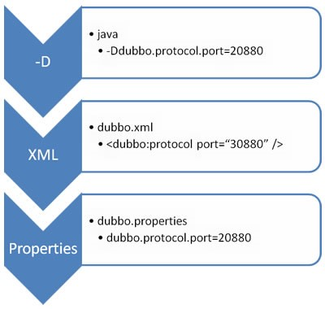
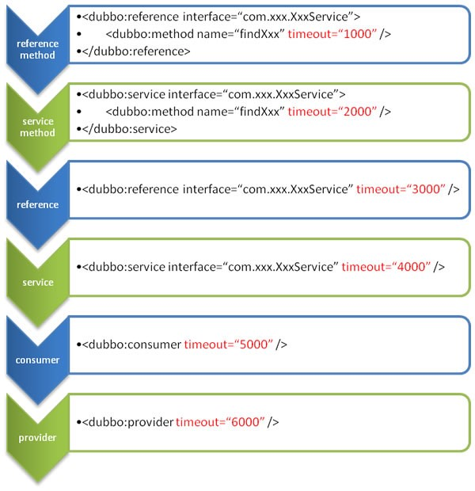

## 一、基础知识

### 1.1 分布式理论

分布式系统原理与范型：分布式系统是若干独立计算机的集合，这些计算机对于用户来说就像单个相关系统。分布式系统（distributed system）是建立在网络之上的软件系统。

随着互联网的发展，网站应用的规模不断扩大，常规的垂直应用架构已无法应对，分布式服务架构以及流动计算架构势在必行，亟需 **一个治理系统** 确保架构有条不紊的演进。

#### 1.1.1 发展演变


**单一架构**

当网站流量很小时，只需一个应用，将所有功能都部署在一起，以减少部署节点和成本。此时，用于简化增删改查工作量的数据访问框架(ORM)是关键。适用于小型网站，小型管理系统，将所有功能都部署到一个功能里，简单易用。缺点也很明显：性能拓展困难；协同开发问题；不利于维护升级。

**垂直应用**

当访问量逐渐增大，单一应用增加机器带来的加速度越来越小，将应用拆成互不相干的几个应用，以提升效率。此时，用于加速前端页面开发的Web框架(MVC)是关键。通过切分业务来实现各个模块独立部署，降低了维护和部署的难度，团队各司其职更易管理，性能扩展也更方便，更有针对性。缺点： 公用模块无法重复利用，开发性的浪费。

**分布式服务架构**

当垂直应用越来越多，应用之间交互不可避免，将核心业务抽取出来，作为独立的服务，逐渐形成稳定的服务中心，使前端应用能更快速的响应多变的市场需求。此时，用于提高业务复用及整合的 **分布式服务框架(RPC)** 是关键。缺点：不能进行调度管理，根据实时访问压力来管理集群，机器利用率不高。

**流动计算架构**

当服务越来越多，容量的评估，小服务资源的浪费等问题逐渐显现，此时需增加一个调度中心基于访问压力实时管理集群容量，提高集群利用率。此时，用于 **提高机器利用率的资源调度和治理中心(SOA)[ Service Oriented Architecture]** 是关键。


#### 1.1.2 RPC

RPC（Remote Procedure Call）：指远程过程调用，是一种进程间通信方式，它是一种技术的思想，而不是规范。它允许程序调用另一个地址空间（通常是共享网络的另一台机器上）的过程或函数，而不用程序员显式编码这个远程调用的细节。即程序员无论是调用本地的还是远程的函数，本质上编写的调用代码基本相同。


### 1.2 dubbo核心概念

#### 1.2.1 简介

Apache Dubbo (incubating) |ˈdʌbəʊ| 是一款高性能、轻量级的开源Java RPC框架，它提供了三大核心能力：

- 面向接口的远程方法调用
- 智能容错和负载均衡
- 服务自动注册和发现。

官网：http://dubbo.apache.org/

#### 1.2.2 基本概念


- **服务提供者（Provider）**：暴露服务的服务提供方，服务提供者启动时，向注册中心注册自己提供的服务。
- **服务消费者（Consumer）**: 调用远程服务的服务消费方，服务消费者启动时，向注册中心订阅自己所需的服务。服务消费者从提供者地址列表中，基于软负载均衡算法，选一台提供者进行调用，如果调用失败，再选另一台调用。
- **注册中心（Registry）**：注册中心返回服务提供者地址列表给消费者，如果有变更，注册中心将基于长连接推送变更数据给消费者。
- **监控中心（Monitor）**：服务消费者和提供者，在内存中累计调用次数和调用时间，定时 **每分钟** 发送一次统计数据到监控中心。

调用关系说明：

- 服务容器负责启动，加载，运行服务提供者
- 服务提供者在启动时，向注册中心注册自己提供的服务
- 服务消费者在启动时，向注册中心订阅自己所需的服务
- 注册中心返回服务提供者地址列表给消费者，如果有变更，注册中心将基于长连接推送变更数据给消费者
- 服务消费者，从提供者地址列表中，基于软负载均衡算法，选一台提供者进行调用，如果调用失败，再选另一台调用
- 服务消费者和提供者，在内存中累计调用次数和调用时间，定时每分钟发送一次统计数据到监控中心

### 1.3 dubbo环境搭建

#### 1.3.1 zookeeper安装

注意：zookeeper的启动需要依赖jdk

**windows**

> 1. 官网下载：https://archive.apache.org/dist/zookeeper/zookeeper-3.4.13/
> 2. 复制zoo_sample.cfg为zoo.cfg，几个重要参数：dataDir、dataDirLog、clientPort
> 3. 使用zkServer.cmd启动即可
> 4. 几个命令：
>    1. ls /：列出zookeeper根下保存的所有节点
>    2. create -e /name sherman：创建一个name节点，值为sherman
>    3. get /name：获取/name的值，即sherman

**linux**

1. 下载zookeeper：wget https://archive.apache.org/dist/zookeeper/zookeeper-3.4.11/zookeeper-3.4.11.tar.gz 
2. 设置启动脚本：

```shell
#!/bin/bash
#chkconfig:2345 20 90
#description:zookeeper
#processname:zookeeper
ZK_PATH=/usr/local/zookeeper
export JAVA_HOME=/usr/local/java/jdk1.8.0_241
case $1 in
         start) sh  $ZK_PATH/bin/zkServer.sh start;;
         stop)  sh  $ZK_PATH/bin/zkServer.sh stop;;
         status) sh  $ZK_PATH/bin/zkServer.sh status;;
         restart) sh $ZK_PATH/bin/zkServer.sh restart;;
         *)  echo "require start|stop|status|restart"  ;;
esac
```

3. 把脚本注册为服务：`chkconfig --add zookeeper`
4. 增加权限：`chmod +x /etc/init.d/zookeeper`
5. zookeeper配置和windows上相同，注意路径即可
6. 启动zookeeper：`service zookeeper start`

#### 1.3.2 dubbo-admin管理控制台

dubbo本身并不是一个服务软件。它其实就是一个jar包能够帮你的java程序连接到zookeeper，并利用zookeeper消费、提供服务。所以你不用在Linux上启动什么dubbo服务。但是为了让用户更好的管理监控众多的dubbo服务，官方提供了一个可视化的监控程序，不过这个监控即使不装也不影响使用。

1. github下载地址：https://github.com/apache/incubator-dubbo-ops
2. 修改dubbo-admin配置：src\main\resources\application.properties 指定zookeeper地址：
   1. spring.guest.password=guest
   2. dubbo.registry.address=zookeeper://127.0.0.1:2181
3. 打包dubbo-admin：`mvn clean package -Dmaven.test.skip=true`
4. 运行jar包：j`ava -jar dubbo-admin-0.0.1-SNAPSHOT.jar`，访问：localhost:7001即可

### 1.4 dubbo-helloworld

[源码链接](https://github.com/tanglei302wqy/notes/tree/master/%E4%B8%AD%E9%97%B4%E4%BB%B6/dubbo/src/dubbo-projects)

#### 1.4.1 需求

某个电商系统，订单服务需要调用用户服务获取某个用户的所有地址，需要创建两个服务模块进行测试 ：

| 模块                                         | 功能           |
| -------------------------------------------- | -------------- |
| 订单服务web模块（order-service-consumer）    | 创建订单       |
| 用户服务service模块（user-service-provider） | 查询用户地址等 |

预期测试结果：订单服务web模块在A服务器，用户服务模块在B服务器，A可以远程调用B的功能。

#### 1.4.2 工程架构

**分包**

建议将 **服务接口，服务模型，服务异常等** 均放在 API 包中，因为服务模型及异常也是 API 的一部分，同时，这样做也符合分包原则：重用发布等价原则(REP)，共同重用原则(CRP)。

如果需要，也可以考虑在 API 包中放置一份 spring 的引用配置，这样使用方，只需在 spring 加载过程中引用此配置即可，配置建议放在模块的包目录下，以免冲突，如：com/alibaba/china/xxx/dubbo-reference.xml。

**粒度**

服务接口尽可能大粒度，每个服务方法应代表一个功能，而不是某功能的一个步骤，否则将面临分布式事务问题，Dubbo **暂未提供分布式事务支持**。

服务接口建议以业务场景为单位划分，并对相近业务做抽象，**防止接口数量爆炸**。不建议使用过于抽象的通用接口，如：Map query(Map)，这样的接口没有明确语义，会给后期维护带来不便。

#### 1.4.3 创建模块

先创建一个空的dubbo-projects工程，里面在包含三个module：

- mall-common-interfaces：存放服务接口，服务模型等
- order-service-consumer：订单模块，需要远程调用用户模块的方法
- user-service-provider：用户模块，提供订单模块需要调用的方法

**mall-common-interfaces**

在fun.sherman.mall包下存放bean和service包，其中bean包存放具体pojo对象，service存放PRC接口

**user-service-provider**

- pom.xml文件中引入mall-common-interfaces依赖

- 提供mall-common-interfaces中service层中生产者接口的实行类
- 在classpath路径下提供spring的配置文件 **provider.xml**：

```xml
<beans xmlns:xsi="http://www.w3.org/2001/XMLSchema-instance"
       xmlns:dubbo="http://dubbo.apache.org/schema/dubbo"
       xmlns="http://www.springframework.org/schema/beans" xmlns:context="http://www.springframework.org/schema/context"
       xsi:schemaLocation="http://www.springframework.org/schema/beans http://www.springframework.org/schema/beans/spring-beans-4.3.xsd
       http://dubbo.apache.org/schema/dubbo http://dubbo.apache.org/schema/dubbo/dubbo.xsd http://www.springframework.org/schema/context http://www.springframework.org/schema/context/spring-context.xsd">

    <!-- 指定当前服务（应用）名称，直接和module名称相同即可 -->
    <dubbo:application name="user-service-provider"/>
    <!-- 指定注册中心的位置 -->
    <dubbo:registry protocol="zookeeper" address="127.0.0.1:2181"/>
    <!-- 指定通信规则：协议 & 端口 -->
    <dubbo:protocol name="dubbo" port="52571"/>
    <!-- 暴露服务 ref：指向服务的真正实现对象 -->
    <dubbo:service interface="fun.sherman.mall.service.IUserService" ref="userServiceImpl"/>
    <!-- 服务真正实现的bean对象 -->
    <bean id="userServiceImpl" class="fun.sherman.mall.service.impl.UserServiceImpl"/>
</beans>
```

**order-service-consumer**

- pom.xml文件中引入mall-common-interfaces依赖

- 提供mall-common-interfaces中service层中消费者接口的实行类
- 在classpath路径下提供spring的配置文件 **consumer.xml**：

```xml
<beans xmlns:xsi="http://www.w3.org/2001/XMLSchema-instance"
       xmlns:dubbo="http://dubbo.apache.org/schema/dubbo"
       xmlns="http://www.springframework.org/schema/beans" xmlns:context="http://www.springframework.org/schema/context"
       xsi:schemaLocation="http://www.springframework.org/schema/beans http://www.springframework.org/schema/beans/spring-beans-4.3.xsd
       http://dubbo.apache.org/schema/dubbo http://dubbo.apache.org/schema/dubbo/dubbo.xsd http://www.springframework.org/schema/context http://www.springframework.org/schema/context/spring-context.xsd">

    <context:component-scan base-package="fun.sherman.mall" />
    <!-- 指定当前服务（应用）名称，直接和module名称相同即可 -->
    <dubbo:application name="order-service-consumer"/>
    <dubbo:registry address="zookeeper://127.0.0.1:2181"/>
    <!-- 声明需要调用的远程服务的接口，生成远程服务代理 -->
    <dubbo:reference interface="fun.sherman.mall.service.IUserService" id="iUserService" />
</beans>
```

#### 1.4.4 监控中心

除了dubbo-admin外，dubbo-ops还提供了dubbo-admin-simplel监控服务：

1. 下载：https://github.com/apache/incubator-dubbo-ops

2. 修改配置：主要修改 `dubbo.registry.address=zookeeper://127.0.0.1:2181`

3. 打包dubbo-admin-simple：`mvn clean package -Dmaven.test.skip=true`

4. 在order-service-consumer和user-service-provider中加入<dubbo-monitor>标签：

   `<dubbo:monitor protocol="registry"/>`

5. 打开网页：localhost:8080

### 1.5 整合Spring Boot

上述dubbo-helloworld采用spring框架，使用的是xml配置文件形式。Spring Boot整合dubbo可以直接使用注解版本，[源码链接](https://github.com/tanglei302wqy/notes/tree/master/%E4%B8%AD%E9%97%B4%E4%BB%B6/dubbo/src/springboot-dubbo-projects)

**项目结构**

创建一个空工程：springboot-dubbo-projects，该工程下包含三个module：

- mall-common-interface
- user-service-provider
- order-service-consumer

**相关设置**

- user-service-provider和order-service-consumer两个module都应该依赖mall-common-interface
- user-service-provider模块中配置文件：

```yml
dubbo:
  application:
    name: user-service-provider
  registry:
    protocol: zookeeper
    address: 127.0.0.1:2181
  protocol:
    name: dubbo
    port: 20080
  monitor:
    protocol: registry
server:
  port: 8082
```

- order-service-consumer模块中配置文件：

```yml
dubbo:
  application:
    name: order-service-consumer
  registry:
    protocol: zookeeper
    address: 127.0.0.1:2181
  monitor:
    protocol: registry

server:
  port: 8081
```

- dobbo和zookeeper依赖关系：zookeeper如果是3.4.x，则对应的curator应该使用2.x版本
- 注册服务：@Service，获取服务：@Reference


## 二、Dubbo配置

### 2.1 配置覆盖顺序



- JVM启动 -D 参数优先，可以方便用户在部署和启动时候进行参数重写
- dubbo.xml，即在相应的xml文件（provider.xml和consumer.xml）中配置dubbo标签
- dubbo.properties，可以在resources下专门新建一个dubbo.properties，相当于dubbo的缺省值，通常用于共享公共配置，例如应用名

### 2.2 启动时检查

dubbo缺省配置情况下，在启动时候会检查依赖的服务是否可用，不可用时会抛出异常，组织spring初始化完成，以便上线之前能够尽早发现问题，默认 `check=true`。

可以通过 `check=false`关闭检查，例如，测试时某些服务不关心，或者出现了循环依赖，必须有一方先启动。

另外，如果spring容器是懒加载的，或者通过API变成延迟引用服务，一定需要关闭check，否则服务临时不可用时，会抛出异常，拿到null值，如果 `check=false`，总会返回引用，当服务恢复时，能自动连上。

几种关闭启动时检查方式：

- 关闭当前消费者单个服务：`<dubbo:reference interface="fun.sherman.mall.IUserService" id="iUservice" check="false"/>`
- 关闭当前消费者所有服务：`<dubbo:consumer check="false"/>`
- 关闭注册中心启动时检查：`<dubbo:registry check="false">`

### 2.3 超时时间

由于网络或服务端不可靠，会导致调用出现一种不确定的中间状态（超时）。为了避免超时导致客户端资源（线程）挂起耗尽，必须设置超时时间。

超时配置的覆盖规则：

- 精度优先：方法级别优先，接口级别次之，全局配置最后
- 消费者优先：**如果级别一样**，则消费方优先，提供方次之



配置原则：

dubbo推荐尽可能在provider端配置consumer端属性：

- 作为服务的提供者，比服务的使用者更加清楚服务性能参数，例如超时时间，合理的重试次数等
- 在provider端配置参数后，如果consumer端不进行配置参数，provider端配置的参数可以作为consumer端参数缺省值。否则，consumer端会使用consumer端的全局参数值，这对provider端是不可控的，也是不合理的。

### 2.4 超时次数

失败自动切换，当出现失败，重试其它服务器，但重试会带来更长延迟。可通过 retries="2" 来设置重试次数(不含第一次)，retries="0"代表不重试。相关配置：

```xml
1. <dobbo:service retries="2" />
2. <double:reference retries="2" />
3. 
<dubbo:reference>
    <dubbo:method name="findFoo" retries="2" />
</dubbo:reference>
```

设置规则：

- 幂等操作（查询、删除、修改）：可以设置重试次数
- 非幂等操作（新增）：不能设置超时次数

### 2.5 多版本

当一个接口实现，出现不兼容升级时，可以用版本号过渡，版本号不同的服务相互间不引用。可以按照以下的步骤进行版本迁移：

- 在低压力时间段，先升级一半提供者为新版本

- 再将所有消费者升级为新版本

- 然后将剩下的一半提供者升级为新版本

```xml
<!-- provider：第一个版本 -->
<dubbo:service interface="fun.sherman.mall.service.IUserService" ref="userServiceImpl01" timeout="1000" version="1.0.0" />
<bean id="userServiceImpl01" class="fun.sherman.mall.service.impl.UserServiceImpl01" />

<!-- provider：第二个版本 -->
<dubbo:service interface="fun.sherman.mall.service.IUserService" ref="userServiceImpl02" timeout="1000" version="2.0.0" />
<bean id="userServiceImpl02" class="fun.sherman.mall.service.impl.UserServiceImpl02" />

<!-- consumer：消费者使用对应的版本 -->
<dubbo:reference interface="fun.sherman.mall.service.IUserService" id="iUserService" timeout="5000" retries="3" version="2.0.0" />
```

### 2.6 本地存根

远程服务后，客户端通常只剩下接口，而实现全在服务器端，但提供方有些时候想在客户端也执行部分逻辑，比如：做 ThreadLocal  缓存，提前验证参数，调用失败后伪造容错数据等等，此时就需要在 API 中带上 Stub，客户端生成 Proxy 实例，会把 Proxy  通过构造函数传给 Stub [[1\]](https://dubbo.apache.org/zh-cn/docs/user/demos/local-stub.html#fn1)，然后把 Stub 暴露给用户，Stub 可以决定要不要去调 Proxy。


使用方法：

- 在本地编写一个远程服务接口的本地存根实现（UserServiceImplStub），并且该实现类必须有一个有参构造器，用于传入真正的代理对象
- 配置：`<dubbo:service interface="fun.sherman.mall.service.IUserservice" stub=funlmsherman.mall.service.impl.UserviceImplStub`
- 实际开发中，一般会将本地存根放入到公共接口项目（mall-common-interfaces）中，以便调用

### 2.7 整合Spring Boot

dubbo整合Spring Boot一般有三种方式：

**dubbo-starter配置**

导入dubbo-starter后，在application.properties中进行属性配置，使用@Service来暴露服务，使用@Reference来引用服务。要使用该功能，一定是使用@EnableDubbo来开启注解功能。

**保留dubbo.xml配置**

可以将dubbo.xml配置文件（例如，provider.xml和consumer.xml）放入到类路径下，然后在主配置类上通过`@ImportResource(location="classpath:provider.xml")` 注解来引用即可。

**使用注解版配置**

直接使用@Configuration和@Bean对dubbo进行注解配置，之前xml文件中每一个 **\<dubbo:xxx/\>** 标签都有一个对应的 **xxxConfig** 类对应：

- 编写配置文件类
- 使用@DubboComponentScan将扫描规则指定扫描对应的配置类

```java
@Configuration
public class DubboConfig {
    @Bean
    public ApplicationConfig applicationConfig() {
        ApplicationConfig ac = new ApplicationConfig();
        ac.setName("springboot-user-service-consumer");
        return ac;
    }
    
    @Bean
    public RegistryConfig registryConfig() {
        RegistryConfig rc = new RegistryConfig();
        rc.setProtocol("zookeeper");
        rc.setAddress("127.0.0.1:2181");
        return rc;
    }
    
    @Bean
    public ProtocolConfig protocolConfig() {
        ProtocolConfig pc = new ProtocolConfig();
        pc.setName("dubbo");
        pc.setPort("20800");
        return pc;
    }
    
    @Bean
    // 注意入参IUserService直接是从spring容器中获取
    public ServiceConfig<IUserService> serviceConfig(IUserService iUserService) {
        ServiceConfig<IUserService> sc = new ServiceConfig<>();
        sc.setInterface(IUserService.class);
        sc.setRef(iUserService);
        sc.setVersion("1.0.0");
        
        // 设置method
        MethodConfig mc = new MethodConfig();
        mc.setName("getUserAddressList");
        mc.setTimeout(1000);
        
        List<MethodConfig> mcs = new ArrayList<>();
        mcs.add(mc);
        
        sc.setMethods(mcs);
        
        return sc;
    }
    
    // ...
}
```

