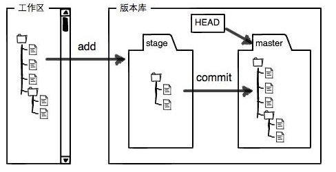
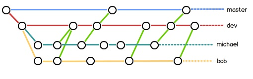

## git配置

git跟踪并管理的是修改，而非文件。

不同操作系统上安装git：

-   windows：下载安装包直接安装即可

-   centos7：`yum install git`
-   ubuntu：`sudo apt-get install git`

全局配置：

```shell
>> git config --global user.name "smantle"
>> git config --global user.email "smantle@aliyun.com"
```

创建一个本地git仓库并初始化：

```shell
>> mkdir -p /opt/learngit
>> cd /opt/learngit && git init
```

会在learngit目录下生成一个**.git**隐藏目录，需要额外关注里面一个config配置文件， vim config：

```txt
[core]
	repositoryformatversion = 0
	filemode = true
	bare = false
	logallrefupdates = true
```

------

## 基本命令




-   `git status`：查看当前git的状态
-   `git add file`：添加到暂存区（stage），可以add多个
-   `git commit -m "comments"`：commit文件，默认需要注释
-   `git commit --allow-empty-message -m ''`：也可以不提交注释，不推荐
-   `git checkout -- file`：撤销修改，在不同地方意义不同，后面介绍

-   `git log`：显示从最近到最远的提交日志，完整日志
-   `git log --pretty=oneline`：以{commit-id }+ message形式展示log信息
-   `git reset --hard HEAD^`：回退到上个commit版本
-   `git reset --hard HEAD^^`：回退到上上个commit版本
-   `git reset --hard HEAD~10`：回退到上10个commit版本
-   `git reset --hard {commit-id}​`:star:
-   `git reflog`：显示之前的每一次命令

补充：

-   当你用`git add`放入到暂存区后，但是在工作区进行的修改并没有放入暂存区，所以此时进行`git commit`只负责把刚开始放入到暂存区中的修改进行提交，之后的修改不会提交。

-   `git checkout -- readme.txt`意思就是，把`readme.txt`文件在工作区的修改全部撤销，这里有两种情况：

    -   `readme.txt`自修改后还没有被放到暂存区，现在，撤销修改就回到和版本库一模一样的状态

    -   `readme.txt`已经添加到暂存区后，又作了修改，现在撤销修改就回到添加到暂存区后的状态

    总之就是让这个文件回到最近一次`git commit`或`git add`时的状态。

-   `git checkout -- file`命令中的`--`很重要，没有`--`，就变成了“切换到另一个分支”的命令

-   `git reset`命令既可以回退版本（将HEAD指针指向不同的{commit-id}），也可以把暂存区的修改回退到工作区。当使用`HEAD`时，表示最新的版本。例如：`git reset HEAD readme.txt`

------


## 删除commit过文件

不小心删除了版本库中已经comimt过的文件：

-   确实要从版本库中删除该文件，那就用命令`git rm`删掉，并且`git commit`注释删除文件的说明
    -   git rm readme.txt
    -   git commit -m 'delete readme.txt'

-   并不想删除文件，属于误删操作，需要回退，此时文件还在版本库中能够找到：
    -   git checkout -- readme.txt

------


## ssh和https

两种协议对应的`add origin`操作，之后都使用`git push -u origin master`进行push：

-   https-->  git remote add origin https://github.com/smantle/learngit.git

-   ssh --> git remote add origin git@github.com:smantle/learngit.git

由于远程库是空的，第一次推送master分支时，加上了-u参数，git不但会把本地的master分支内容推送的远程新的master分支，还会把本地的master分支和远程的master分支关联起来，在以后的推送或者拉取时就可以简化命令。之后的push操作，直接就可以使用：git push origin master

------


## ssh私钥生成

ssh-keygen：

-   `ssh-keygen -t rsa -C "email"`：生成ssh公钥和私钥

-   `ssh -T git@github.com` ：测试是否通过

-   修改https -> ssh

```shell
>> git remote -v
origin	https://github.com/smantle/learngit.git (fetch)
origin	https://github.com/smantle/learngit.git (push)

// 将origin切换成ssh模式
>> git remote set-url origin git@github.com:smantle/learngit.git
>> git push origin master
>> git clone xxx.git
```

------


## 分支管理

-   `git checkout -b dev`：创建并切换到dev上，等价于：`git branch dev && git checkout dev`

-   `git branch`：查看当前分支

-   `git merge dev`：在当前分支上对dev分支进行合并

-   `git branch -d dev`：删除分支

-   注意新版本的git支持：git switch -c branch来切换到新分支上


merge冲突：当对分支进行merge时，可能会出现merge冲突，例如一下错误：

Auto-merging readme.txt
CONFLICT (content): Merge conflict in readme.txt
Automatic merge failed; fix conflicts and then commit the result.

冲突内容由 <<<<<<< HEAD、======= 和 >>>>>>> [冲突分支组成]

```txt
<<<<<<< HEAD
conflicts in dev and master branch
=======
conflicts in dev && master branch
>>>>>>> dev
```

将<<<<<<<和>>>>>>>之间的冲突内容手动合并，解决冲突即可。


查看解决冲突过程：

```shell
[root@aliyun]/opt/learngit# git log --graph --pretty=oneline --abbrev-commit
*   ae1420f fix conflicts
|\  
| * 889c2f0 conflict in dev
* | 6e0bf7f conflict in master
|/  
* 77b6ccd add msg on dev branch
...
```

通常，合并分支时，如果可能，git会用`Fast forward`模式，但这种模式下，删除分支后，会丢掉分支信息。

如果要强制禁用`Fast forward`模式，git就会在merge时生成一个新的commit，这样，从分支历史上就可以看出分支信息。演示`--no-ff`方式的`git merge`：

```shell
>> git checkout -b dev
>> ...
>> git add file && git commit -m 'xxx'

>> git chechout master
>> git merge --no-ff -m 'merge with no-ff' dev
>> git log --pretty=oneline --graph --abbrev-commit
*   cdbc7dd merge with no-ff
|\  
| * 648e530 --no-ff merge
|/  
*   ae1420f fix conflicts
...
```

实际开发中：

-   master分支应该是非常稳定的，也就是仅用来发布新版本，平时不能在上面干活；

-   真正干活都在dev分支上，dev分支是不稳定的，到某个时候，比如1.0版本发布时，再把dev分支合并到master上，在master分支发布1.0版本；

-   团队成员都在dev分支上干活，每个人都有自己的分支，时不时地往dev分支上合并就可以了。

所以，团队合作的分支看起来就像这样：



## bug分支

在dev开发到一半时（需要文件都已经进行追踪），突然master分支上出现了bug。此时当前dev分支未完成工作，且不能commit，可以使用`git stash`进行现场存储，bug处理完成之后在进行现场恢复：

```shell
>> git stash
Saved working directory and index state WIP on dev: 648e530 --no-ff merge
HEAD is now at 648e530 --no-ff merge

>> git checkout master
>> git checkout -b issue-101

... 修复bug
>> git commit -m 'fix issue-101'
[issue-101 28a6a3a] fix issue-101   # 注意28a6a3a这个id，之后会用到

>> git checkout master
>> git merge --no-ff -m 'merged bug fix issue-101' issue-101

>> git checkout dev
>> git status
On branch dev
nothing to commit, working tree clean

>> git stash list
stash@{0}: WIP on dev: 648e530 --no-ff merge

// 在dev上恢复现场有两种方式：
// 1. 用git stash apply恢复，但是恢复后，stash内容并不删除，你需要用git stash drop来删除
// 2. 用git stash pop，恢复的同时把stash内容也删了
>> git stash pop
# On branch dev
# Changes not staged for commit:
#   (use "git add <file>..." to update what will be committed)
#   (use "git checkout -- <file>..." to discard changes in working directory)
#
#	modified:   readme.txt
#
# no changes added to commit (use "git add" and/or "git commit -a")
```

dev分支是早期从master分支分出来的，所以，这个bug其实在当前dev分支上也存在。现在不需要再在dev分支上重复进行一次bug修复操作，直接使用cherry-pick命令即可：

```shell
>> git branch
* dev
  master
>> git cherry-pick 28a6a3a    // 28a6a3a是issue-101commit后生成的id
```


彻底删除一个新分支：

```shell
>> git checkout -b feature-vulcan
...
>> git add feature-vulcan
>> git commit feature-vulcan -m 'add feature-vulcan'

>> git switch dev

// 此时feature-vulscan分支已经commit，但是没有merge到dev分支上
// 现在徐亚删除掉feature-vulscan分支，防止资料泄露
>> git branch -d feature-vulscan
```


远端分支：

-   `git branch -v`：查看远端库的分支情况 

-   创建远程分支：
    -   `git checkout -b dev`：先切换到dev分支上
    -   `git push --set-upstream origin dev`：创建远端dev分支，并关联本地dev分支
    
-   本地分支推送：
    -   `git push origin master --force`：--force强制push
    -   `git push origin dev --force`
    
    

一般多人开发流程：

小伙伴A将项目克隆到自己电脑上，且该项目远端有master和dev两个分支：

-   本地新建的分支如果不推送到远程，对其他人就是不可见的；

-   从本地推送分支，使用`git push origin dev`，如果推送失败，先用`git pull`抓取远程的新提交；

-   在本地创建和远程分支对应的分支，使用`git checkout -b dev origin/dev`，本地和远程分支的名称最好一致；

-   建立本地分支和远程分支的关联，使用`git branch --set-upstream dev origin/dev`；

-   从远程抓取分支，使用`git pull`，如果有冲突，要先处理冲突。

注意如果git pull拉取失败：则说明本地分支和远程分支的链接关系没有创建，使用以下命令进行关联：

`git branch --set-upstream-to dev origin/dev`

------


## git rebase

-   合并多个commit为一个完整的commit
-   将一段commit黏贴到另一段分支上（和 git cherry-pick类似）

参考文章：https://www.jianshu.com/p/4a8f4af4e803

------


## 标签

创建标签：

-   默认标签是打在最新提交的commit上的：`git tag v1.0`
-   如果之前的某次提交需要打上标签：`git tag v1.0 {commit-id}`
-   查看所有标签：`git tag`
-   查看某个标签：`git show {tag-name}`
-   删除标签：`git tag -d v1.0`

因为创建的标签都只存储在本地，不会自动推送到远程。所以打错的标签可以在本地安全删除。

如果要推送某个标签到远程，使用命令：`git push origin {tag-name}`

一次性将所有标签全部推送到远端：`git push origin --tags`


删除远端标签：

-   先删除本地标签：`git tag -d v1.0`
-   再删除远端标签：`git push origin :refs/tags/v1.0`

------


## 配置别名

例如希望将checkout配置一个alias为ck，之后直接用git ck进行分支切换：

-   `git config --global alias.ck checkout`

-   `git config --global alias.ci commit`

------


## .gitignore文件

.gitignore文件下载：https://github.com/github/gitignore

-   强制添加.gitignore文件已经排除在外的文件：`git add -f xxx.so`

-   根据某个文件价差.gitignore文件错误：`git check-ignore -v xxx.so`


补充：

github多人协作开发文章：https://segmentfault.com/a/1190000015798490