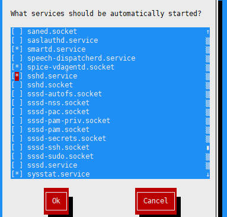
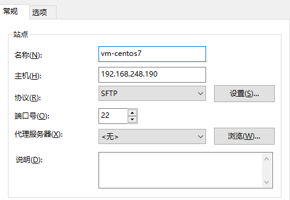
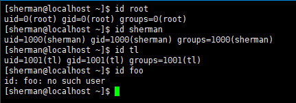

## Linux基础

### 1.1 虚拟机三种网络配置说明:
- 桥连接：虚拟机可以和其它物理机器之间通信，网络质量高，但是一旦数量过多，容易造成ip冲突
- NAT：网络地址转换，物理机和虚拟机形成一个内网环境，其它同网段物理机ping不到虚拟机，但是虚拟机能通过所在的物理机ping到其它物理机，推荐的方式。
- 主机模式：虚拟机是一个独立的主机，不能访问外网

### 1.2 vmtools和共享文件夹
vmtools安装后可以实现物理机和虚拟机之间之间粘贴复制，并且vmtools之后才能设置共享文件夹。

**vmtools**安装：
VMware -> 虚拟机 -> 安装VMware Tools，在桌面上生成一个文件夹，进入该文件夹：
```shell
# tar -zxvf VMwareTools-10.3.10-12406962.tar.gz -C /opt
# cd /opt/vmware-tools-distrib
# ./vmware-install.pl
```

**共享文件夹安装**：
VMware -> 虚拟机 -> 设置 -> 选项 -> 共享文件夹：
指定共享文件夹的位置即可，在虚拟机中，共享文件夹的默认位置：**/mnt/hgfs/**

### 1.3 Linux的目录结构
 Linux采用层级式的树状目录结构，根目录是"/"，在Linux里，**一切皆文件**。

 具体的目录结构：
 - /bin（/usr/bin、/usr/local/bin）：binary缩写，存放最经常使用的命令
 - /home：存放普通用户的主目录，Linux中每个用户都有自己的一个目录，目录名即为用户名
 - /root：该目录为系统管理员主目录
 - /lib：系统开机所需要的最基本的动态链接库，类似于DLL文件，几乎所有的应用程序都需要使用这些共享库
 - /lost+found：当系统非法关机时，会产生相应的日志文件，一般情况下该目录都是空的
 - /etc：所有的系统管理所需要的配置文件和子目录，例如MySQL的配置文件my.conf，用户和组的配置文件
 - /usr（unix system resource）：用户很多的应用程序和文件都放在这个目录下，类似于program files目录
 - /boot：存放的是启动Linux时使用的一些核心文件，包括一些链接文件和镜像文件
 - /proc：是一个虚拟的目录，它是系统内存的映射，访问这个目录来获取系统信息
 - /srv：service缩写，存放服务启动之后需要提取的数据
 - /sys：Linux2.6内核的一个很大变化，存放Linux2.6内核中新出现的一个系统文件
 - /tmp：存放一些临时文件
 - /dev：类似于windows的设备管理器，把所有的硬件用文件形式存储
 - /media：Linux会自动识别一些设备，例如U盘、光驱等，识别后会把设备**挂载**到这个目录下
 - /mnt：为了让用户临时挂载别的文件系统，就可以进入该目录中查看里面的内容了，例如上一小节中共享文件夹在：/mnt/hgfs
 - /opt：给主机额外安装软件所存储的位置
 - /usr/local：给主机额外安装软件所安装的目录，一般是通过编译源码方式安装的程序
 - /var：存放不断扩充的东西（日志），习惯将经常被修改的日志放在这个目录中
 - /selinux：security-enhanced linux，是一种安全子系统，能控制程序只能访问特定文件

### 1.4 Xshell & Xftp
**Xshell**:

要使用Xshell进行远程登录，Linux虚拟机必须开启**sshd.service**服务，即Xshell使用ssh协议监听22端口，可以使用**setup**工具开启该服务：



**Xftp**:

Xftp支持ftp协议和sftp协议，但是Linux的默认是不提供FTP的，需要额外安装FTP服务器，会占用一定的VPS服务器资源。sftp协议是ssh协议的一部分，它本身没有单独的守护进程，必须依赖sshd守护进程（即ssd.service，端口号为22）：



### 1.5 vi & vim
**vi & vim三种模式**：

- 正常模式：各种快捷键的使用
- 插入模式：可以进行编辑，i、o、a、r任意字母可以进入
- 命令行模式：提供相关指令，完成读取、存储、退出、显示行号等功能

**常用的快捷键**：

- 删除字符：x、nx，n为数字
- 删除行：dd、ndd，n为数字
- 复制：yy、nyy
- 黏贴：p
- 撤销：u
- 替换：r
- 显示/取消行号：:set nu/nonu
- （非）高亮匹配：:set hls/nohls
- 查找：/word  n -> 向上查找下一个 N -> 向上查找下一个
- 移动：
    - w：向后移动一个单词
    - W：向后移动一个单词，但会忽略一些标点
    - b：向前移动一个单词
    - B：向前移动一些单词，但会忽略一些标点
    - 0：移动到行首
    - $：移动到行尾
- 插入：
    - i：插入模式，当前行进行插入
    - a：光标后进行插入
    - A：当前行最后插入
    - o：下一行行首插入
    - O：上一行行首插入

### 1.6 关机、重启、注销
关机&重启：
- shutdown：
    shutdown -h now：立即关机
    shutdown -h n：n分钟后关机
    shutdown -r now：立即重启，等价于reboot
- halt：等价于关机
- reboot：重启
- sync：把内存数据刷入到磁盘中，建议关机之前使用

注销：注意注销指令 **logout** 在图形运行级别下无效，在 **运行级别3** 下有效

### 1.7 用户管理
Linux系统是一个多用户多任务的操作系统，任何一个要使用系统资源的用户，都必须首先向系统管理员申请一个账号，然后以这个账号的身份进入系统。Linux中的用户至少需要属于一个组。

**添加用户**：`useradd username [-d /home/username]`

-   添加一个新用户，会将该用户放入到用户名同名的group中

- 如果不指定新用户的家目录，默认会创建一个和用户名相同的家目录，在/home下
- 可以使用-d参数指定用户的家目录

**指定、修改密码**：`passwd username`

**删除用户**
```shell
# 删除用户但不会删除对应的家目录
# userdel username

# 删除用户且删除对应的家目录
# userdel -r username
```
注意：实际开发中，删除用户即可，不要删除用户的家目录

**查询用户信息**：`id username`



**用户切换**：
- 从高权限切换到低权限用户时，必须要密码验证，反之则需要
- 如果需要返回原来的用户，使用**exit**指令或者ctrl+d

切换用户语法：`su username`

**查询当前用户**：`whoami 或者who am i`

**用户组**：
用户组类似于角色，系统够可以对有共性的多个用户进行统一管理。
```shell
# 创建组
groupadd group_name

# 删除组
groupdel group_name

# 在创建用户时直接指定用户组
useradd -g group_name username

# 修改某个用户所属的用户组
usermod -g group_name username
```

*注意*：当要删除某个组时，但是该组是某个用户的主组时，直接使用删除会报错：

```properties
# 此时tl用户的主组是wd
[root@localhost sherman]# groupdel wd
groupdel: cannot remove the primary group of user 'tl'
```

如果要继续删除，首先修改用户tl的主组，然后再将wd组删除掉即可。
```shell
# 修改用户tl的主组为tl
usermod -g tl tl

# 然后删除wd组
groupdel wd

# 注意，-g 和 -G两个参数的区别；
# -g：修改用户的主组，即该用户所属组的数量没有变化
# -G：将用户添加到某个组中，但是并没有修改用户的主组，即用户所属组的数量+1
```

**:star:用户和组相关的文件**：
- /etc/passwd：用户的配置文件，记录用户的各种信息:
```shell
# 用户名:口令:用户id:组id:注释:家目录:登录Shell
sherman:x:1000:1000:sherman:/home/sherman:/bin/bash
```
- /etc/shadow：口令配置文件，都是加密的：
```shell
# 用户名:口令:最后一次修改时间:最小时间间隔:最大时间间隔:警告时间:不活动时间:失效时间:标志
sherman:$6$BIy099lmLGVut3Z0$Q9U0feqtGDCqe1cysEzymHgQRylDxIxupP4htsexQN0lvxvyk4apoljbtUi9ECfu5lYRKYF.bTxkvzNGKgElI0::0:99999:7:::
```
- /etc/group：组相关配置文件，记录Linux包含的组信息
```shell
# 组名:口令:组id:组内用户列表（一般看不到）
wd:x:1002:
```

### 1.8 实用指令
**用户级别**：用户级别类似于Windows中普通模式和安全模式，基本的运行级别：

- 0：关机
- 1：单用户、无网络，用于找回丢失密码
- 2：多用户、无网络服务
- :star: 3：多用户、有网络、无界面 --> multi-user.target
- 4：保留                 
- :star: 5：多用户、有网络、有界面 --> graphical.target
- 6：系统重启

修改默认运行级别：
```shell
# centos6:
# /etc/inittab文件修改：
id:run_level:initdefault:

# 命令行修改：
init run_level
```

centos7中运行级别有一定变化，相关命令是一个软连接，输入：
```shell
ll /usr/lib/systemd/system/*.target

# ubuntu下查找相应信息：
ll /lib/systemd/system/*.target
```


从上图可以看出，软连接的详细情况，要设置默认运行级别：
```shell
systemctl set-default runlevel3.target
systemctl set-default multi-user.target
```

使用**运行级别1**解决root密码忘记问题：在系统引导时候，进入单用户、无网络级别，此时就是用root账户登录的。因此，可以直接使用**passwd root**修改密码。centos7中演示：

-   引导界面键入：e，找到**ro**


-   将 **ro** 修改成：**/sysroot/bin/sh**


-   ctrl+x启动，会以run level 1进入系统，修改root密码即可：

```shell
>> chroot /sysroot
>> passwd root
>> LANG=en # 如果是中文系统，建议设置一下
>> touch /.autorelabel # 这个动作不能少
>> exit
>> reboot
```

**帮助文档**：
- man 命令
- help 命令
- 命令 --help

**文件目录类**：
- pwd：显示当前绝对路径
- ls：显示当前目录下文件和目录
    - ll:
    - ls -a
    - ll -r
    - ll -h
    - ll --sort=time|size|version|extension：按照指定规则排序，等价于：ll -t|-s|-v|-x
- cd：切换目录
    - cd ~：回到当前用户的家目录
    - cd ..：返回上一级目录
    - cd -：返回上一次所在目录，由环境变量**OLDPWD**设置, echo $OLDPWD
    

**创建和删除目录**：
- mkdir /dir：创建单级目录：
- mkdir -p /dir1/dir2/dir3：创建多级目录
- rmdir /dir：删除空目录
- rmdir -rfv /dir：删除非空目录， `-r: recursive -f: force -v: verbose`

**创建、复制文件**：

- touch file1 \[file2]：创建文件file1...
- cp \[-rvf] src dst：将src文件或文件夹copy到dsc，-r：recursive -f：force -v：verbose
- cp \[选项]src dst：强制覆盖，相当于cp -f src dst

**删除和移动**：
- rm \[-rfv] src：删除文件或文件夹，-r: recursive -f: force -v: verbose
- mv \[-fv] src dst：移动或者重命名，-f: force -v: verbose

**查看文件内容**：
- cat [-n] file：只读方式，并且一次性全部输出，-n：显示行号，通常配合**more**命令一起分页显示
```shell
cat -n file | more
```
- more file：以全屏的方式显示文本文件内容，注意它会一次性加载所有内容，相关快捷键
    - space：向下翻一页
    - enter：向下翻一行
    - q：离开
    - ctrl+f：向下滚动一屏
    - ctrl+b：向上滚动一屏
    - =：显示当前行号
    - :f：显示文件名和当前行号
- less file：取自"less is more"，功能类似于more，但是并不是一次性将整个文件加载后显示，而是根据需要再加载，效率较高，对于大型日志文件推荐使用的方式。

**重定向和追加**：
- \>：重定向，注意会覆盖
    - ls -l > file.txt：列入当前文件夹中的内容并写入到file.txt中（会覆盖）
    - ls -al >> file.txt：列入当前文件夹中的内容并追加到file.txt中（追加）
    - cat file1.txt > file2.txt：将file1.txt内容写入到file2.txt中，覆盖模式
    - echo "hello world" >> file.txt：在file.txt中追加hello world字符串
    

**输出指令**：
- echo：输出内容（环境变量）到控制台:
    - echo $PATH $PWD $HISTSIZE
    - echo "hello world"
- head：显示文件开头部分内容，默认前10行
    - head \[-n num] file.txt
- tail：显示文件结尾部分内容，默认后10行
    - tail \[-n num] file.txt
    - :star:tail -f -n 10 file.txt：实时显示文件file最后10行内容

**软链接和history**：
软连接相当于Windows中的快捷方式：
- ln -s /usr/python python-copy：给python一个软连接 **python-copy** ，之后直接执行 **./python-copy** 就可以打开python终端
```shell
>> ll python-copy
lrwxrwxrwx. 1 root root 11 Dec  5 20:18 python-copy -> /bin/python
>> rm -rf python-copy # 删除软链接，注意删除软链接时候，比较在最后加入/，例如，rm -rf python-copy/
```
- 注意：当使用pwd查看目录时候，如果有软链接存在，显示的还是软链接所在的目录，而不是软链接实际所指的目录
- history：查看已经执行过的历史命令
- history -c：清空历史命令
- histroy num：显示最近num条指令
- !num：执行编号为num的历史指令

**时间和日期**：

- date：Thu Dec  5 20:37:55 CST 2019
- date +"%Y/%m/%d %H:%M:%S"：2019/12/05 20:38:41
- cal：显示当前天日历
- cal -m：显示当前月日历
- cal -y：显示当前年所在日历
- cal 21 3 2022：显示2022年3月21日日历

**查询指令**：
- find：find指令从指定目录下递归地遍历各个子目录，将满足条件的文件和目录显示在终端:
    - find / -name *.txt：查找整个系统中txt文件夹
    - find /opt -user sherman：在/opt文件夹下查找属于sherman的文件和目录
    - find / -size +20M|-20M|20M：在整个系统中查找大小大于|小于|等于20M的文件
    - find ./ -mtime +10：当前路径下查找，文件的更改时间超过10天的文件
    - find ./ -amin +10：当前路径下查找，文件的更改时间超过10分钟的文件
- locate：locate指令用于文件查找，且速度较快，因为它事先建立好了一个包含所有档案名称和路径的数据库，之后的查询都是在该数据库上进行的，但是它的查询并不是实时的，使用前需要使用**updatedb**更新。
  - locate -n 5 apache：查找带有apache的目录
    - locate -r ^/opt | grep .so$ > result.txt：查找以/opt开头且.so结尾的文件，保存到result.txt中
    - locate -i /HTTP -c：查找包含/HTTP的目录，忽略大小写，统计最终的数量
- grep：过滤查找，通常和|一起使用
    - cat file | grep ^# -n：显示file文件中以#开头的内容，并显示行号
    - cat /etc/profile | grep in -in：以忽略大小写的方式，在/etc/profile文件只能够查找in关键字，并显示行号

**压缩和解压缩**：
- gzip：gzip指令对文件压缩后，不会保留原来的文件，产生一个和原来文件名+.gz的文件
- gunzip：gunzip指令对文件解压缩之后，不会保留原来的压缩文件，直接产生一个去掉.gz的解压缩文件
- zip -r my_package /home：将/home下所有文件、文件夹递归压缩到my_package中
- unzip -d /opt/tmp my_package.zip：将my_package.zip解压到/opt/tmp下
- tar：非常常用的打包命令，打包后的文件的后缀名.tar.gz，几个常见的选项：
    - c：create，产生tar.gz文件
    - v：verbose，显示详细信息
    - f：file，指定压缩后的文件名
    - z：打包并同时压缩
    - x：解压.tar.gz文件
- tar -zcvf all.tar.gz file1 file2：将file1和file2压缩成all.tar
- tar -zxvf all.tar.gz -C /opt/tmp：将all.tar.gz解压到/opt/tmp目录下，注意/opt/tmp必须存在