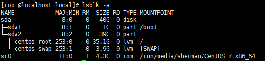
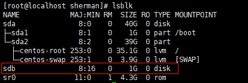
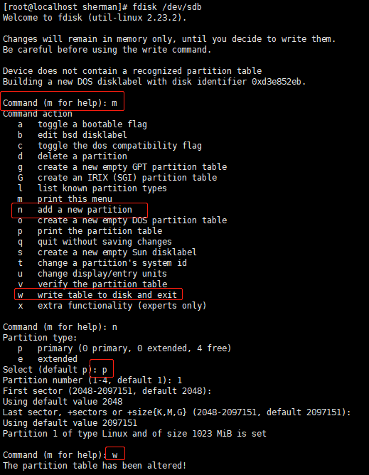
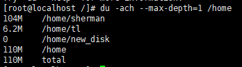
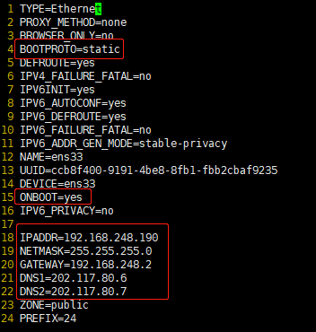
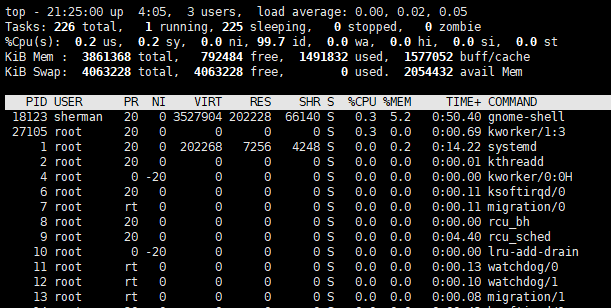

## Linux进阶

### 1.1 组管理
**Linux组介绍**：
在Linux中每个用户必须属于一个组，不能独立于组外，在Linux中每个文件有三个概念：
- 所有者
- 所在组
- 其它组

**文件/目录所有者**：
一般情况下，哪个用户创建了文件，该文件的所有者就是对应的用户。当某个用户创建了某个文件之后，
默认这个文件所在组就是该用户所在组。其它组：除文件的所有者和所在组的用户外，系统的其它用户都是文件的其它组。
- 查看文件所有者、所在组：ll -a
- 修改文件所有者：`chown username file_name`
- 修改文件所在组：`chgrp group_name file_name`
- 修改用户所在的主组：`usermod -g username group_name`，注意-g和-G两个参数的区别
- :star:递归修改文件所有者、所在组：`chown -R new_owner:new_group dir_name`

**权限的基本内容**：
以xxx.txt文件为为例：

```shell
>> ll xxx.txt
-rw-rw-r--. 1 sherman root 0 Dec  7 13:48 xxx.txt
```
依次介绍：
- -: 代表文件类型：
    - -: 普通文件
    - d: 目录
    - l: 软链接
    - c: 字符设备，例如键盘、鼠标，都会被映射成文件
    - b: 块文件、硬盘
- rw-: 文件所有者的权限，有读（r）、写（w）权限，没有执行（-）权限
- rw-: 文件所有组的权限，有读（r）、写（w）权限，没有执行（-）权限
- r--：其它组用户的权限：有读（r）权限，没有写和执行权限

注意权限一共有3中：读、写、执行，分别用字母r、w、x表示，也可以用数字表示，分别为4、2、1。因此：
- rwx：表示用读、写、执行三种权限
- r-x：表时有读、执行权限，没有写权限
- 7：7=4+2+1，表示有读写执行三种权限
- 6：6=4+2，表示有读、写权限，没有执行权限
- 3：3=2+1，表示有写、执行权限，没有读权限

文件所有者、所在组、其它组也可以分别用：u、g、o表示，同时a表时三个都有。因此：
- a+x：表示三者都添加（+表示）执行权限
- ug-w：表示所有者、所在组用户移除写权限
- chmod 777 file_name：表示为所有者、所在组用户、其它组用户添加所有权限（7=4+2+1）
- chmod a+x file_name：表示为所有者、所在组用户、其它组用户添加执行权限


- 1：如果是文件，表示硬链接数目（即文件数目，就是1），如果是目录，代表该目录中子目录的个数，注意：如果是目录，这个值至少是2，因为一个所谓的空目录中也有当前目录（.）和父目录（..）两个存在，可以使用：ll -a查看
- sherman：文件所有者
- root：文件所在组
- 0：文件大小（单位：字节），如果是空目录，大小为4096字节，即4kb
- Dec  7 13:48：文件最后修改时间
- xxx.txt：文件名
- xxx.txt -> foo：表示软链接实际指向的位置

**chmod命令举例**：

- chmod u=rwx,g=rx,o=rx xxx.txt：xxx.txt文件，所有者所有权限，用户组读、执行权限，其它组读、执行权限
- chmod u-x,g+w xxx.txt：xxx.txt文件，所有者减去写权限，用户组加上写权限
- chmod 755 xxx.txt：xxx.txt文件所有者所有权限，所在组和其它组读、执行权限

### 1.2 定时任务调度
任务调度：系统在某个时间执行特定的命令或者程序，任务调度分类：
- 系统工作：有些重要的工作必须周而复始地执行，比如病毒扫描
- 个别用户工作：个别用户希望执行某些程序，比如对mysql数据库的备份

**crontab选项**：
- -e：编辑crontab定时任务
- -l：查询crontab任务
- -r：删除当前用户所有的crontab任务

**参数说明**：

```shell
* * * * * script
```
- 第一个*：分，范围00-59
- 第二个*：小时：范围00-23
- 第三个*：天：1-31
- 第四个*：月：1-12
- 第五个*：周：0-6
- script：待执行脚本

**参数使用细节**：
- *：代表任何时间，比如第一个\*：代表每分钟执行一次
- ,：代表不连续时间，例如"0 8, 12 * * *"：表示每天8:00和12:00执行一次脚本
- -：代表连续时间，例如"0 5 * * 1-6"：表示周一至周六5:00执行一次脚本
- */n：代表每个多久执行一次，例如"\*/10 * * * * "：表示每10分钟执行一次

**示例**：
- 45 22 * * * *：在22:45分执行命令
- 0 17 * * 1：每周一17:00执行命令
- 0 5 1,15 * *：每月1号和15号的5:00执行命令
- 40 4 * * 1-5：每周一至周五4:40执行命令
- */10 4 * * *：每天4:00，每个10分钟执行一次命令
- 0 0 1,15 * 1：每周一，每月1号和15号00:00执行一次命令。注意，实际中，星期和天不要同时出现

**使用脚本进行调度**：

例如：每个1分钟，就将当前日期追加到/tmp/mydate文件中：
- 编写/home/task1.sh，内容为：date >> /tmp/mydate
- 给task1.sh可执行权限
- crontab -e */1 * * * * /home/task1.sh
  

又例如：每天凌晨2点，将mysql中test_db备份到/tmp/mydb.bak中：
- 编写/home/task2.sh，内容为：/usr/bin/mysqldump -uroot -psherman >> /tmp/mydb.bak
- 给/home/task2.sh执行权限
- crontab -e：2 * * * * /home/task2.sh

### 1.3 磁盘分区
**分区基础知识**：
- MBR分区：比较传统的分区方式
    - 最多支持四个主分区
    - 系统只能安装在主分区上
    - 拓展分区至少要占一个主分区
    - 最大支持2TB，但是兼容性较好
- GTP分区：
    - 支持无限多分区（但操作系统有限制，例如Windows下最多128个分区）
    - 最大支持18EB，1EB=1024PB，1PB=1024TB
    - Windows7 64位之后开始支持GTP分区

**硬盘说明**：
Linux硬盘分为IDE和SCSI硬盘，目前基本是SCSI硬盘：
- IDE硬盘：驱动器标志符为**hdx~**:
    - hd：代表类型为IDE硬盘
    - x：盘号，a：基本盘，b：从属盘，c：辅助主盘，d：辅助从属盘
    - ~：分区，前四个分区用1-4表示，表示它们是主分区或者拓展分区，从5开始表示逻辑分区
    

例如，hda3：IDE硬盘上基本盘上的第3个分区，该分区是主分区或者拓展分区
- SCSI硬盘：标志符为**sdx~**:sd表示是SCSI硬盘类型，其它和IDE硬盘相同。

使用**lsblk**命令查看：



**示例：:star:给Linux添加新硬盘**
- 虚拟机添加硬盘：VMware -> 虚拟机 -> 设置 -> 硬件 -> 硬盘 -> 添加SCSI硬盘，添加完成后重启执行：lsblk -a：


- 分区：执行：fdisk /dev/sdb开始分区操作：
    - m：for help
    - n：add new partition
    - p：primary
    - w：write table to disk and exit



- 格式化：mkfs -t ext4 /dev/sdb1：把/dev/sdb1设备进行ext4格式化
- 挂载：
    - mkdir /home/new_disk
    - mount /dev/sdb1 /home/new_disk
- 永久挂载：当前的挂载都是临时挂载，如果机器重启，/dev/sdb1和/home/new_disk之间的挂载关系会失效，需要永久挂载：
    - vim /etc/fstab
    - 添加一行：/dev/sdb1 /home/new_disk ext4 defaults 0 0
    - 保存并退出
    
### 1.4 磁盘使用情况查询
- 查询系统整体磁盘使用情况：df -hl
- 查询指定目录的磁盘占用情况：du -ach --max-depth=1 /home
    - -a：all，包含文件
    - -c：total，计算总量
    - -h：human，易于人读
    


    
**其它统计**：

- 统计当前文件夹（及子文件夹）下所有文件的个数：`ll [-R] /home/sherman | grep "^-" | wc -l`
- 统计当前文件夹（及其子文件夹）下所有目录的个数：`ll [-R] /home/sherman | grep "^d" | wc -l`
- 以树状结构显示目录结构：
    - yum install tree
    - tree /dir
    
### 1.4 网络配置
配置静态ip：`vim /etc/sysconfig/network-scripts/ifcfg-ens33`



### 1.5 进程管理
**显示系统执行的进程**：`ps -aux [| more]`

指令详情：
   - USER：用户名称
   - PID：进程id号
   - %CPU：进程占用cpu的百分比
   - %MEM：进程占用物理内存的百分比
   - VSZ：进程占用虚拟内存的大小（单位KB）
   - RSS：进程占用物理内存的大小（单位KB）
   - TTY：终端名称缩写
   - STAT：进程状态
        - S：睡眠
        - s：该进程是会话的先导进程
        - N：进程拥有比普通优先级更低的优先级
        - R：正在运行
        - D：短期等待
        - Z：僵尸进程
        - T：被追踪或者被停止
   - STARTED：进程启动的时间
   - TIME：CPU时间，即进程使用CPU的总时间
   - COMMAND：进程启动时所使用的命令和参数

**过滤某个具体进程**：

```shell
>> ps -ef | grep xxx
# e：显示所有进程
# f：full format
```

**终止进程**：
- 踢出非法远程用户：
```shell
# ps -ef | grep sshd
# kill -9 pid
```
- 查看进程树：ps -pu
    - -p：显示进程的id
    - -u：显示进程所属用户
    

**服务管理**：
服务本质上就是进程，但是是运行在后台的，通常会监听某个端口，等待其它进程的请求，也称为守护进程。
service管理命令：
```shell
# centos6
service service_name [start|stop|restart|reload|status]
# centos7
systemctl [start|stop|restart|reload|status] service_name
```

**查看服务**：
- 界面方式：setup
- 命令方式：ll /etc/init.d

**服务的运行级别**：
之前已经介绍过，对应文件：/etc/inittab，补充：开机流程：

开机 -> BIOS -> /boot -> init进程 -> 系统运行级别 -> 运行级别对应的服务

**检查是否开启某个端口**：telnet ip port，例如telnet 192.168.248.190 6379

**chkconfig指令**：给服务设置运行级别修改成on/off
- chkconfig --list | grep redisd：相当于：chkconfig redisd --list，查看服务各个运行级别的开启情况
- chkconfig --level n service_name on/off：给服务（service_name）的运行级别（n）设置开关（on/off）
- chkconfig service_name on/off：给服务（service_name）所有的运行级别全部设置为（on/off）

**进程的监控**：
- 动态监控进程：**top**命令和ps命令相似，用来显示正在执行的进程，但是top命令可以动态更新正在运行的进程。交互选项：
    - p：以CPU使用率排序，默认就是此选项
    - M：内存使用率排序
    - N：PID排序
    - u：查看指定用户的进程状态
    - k：再输入需要结束的进程id，即可结束进程
    - d：指定几秒刷新一次
    - q：退出
    

查看top命令的一个截图：



各个参数解释：
```shell
# top -21:25:00 up 4:05 3 users, load average: 0.00, 0.02, 0.05
# 当前时间21:25:00 开机时长4:05 共有3个用户 以往5、10、15分钟内负载均衡为0.00、0.02、0.05

# Tasks: 226 total, 1 running, 225 sleeping, 0 stopped, 0 zombie
# 共有226个任务，一个运行，225个睡眠，0个停止，0个僵尸状态

# %Cpu(s): 0.2us, 0.2 sy, 0.0ni, 99.7id, 0.0wa, 0.0hi, 0.0si, 0.0st
# 占用cpu时间：未调整优先级用户、运行内核进程、调整优先级用户、空闲cpu百分比、等待IO、硬件中断、软件中断、被hypervisor偷取的cpu时间

# KiB Mem: 3861368 total, 792484 free, 1491832 used, 1577052 buff/cache
# 内存使用：物理内存总量、空闲内存、使用的内存、缓冲的内存

# KiB Swap：类比Mem，交换内存只有在物理内存不够用时，才会使用

# PID USER PR NI VIRT RES SHR S %CPU %MEM TIME+ COMMAND
# 进程id 用户 父进程id nice值（负值表示高优先级，正数表示低优先级）
# VIRT：进程中使用虚拟内存量（kb）
# RES：进程中使用、未被换出的物理内存大小
# SHR：共享内存大小（kb）
...
```
- 监控网络：netstat -antpl \[| grep 6379]
    - a：all
    - n：numeric，不解析names
    - t：tcp -u：udp
    - p：programs，显示pid/program名称
    - l：listening，显示处于监听的服务
    
### 1.5 包管理
**RPM**:

RPM是RedHat Package Manager（RedHat软件包管理工具）的缩写，类似windows的setup.exe。
- 查询已经安软的rpm包：rpm -qa \[| grep firefox]，q：query，a：all -> firefox-60.9.0-1.el7.centos.x86_64
    - firefox：名称
    - 60.9.0-1：版本号
    - el7.centos.x86_64：操作系统，注意**noarch**表示通用，32位和64位都可以使用
- 其它查询选项：
    - -qi：information，查询软件包信息
    - -ql：location，查询软件安装文件的路径
    - -qf：file，根据文件路径名，查询文件所属那个软件包
    - e：erase，删除软件包，可以加--nodeps表示强制删除
- 安装：rpm -ivh xxx.rpm
    - i：install
    - v：verbose
    - h：hash，显示进度条
    

**YUM**:

YUM是一个Shell前端软件包管理器，基于RPM包管理能够从指定服务器自动下载RPM包并且安装，可以**自动处理依赖性关系**，并且一次性
安装所有依赖的软件包。
- 查询服务器是否有需要的软件：yum list | grep package_name
- 安装指定的yum包：yum install package_name

安装阿里yum镜像源：
- 备份原有的镜像源：cp /etc/yum.repos.d/CentOS-Base.repo /etc/yum.repos.d/CentOS-Base.repo.backup
- 下载阿里源：wget -O /etc/yum.repos.d/CentOS-Base.repo http://mirrors.aliyun.com/repo/Centos-7.repo
- 配置源文件配置文件：/etc/yum.repos.d/CentOS-Media.repo  -> enable=0
- 清理缓存：yum clean all
- 将服务器上的软件包信息缓存到本地：yum makecache
- 更新：yum -y update
