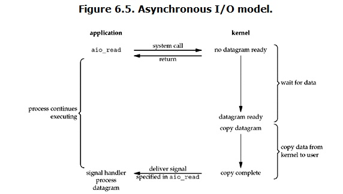

本文根据博客整理：https://segmentfault.com/a/1190000003063859


# Linux I/O模型

## 几个概念

### 用户空间和内核空间

现在操作系统都是采用虚拟存储器，那么对32位操作系统而言，它的寻址空间（虚拟存储空间）为4G（2^32）。操作系统的核心是内核，独立于普通的应用程序，可以访问受保护的内存空间，拥有访问底层硬件设备的所有权限。为了保证用户进程不能直接操作内核（kernel），保证内核的安全，操作系统将虚拟空间划分为两部分，一部分为内核空间，一部分为用户空间。针对Linux操作系统而言，将最高的1G字节（从虚拟地址0xC0000000到0xFFFFFFFF），供内核使用，称为内核空间，而将较低的3G字节（从虚拟地址0x00000000到0xBFFFFFFF），供各个进程使用，称为用户空间。


### 进程切换

为了控制进程的执行，内核必须有能力挂起正在CPU上运行的进程，并恢复以前挂起的某个进程的执行。这种行为被称为 **进程切换**。因此可以说，任何进程都是在操作系统内核的支持下运行的，是与内核紧密相关的。

从一个进程的运行转到另一个进程上运行，这个过程中经过下面这些变化：
-   保存处理器上下文，包括程序计数器和其他寄存器。

-   更新进程控制块（PCB）信息。

-   把进程的PCB移入相应的队列，如就绪、在某事件阻塞等队列。

-   选择另一个进程执行，并更新其PCB。

-   更新内存管理的数据结构。

-   恢复处理器上下文。


### 进程阻塞

正在执行的进程，由于期待的某些事件未发生，如请求系统资源失败、等待某种操作的完成、新数据尚未到达等，则由系统自动执行阻塞原语(Block)，使自己由运行状态变为阻塞状态。可见，进程的阻塞是进程自身的一种主动行为，也因此只有处于运行态的进程（获得CPU），才可能将其转为阻塞状态。当进程进入阻塞状态，是不占用CPU资源的。特别注意两点：

-   阻塞是进程自身主动行为，只有处于运行态才能转换成阻塞态
-   进程进入阻塞状态后，是不占用CPU资源


### 文件描述符fd

文件描述符（File descriptor）是计算机科学中的一个术语，是一个用于表述指向文件的引用的抽象化概念。fd这个概念符合Linux中“一切皆文件”的思想。

文件描述符在形式上是一个非负整数。实际上，它是一个索引值，指向内核为每一个进程所维护的该进程打开文件的记录表。当程序打开一个现有文件或者创建一个新文件时，内核向进程返回一个文件描述符。在程序设计中，一些涉及底层的程序编写往往会围绕着文件描述符展开。但是文件描述符这一概念往往只适用于UNIX、Linux这样的操作系统。


### 缓存I/O

缓存 I/O 又被称作标准 I/O，大多数文件系统的默认 I/O 操作都是缓存 I/O。在 Linux 的缓存 I/O 机制中，操作系统会将 I/O 的数据缓存在文件系统的页缓存（ page cache ）中，也就是说，数据会先被拷贝到操作系统内核的缓冲区中，然后才会从操作系统内核的缓冲区拷贝到应用程序的地址空间。

**缓存 I/O 的缺点：**
数据在传输过程中需要在应用程序地址空间和内核进行多次数据拷贝操作，这些数据拷贝操作所带来的 CPU 以及内存开销是非常大的。

举例来说：

对于一次IO访问（以read为例），数据会先被拷贝到操作系统内核的缓冲区中，然后才会从操作系统内核的缓冲区拷贝到应用程序的地址空间。所以说，当一个read操作发生时，它会经历两个阶段：

-   等待数据准备（Waiting for data to be ready）
-   将数据从内核空间拷贝到用户进程地址空间中（copy the data from the kernel to the process）

正式因为这两个阶段，Linux系统产生了五种IO网络模型。


## I/O模式

### 阻塞I/O（blocking IO）

在Linux中，默认情况下所有的socket都是blocking，一个典型的read操作流程：


当用户进程通过调用 **recvfrom** 进行一次系统调用后，kernel开始I/O的两个阶段：

-   准备数据：对于网络I/O来说，很多时候数据一开始都是没有到达的，例如还没有收到一个完整的UDP包。这个时候kernel需要进行等待，而对于用户进程而言，整个进程也是被阻塞（当然是用户进程自己选择阻塞，因为数据未到达）
-   拷贝数据：kernel在数据准备完成后，需要将数据从kernel中拷贝到用户空间中，之后返回状态给用户进程，用户进程收到通知后解除阻塞状态，重新运行起来

阻塞I/O最大的特点就是：I/O执行的两个阶段都是阻塞的。


### 非阻塞I/O（nonblocking IO）

在Linux中，可以通过设置socket使其变成non-blocking状态，当对一个non-blocking socket执行read操作时，大致流程为：


当用户进程发出read操作时，如果kernel中的数据还没有准备好，那么它并不会block用户进程，而是立刻返回一个error。从用户进程角度讲 ，它发起一个read操作后，并不需要等待，而是马上就得到了一个结果。用户进程判断结果是一个error时，它就知道数据还没有准备好，于是它可以再次发送read操作。一旦kernel中的数据准备好了，并且又再次收到了用户进程的system call，那么它马上就将数据从kernel空间拷贝到用户地址空间，并且返回ok状态给用户进程。

non-blocking IO的特点：在kernel准备数据时并不阻塞，而是不断主动询问kernel数据是否准备好，而在数据拷贝阶段仍然阻塞。


### I/O多路复用（IO multiplexing）

I/O多路复用也就是Linux下的select、poll、epoll函数，也被称为事件驱动（event driven）I/O模型。select/epoll好处在于单个进程可以同时处理多个网络连接IO，不需要向阻塞、非阻塞IO那样，单个进程只能负责单个网络连接。它的基本原理：通过select、poll、epoll这些函数不断地轮训它们负责的所有socket，当某个socket有数据到达时，就通知用户进程，用户进程在通过系统调用，让kernel进行数据拷贝。

当用户调用select函数时，用户进程并不被kernel准备数据这一过程阻塞，而是被select函数本身阻塞，类似于redis在RDB持久化时被bgsave命令的fork函数阻塞。在阻塞期间，kernel会监视select函数负责的所有socket，当任何一个socket的数据准备完成，select就会返回。之后用户进程在进行一次系统调用，kernel就会开始进行数据拷贝。

总之，I/O多路复用的特点是：通过一种机制，让一个进程能够同时等待多个文件描述符（这里指的是socket），而这些fd其中任意一个进入了读就绪状态，select函数就会返回对应socket的fd。


特点：

-   用户进程在kernel等待数据阶段被select函数本身阻塞
-   需要两次系统调用，第一次系统调用时select函数，第二次系统调用是进行数据拷贝
-   数据拷贝阶段用户进程被阻塞

补充：

I/O多路复用模型的优势在于单个进程能够处理更多的连接，而不是对于单个连接处理速度更快。也就是说，如果当前处理的连接数不是非常高，使用select、poll、epoll这样的web server的处理速度，并不比使用多线程&阻塞IO&线程池技术的server更快，也可能延迟更大。


### 信号驱动式I/O（signal-driven IO）

信号驱动式I/O，在Linux中设置socket为信号驱动IO，并且为其安装一个信号处理函数，进程继续运行并不阻塞。当数据准备好后，用户进程会受到一个SIGIO，可以在信号处理函数中调用I/O操作函数处理数据：


信号驱动式I/O实际中并不常用，注意kernel第一次返回SIGIO时，此时数据仅仅是准备状态，还没有完成数据拷贝动作，用户进程接收到SIGIO信号后，还需要发起一次系统调用，通知kernel去完成数据拷贝动作。


### 异步I/O（asynchronous IO）

在Linux下，AIO其实用的也很少，主要流程图：



用户进程发起一个read操作之后，立刻就可以开始去做其它的事情，在kernel数据准备和数据拷贝阶段完全处于非阻塞状态。另一方面，kernel收到一个asynchronous read之后，首先立刻返回，所以不会对用户进程产生任何阻塞。然后kernel会等待数据准备完成，数据准备完成后进行数据拷贝动作。以上两个过程完成后，kernel会向用户进程发送一个signal，告诉用户进程read操作完成。

AIO相对于信号驱动式IO而言，kernel返回信号就代表着数据准备和数据拷贝动作全部完成，而信号驱动式IO中，kernel第一次返回信号，仅仅代表数据准备工作完成。


### 总结

#### blocking和non-blocking的区别

调用blocking IO会一直block住对应的进程直到操作完成，而non-blocking IO在kernel还没有准备好数据时会立刻返回。


### synchronous IO和asynchronous IO的区别

-   a synchronous I/O operation causes the requesting process to be blocked until that I/O operation completes
-   An asynchronous I/O operation does not cause the requesting process to be blocked

区别：synchronous IO在做 **IO operation** 时候会将进程阻塞，按照这个定义，五种IO模型中，除了AIO，其它都属于同步IO。

注意这里的IO operation是指真实的IO操作，例如recvfrom这个系统调用，在non-blocking IO中，虽然在执行系统调用时，如果数据没有准备好，不会进行阻塞状态。但是当kernel数据准备好后，还是需要使用recvfrom这个系统调用，将kernel中数据拷贝到用户空间内存中，这个时候用户进程就被阻塞了。

AIO则完全不同，它就像是用户进程将整个IO操作交给了他人（kernel）完成，然后他人完全做完后发信号通知。在此期间，用户进程不需要去检查IO操作的状态，也不需要主动发起系统调用去拷贝数据。

在多路复用IO中，select、poll、epoll几个函数在监听到对应的读写事件就绪后，就需要用户进程自己负责对应的读写工作，也就是说这个读写过程是阻塞的。而AIO完全不需要自己负责读写，AIO的实现是让kernel把数据从内核拷贝到用户空间。

五种IO Model对比图：


## select、poll、epoll

select、poll、epoll都是IO复用机制，IO多路复用就是通过一种机制，一个进程可以监视多个描述符，一旦某个描述符就绪（读就绪、写就绪），能够通知程序进行对应的读写操作。

### select

函数定义：

`int select (int n, fd_set* readfds, fd_set* writefds fd_set* exceptfds, struct timeval* timout)`

select函数监视的描述符分为三种：

-   readfds：可读
-   wirtefds：可写
-   exceptfds：有异常

调用select函数后会阻塞，直到有上述三种描述符就绪，或者超时（超时立刻返回null）。当select函数返回时，可以通过**遍历**fdset，来找到就绪的描述符。select函数拥有良好的跨平台性，几乎所有的平台都支持该函数。

缺点：

-   select函数能够监视的文件描述符数量存在限制，Linux上默认是1024个，当然可以修改对应文件来增大该值，但是会降低效率
-   为什么增大fd最大数量会降低效率？select函数实现的多路复用IO中其实存在两个遍历过程：
    -   kernel通过select函数监听其所维护的fd集合，不断轮训才能发现那个fd发生了读写事件
    -   select函数返回时，用户进程需要遍历所有的fd集合，才能将结果返回给对应的fd
-   上述两个遍历过程都是O(n)的，当修改了fd数量上限时，自然会效率降低


### poll

poll函数定义：

`int poll (struct pollfd* fds, unsigned int nfds, int timeout)`

不同于select使用三个位图来表示三种fdset，poll使用一个pollfd的指针来实现：

```c
struct pollfd {
    int fd;          // file descriptor
    short events;    // requested events to watch
    short revents;   // returned events witnessed
}
```

pollfd结构体中包含了要监视的event和发生的event，不在使用select函数“参数-值”的传递方式。同时pollfd没有最大描述符数量的限制（但是数量大后性能也会降低）。和select函数一样，poll函数返回后，仍然需要通过轮训来获取就绪的描述符。

相比于select函数，poll函数只需要一次O(n)遍历操作，但是对于非常多的连接，可能在同一时刻，之后很少的fd处于就绪状态，因此如果对最大fd数量没有限制的话，系统性能也会线性下降。


### epoll

epoll在Linux内核2.6开始提出了，是select和poll的增强版本，相对于select、poll更加灵活，没有fd数量的限制。epoll使用一个fd去管理多个fd（类似于map-map，多路复用IO-多路复用fd），将用户关系fd的事件存放到kernel的事件表中，这样用户空间和内核空间的拷贝动作只需要一次。

epoll操作有三个接口：

```c
int epoll_create(int size);
int epoll_ctl(int epfd, int op, int fd, struct epoll_event* event);
int epoll_wait(int epfd, struct epoll_event* events, int maxevnets, int timeout);
```

#### 1. int epoll_create(int size);

创建一个epoll句柄，size参数告诉kernel监听的数量有多大，注意该参数只是对于kernel初识分配大小的一个建议。创建好epoll之后，它自身会占用一个fd（由这个fd管理其它fd），因此初识值分配的fd数量为 **size+1** ，自身占用的fd可以在/proc/{进程id}/fd中查看到，在epoll使用完毕后，要关闭这个fd，防止资源泄露，导致fd耗尽。

#### 2. int epoll_ctl(int epfd, int op, int fd, struct epoll_event* event);

该函数用于对指定opfd执行op操作：

-   opfd：opoll_create()函数的返回值
-   op：具体操作，由三个宏表示：EPOLL_CTL_ADD, EPOLL_CTL_DEL, EPOLL_CTL_MOD，分别表示添加、删除和修改对fd的监听事件
-   fd：需要监听的fd
-   epoll_event：告诉kernel需要监听什么事件

#### 3. int epoll_wait(int epfd, struct epoll_event* events, int maxevnets, int timeout);

该函数等待epfd的IO事件，最多等待返回maxevents个事件，并且可以设置是否阻塞：

-   epfd：需要等待的fd
-   epoll_event：从内核中得到的事件集合
-   maxevents：告诉内核这个events有多大，不能大于epoll_create()函数参数的size值
-   timeout：超时时间（毫秒，0表示立即返回，-1永久阻塞），该函数返回需要处理的事件数量，当返回0表示已经超时

#### 工作模式

epoll对于fd的操作有两种模式：LT（level trigger）和ET（edge trigger），LT是默认的工作模式：

-   LT：当epoll_wait检测到fd事件发生并且将此事通知给应用程序时，应用程序 **可以不立即响应** 事件，下次调用epoll_wait时，会再次响应应用程序并调用此事件。ET模式同时支持block和no-block socket。
-   ET：当epoll_wait检测到描述符事件发生并将此事件通知应用程序，应用程序 **必须立即处理** 该事件。如果不处理，下次调用epoll_wait时，不会再次响应应用程序并通知此事件。ET是高速工作方式，只支持no-block socket，很大程度上减少epoll事件被重复触发的次数，效率高。epoll工作在ET模式的时候，必须使用非阻塞套接口，以避免由于一个文件句柄的阻塞读/阻塞写操作把处理多个文件描述符的任务饿死。

#### 总结

在 select/poll中，进程只有在调用一定的方法后，内核才对所有监视的文件描述符进行扫描，而**epoll事先通过epoll_ctl()来注册一 个文件描述符，一旦基于某个文件描述符就绪时，内核会采用类似callback的回调机制，迅速激活这个文件描述符，当进程调用epoll_wait() 时便得到通知**。

优点：

-   监视的fd不受限制，受系统内存关系影响很大，可通过/proc/sys/fs/file-max来查看
-   IO的效率不会随着监视的fd数量的增加而下降，因为epoll不同于select、poll的轮训方式，而是通过系统回调来实现的，只有就绪的的fd才能执行回调函数
-   当没有大量的idle-connection或者dead-connection，epoll的效率不会比select、poll高很多，但是如果遇到大量的idle-connection，就会发现epoll的效率远远高于select、poll