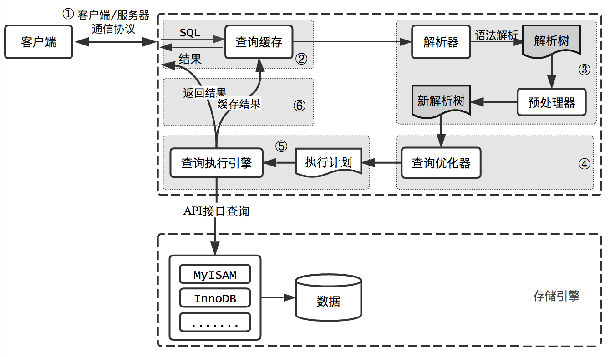

假设表中只有一个字段ID，一条简单的查询sql语句：`select * from T where ID=10；`的执行执行流程是什么？

## MySQL基本架构

MySQL总体上可以分为Server层和存储引擎层，Server层包括连接器、查询缓存、分析器、优化器、执行器，以及所有的内置函数和存储过程、视图、触发器等。

存储引擎是以插件式形式存在，从MySQL 5.5.5开始默认为InnoDB作为默认存储引擎。



### 连接器

负责客户端建立连接、获取权限和维护、管理连接：

```sql
mysql -h$ip -p$ip -u$user -p
```

连接成功后会从权限表中获取用户对于该表的权限，之后的所有操作都是基于当前查出来的权限，也就是说，只要连接处于维持状态，即使管理员账号对于该连接权限进行了修改，也需要等到重新建立连接修改才会生效。

如果连接一直处于空闲状态，可以通过`show processlist`查看Command列的状态，如果该值为Sleep即表示处于空闲状态。如果空闲状态超过`wait_timeout`设置的值就会自动断开连接，默认为8h。

在实际开发中，应该尽量避免频繁的断开和建立连接，尽量使用长连接，但是长连接也会导致MySQL内存占用过高问题，可以有两种手段解决：

- 定期删除长连接：维护一个定时器或者在程序中判断执行一个占用内存大的查询后，断开长连接
- 在MySQL 5.7之后，可以在每次执行占用内存大的操作之后，通过`mysql_reset_connectioin`来重新初始化连接资源。它不会进行重连操作，而是直接将连接恢复到初始连接状态


### 查询缓存

MySQL拿到一个查询请求时，回到缓存中查询。如果之前有相同的查询操作，会以key-value形式将查询语句（key）和查询结果（value）放入到缓存中。

MySQL的查询缓存效率不高，不推荐使用：

- 查询缓存只针对select操作，任何修改操作都会使得缓存失效，因此查询缓存比较适合系统配置表，长期不会改变
- 对于某些语句显式使用查询缓存：`select SQL_CACHE * from T where id=10`
- MySQL 8.0开始，直接移除掉查询缓存模块


### 分析器

分析器先执行词法分析形成一个词法树，分析sql语句中的字符串分别是什么，代表什么。然后执行语法分析，检查sql语句中是否存在语法错误，形成一个新的解析树。


### 优化器

在执行sql语句之前还会进行优化处理，例如：

- 在表中有多个索引时，决定使用哪个索引
- 多表关联查询时，先查询哪个表（小标驱动大表效率更高）
- 排除无用表
- 优化where语句
- 决定order by和group by是否走索引
- 简化子查询，是否决定将结果缓存


### 执行器

执行操作开始之前，需要先判断是否有表的查询操作的执行权限，如果没有，直接返回错误。如果有，执行器一次读取一条记录，然后进行判断，直到读取所有记录。

通过慢查询的`rows_examined`字段查看某个语句具体扫描了多少行，但是`rows_examined`和引擎具体扫描的行数并不是一定完全相同，这和存储引擎的内部机制有关！


## 问题

如果表 T 中没有字段 k，执行语句`select * from T where k=1`, 那肯定是会报不存在这个列的错误： “Unknown column ‘k’ in ‘where clause’”，那么该错误在MySQL基本架构的哪个阶段呢？

分析器。分析器的词法解析和语法解析会形成词法树和解析树，在这一阶段会对解析数进行检查，判断其是否合法，包括：数据表和数据列是否存在，别名是否歧义等。