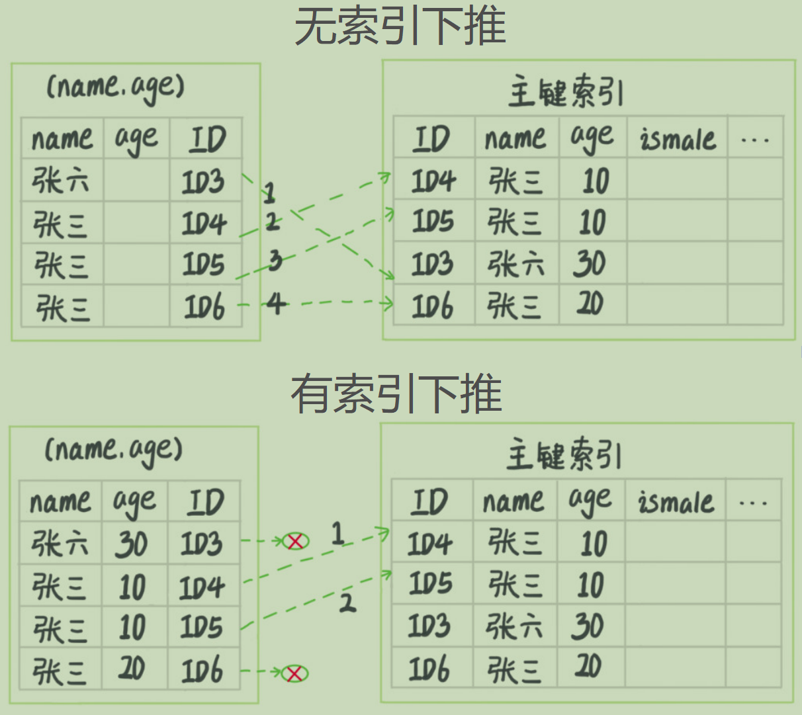

## 索引覆盖

select的数据列只用从索引中就能够取得，不必从数据表中读取，换句话说查询列要被所使用的索引覆盖。注意这里的查询列包括select、join和where字句中的所有列。

当发起一个覆盖索引查询时，使用explain进行分析时，Extra中会出现 **“Using index”**，如果Extra中出现了 **“Using index condition”**，表示检索方式为非聚簇索引。

覆盖索引可以减少树的搜索次数，显著提升查询性能，所以使用覆盖索引是一个常用的性能优化手段。也就是说：**即使在使用非聚簇索引下，如果非聚簇索引能够满足覆盖索引，也不需要回标查询过程，直接能够拿到行数据。**

考虑这样一个问题，现在有一个市民表：

```sql
CREATE TABLE `tuser` (
    `id` int(11) NOT NULL,
    `id_card` varchar(32) DEFAULT NULL,
    `name` varchar(32) DEFAULT NULL,
    `age` int(11) DEFAULT NULL,
    `ismale` tinyint(1) DEFAULT NULL,
    PRIMARY KEY (`id`),
    KEY `id_card` (`id_card`),
    KEY `name_age` (`name`,`age`)
) ENGINE=InnoDB
```

现在已经有一个主键 `id`，并且还有一个非聚簇索引 `id_card`能够唯一标识用户信息，那么是否还需要 `name_age`这个复合索引？

如果现在有一个高频请求，要根据市民的身份证号查询他的姓名和年龄，这个联合索引就有意义
了，因为查询语句会类似于：

```sql
select name, age from T where id_card=xxxx;
```

如果不建立 `name_age`复合索引，那么只会使用一个 `id_card`非聚集索引，导致进行回表操作，降低性能。但是如果建立的 `id_card`复合索引，虽然仍然是非聚集索引，但是此时变成了覆盖索引，不再需要回表操作，提升查询性能。

当然，索引字段维护是需要代价的，因此建立冗余索引来支持覆盖索引应该权衡查询效率和维护成本综合考虑。


## 最左前缀原则

B+ 树这种索引结构，可以利用索引的“最左前缀”，来定位记录。简单说，B+树的非叶子节点指引搜索方法，如果在某一次搜索时，并不能提供下一步的搜索方向，那么会导致将该层数据全部取出来，也就是索引失效。

最左前缀原则可以是联合索引的最左N的字段（a、b、c三个联合索引，则a，a、b，a、b、c三个满足），也可以是字符串索引的最左边M个字符。

根据最左前缀原则，再来讨论：简历联合索引时候，如何安排索引内的字段顺序？即评估索引的复用能力。

- 第一原则：如果通过调整索引字段顺序能够少维护一个索引，那么该顺序往往是优先考虑的
- 空间原则：如果在最左前缀不满足情况下，有需要提高查询效率，推荐再新建一个新的索引，空间换时间


## 索引下推

索引下推（index condition pushdown）：MySQL 5.6开始引入的新特性，可以在索引遍历的过程中，对索引中包含的字段进行判断，如果当前记录不满足就会直接过滤掉，减少回表次数，类似于 **短路** 操作。

例如对于user表，已经建立了(name, age)联合索引，现在有如下需求：

```sql
select * from user where name like '汤%' and age=10 and is_male=1;
```

因为除了主键索引之外，只有(name, age)这个联合索引，而查询的字段包含name、age和is_male，不满足覆盖索引条件，因此会有回表查询操作。

但是虽然会有回表查询操作，但是可以减少回表查询的次数，将在对（name，age）索引进行查询时，如果判断出当前记录直接不满足条件，例如age!=10的记录，就会被直接过滤掉，这样可以很大程度上提高查询效率。




## 问题

公司以前很久的一个项目使用到某个表：

```sql
CREATE TABLE `geek` (
    `a` int(11) NOT NULL,
    `b` int(11) NOT NULL,
    `c` int(11) NOT NULL,
    `d` int(11) NOT NULL,
    PRIMARY KEY (`a`,`b`),
    KEY `ca` (`c`,`a`),
    KEY `cb` (`c`,`b`)
) ENGINE=InnoDB;
```

注意这个表上主键是联合索引，可能因为某些历史原因，但是为什么要创建 `ca` 和 `cb`这样的联合索引呢？按照道理来说，只需要创建一个新的 `c` 索引就能够包含 a、b、c三个字段，现在有人告诉你说，是因为可能业务中有着样的需求：

```sql
>>> select ... from geek where c=N order by a;
>>> select ... from geek where c=N order by b;
```

请问上面解释是否合理，如果不合理，`ca` 和 `cb` 索引是否合适？

`ca` 索引不合适，可以直接去除。通过索引对数据进行筛选，回标查询的时候，因为a本身就是主键索引，可以保证有序；`cb` 可以保留，因为 `ab`主键索引并不能保证第二条sql的最左前缀原则，同时b上没有索引，保留 `cb` 字段可以加快排序速度。但是如果数据比较少的话，内存中排序也是可以的，没必要建立 `cb` 索引。