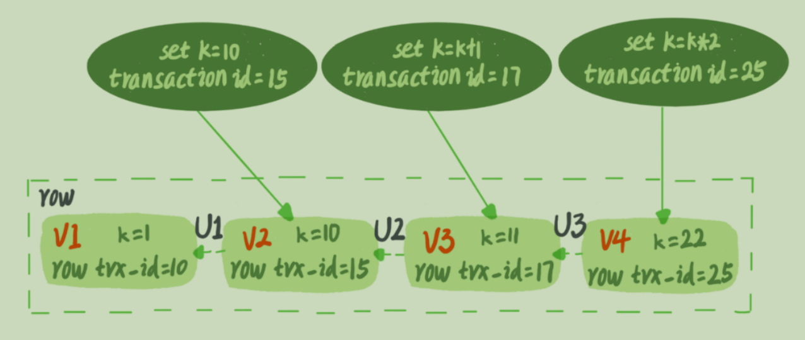

在03节介绍过：

如果在可重复读隔离（RR）级别，事务 T 启动的时候会创建一个视图 read-view，之后事务 T 执行期间，即使有其他事务修改了数据，这个事务看到的仍然跟在启动时看到的一样。

考虑现在有这样一个表：

```sql
mysql> CREATE TABLE `t` (
    `id` int(11) NOT NULL,
    `k` int(11) DEFAULT NULL,
    PRIMARY KEY (`id`)
) ENGINE=InnoDB;
insert into t(id, k) values(1,1),(2,2);
```

现在有三个事务：注意事务C是自动提交。

|                  事务A                  |                            事务B                             |             事务C             |
| :-------------------------------------: | :----------------------------------------------------------: | :---------------------------: |
|     begin;select k from where id=1;     |                                                              |                               |
|                                         |              begin;select k from t where id=1;               |                               |
|                                         |                                                              | update t set k=k+1 where id=1 |
|                                         | update t set k=k+1 where id=1;   <br />(Q1) select k from t where id = 1; commit; |                               |
| (Q2) select k from t where id=1;commit; |                                                              |                               |

问题：在可重复读的隔离条件下，Q1读取到的k值为多少，Q2读取到的k值为多少？

- 更新数据是先读后写，而这个读是读取当前值，称为**“读当前”**。因此，虽然在RR隔离级别下，Q1读取的值还是在事务C提交后的值（此时k=2），然后在k=2的基础上对k加一，因此Q1最终读取到的值为3
- 读取操作在RR隔离级别下，还是以最初事务开启之前创建的read-view为准，在整个事务期间其它事务的修改并不会影响到当前事务读取的值，即事务B和事务C对于k的更新操作并没有影响，Q2最终读取到的值为1


## 快照在MVCC里怎么工作

在RR隔离界别下，事务在启动的时候就“拍了个快照”。注意，这个快照是基于整库的，但它并不是对于整个数据库做一次拷贝操作。

InnoDB 里面每个事务有一个唯一的事务 ID，叫作 `transaction id`。它是在事务开始的时候向InnoDB的事务系统申请的，是按申请顺序严格递增的。

每行数据也都是有多个版本的。每次事务更新数据的时候，会生成一个新的数据版本，并且把 `transaction id` 赋值给这个数据版本的事务 ID，记为 `row trx_id`。同时，旧的数据版本要保留，并且在新的数据版本中，能够有信息可以直接拿到它。

也就是说，数据表中的一行记录，其实可能有多个版本 (row), 每个版本有自己的 `row trx_id`。




- 图中虚线框内是同一行数据的4个版本，当前版本是V4，k值为22，它被transaction id=25的事务更新，因此row trx_id=25
- 图中三个向左的虚线头就是undo log，也就是说，如果需要V2版本，可以通过V4版本经过U3、U2计算得到
- 在InnoDB代码实现上，一个事务只需要在启动的时候，找到所有已经提交事务ID的最大值，记为 `up_limit_id`。然后声明说：如果一个数据库版本的row trx_id大于up_limit_id就不认，必须找到它的一个版本。例如对于某一个事务，它的up_limit_id为18，在上图中，对于V4就不认，找到V4，因此最终k的值为11


## 可重复读和读已提交

可重复读的核心就是一致性读（consistent read）；而事务更新数据的时候，只能用当前读。如果当前的记录的行锁被其他事务占用的话，就需要进入锁等待。

而读提交的逻辑和可重复读的逻辑类似，它们最主要的区别是：

- 在可重复读隔离级别下，只需要在事务开始的时候找到那个 up_limit_id，之后事务里的其他查询都**共用**这个 up_limit_id
- 在读提交隔离级别下，每一个语句执行前都会重新算一次 up_limit_id 的值。因此如果对于最开始案例来说，如果事物隔离界别为可重复读，那么Q1和Q3读取到的值都为3。