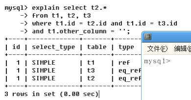
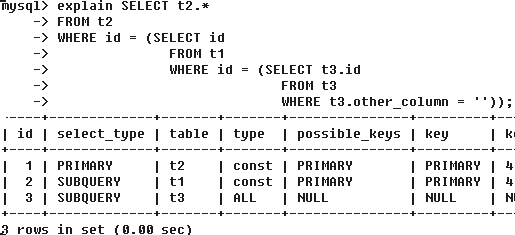
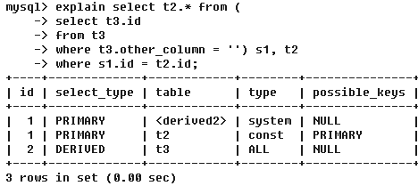

## Explain

使用EXPLAIN关键字可以模拟优化器执行SQL查询语句，从而知道MySQL是如何处理SQL语句的，从而分析出查询语句或者表结构的性能瓶颈。使用方式：explain+sql：

```sql
>> explain select * from emp;
id select_type table type possible_keys key key_len ref rows filtered Extra
1    SIMPLE     emp   ALL      NULL     NULL  NULL  NULL 14   100.00  NULL
```

### 1.1 id字段：读取顺序
select查询的序列号，包含一组数字，表示查询中执行select子句或者操作表的顺序:
- id相同：执行顺序由上至下：t1 -> t3 -> t2：


- id不相同：id值越大优先级越高，越先被执行，常见于子查询，例如下面执行顺序：t3 -> t1 -> t2：



- id相同和id不相同同时存在：先查询id值大的表，然后相同id从上到下顺序执行，例如下面的是t3 -> t2 -> derived2：


- 注意上面\<derived2>：derived代表中间查询过程衍生出来的表，2代表从**id为2**的查询表中衍生出来的。

### 1.2 select_type & table字段
- 查询类型：
    - SIMPLE：简单的select查询，查询中不包含子查询或者UNION；
    - PRIMARY：查询中包含任何复杂的子部分，最外层被标记为PRIMARY；
    - SUBQUERY：在select或者where列表中包含的子查询；
    - DERIVED：在from列表中包含的子查询被标记为DERIVED，MySQL会递归地执行这些查询，把结果放在临时表中；
    - UNION：若在第二个select出现UNION之后，则被标记为UNION；
    - UNION RESULT：从UNION表中获取结果的select，注意UNION RESULT的id为NULL；
    
### 1.3 type字段：访问类型排列

显示查询实用类何种类型，总共有的类型为：ALL、index、range、ref、eq_ref、const、system、NULL：从最好到最差依次是：

**system > const > eq_ref > ref > range > index > ALL**

- system：表只有一行记录（等于系统表），这是const类型的特例，平时不会出现，忽略不计；
- const：通过索引一次就能找到，const用于primary key或者union key。因为只匹配一行数据，所以很快。如将主键置于where列表中MySQL就能将该查询转换成一个常量；
- eq_ref：唯一性索引扫描，对于每个索引键，表中只有一条记录与之匹配，常见于主键或者唯一索引扫描；
- ref:star:：非唯一性索引扫描，返回匹配某个单独值的所有行。本质上也是一种索引访问，它返回所有匹配某个单独值的行；
- range：质检所给定范围的行，使用一个索引来选择行。这种范围扫描比全表扫描要好，因为它只需要开始于索引的某个点，而结束语索引的另外一个点，不需要扫描全部索引；
- index：Full Index Scan，index和all的区别为index类型只遍历索引树，这通常比all快，因为索引文件通常比数据文件小，index从索引文件中读取的，all是从硬盘中读取；
- ALL：全表扫描；

### 1.4 possible_keys & key字段

possible_key显示可能应用到这张表中的索引，一个或者多个。查询涉及到的字段若存在索引，该索引将被列出，但是**不一定被查询实际所使用**；key为实际使用的索引，如果为NULL，则表示没有使用索引。查询中若使用了覆盖索引（查询的字段刚好和建立索引的字段正好相同，即查询列刚好被所建索引覆盖），则该索引仅出现在key列表中。通过这两个字段可以完成：
> 1. 是否使用了索引，即索引是否失效;
> 2. 在多个索引竞争的情况下，MySQL最终使用了哪个索引;

```shell
# 未建立索引情况下
explain select * from emp;
# output:
# possible_keys: NULL	key: NULL

# 对ename, job建立复合索引情况下：
create index idx_ename_job on emp(ename, job);
explain select ename, job from emp;
# output:
# possible_keys: NULL key: idx_ename_job
```

### 1.5 key_len字段

表示索引中使用的字节数，可以通过该列计算查询中使用的索引的长度。在不损失精确度的情况下，长度越短越好。key_len显示的值为索引字段的最大可能长度，并非实际使用的长度，即key_len是根据表定义计算而得到的，不是通过表内检索出的。**检索的条件越多，检索越精确，索引使用的字节数越多**：

```shell
# emp表上已经对ename，job建立了复合索引idx_ename_job
explain select * from emp where ename = 'SCOTT';
# output: key_len = 12

explain select * from emp where ename = 'SCOTT' and job = 'ANASYST';
# output: key_len = 24
# 上述查询结果相同，但是使用的索引字节数不相同
```

### 1.6 ref字段
显示索引的哪一列被使用了，如果可能的话，尽量让其是一个常数，表示哪些字段或者常量被用于查找索引列上的值：

```shell
explain select * from emp where ename='SCOTT' and job = 'ANALYST';
# output: ref: const, const

explain select * from emp, dept where emp.deptno=dept.deptno;
# output: ref: testdb.emp.deptno
```

### 1.7 rows字段
根据统计信息及索引选用的情况，大致估算出找到所需要的记录所需要读取的行数，即也表示每张表有多少行被优化器查询。

### 1.8 Filtered字段

查询条件过滤了表中多少行记录，是一个估算的百分比值。rows列显示的是行的估算值，`rows*filtered/100`表示跟前面表join的行数。在低版本的MySQL中需要使用EXPLAIN EXTENDED时才会展示。

### 1.9 Extra字段

包含不适合在其他列中显示但是十分重要的额外信息。

- Using filesort:star:：MySQL中无法利用索引完成的排序操作称为“文件内排序”，说明MySQL会对数据使用一个外部的索引排序，而不是按照表内的索引顺序进行读取：
```shell
# create index idx_ename_job on emp(ename, job);
explain select * from emp where job = 'SALESMAN' order by ename;
# Extra: Using where; Using filesort
```

- Using temporary:star:：使用了临时表保存中间结果，MySQL在对查询结果排序时使用临时表，常见于排序order by和分组查询group by。
```shell
explain select * from emp where job in ('SALESMAN', 'CLERK') group by mgr;
# Extra: Using where; Using temporary; Using filesort
```

- Using index:star:：表示相应的select操作中使用了覆盖索引（Covering Index），避免了访问表的数据行，效率不错。如果同时出现using where，表明索引被用来执行索引键值查找；如果没有同时出现using where，表明索引用来读取数据而非执行查找动作。
```shell
explain select ename from emp where job = 'SALESMAN';
# Extra: Using where; Using index
explain select ename, job from emp;
# Extra: Using where
```
- Using where：表明使用了where过滤
- Using join buffer：使用了连接缓存，如果出现多个join，需要在my.cnf配置文件中将join buffer内存调大
- impossible where：where子句的值总是false，不能用来获取任何元组
- select tables optimized away：在没有group by子句的情况下，基于索引优化MIN/MAX操作或者对于MyISAM存储引擎优化COUNT(*)操作，不必等到执行阶段在进行计算，查询执行计划生成的阶段即完成优化
- distinct：优化distinct操作，在找到第一匹配的元组后即停止找同样值的操作

