## 索引优化

### 1.1 案例分析（单表：Using filesort）
表article设计及内容：

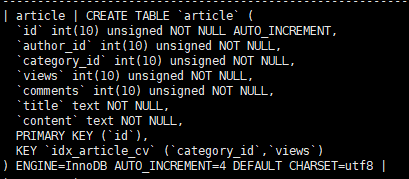

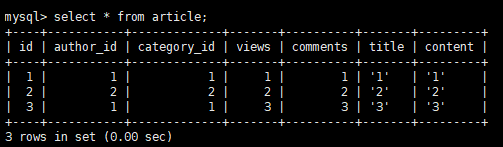

**优化示例**：

第一次依次对article的`category_id, comments, views`三个字段建立了索引，但是因为comments查询时候是一个范围，导致type是range。按照BTree索引的工作原理，先对category_id进行排序，当遇到相同的category_id则再对comments进行排序，如果遇到相同的comments则在对views进行排序。当comments处于联合索引里的中间位置时，因为comments>1是一个条件范围（range），MySQL无法利用索引在对后面的views进行部分检索，即range类型查询字段后面的索引失效：

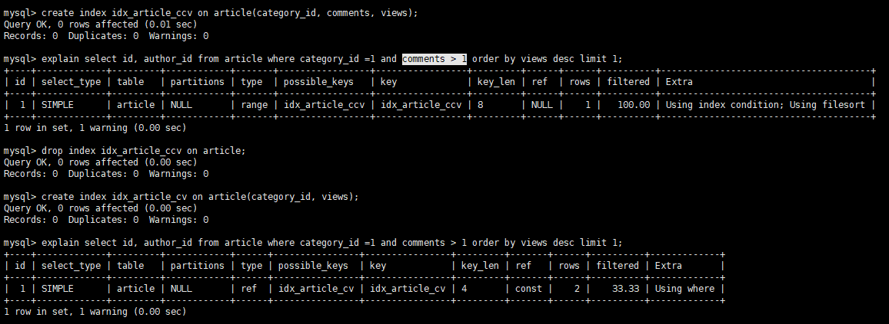

**索引最左前缀原则:star:**

当建立复合索引时，索引生效的方式按照索引最左前缀原则进行。例如上述对article的category_id, comments, views建立了复合索引，那么想要索引生效的方式只能使用下面三个方式：

> 1. category_id
> 2. category_id -> comments
> 3. category_id -> comments -> views

其它方式的索引（例如comments、comments->views都将生效）

出现这种情况的原因是因为索引底层使用B+树这种数据结构的搜索方式导致的。B+树是从左往右的顺序建立搜索树，当有（category_id, comments, views）这样完整的数据来检索时，B+树会优先比较category_id来确定下一步的比较方向，如果相同再对comments进行比较确定下一步比较方向，依次类推。但是如果需要检索的数据时（comments, views）这样的数据，B+树在第一步进行比较时，没有可用的比较因子来确定下一步的比较方向，
导致数据库只能把所有的category_id数据全部取出，然后再根据comments、views来依次确定比较方向，但是注意此时其实在第一步比较过程中就已经将所有的数据全部取出来了，索引也就失去了原本的意义。

上述第一次查询过程中（索引为idx_article_ccv），再B+树第二次进行比较时，虽然提供了比较因子comments，但是comments是一个范围，**MySQL还是需要将所有comments>1的数据全部取出，导致之后的views进行检索时失去意义**。

对于上述第一次查过程出现索引失效的情况，还可以通过调整索引顺序（将views和comments互换即可）来解决：
```sql
create index idx_article_cvc on article(category_id, views, comments);
explain select id, author_id from article where category_id = 1 and comments > 1
order by views desc limit 1;
```

输出结果：

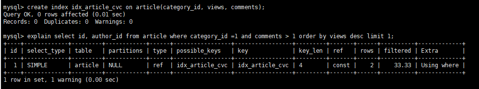

### 1.2 案例分析（双表：type为ALL）

以emp表和dept表为例：emp表中的deptno为外键，关联dept中主键deptno演示：

- left join
```shell
// LEFT JOIN情况下：
    (1) 索引建立在emp的deptno上：
        - emp left join dept				------> ALL
        - dept left join emp				------> ref
    (2) 索引建立在dept的deptno上：
        - emp left join dept				------> ALL
        - dept left join emp				------> ref
// 在LEFT JOIN情况下，无论索引建立在哪张表上，left join的格式都应该为：
// <附表> left join <主表>
```

对应情况（1）：

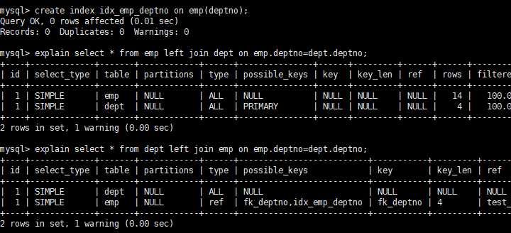

对应情况（2）：

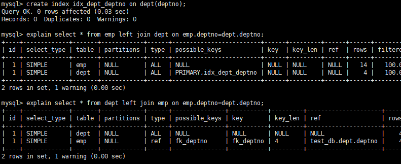

- right join
```shell
// RIGHT JOIN情况下：
    （3）索引建立在emp的deptno上：
        - emp right join dept				------> ref
        - dept right join emp				------> ALL
    （4）索引建立在dept的deptno上：
        - emp right join dept				------> ref
        - dept right join emp				------> ALL
// 在RIGHT JOIN情况下，无论索引建立在哪张表上，right join的格式都应该为：
// <主表> right join <附表>
```
对应情况（3）：

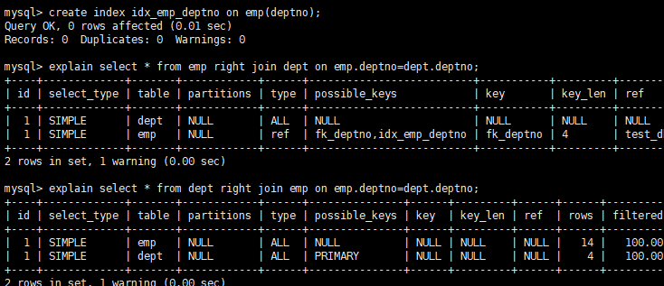

对应情况（4）：

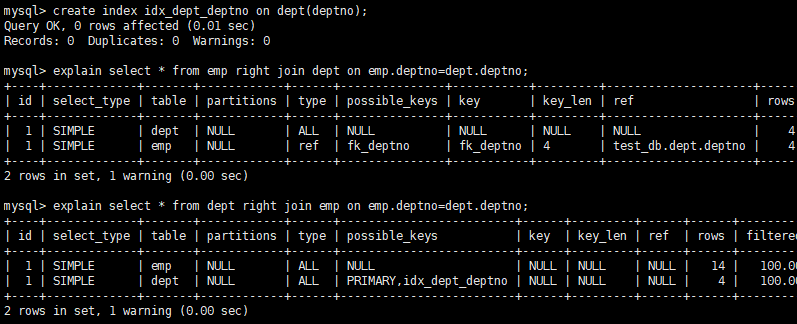

**总结**：

无论索引建立在哪张表上，对于left join和right join而言，都是按照本身的join顺序（left join从左往右、right join从右往左），最终的结果为：附表 -> join_type -> 主表。

### 1.3 索引优化

首先对emp表的empno、ename、job三列建立复合索引，注意建立索引完毕之后Seq_in_index这一列：

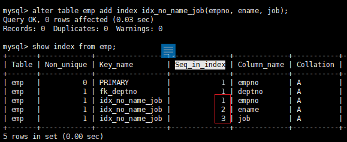

- 全值匹配我最爱：
```sql
-- 全值匹配
select * from emp where empno = 7900 and ename = 'JAMES' and job = 'CLERK';
-- 下面两种也不会索引失效，最左前缀原则
select * from emp where empno = 7900 and ename = 'JAMES';
select * from emp where empno = 7900;
```

- 最左前缀原则:star:：带头大哥不能死，中间兄弟不能丢，指查询从索引的最左列开始且不能跳过索引中间列。

- 索引列上不操作（计算、函数、（自动or手动的）类型转换），会导致索引失效而转向全表扫描：

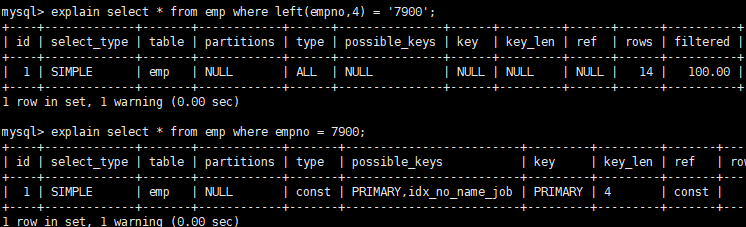

- 范围之后全失效：存储引擎不能使用索引中范围条件（in、link、 between and、>等）右边的列

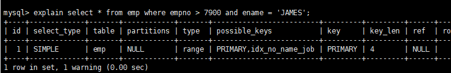

- 尽量使用覆盖索引（只访问索引的查询，即索引和查询列一致），减少使用select *
- 使用不等于（!=或者<>）的时候可能无法使用索引导致全表扫描
- is null, is not null也无法使用索引，导致全表扫描
- like以通配符开头（'%abc...'）索引失效导致全表扫描，即%右边不能有内容，正确使用%应该是：'xxx%'

注意下面修改了索引：**`create index idx_name_no_job on emp(ename, empno, job);`**

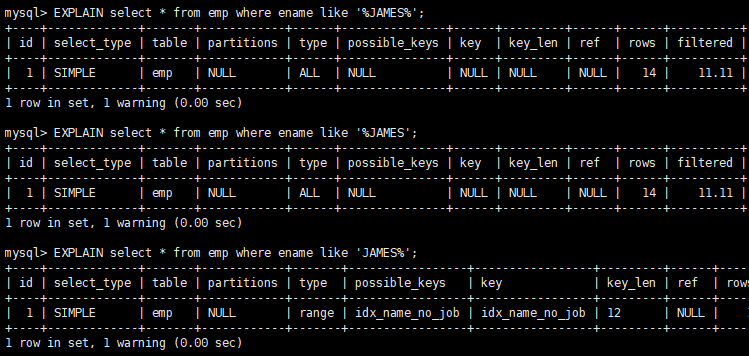

**问题**：如果必须要使用 **like '%xxx%'** 这种形式进行查询，如何避免全表扫描

使用覆盖索引！

注意下面表修改了索引：**`create index idx_name_no_job on emp(empno, ename, job);`**

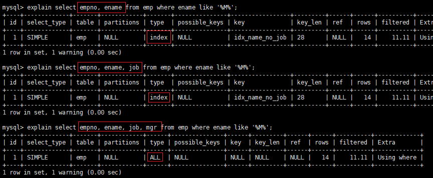

- 字符串不加单引号索引失效：开发中varchar类型绝对不能失去单引号：这一点和不要在索引列上做任何操作（自动or手动转换）呼应 ，例如表中某列msg属性是varchar，但是给的数据中存在整数例如2000，应该使用msg=`2000`，不能使用msg=2000，否则会发生自动转换，导致索引失效，进而产生全表扫描。

### 1.4 索引优化题目

**测试题表结构**

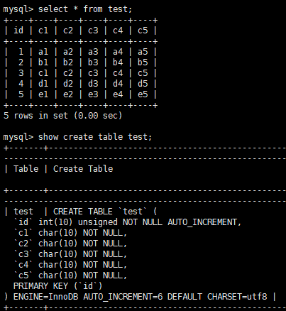

**对应索引**

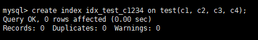

```sql
>> explain select * from test where c1='c1' and c2='c2' and c3='c3' and c4='c4';
-- output:
select_type: SIMPLE
type: ref
possible_keys: idx_test_c1234  key: idx_test_c1234
key_len: 120
ref: const, const, const, const

>> explain select * from test where c1='c1' and c2='c2' and c4='c4' and c3='c3';
-- output:
select_type: SIMPLE
type: ref
possible_keys: idx_test_c1234  key: idx_test_c1234
key_len: 120
ref: const, const, const, const

>> explain select * from test where c4='c4' and c3='c3' and c2='c2' and c1='c1';
-- output:
select_type: SIMPLE
type: ref
possible_keys: idx_test_c1234  key: idx_test_c1234
key_len: 120
ref: const, const, const, const

>> explain select * from test where c1='c1' and c2='c2' and c3>'c3' and c4='c4';
-- output:
select_type: SIMPLE
type: range
possible_keys: idx_test_c1234  key: idx_test_c1234
key_len: 90
ref: NULL
Extra: Using index condition

>> explain select * from test where c1='c1' and c2='c2' and c4>'c4' and c3='c3';
-- output:
select_type: SIMPLE
type: range
possible_keys: idx_test_c1234  key: idx_test_c1234
key_len: 120
ref: NULL
Extra: Using index condition

-- c1,c2索引被使用，然后c3索引被用来排序，排序之后就结束，但未进行统计，不会使用c4索引
>> explain select * from test where c1='a1' and c2='a2' and c4='c4' order by c3;
-- output:
select_type: SIMPLE
type: ref
possible_keys: idx_test_c1234  key: idx_test_c1234
key_len: 60
ref: const, const
Extra: Using index condition

-- 和上面完全相同
>> explain select * from test where c1='a1' and c2='a2' order by c3;
-- output:
select_type: SIMPLE
type: ref
possible_keys: idx_test_c1234  key: idx_test_c1234
key_len: 60
ref: const, const
Extra: Using index condition

-- c1,c2索引被使用，但是直接跳到c4排序，导致进行内部文件排序
>> explain select * from test where c1='a1' and c2='a2' order by c4;
-- output:
select_type: SIMPLE
type: ref
possible_keys: idx_test_c1234  key: idx_test_c1234
key_len: 60
ref: const, const
Extra: Using index condition; Using filesort

-- c1索引被使用，接着使用c2,c3索引排序直接结束，c5非索引，为干扰项
mysql> explain select * from test where c1='a1' and c5='a5' order by c2, c3;
-- output:
select_type: SIMPLE
type: ref
possible_keys: idx_test_c1234  key: idx_test_c1234
key_len: 30
ref: const
Extra: Using index condition; Using where

-- c1索引被使用，c3,c2索引排序顺序不正确导致filesort，c5为干扰项
>> explain select * from test where c1='a1' and c5='a5' order by c3, c2;
-- output:
select_type: SIMPLE
type: ref
possible_keys: idx_test_c1234  key: idx_test_c1234
key_len: 30
ref: const
Extra: Using index condition; Using where; Using filesort

>> explain select * from test where c1='a1' and c2='a2' order by c2, c3;
-- output:
select_type: SIMPLE
type: ref
possible_keys: idx_test_c1234  key: idx_test_c1234
key_len: 60
ref: const, const
Extra: Using index condition

-- 和上述类似，c5为干扰项
>> explain select * from test where c1='a1' and c2='a2' and c5='c5' order by c2, c3;
-- output:
select_type: SIMPLE
type: ref
possible_keys: idx_test_c1234  key: idx_test_c1234
key_len: 60
ref: const, const
Extra: Using index condition; Using where

-- 虽然order by中c3和c2的顺序不同，但是前面因为执行了c2='a2'，相当于一个常量定值，等价于执行：
-- select * from test where c1='a1' and c5='c5' order by c3, 'a2';
>> explain select * from test where c1='a1' and c2='a2' and c5='c5' order by c3, c2;
-- output:
select_type: SIMPLE
type: ref
possible_keys: idx_test_c1234  key: idx_test_c1234
key_len: 60
ref: const, const
Extra: Using index condition; Using where

-- 注意和上一题区分，c3和c2顺序不对，且两个索引都没有定值，导致filesort
>> explain select * from test where c1='a1' and c5='c5' order by c3, c2;
-- output:
select_type: SIMPLE
type: ref
possible_keys: idx_test_c1234  key: idx_test_c1234
key_len: 30
ref: const
Extra: Using index condition; Using where; Using filesort

-- c1索引被使用，c2,c3索引分组前先排序，然后结束，c4索引不会被使用
>> explain select * from test where c1='a1' and c4='c4' group by c2, c3;
-- output:
select_type: SIMPLE
type: ref
possible_keys: idx_test_c1234  key: idx_test_c1234
key_len: 30
ref: const
Extra: Using index condition

-- c1索引被使用，c3、c2索引分组前先排序，但是它们顺序不对，导致临时表产生，排序完成直接结束
-- c4索引不会被使用
>> explain select * from test where c1='a1' and c4='c4' group by c3, c2;
-- output:
select_type: SIMPLE
type: ref
possible_keys: idx_test_c1234  key: idx_test_c1234
key_len: 30
ref: const
Extra: Using index condition; Using temporary; Using filesort

-- c1被使用，c2因为%开头索引失效，导致c3也不能使用
>> explain select * from test where c1 = 'c1' and c2 like '%c2' and c3 = 'c3';
-- output:
select_type: SIMPLE
type: ref
possible_keys: idx_test_c1234  key: idx_test_c1234
key_len: 30
ref: const
Extra: Using index condition

-- c1被使用，c2因为'c2'开头可以使用，但是它其实是一个范围查询，导致c3不能使用
>> explain select * from test where c1 = 'c1' and c2 like 'c2%' and c3 = 'c3';
-- output:
select_type: SIMPLE
type: range
possible_keys: idx_test_c1234  key: idx_test_c1234
key_len: 90
ref: NULL
Extra: Using index condition

>> explain select * from test where c1 = 'c1' and c2 like '%c2%' and c3 = 'c3';
-- output:
select_type: SIMPLE
type: ref
possible_keys: idx_test_c1234  key: idx_test_c1234
key_len: 30
ref: const
Extra: Using index condition

-- 注意干扰项，仍然出现了%右边有值的情况
>> explain select * from test where c1 = 'c1' and c2 like 'c2%c2%' and c3 = 'c3';
-- output:
select_type: SIMPLE
type: range
possible_keys: idx_test_c1234  key: idx_test_c1234
key_len: 90
ref: NULL
Extra: Using index condition
```
**一般性建议**

- 对于单键索引，尽量选择针对当前query过滤性更好的索引；
- 选择组合索引时，当前query过滤性最好的字段应该放在索引顺序的最左边；
- 选择组合索引时，尽量选择可以包含当前query中where子句中更多的索引字段；
- 尽量通过分析统计信息和调整query的写法来达到选择合适索引的目的；


