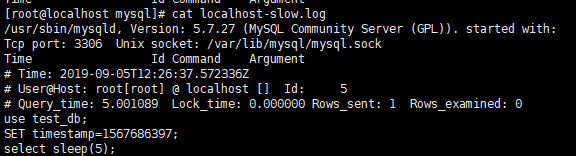
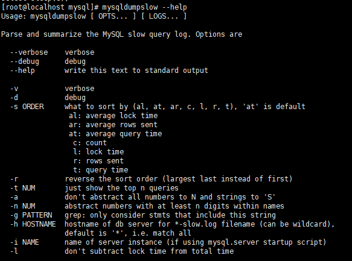
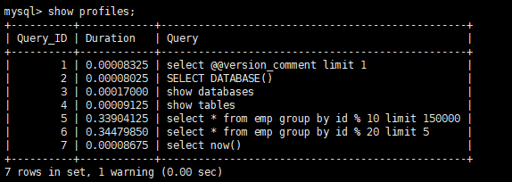
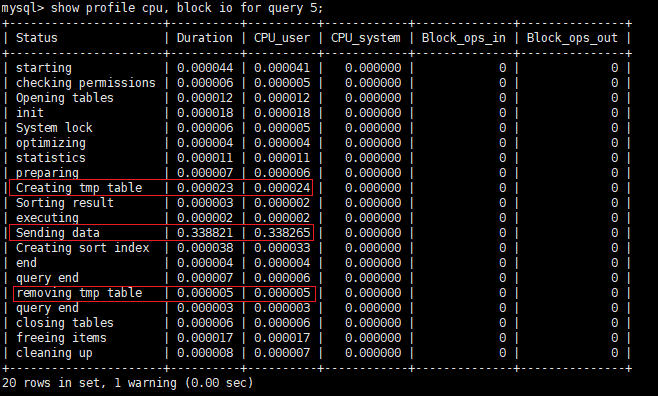

## 查询截取分析

当MySQL出现慢SQL情况下，一般分析步骤：
- 慢查询的开启和捕获
- explain & 慢查询分析
- show profile查询SQL在MySQL服务器里面执行的细节和生命周期情况
- SQL数据库服务器参数调优

### 1.1 查询优化
- 小表驱动大表：小数据集表驱动大数据集表
```sql
-- 先进行B表子查询，再A表查询
select * from A where id in (select id in B);
-- 等价于
select * from A exists (select 1 from B where A.id = B.id);

-- 小表驱动大表的原则：
-- 1. 当B表数据集小于A表数据集时，使用in效率更高
-- 2. 当A表数据集小于B表数据集时，使用exists效率更高
```
- order by排序优化：尽量使用index方式排序，避免使用filesort方式排序，即尽可能在索引列上完成排序操作，遵循索引建立的最佳左前缀原则，如果不在索引列上，filesort会有两种算法：
  - 双路排序：MySQL4.1之前使用双路排序，会对磁盘进行两次扫描，读取行指针和order by列，对它们进行排序，然后扫描已经排序好的列表，按照列表中的值重新从列表中读出。总的过程为：从磁盘取排序字段，在buffer中进行排序，再从磁盘中读取其它字段
    - 单路排序：从磁盘中读取需要查询的所有列，按照order by列在buffer中对它们进行排序，然后扫描排序后的列表进行输出，单路排序只要一次读取数据操作，并且将随机IO转变成顺序IO，但是会使用更多的空间，因为它把每一行数据都存储在内存中。但是如果单路排序取出的数据超过了**sort_buffer**的大小，导致每次只能读取sort_buffer容量大小的数据，进行排序（创建tmp文件，多路合并），排完序再取sort_buffer容量大小，再排序......从而导致多次IO，这样甚至比双路排序效率还要低。如果真是因为sort_buffer容量太小导致SQL慢，则需要在MySQL服务器中调整sort_buffer_size和max_length_for_sort_data两个参数。
- 提高order by排序速度建议：
    - 不要使用 **select * ** ，可能导致查询出来的字段大小长度和大小查过max_length_for_sort_data和sort_buffer容量，导致多路排序；
    - 尝试提高sort_buffer_size;
    - 尝试提高max_length_for_sort_data，但是如果设置太高，数据超出sort_buffer_size的概率会大大增加，明显的症状是非常高的磁盘IO活动以及低的处理器使用率；
- group by优化：group by是指是先排序后进行分组，遵循索引键最佳左前缀原则，其具体优化参照order by优化。当无法使用索引列时，增大max_length_for_sort_data、sort_buffer_size参数设置。**同时注意where优先级高于having，能在where限定条件完成的任务就不要放在having子句中**。

1.2 慢查询日志

MySQL的慢查询日志是MySQL提供的一种日志记录，它用来记录在MySQL中响应时间超过阈值的语句，该阈值由 **long_query_time** 值设定，默认值为10秒，慢查询语句会被记录到慢查询日志中。注意，默认情况下，MySQL没有开启慢查询日志，如果不是调优需要，一般不建议启动该参数。可以通过：

-   show variables like '%slow_query_log'来查看该参数的开启情况

-   show variables like '%long_query_time%'查看默认最长忍耐时间


如果要开启该参数：

```shell
# 对当前数据库临时生效
set global slow_query_log = 1;  # 立即生效，直接使用show variables ... 即可
set global long_query_time = 3; # 不会立即生效，重开连接或者使用show global variables ...

# 永久生效
# /etc/my.cnf
[mysqld]
slow_query_log=1
slow_query_log_file=/var/lib/mysql/localhost-slow.log
long_query_time=3
```
- 产生慢查询日志：`select sleep(5);`
- 慢查询日志：



- 查看当前系统中有多少条慢查询记录：`show global status like '%Slow_queries%';`
- 慢查询日志分析工具——mysqldumpslow:



距离说明：
```shell
# 得到返回记录中top 10个sql
mysqldumpslow -s r -t 10 /var/lib/mysql/localhost-slow.log
# 得到访问次数最多的10个sql
mysqldumpslow -s c -t 10 /var/lib/mysql/localhost-slow.log
# 按照时间顺序排序，得到前10条记录中包含"left join"的查询语句
mysqldumpslow -s t -t 10 -g "left join" /var/lib/mysql/localhost-slow.log | grep more
```

### 1.3  测试脚本
- 产生随机字符串脚本：
```sql
DELIMITER $$
CREATE FUNCTION rand_string(n INT) RETURNS VARCHAR(255)
BEGIN
	DECLARE chars_str VARCHAR(100) DEFAULT 'abcdefghijklmnopqrstuvwxyzABCDEFGHIJKLMNOPQRSTUVWXYZ';
	DECLARE return_str VARCHAR(255) DEFAULT '';
	DECLARE i INT DEFAULT 0;
	WHILE i < n DO
	SET return_str = CONCAT(return_str, SUBSTRING(chars_str, FLOOR(1+RAND()*52), 1));
	SET i = i + 1;
	END WHILE;
	RETURN return_str;
END $$
```

- 产生部门随机编号脚本：
```sql
DELIMITER $$
CREATE FUNCTION rand_num() RETURNS INT(5)
BEGIN
DECLARE i INT DEFAULT 0;
SET i = FLOOR(100 + RAND() * 10);
RETURN i;
END $$
```

- 创建存储过程：
```sql
% 插入emp表
DELIMITER $$
CREATE PROCEDURE insert_emp(IN START INT(10), IN max_num INT(10))
BEGIN
DECLARE i INT DEFAULT 0;
SET autocommit = 0;
REPEAT
SET i = i + 1;
INSERT INTO emp(empno, ename, job, mgr, hiredate, sal, comm, deptno)
VALUES((START + i), rand_string(6), 'SALESMAN', 0001, CURDATE(), 2000, 400, rand_num());
UNTIL i = max_num
END REPEAT;
COMMIT;
END $$

% 插入dept表
DELIMITER $$
CREATE PROCEDURE insert_dept(IN START INT(10), IN max_num INT(10))
BEGIN
DECLARE i INT DEFAULT 0;
SET autocommit = 0;
REPEAT
SET i = i + 1;
INSERT INTO dept(deptno, dname, loc) 
VALUES((START + i), rand_string(10), rand_string(8));
UNTIL i = max_num
END REPEAT;
COMMIT;
END $$
```

- 调用存储过程：
```sql
delimiter ;
call insert_emp(100001, 500000);
```

- 过程中用到相关命令：
```sql
select @@IDENTITY;
select last_insert_id();
select table status;

-- ls -hsl /var/lib/mysql/big_db
```

### 1.4 show profiles
show profiles是MySQL提供可以用来分析当前会话中语句执行的资源消耗情况，可以使用SQL的调优来测量，即是每条语句的细节说明。默认情况下是关闭的，并且只保存15次运行结果，可以通过show variables like 'profiling'查看，开启该参数: set global profiling = on;
- 查看之前sql的执行情况：



- 查看详细信息：参数包括：
    - all：所有开销
    - block io：阻塞io
    - context switches：上下文切换
    - cpu
    - ipc：发送和接受相关开销
    - memory：内存相关
    - page faults：页面错误相关
    - source：和source_function、source_file、source_line相关的开销
    - swaps：交换次数相关开销



- 通过profiles发现常见的四种问题：
    - converting HEAP to MyISAM：查询结果太大，内存都不够用，开始往磁盘上搬迁;
    - creating tmp table：创建临时表，需要拷贝数据到临时表，然后用完再删除临时表；
    - copying to tmp table on disk：把内存中临时表复制到磁盘中；
    - locked：锁产生
    
### 1.5 全局查询日志

只允许在测试环境中使用，永远不能在生产环境中开启这个功能。

- 启用：
```properties
[mysqld]
# 开启
general_log=on
# 记录日志文件的路径
general_log_file=/path/logfile
# 输出格式
log_output=FILE

# -----------使用----------

# set global general_log=on;
# set global log_output='TABLE';
# 此时所编写的sql语句，将会记录到mysql库里面general_log表中，查看方式：
# select * from mysql.general_log;
```
