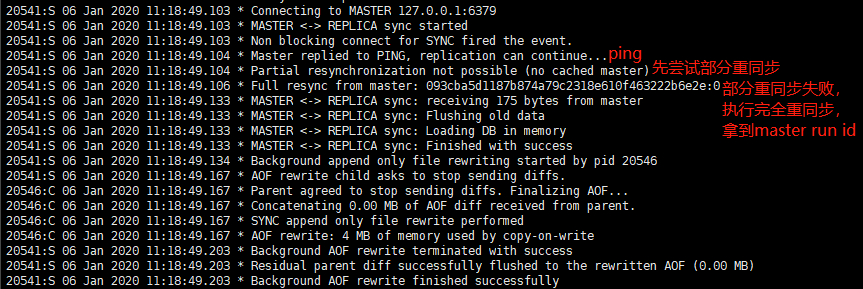

## 四. 主从复制

单个数据库实例遇到断电等问题，可以使用持久化技术从硬盘中恢复数据。但是如果硬盘损坏或其它不可恢复的情况发生，redis就需要使用主从复制技术确保容灾恢复能力。


### 4.1 主从复制原理


#### 4.1.1 PSYNC命令

psync命令：有完整重同步（full resynchronization）和部分重同步（partial resynchronization）两种模式：

- 完整重同步（全量复制）：

  

  - 主服务器执行BGSAVE命令生成一个RDB文件，这个生成操作需要耗费大量服务器CPU、内存和磁盘IO资源
  - 主服务器将自己生成的RDB文件发送给从服务器，这个发送操作会耗费主从服务器大量的网络资源，并对主服务器响应命令请求的时间产生影响
  - 接受到RDB文件的从服务器需要载入主服务器的RDB文件，需要清空自身数据，并且载入期间，从服务器会因为阻塞而无法处理命令请求

- 部分重同步（部分复制）：

  

  - 主服务器复制偏移量和从服务器的复制偏移量
  - 主服务器的复制积压缓冲区（replication backlog）
  - 服务器的运行id（run id）

  具体来说，主服务器/从服务器的赋值偏移量：

  - 主服务器每次向从服务器传播N个字节数据时候，就会将自己复制偏移量加上N
  - 从服务器每次从主服务器接受N个字节数据时候，就会将自己复制偏移量加上N

  **对比主、从服务器复制偏移量，就可以判断主、从服务器是否处于同一状态，从而判断是否需要进行重同步操作。**

  如果两者偏移量不一致，就会存在两个问题：

  - 偏移量不一致应该执行完整重同步还是部分重同步？
  - 如果执行部分重同步，从服务器端点之后是如何恢复数据的？

  这两个问题和 **复制积压缓冲区** 以及 **runid** 有关。

#### 4.1.2 复制积压缓冲区

复制积压缓冲区是由主服务器维护的一个**固定长度、先进先出**的队列，默认大小1mb，当入队元素的数量大于队列长度时，最先入队列的元素会被弹出，新元素入队列。

当主服务器进行命令传播时，它不仅会将新命令写入到所有从服务器，还会将新命令放到复制积压缓冲区中，因为复制积压缓冲器是固定大小的，因此，主服务器的赋值积压缓冲区保存着一部分最近传播的命令，并且复制积压缓冲区中会为队列中的每个字节记录相应的赋值偏移量。

当从服务器重新连接到主服务器时候，从服务器会通过psync命令将自己的**复制偏移量offset**发送给主服务器，主服务器根据这个offset来决定对服务器执行何种同步操作：

- 如果offset偏移量之后的数据仍然存在于复制积压缓冲区里面，那么主服务器将对从服务器执行部分重同步操作
- 如果offset偏移量之后的数据已经不存在复制积压缓冲区，那么主服务器将对从服务器执行完整重同步操作


**调整复制积压缓冲区大小**

redis默认复制积压缓冲区大小为1mb，如果主服务器执行大量写命令，又或者主从服务器断电后重新连接需要的时间比较长，那么这个大小并不合适。

如果复制积压缓冲区大小设置不恰当，那么psync命令可能导致频繁地发生完整重同步，使得redis整体效率低下，因此需要正确的估算和设置复制积压缓冲区大小：

- 最小大小：                          断电后重连时间 * 主服务器平均每秒写入命令大小
- 安全大小：                          2 * 最小大小
- 相关配置：                           **repl-backlog-size**=5mb

#### 4.1.3 run id

除了复制偏移量和复制积压缓冲区之外，实现部分重同步还需要用到服务器运行ID（run id）：

- 每个redis服务器，无论是主服务器还是从服务器，都会有自己的run id
- 每个run id在服务器启动时候自动生成，由40个随机的16进制字符组成

当从服务器第一次对主服务器进行初次复制时候，主服务器会将自己的run id发送给从服务器，而从服务器会将该run id保存起来。当从服务器断电后重新连接上，从服务器会向**当前连接的主服务器**发送之前保存的run id：

- 如果当前连接的主服务器的run id和之前保存的run id，那么说明从服务器断电之前和重连后两个的主服务器是相同的，主服务器尝试继续执行部分重同步操作

- 如果两者run id不相同，说明断电之前和重连后的主服务器不一样，此时**只能执行完整重同步操作**


### 4.2 主从复制实现

实现主从复制两种方式:

- slaveof
- 配置文件

#### 4.2.1 slaveof

slaveof命令：slaveof xxx.xxx.xxx.xxx & slaveof no one

```shell
# 如果master设置了密码
>> config set masterauth xxxxxx
OK
# 从节点6380 slaveof 主节点6379
>> salveof 127.0.0.1 6379
OK
# 对应6380节点的日志：
20484:S 06 Jan 2020 11:00:34.777 * Connecting to MASTER 127.0.0.1:6379
20484:S 06 Jan 2020 11:00:34.777 * MASTER <-> REPLICA sync started
20484:S 06 Jan 2020 11:00:34.777 * Non blocking connect for SYNC fired the event.
20484:S 06 Jan 2020 11:00:34.777 * Master replied to PING, replication can continue...
20484:S 06 Jan 2020 11:00:34.777 * Partial resynchronization not possible (no cached master)
20484:S 06 Jan 2020 11:00:34.778 * Full resync from master: 8b0050279336a1e0b1c6b9aad157af91c700c370:0
20484:S 06 Jan 2020 11:00:34.878 * MASTER <-> REPLICA sync: receiving 191 bytes from master
20484:S 06 Jan 2020 11:00:34.878 * MASTER <-> REPLICA sync: Flushing old data
20484:S 06 Jan 2020 11:00:34.878 * MASTER <-> REPLICA sync: Loading DB in memory
20484:S 06 Jan 2020 11:00:34.878 * MASTER <-> REPLICA sync: Finished with success
20484:S 06 Jan 2020 11:00:34.879 * Background append only file rewriting started by pid 20501
20484:S 06 Jan 2020 11:00:34.912 * AOF rewrite child asks to stop sending diffs.
20501:C 06 Jan 2020 11:00:34.912 * Parent agreed to stop sending diffs. Finalizing AOF...
20501:C 06 Jan 2020 11:00:34.912 * Concatenating 0.00 MB of AOF diff received from parent.
20501:C 06 Jan 2020 11:00:34.912 * SYNC append only file rewrite performed
20501:C 06 Jan 2020 11:00:34.913 * AOF rewrite: 4 MB of memory used by copy-on-write
20484:S 06 Jan 2020 11:00:34.978 * Background AOF rewrite terminated with success
20484:S 06 Jan 2020 11:00:34.979 * Residual parent diff successfully flushed to the rewritten AOF (0.00 MB)
20484:S 06 Jan 2020 11:00:34.979 * Background AOF rewrite finished successfully
20484:S 06 Jan 2020 11:00:47.446 * REPLICAOF would result into synchronization with the master we are already connected with. No operation performed.

# 对应6379节点日志：
20475:M 06 Jan 2020 11:00:34.777 * Replica 127.0.0.1:6380 asks for synchronization
20475:M 06 Jan 2020 11:00:34.777 * Full resync requested by replica 127.0.0.1:6380
20475:M 06 Jan 2020 11:00:34.777 * Starting BGSAVE for SYNC with target: disk
20475:M 06 Jan 2020 11:00:34.778 * Background saving started by pid 20500
20500:C 06 Jan 2020 11:00:34.788 * DB saved on disk
20500:C 06 Jan 2020 11:00:34.789 * RDB: 2 MB of memory used by copy-on-write
20475:M 06 Jan 2020 11:00:34.878 * Background saving terminated with success
20475:M 06 Jan 2020 11:00:34.878 * Synchronization with replica 127.0.0.1:6380 succeeded
```

#### 4.2.2 配置文件

- 修改从节点的配置文件redis-6380.conf

```properties
masterauth tanglei	 				# 主节点的密码
replica-read-only yes				# 从节点是否是只读的
repl-backlog-size 5mb				# 复制积压缓冲区大小
replicaof 127.0.0.1 6379			# 主节点ip、端口，replicaof和slaveof效果相同
```

启动主节点，从节点，并查看相应日志：

- 从节点6380日志：



- 主节点6379日志：


### 4.3 主从复制问题

#### 4.3.1 读写分离

主节点复制数据写入，从节点负责数据读取，减轻主节点压力，达到读写分离、负载均衡目的，但是也存在一些问题：

- 复制数据可能存在延迟
- 可能读取到过期数据（v3.2后解决了该问题）
- 从节点故障，可能会给其它从节点带来压力
- 主节点故障，应该使用redis sentinel实现故障转移，实现高可用

#### 4.3.2 配置不一致

* 例如master和slave结点的maxmemory配置不一致，可能出现slave结点内存不足，丢失数据情况，且无法恢复
* 数据结构优化参数不一致，例如hash-max-ziplist-entries

#### 4.3.3 避免复制风暴

- 单节点复制风暴：主节点重启之后，主节点重启之后多个从节点都需要进行全量复制
- 单机器复制风暴：机器宕机后，会有大量的复制。解决方案：主节点应该分散到多个机器上，或者使用redis sentinel